# BuildLens — Learning Ledger

## Purpose

CMU's learning principles emphasize that prior knowledge and how knowledge is organized affect later learning. Retrieval practice is most useful when it exposes what can actually be recalled and transferred.

This file tracks **mental-model quality**, not project completion.

Do not log every fact.

Log concepts that matter.

---

# Concept Entry Template

## Concept

`<name>`

### My explanation

Write from memory before checking documentation.

### Mental picture

```text
draw / ASCII map
```

### Example I can solve

`<example>`

### Transfer example

`<different context>`

### Common mistake / misconception

`<what I previously misunderstood>`

### Evidence I understand it

- [ ] unseen variant
- [ ] second context
- [ ] delayed retrieval
- [ ] teach aloud
- [ ] used in real BuildLens code
- [ ] defended under questioning

### Confidence before check

`0–100%`

### Actual result

`correct / partial / wrong`

### Calibration note

Was confidence too high, too low, or appropriate?

### Next retrieval due

`<phase/date>`

---

# Formal Exercise Evidence Record

Every formal tracing, transfer, debugging, test-design, teach-back, and oral-defense exercise creates an Evidence Record.

The learner's original answer is historical evidence and is never cleaned up or replaced by the correction.

## Required record

```text
EVIDENCE ID:
<stable id>

DATE / PHASE / GATE:
...

IMPLEMENTATION TRIGGER:
<real BuildLens task that made this concept relevant>

ADJACENT CONCEPT:
...

EXERCISE TYPE:
<tracing | transfer | debugging | test design | teach-back | oral defense>

SOURCE / CONTEXT:
<academic | BuildLens | Argos | Datum | Trellis | blind transfer>

PROBLEM — VERBATIM:
<exact prompt>

MY ANSWER — VERBATIM:
<exact first committed answer>

MY REASONING — VERBATIM:
<exact reasoning or "not provided">

CONFIDENCE BEFORE CHECK:
<0–100% or not provided>

TOOLS / HELP USED BEFORE COMMITMENT:
<none | interpreter | debugger | docs | Claude | Codex | other>

RESULT:
<correct | partial | wrong>

MISCONCEPTION / GAP:
...

CORRECT MODEL — ADDED AFTER ATTEMPT:
...

WHY THIS MATTERS TO THE REAL IMPLEMENTATION:
...

TRANSFER / NEXT RETRIEVAL:
...
```

Rules:

1. Preserve the exact problem and first committed answer.
2. Preserve every later attempt separately.
3. Never reconstruct a missing verbatim answer from memory; write `VERBATIM ANSWER UNAVAILABLE`.
4. Gate completion references Evidence IDs.
5. A bare checklist checkmark is not evidence; point it to a record.

Example:

```text
- [x] unseen variant — EV-P1-STR-003
- [x] second context — EV-P3-ALIAS-002
- [ ] delayed retrieval
```

---

# Remediation Chain

When an Evidence Record is `wrong` or `partial`, link the follow-up attempts instead of treating them as unrelated questions.

Add these fields to every remediation Evidence Record:

```text
PARENT EVIDENCE ID:
<failed attempt that triggered this remediation>

PRIMARY BLOCKER:
<SYNTAX_READING | EXECUTION_ORDER | ...>

SCAFFOLD RUNG:
<R0 | R1 | R2 | R3 | R4 | R5 | R6>

WHY THIS RUNG:
<what complexity was removed and why>

SUPPORT PROVIDED BEFORE THIS ATTEMPT:
<none | syntax explanation | state table | guiding question | worked example | partial example>

RECOVERY STATUS:
<descending | stable-at-rung | climbing | target-restored>
```

## Example chain

```text
EV-P1-014
target-level function trace
RESULT: wrong
PRIMARY BLOCKER: STRING_INDEXING
SCAFFOLD RUNG: R5

        ↓

EV-P1-015
`word = "Hi"` → `word[-1]`
SCAFFOLD RUNG: R0
RESULT: correct
RECOVERY STATUS: stable-at-rung

        ↓

EV-P1-016
fresh string-indexing micro-variant
R0
RESULT: correct

        ↓

EV-P1-017
one simple branch using a string prefix
R3
RESULT: correct

        ↓

...

        ↓

EV-P1-021
fresh target-level classifier trace
R5
RESULT: correct
RECOVERY STATUS: target-restored
```

The chain makes progress visible without deleting the original mistake.

## Attempt-count interpretation

A long remediation chain is not a negative score.

It is useful evidence showing:

```text
initial mental model
→ exact blocker
→ scaffolding needed
→ recovery path
→ later independence
```

Do not summarize multiple wrong answers into one cleaned-up record.

Each committed attempt keeps its own verbatim problem and answer.

---

# Status Vocabulary

Use:

```text
NEW
RECOGNIZE
TRACE
EXPLAIN
TRANSFER
DEFEND
MASTERED
```

Do not mark `MASTERED` because a concept feels familiar.

---

# Weekly Reflection

## 1. What can I now explain that I could not last week?

## 2. What did I think I understood but fail to retrieve?

## 3. Which architecture box/arrow did I forget during reconstruction?

## 4. Which debugging hypothesis was wrong, and why?

## 5. What design decision can I now defend with alternatives and tradeoffs?

## 6. Which concept needs a different-looking transfer problem?

## 7. What should Claude give me *less* help with next week?

---

# Calibration Rule

Before running code or revealing an answer, record confidence:

```text
Prediction: X
Confidence: 80%
```

Then compare.

The purpose is to learn the difference between:

```text
"I recognize this"
and
"I can actually predict/explain this"
```

A confidently wrong answer is especially useful study material.

---

# Architecture Reconstruction Log

Once per week:

```text
VIEW:
module / runtime / data / deployment / failure

REMEMBERED:
...

MISSING:
...

WRONG CONNECTION:
...

WHY I MISSED IT:
...

NEXT EXERCISE:
...
```

Do not merely redraw the missing arrow afterward.

Create a retrieval/transfer exercise around it.


# Decision Defense Entry

For every major architectural choice, occasionally retrieve this **without opening the ADR**:

```text
DECISION:
...

CONSTRAINT THAT MATTERED:
...

QUALITY I OPTIMIZED FOR:
...

CREDIBLE ALTERNATIVE:
...

WHY MY CHOICE WORKS — MECHANISM:
...

DOWNSIDE I ACCEPTED:
...

EVIDENCE I HAVE:
...

EVIDENCE I DO NOT HAVE YET:
...

WHAT WOULD HAVE TO BE TRUE TO REVERSE IT:
...

45-SECOND SPOKEN ANSWER:
...
```

Then have Claude challenge the answer using the five-round defense in `docs/DESIGN_REVIEW_RUBRIC.md`.

# Systems Connection Entry

When a new boundary appears, record one connection:

```text
APPLICATION CONCEPT:
e.g. subprocess.run

UNDERLYING SYSTEM CONCEPT:
child process + stdout/stderr + exit status

FAILURE I CAN NOW EXPLAIN:
non-zero exit / timeout / unavailable executable

WHAT I STILL DO NOT UNDERSTAND:
...
```

The goal is gradual depth, not pretending every abstraction has been mastered.

---

# Recorded Evidence

## Concept

`function_parameters_local_state_branches_and_returns`

**Status:** `TRACE`

### Common mistake / misconception

`exact_output_tracking` — Python preserves string case unless code explicitly changes it.

### Evidence I understand it

- [x] first exposure

  #### Evidence Record

  **Exercise ID:** `BL-P0-TRACE-20260825-001`

  **Date / Phase / Gate:** `2026-08-25 / Phase 0 / first tracing gate`

  **Exercise type:** `tracing`

  **Source/context:** `academic micro-problem`

  **Evidence role:** `first exposure`

  **Prediction timing:** `Before checking; no tools, interpreter, debugger, docs, Claude, or Codex use was reported between prompt and answer.`

  **Problem — verbatim**

  ````text
  ## Phase 0 tracing exercise

  Do not run this yet.

  ```python
  def revise(amount, step):
      amount = amount + step

      if amount % 2 == 0:
          amount = amount // 2
      else:
          amount = amount + 3

      return amount


  starting = 5
  first = revise(starting, 3)
  second = revise(first, starting)

  print(starting, first, second)
  ```

  Commit to:

  1. The exact printed output.
  2. The final values of `starting`, `first`, and `second`.
  3. A short explanation of execution order: trace each function call, the parameter values, the branch taken, and the returned value.
  4. Your confidence from 0–100%.

  Do not run it before replying. I will evaluate both your result and your reasoning before we verify it.
  ````

  **Learner response — verbatim**

  ```text
  5,4,12, i had to start with starintg and trace what was going on then i ran the function for first which would be (5,3)  5+3 =8 and then amount is even so we divide by 2 and return 4, so we then run second which is (4,5) 4+5 is 9 and then since it is not even we add 3 and get 12
  ```

  **Answer — verbatim**

  ```text
  5,4,12
  ```

  **Reasoning — verbatim**

  ```text
  i had to start with starintg and trace what was going on then i ran the function for first which would be (5,3)  5+3 =8 and then amount is even so we divide by 2 and return 4, so we then run second which is (4,5) 4+5 is 9 and then since it is not even we add 3 and get 12
  ```

  **Confidence before checking:** `Not provided`

  **Assessment:** `partial`

  **Specific misconception or gap:** `print_argument_separator — the values and control flow were correct, but the requested exact console output uses spaces rather than commas.`

  **Correct answer/explanation — added only after preserving the original**

  ```text
  The exact output is `5 4 12`. The first call receives 5 and 3, computes 8, takes the even branch, and returns 4. The second receives 4 and 5, computes 9, takes the odd branch, and returns 12. Reassigning the local parameter `amount` does not reassign `starting`.
  ```

  **Verification/tool use after commitment:** `The learner was given permission to run the code; whether it was run was not reported.`

- [x] unseen variant

  #### Evidence Record

  **Exercise ID:** `BL-P0-TRACE-20260825-002`

  **Date / Phase / Gate:** `2026-08-25 / Phase 0 / changed tracing variant`

  **Exercise type:** `tracing`

  **Source/context:** `academic micro-problem`

  **Evidence role:** `unseen variant`

  **Prediction timing:** `Before checking; no tools, interpreter, debugger, docs, Claude, or Codex use was reported between prompt and answer.`

  **Problem — verbatim**

  ````text
  Now change one meaningful aspect. Do not run this version yet:

  ```python
  def revise(amount, step):
      if amount > step:
          step = amount - step
      else:
          amount = amount + step

      return amount + step


  starting = 5
  first = revise(starting, 3)
  second = revise(first, starting)

  print(starting, first, second)
  ```

  Predict:

  1. The exact printed output.
  2. The final values of `starting`, `first`, and `second`.
  3. For each call: parameter values, branch taken, local values before return, and returned value.
  4. Your confidence from 0–100%.
  ````

  **Learner response — verbatim**

  ```text
  5 7 9 firsst starts as 5>3 so 5-3=2 and returns 5+2=7 then we use that to have second which is 7>5 which is 7-5=2 which returns 7+2 = 9
  ```

  **Answer — verbatim**

  ```text
  5 7 9
  ```

  **Reasoning — verbatim**

  ```text
  firsst starts as 5>3 so 5-3=2 and returns 5+2=7 then we use that to have second which is 7>5 which is 7-5=2 which returns 7+2 = 9
  ```

  **Confidence before checking:** `Not provided`

  **Assessment:** `correct`

  **Specific misconception or gap:** `Confidence was requested but not provided; no execution misconception was observed.`

  **Correct answer/explanation — added only after preserving the original**

  ```text
  The exact output is `5 7 9`. Each call has its own local `step`. The first changes local `step` from 3 to 2 and returns 7. The second changes local `step` from 5 to 2 and returns 9. `starting` remains 5.
  ```

  **Verification/tool use after commitment:** `The learner was given permission to run the code; whether it was run was not reported.`

  #### Evidence Record

  **Exercise ID:** `BL-P0-TRANSFER-20260825-006`

  **Date / Phase / Gate:** `2026-08-25 / Phase 0 / unseen exact-state transfer gate`

  **Exercise type:** `transfer`

  **Source/context:** `academic micro-problem`

  **Evidence role:** `unseen variant`

  **Prediction timing:** `Before checking; no tools, interpreter, debugger, docs, Claude, or Codex use was reported between prompt and answer.`

  **Problem — verbatim**

  ````text
  Here is the final unseen Phase 0 variant. Do not run it yet:

  ```python
  def build_tag(word, marker):
      if word[0] == marker:
          word = word + "x"
      else:
          marker = word[-1]

      return marker + word


  seed = "Go"
  first = build_tag(seed, "G")
  second = build_tag("Hi", first[0])

  print(seed, first, second)
  ```

  Commit to:

  1. The exact printed output.
  2. The final values of `seed`, `first`, and `second`.
  3. Each call’s arguments, branch, local changes, and return value.
  4. Confidence from 0–100%.

  Do not run it before answering.
  ````

  **Learner response — verbatim**

  ```text
  Go GGox GI first is (Go,G) G=G so word = GO + x then  G + Gox for the return, then second (Hi, G) "H" x= "G" so marker = "i" then return "G"+"i"
  ```

  **Answer — verbatim**

  ```text
  Go GGox GI
  ```

  **Reasoning — verbatim**

  ```text
  first is (Go,G) G=G so word = GO + x then  G + Gox for the return, then second (Hi, G) "H" x= "G" so marker = "i" then return "G"+"i"
  ```

  **Confidence before checking:** `Not provided`

  **Assessment:** `partial`

  **Specific misconception or gap:** `local_reassignment_and_return_expression — the trace correctly assigned local marker = "i" in the second call but then evaluated the return using the old marker and omitted the full local word. exact_case_tracking also remained inconsistent because "Go" was written as "GO" during the trace.`

  **Correct answer/explanation — added only after preserving the original**

  ```text
  The exact output is `Go GGox iHi`. The first call receives `word = "Go"` and `marker = "G"`; the condition is true, so local `word` becomes `"Gox"`, and the return is `"G" + "Gox"`, which is `"GGox"`. The second call receives `word = "Hi"` and `marker = "G"`; the condition is false, so local `marker` becomes `word[-1]`, which is `"i"`. The return expression then uses the current local values: `"i" + "Hi"`, which is `"iHi"`. `seed` remains `"Go"`.
  ```

  **Verification/tool use after commitment:** `The learner may run the code after this committed answer; whether it was run has not yet been reported.`

  #### Evidence Record

  **Exercise ID:** `BL-P0-CLARIFICATION-20260825-010`

  **Date / Phase / Gate:** `2026-08-25 / Phase 0 / unseen trace clarification`

  **Exercise type:** `tracing`

  **Source/context:** `academic micro-problem`

  **Evidence role:** `unseen variant clarification`

  **Prediction timing:** `Provided after feedback identified the mismatch between the correct output and written reasoning.`

  **Problem — verbatim**

  ```text
  Your exact output is correct, but the reasoning selected the second branch using the wrong character: `code[-1]` means the last character, which is lowercase `"y"` for `"By"`.
  ```

  **Learner response — verbatim**

  ```text
  that was a typo By is the correct cases, i traced it on paper with "y" just transfered it over incorrectly onto the prompt
  ```

  **Answer — verbatim**

  ```text
  that was a typo By is the correct cases
  ```

  **Reasoning — verbatim**

  ```text
  i traced it on paper with "y" just transfered it over incorrectly onto the prompt
  ```

  **Confidence before checking:** `Not provided`

  **Assessment:** `partial`

  **Specific misconception or gap:** `trace_transcription_precision — the learner reports that the paper trace used the correct last character "y", but the submitted reasoning compared against "B" and changed "By" to "BY". The original response remains unchanged; the clarification is preserved separately.`

  **Correct answer/explanation — added only after preserving the original**

  ```text
  For `code = "By"`, `code[-1]` is lowercase `"y"`. The available written evidence does not establish a negative-indexing misconception conclusively, but it does establish that exact trace state was not transferred accurately into the submitted explanation.
  ```

  **Verification/tool use after commitment:** `The learner reports using paper for the original trace. No interpreter, debugger, docs, Claude, or Codex use before the prediction was reported.`

  #### Evidence Record

  **Exercise ID:** `BL-P0-CORRECTION-20260825-011`

  **Date / Phase / Gate:** `2026-08-25 / Phase 0 / exact indexing and concatenation correction`

  **Exercise type:** `tracing`

  **Source/context:** `academic micro-problem`

  **Evidence role:** `unseen variant correction`

  **Prediction timing:** `Answered after the indexing/transcription mismatch was identified; no additional tool use was reported.`

  **Problem — verbatim**

  ```text
  "By"[-1] = ?
  "A" + "By" = ?
  ```

  **Learner response — verbatim**

  ```text
  y and ABy
  ```

  **Answer — verbatim**

  ```text
  y and ABy
  ```

  **Reasoning — verbatim**

  ```text
  Not provided
  ```

  **Confidence before checking:** `Not provided`

  **Assessment:** `correct`

  **Specific misconception or gap:** `None in this correction; a fresh unseen written trace is still required.`

  **Correct answer/explanation — added only after preserving the original**

  ```text
  `"By"[-1]` is lowercase `"y"`, and `"A" + "By"` is `"ABy"`.
  ```

  **Verification/tool use after commitment:** `Not reported`

  #### Evidence Record

  **Exercise ID:** `BL-P0-CORRECTION-20260825-007`

  **Date / Phase / Gate:** `2026-08-25 / Phase 0 / exact-state correction`

  **Exercise type:** `tracing`

  **Source/context:** `academic micro-problem`

  **Evidence role:** `unseen variant correction`

  **Prediction timing:** `Answered after the correct result and misconception were revealed; no additional tool use was reported.`

  **Problem — verbatim**

  ```text
  You may run the exercise now. Before receiving another unseen problem, explain only the second call:

  1. What are `word` and `marker` when it begins?
  2. What are they immediately before `return`?
  3. Which exact two strings does `return marker + word` concatenate?
  ```

  **Learner response — verbatim**

  ```text
  so for the second call you use the "Hi" with the first letter in the first return then since the first letter in word is not the same as marker we go to marker = "i" and then we return I + "Hi" 
  ```

  **Answer — verbatim**

  ```text
  marker = "i" and then we return I + "Hi" 
  ```

  **Reasoning — verbatim**

  ```text
  so for the second call you use the "Hi" with the first letter in the first return then since the first letter in word is not the same as marker we go to marker = "i"
  ```

  **Confidence before checking:** `Not provided`

  **Assessment:** `partial`

  **Specific misconception or gap:** `exact_case_tracking — the local assignment was correctly stated as marker = "i", but the return operand was then written as uppercase I.`

  **Correct answer/explanation — added only after preserving the original**

  ```text
  Immediately before return, `word` is `"Hi"` and `marker` is lowercase `"i"`. The return concatenates `"i" + "Hi"`, producing `"iHi"`.
  ```

  **Verification/tool use after commitment:** `Permission to run had been given; whether the learner ran it was not reported.`

  #### Evidence Record

  **Exercise ID:** `BL-P0-CORRECTION-20260825-008`

  **Date / Phase / Gate:** `2026-08-25 / Phase 0 / exact-case correction follow-up`

  **Exercise type:** `tracing`

  **Source/context:** `academic micro-problem`

  **Evidence role:** `unseen variant correction`

  **Prediction timing:** `Answered after the exact case error was identified; no additional tool use was reported.`

  **Problem — verbatim**

  ```text
  Before the next unseen problem, reply with only this completed expression, preserving exact case:

  "i" + "Hi" = ?
  ```

  **Learner response — verbatim**

  ```text
  you are right it is lowercase i+Hi = iHi
  ```

  **Answer — verbatim**

  ```text
  lowercase i+Hi = iHi
  ```

  **Reasoning — verbatim**

  ```text
  you are right it is lowercase
  ```

  **Confidence before checking:** `Not provided`

  **Assessment:** `correct`

  **Specific misconception or gap:** `None in this correction; unseen transfer is still required.`

  **Correct answer/explanation — added only after preserving the original**

  ```text
  Lowercase `"i"` concatenated with `"Hi"` produces `"iHi"`.
  ```

  **Verification/tool use after commitment:** `Not reported`

  #### Evidence Record

  **Exercise ID:** `BL-P0-TRANSFER-20260825-009`

  **Date / Phase / Gate:** `2026-08-25 / Phase 0 / unseen exact-state transfer gate`

  **Exercise type:** `transfer`

  **Source/context:** `academic micro-problem`

  **Evidence role:** `unseen variant`

  **Prediction timing:** `Before checking; no tools, interpreter, debugger, docs, Claude, or Codex use was reported between prompt and answer.`

  **Problem — verbatim**

  ````text
  Now solve this fresh unseen variant without running it:

  ```python
  def shift(code, key):
      if code[-1] == key:
          key = code[0]
      else:
          code = key + code

      return code + key


  base = "Ax"
  first = shift(base, "x")
  second = shift("By", first[-1])

  print(base, first, second)
  ```

  Commit to:

  1. The exact printed output.
  2. Final values of `base`, `first`, and `second`.
  3. For each call: arguments, condition result, local values immediately before `return`, and returned value.
  4. Confidence from 0–100%.

  Do not run it before answering.
  ````

  **Learner response — verbatim**

  ```text
  Ax AxA AByA first("Ax","x") "x"="x" then key = "A" then return is "Ax" + "A", second is ("By","A") which "A" is not eual to "B" so we do code = "A" + "BY" then we do "ABy" + "A" to return "AByA"
  ```

  **Answer — verbatim**

  ```text
  Ax AxA AByA
  ```

  **Reasoning — verbatim**

  ```text
  first("Ax","x") "x"="x" then key = "A" then return is "Ax" + "A", second is ("By","A") which "A" is not eual to "B" so we do code = "A" + "BY" then we do "ABy" + "A" to return "AByA"
  ```

  **Confidence before checking:** `Not provided`

  **Assessment:** `partial`

  **Specific misconception or gap:** `negative_string_indexing — the condition uses code[-1], the last character "y", but the reasoning compared against the first character "B". exact_case_tracking was also inconsistent because "By" became "BY" during the trace. The final output was correct despite these reasoning errors.`

  **Correct answer/explanation — added only after preserving the original**

  ```text
  The exact output is `Ax AxA AByA`. The first call compares `code[-1]`, `"x"`, with `"x"`, takes the true branch, changes local `key` to `"A"`, and returns `"AxA"`. The second call receives `code = "By"` and `key = "A"`. It compares the last character `"y"` with `"A"`, takes the else branch, changes local `code` to `"ABy"`, and returns `"AByA"`.
  ```

  **Verification/tool use after commitment:** `The learner may run the code after this committed answer; whether it was run has not yet been reported.`

- [x] second context

  #### Evidence Record

  **Exercise ID:** `BL-P0-TRANSFER-20260825-003`

  **Date / Phase / Gate:** `2026-08-25 / Phase 0 / differently surfaced transfer variant`

  **Exercise type:** `transfer`

  **Source/context:** `academic micro-problem`

  **Evidence role:** `second context`

  **Prediction timing:** `Before checking; no tools, interpreter, debugger, docs, Claude, or Codex use was reported between prompt and answer.`

  **Problem — verbatim**

  ````text
  Here is the differently surfaced transfer variant. Do not run it yet:

  ```python
  def make_label(item, suffix):
      if len(item) > 3:
          suffix = item[0]
      else:
          item = item + suffix

      return item + "-" + suffix


  base = "map"
  first = make_label(base, "X")
  second = make_label(first, "Q")

  print(base, first, second)
  ```

  Predict:

  1. The exact printed output.
  2. The final values of `base`, `first`, and `second`.
  3. For each call: parameter values, branch taken, local changes, and return value.
  4. Your confidence from 0–100%.

  Do not run it before committing to your answer.
  ````

  **Learner response — verbatim**

  ```text
  map mapx-x mapx-x-m so base is map and first is (map,x) it is equal to 3 so it is the else item=map+x and returns mapx-x then second is (mapx-x,q) it is more than 3 so suffix = m then return mapx-x-m
  ```

  **Answer — verbatim**

  ```text
  map mapx-x mapx-x-m
  ```

  **Reasoning — verbatim**

  ```text
  so base is map and first is (map,x) it is equal to 3 so it is the else item=map+x and returns mapx-x then second is (mapx-x,q) it is more than 3 so suffix = m then return mapx-x-m
  ```

  **Confidence before checking:** `Not provided`

  **Assessment:** `partial`

  **Specific misconception or gap:** `case_sensitive_string_state — uppercase string data was silently converted to lowercase in the mental trace even though no operation changed its case.`

  **Correct answer/explanation — added only after preserving the original**

  ```text
  The exact output is `map mapX-X mapX-X-m`. In the first call, `len("map")` is 3, so the else branch produces local `item = "mapX"` and returns `"mapX-X"`. In the second call, the item length is greater than 3, so local `suffix` becomes the first character, `"m"`, and the call returns `"mapX-X-m"`. Python preserves the uppercase `X` because no code changes its case.
  ```

  **Verification/tool use after commitment:** `The learner was given permission to run the code; whether it was run was not reported.`

- [ ] shared-principle explanation

  #### Evidence Record

  **Exercise ID:** `BL-P0-PRINCIPLE-20260825-004`

  **Date / Phase / Gate:** `2026-08-25 / Phase 0 / transfer principle explanation`

  **Exercise type:** `transfer`

  **Source/context:** `academic micro-problem`

  **Evidence role:** `second context`

  **Prediction timing:** `Answered after the transfer result was revealed; no additional tool use was reported.`

  **Problem — verbatim**

  ```text
  Then answer two questions:

  1. What caused the mismatch between your prediction and Python’s output?
  2. What underlying execution principle do all three exercises share?

  Phase 0 is not passed yet; you’ll still need to apply that principle correctly to another unseen variant.
  ```

  **Learner response — verbatim**

  ```text
  i just did not know it was case senesitive but now i do
  ```

  **Answer — verbatim**

  ```text
  i just did not know it was case senesitive but now i do
  ```

  **Reasoning — verbatim**

  ```text
  Not provided
  ```

  **Confidence before checking:** `Not provided`

  **Assessment:** `partial`

  **Specific misconception or gap:** `The case-sensitivity mismatch was identified, but the shared execution principle was not answered.`

  **Correct answer/explanation — added only after preserving the original**

  ```text
  Not supplied yet. It must remain a retrieval question until the learner explains the common principle.
  ```

  **Verification/tool use after commitment:** `Not reported`

- [x] shared-principle explanation

  #### Evidence Record

  **Exercise ID:** `BL-P0-PRINCIPLE-20260825-005`

  **Date / Phase / Gate:** `2026-08-25 / Phase 0 / transfer principle explanation follow-up`

  **Exercise type:** `transfer`

  **Source/context:** `academic micro-problem`

  **Evidence role:** `second context`

  **Prediction timing:** `Answered after the earlier transfer result was revealed; no additional tool use was reported.`

  **Problem — verbatim**

  ```text
  What underlying execution principle do all three exercises share?
  ```

  **Learner response — verbatim**

  ```text
  for 2, they all create vairables that hold a value and then you need to follow where the value goes as you move through the code
  ```

  **Answer — verbatim**

  ```text
  for 2, they all create vairables that hold a value and then you need to follow where the value goes as you move through the code
  ```

  **Reasoning — verbatim**

  ```text
  Not provided separately; the answer itself states the principle.
  ```

  **Confidence before checking:** `Not provided`

  **Assessment:** `correct`

  **Specific misconception or gap:** `The principle is correct but stated broadly; future retrieval should name argument-to-parameter binding, per-call local state, branch selection, and returned values.`

  **Correct answer/explanation — added only after preserving the original**

  ```text
  The shared principle is exact value-flow tracing: each call binds argument values to local parameters, executes statements and one branch in order, returns a value, and the caller stores that returned value. Values, including capitalization, remain exactly as they are unless an executed operation changes them.
  ```

  **Verification/tool use after commitment:** `Not reported`

- [x] unseen variant

  #### Evidence Record

  **Exercise ID:** `BL-P0-TRANSFER-20260825-012`

  **Date / Phase / Gate:** `2026-08-25 / Phase 0 / final unseen written trace`

  **Exercise type:** `transfer`

  **Source/context:** `academic micro-problem`

  **Evidence role:** `unseen variant`

  **Prediction timing:** `Before checking; no tools, interpreter, debugger, docs, Claude, or Codex use was reported between prompt and answer.`

  **Problem — verbatim**

  ````text
  Now solve this fresh unseen variant without running it:

  ```python
  def remix(text, token):
      if text[0] == token:
          token = text[-1]
      else:
          text = text + token

      return token + text


  root = "Cat"
  first = remix(root, "C")
  second = remix("Do", first[0])

  print(root, first, second)
  ```

  Commit to:

  1. The exact printed output.
  2. Final values of `root`, `first`, and `second`.
  3. For each call: starting parameter values, comparison performed, branch taken, local values immediately before `return`, and returned value.
  4. Confidence from 0–100%.

  Do not run it before answering.
  ````

  **Learner response — verbatim**

  ```text
  Cat tCat tDot  first("Cat","C") "C"=="C" then token = "t" then return "t" + "Cat", second ("Do","t") then "D" x= "t" then text = "Do" + "t" then return is "t" + "Dot"
  ```

  **Answer — verbatim**

  ```text
  Cat tCat tDot
  ```

  **Reasoning — verbatim**

  ```text
  first("Cat","C") "C"=="C" then token = "t" then return "t" + "Cat", second ("Do","t") then "D" x= "t" then text = "Do" + "t" then return is "t" + "Dot"
  ```

  **Confidence before checking:** `Not provided`

  **Assessment:** `correct`

  **Specific misconception or gap:** `No execution or transcription gap observed. Confidence was requested but not provided, so calibration remains unavailable.`

  **Correct answer/explanation — added only after preserving the original**

  ```text
  The exact output is `Cat tCat tDot`. The first call receives `text = "Cat"` and `token = "C"`; `text[0] == token` is true, so local `token` becomes `text[-1]`, or `"t"`, and the call returns `"tCat"`. The second call receives `text = "Do"` and `token = first[0]`, or `"t"`; `"D" == "t"` is false, so local `text` becomes `"Dot"`, and the call returns `"tDot"`. `root` remains `"Cat"`.
  ```

  **Verification/tool use after commitment:** `Not reported`

### Next retrieval due

`Phase 2 or the first weekly delayed-retrieval session, whichever comes first. Use a different surface form and recheck exact state tracking without marking the concept mastered.`

---

---

# Phase 1 Recorded Evidence

## Concept

`pure_function_contract_and_branch_precedence`

**Status:** `NEW`

### Evidence I understand it

- [ ] first exposure

  #### Evidence Record

  **Exercise ID:** `BL-P1-CONTRACT-20260825-001`

  **Date / Phase / Gate:** `2026-08-25 / Phase 1 / first pure-function contract prediction`

  **Exercise type:** `test design`

  **Source/context:** `BuildLens`

  **Evidence role:** `first exposure`

  **Prediction timing:** `Before tests or implementation existed; no tools, interpreter, debugger, docs, Claude, or Codex use was reported between prompt and answer.`

  **Problem — verbatim**

  ````text
  Phase 1’s first increment is intentionally tiny: one pure function named `classify_diff_line(line)`.

  Proposed contract:

  ```text
  one diff line (str)
  → classify_diff_line
  → "added" | "removed" | "metadata" | "context"
  ```

  It will have no I/O, mutation, classes, Git calls, or application structure. Tests will be written and observed failing before the function exists.

  Before approving or implementing that design, predict these results:

  ```python
  classify_diff_line("+total = 3")
  classify_diff_line("-old_total = 2")
  classify_diff_line("+++ b/report.py")
  classify_diff_line("--- a/report.py")
  classify_diff_line(" unchanged = True")
  classify_diff_line("")
  ```

  Reply with:

  1. The result of each call.
  2. Why the `+++` and `---` checks must occur before the single-character checks.
  3. A plain-English description of the function’s contract.
  4. Your confidence from 0–100%.

  This is contract prediction, so there is no implementation to run yet.
  ````

  **Learner response — verbatim**

  ```text
  added removed added removed context metadata
  ```

  **Answer — verbatim**

  ```text
  added removed added removed context metadata
  ```

  **Reasoning — verbatim**

  ```text
  Not provided
  ```

  **Confidence before checking:** `Not provided`

  **Post-feedback confidence — verbatim:** `zero conifdence`

  **Assessment:** `partial`

  **Specific misconception or gap:** `branch_precedence — lines beginning with "+++" or "---" were treated as ordinary additions/removals rather than metadata. empty_input_classification — the empty string was labeled metadata even though it has no metadata prefix and belongs to the context/default category. The required reasoning, contract restatement, and confidence were not provided.`

  **Correct answer/explanation — added only after preserving the original**

  ```text
  In order, the results are `"added"`, `"removed"`, `"metadata"`, `"metadata"`, `"context"`, and `"context"`. The longer metadata prefixes must be checked first because `"+++"` also starts with `"+"` and `"---"` also starts with `"-"`; an earlier single-character branch would capture them incorrectly. The function deterministically maps one diff-line string to exactly one classification without changing external state.
  ```

  **Verification/tool use after commitment:** `Not applicable yet; no implementation exists.`

  #### Evidence Record

  **Exercise ID:** `BL-P1-CONTRACT-20260825-004`

  **Date / Phase / Gate:** `2026-08-25 / Phase 1 / concrete classifier call`

  **Exercise type:** `tracing`

  **Source/context:** `BuildLens`

  **Evidence role:** `first exposure`

  **Prediction timing:** `Before any implementation existed; answered after being told the function classifies rather than extracts or edits.`

  **Problem — verbatim**

  ````text
  For this call:

  ```python
  line = "--- a/report.py"
  result = classify_diff_line(line)
  ```

  It examines the entire string and assigns it a label. It does not return the path and does not remove anything.

  Predict:

  ```text
  Value of line after the call:
  Value of result:
  Was any file changed?:
  Confidence from 0–100%:
  ```

  There is still no implementation to run.
  ````

  **Learner response — verbatim**

  ```text
  it will remove some of the value of the line, not sure how much, the a/report.py file was changed and very low confidence
  ```

  **Answer — verbatim**

  ```text
  it will remove some of the value of the line, not sure how much, the a/report.py file was changed
  ```

  **Reasoning — verbatim**

  ```text
  Not provided
  ```

  **Confidence before checking:** `very low confidence`

  **Assessment:** `wrong`

  **Specific misconception or gap:** `data_vs_external_resource — the characters "a/report.py" inside an input string were treated as an opened file. function_call_implies_mutation — calling a classifier was assumed to remove part of its input even though its stated contract only returns a label and includes no file operation.`

  **Correct answer/explanation — added only after preserving the original**

  ```text
  After the call, `line` is still the complete string `"--- a/report.py"`; `result` is `"metadata"`; and no file is changed. A string that contains path-like characters is still only a string. A file changes only if executed code performs a file operation. This proposed pure classifier reads its argument and returns a separate classification value.
  ```

  **Verification/tool use after commitment:** `Not applicable; no implementation exists.`

  #### Evidence Record

  **Exercise ID:** `BL-P1-CONTRACT-20260825-003`

  **Date / Phase / Gate:** `2026-08-25 / Phase 1 / classification contract restatement`

  **Exercise type:** `test design`

  **Source/context:** `BuildLens`

  **Evidence role:** `first exposure`

  **Prediction timing:** `Answered after the input/output and pure-function definitions were supplied; no tool use was reported.`

  **Problem — verbatim**

  ```text
  Now complete this in your own words:

  Input:
  Output:
  Outside changes:
  Why metadata prefixes are checked first:
  ```

  **Learner response — verbatim**

  ```text
  input is --- output is a/report.py outside changes the old header is being removed and the checks are to make sure it is not a - in the code to make sure it is actually metadata
  ```

  **Answer — verbatim**

  ```text
  input is --- output is a/report.py outside changes the old header is being removed and the checks are to make sure it is not a - in the code to make sure it is actually metadata
  ```

  **Reasoning — verbatim**

  ```text
  the checks are to make sure it is not a - in the code to make sure it is actually metadata
  ```

  **Confidence before checking:** `Not provided`

  **Assessment:** `partial`

  **Specific misconception or gap:** `classification_vs_extraction — the function was described as returning the path rather than a category label. pure_function_vs_mutation — it was described as removing the header even though the input string and external state remain unchanged. The prefix-precedence reason was substantially correct.`

  **Correct answer/explanation — added only after preserving the original**

  ```text
  The function accepts the complete line string, such as `"--- a/report.py"`, and returns the category string `"metadata"`. It does not extract `"a/report.py"`, remove the header, change the input string, or modify anything outside the call. Metadata checks come first so the more specific `"---"` prefix is not captured by the general `"-"` rule.
  ```

  **Verification/tool use after commitment:** `Not applicable yet; no implementation exists.`

  #### Evidence Record

  **Exercise ID:** `BL-P1-CONTRACT-20260825-002`

  **Date / Phase / Gate:** `2026-08-25 / Phase 1 / contract restatement`

  **Exercise type:** `test design`

  **Source/context:** `BuildLens`

  **Evidence role:** `first exposure`

  **Prediction timing:** `Answered after the expected classifications and branch-precedence correction were revealed; no tool use was reported.`

  **Problem — verbatim**

  ```text
  Before we write a test, restate in your own words:

  1. Why the longer prefixes must be checked first.
  2. What the function accepts and returns.
  3. Whether it changes anything outside itself.
  ```

  **Learner response — verbatim**

  ```text
  the ++++ and ---- are used for lines of code that get removed from a file as metadata, the longer prefexes need to be checked so they know it is not - or +, i do not know 2 or 3
  ```

  **Answer — verbatim**

  ```text
  the ++++ and ---- are used for lines of code that get removed from a file as metadata, the longer prefexes need to be checked so they know it is not - or +, i do not know 2 or 3
  ```

  **Reasoning — verbatim**

  ```text
  the longer prefexes need to be checked so they know it is not - or +
  ```

  **Confidence before checking:** `Not provided`

  **Assessment:** `partial`

  **Specific misconception or gap:** `unified_diff_metadata_meaning — the prefixes were written with four characters and described as removed source lines; unified-diff file headers use exactly "+++" and "---" and identify the new/old file. function_contract and pure_function_side_effects were explicitly unknown.`

  **Correct answer/explanation — added only after preserving the original**

  ```text
  `"+++"` and `"---"` are three-character unified-diff file-header prefixes: `"+++"` identifies the new-file side and `"---"` identifies the old-file side. They are metadata, not changed source lines. The function accepts one string containing one diff line and returns one classification string. As a pure function, it only computes and returns that result; it does not print, write files, mutate outside state, or otherwise change anything outside the call.
  ```

  **Verification/tool use after commitment:** `Not applicable yet; no implementation exists.`

### Next retrieval due

`Immediate contract correction before writing the first failing test.`

  #### Evidence Record

  **Exercise ID:** `BL-P1-TRANSFER-20260825-005`

  **Date / Phase / Gate:** `2026-08-25 / Phase 1 / generic pure-function transfer`

  **Exercise type:** `transfer`

  **Source/context:** `academic micro-problem`

  **Evidence role:** `second context`

  **Prediction timing:** `Before running; no interpreter, debugger, docs, Claude, or Codex use was reported between prompt and answer.`

  **Problem — verbatim**

  ````text
  Now trace the same principle without file vocabulary. Do not run it:

  ```python
  def classify_number(number):
      if number > 0:
          return "positive"

      return "not positive"


  value = 4
  label = classify_number(value)

  print(value, label)
  ```

  Predict:

  1. Exact output.
  2. Final values of `value` and `label`.
  3. Whether anything outside the function changes.
  4. Confidence from 0–100%.
  ````

  **Learner response — verbatim**

  ```text
  4 Positive, my spelling is wrong i knwo i am still not sure what classify\_number() is supposed to output
  ```

  **Answer — verbatim**

  ```text
  4 Positive
  ```

  **Reasoning — verbatim**

  ```text
  my spelling is wrong i knwo i am still not sure what classify\_number() is supposed to output
  ```

  **Confidence before checking:** `Not provided numerically; the learner wrote "i am still not sure".`

  **Assessment:** `partial`

  **Specific misconception or gap:** `return_literal_as_call_value — the learner was unsure that the executed return literal becomes the value of the function-call expression. exact_case_tracking recurred because the literal "positive" was predicted as "Positive". Outside-state behavior was not answered.`

  **Correct answer/explanation — added only after preserving the original**

  ```text
  `classify_number(4)` binds local `number = 4`. Because `4 > 0` is true, execution reaches `return "positive"`. That makes the entire call expression have the value `"positive"`, so `label` receives `"positive"`. The exact output is `4 positive`. `value` remains `4`, and no outside state changes.
  ```

  **Verification/tool use after commitment:** `The learner may run the academic snippet after committing; whether it was run was not reported.`

  #### Evidence Record

  **Exercise ID:** `BL-P1-RETURN-20260825-006`

  **Date / Phase / Gate:** `2026-08-25 / Phase 1 / return type and contract explanation`

  **Exercise type:** `tracing`

  **Source/context:** `academic micro-problem`

  **Evidence role:** `first exposure`

  **Prediction timing:** `Answered after an explanation that Python functions may return many value types but this classifier's two returns are strings.`

  **Problem — verbatim**

  ```text
  Before continuing: what type does the current `classify_number()` return, and what are its two possible return values?
  ```

  **Learner response — verbatim**

  ```text
  so as long as the return is a in or string or decimal that is what the function will always return, it is not like java where the function is int add() so it has to be an int everytime
  ```

  **Answer — verbatim**

  ```text
  so as long as the return is a in or string or decimal that is what the function will always return, it is not like java where the function is int add() so it has to be an int everytime
  ```

  **Reasoning — verbatim**

  ```text
  it is not like java where the function is int add() so it has to be an int everytime
  ```

  **Confidence before checking:** `Not provided`

  **Assessment:** `partial`

  **Specific misconception or gap:** `dynamic_return_paths_vs_contract — Python does not require every return path to produce the same type, so different calls can return different types if the code is written that way. The intended contract should nevertheless state a stable, predictable return type. The exact two return values requested were not provided.`

  **Correct answer/explanation — added only after preserving the original**

  ```text
  Python returns the value from whichever `return` statement is executed on that call. Unlike a Java method with a declared return type, ordinary Python runtime execution does not require all branches to return the same type. However, this `classify_number` contract is intentionally consistent: both branches return strings, specifically `"positive"` or `"not positive"`.
  ```

  **Verification/tool use after commitment:** `Not applicable; no BuildLens implementation exists.`

---

## Formal Remediation Evidence — Phase 1

```text
EVIDENCE ID:
EV-P1-RETURN-007

DATE / PHASE / GATE:
2026-08-25 / Phase 1 / return-value remediation

IMPLEMENTATION TRIGGER:
The proposed BuildLens diff-line classifier requires understanding that a function call produces a returned value which the caller can assign.

ADJACENT CONCEPT:
One function call, one string return value, and caller assignment.

EXERCISE TYPE:
tracing

SOURCE / CONTEXT:
academic

PROBLEM — VERBATIM:
Do not run this:

def give_label():
    return "ready"


result = give_label()

print(result)

Predict:

1. What value does `give_label()` produce?
2. What value is assigned to `result`?
3. What is the exact printed output?
4. Does anything outside the function change?
5. Confidence from 0–100%.

MY ANSWER — VERBATIM:
it returns "ready" the value is a string and the exact output is ready result gores from having no value to having the value returned by give label

MY REASONING — VERBATIM:
result gores from having no value to having the value returned by give label

CONFIDENCE BEFORE CHECK:
not provided

TOOLS / HELP USED BEFORE COMMITMENT:
none reported

RESULT:
correct

MISCONCEPTION / GAP:
No return-value misconception was observed. The distinction between the function having no external side effect and the caller binding `result` should remain explicit. Confidence was not provided.

CORRECT MODEL — ADDED AFTER ATTEMPT:
`give_label()` executes `return "ready"`, so the call expression has the string value `"ready"`. The caller's assignment binds `result` to that value, and `print(result)` outputs `ready`. The function itself does not mutate outside state.

WHY THIS MATTERS TO THE REAL IMPLEMENTATION:
`classify_diff_line(line)` will return a classification string that the caller may assign; it will not edit the input line or any file.

TRANSFER / NEXT RETRIEVAL:
Give one fresh R4 function-return near-transfer with different names and values before climbing to R5.

PARENT EVIDENCE ID:
BL-P1-RETURN-20260825-006

PRIMARY BLOCKER:
RETURN_VALUE

SCAFFOLD RUNG:
R4

WHY THIS RUNG:
Removed branches, parameters, diff vocabulary, and multiple calls to isolate one function call and one return.

SUPPORT PROVIDED BEFORE THIS ATTEMPT:
return-value explanation and guiding questions

RECOVERY STATUS:
stable-at-rung
```

```text
EVIDENCE ID:
EV-P1-TEST-016

DATE / PHASE / GATE:
2026-08-25 / Phase 1 / blind-transfer test specification recovery

IMPLEMENTATION TRIGGER:
The learner must state a test's input, Boolean boundary result, expected return, and competing incorrect return before implementation.

ADJACENT CONCEPT:
A comparison expression evaluates to the Boolean value `True` or `False` and controls which result applies.

EXERCISE TYPE:
transfer

SOURCE / CONTEXT:
blind transfer

PROBLEM — VERBATIM:
Complete the exercise without writing code:

Input:
Condition—true or false:
Expected returned string:
Incorrect returned string the test catches:
Why:
Confidence:

Shared principle with the ticket_type tests:

MY ANSWER — VERBATIM:
the input is 10, expected return is "heavy" the incorrect return would be "standard" beause the greater than or equal to 10 is for heavy, what do you mean by conditon true or false

MY REASONING — VERBATIM:
beause the greater than or equal to 10 is for heavy

CONFIDENCE BEFORE CHECK:
not provided

TOOLS / HELP USED BEFORE COMMITMENT:
none reported; Codex clarification was requested after the input and return predictions were committed

RESULT:
partial

MISCONCEPTION / GAP:
The input, expected return, competing incorrect return, and boundary reasoning were correct. The learner did not yet recognize “condition true or false” as asking for the Boolean result of the comparison expression, and did not provide confidence or the shared principle.

CORRECT MODEL — ADDED AFTER ATTEMPT:
The relevant condition is `10 >= 10`. It evaluates to the Boolean value `True` because equality is included. Therefore the expected returned string is `"heavy"`, while `"standard"` is the incorrect competing return this test would catch.

WHY THIS MATTERS TO THE REAL IMPLEMENTATION:
BuildLens branch tests require translating each comparison or prefix check into a Boolean decision and an observable returned label.

TRANSFER / NEXT RETRIEVAL:
Ask only for the shared principle connecting the ticket and package boundary tests, plus confidence, before introducing another concept.

PARENT EVIDENCE ID:
EV-P1-TEST-015

PRIMARY BLOCKER:
BOOLEAN_CONDITION_VOCABULARY

SCAFFOLD RUNG:
R1

WHY THIS RUNG:
The observable test result is stable; only the meaning of a single comparison's Boolean result needs clarification.

SUPPORT PROVIDED BEFORE THIS ATTEMPT:
labeled test-design fields with implementation removed

RECOVERY STATUS:
awaiting-principle-explanation
```

```text
EVIDENCE ID:
EV-P1-TEST-017

DATE / PHASE / GATE:
2026-08-25 / Phase 1 / teach-aloud shared-principle attempt

IMPLEMENTATION TRIGGER:
The learner must explain why exact-boundary tests are chosen before using them to drive implementation.

ADJACENT CONCEPT:
Inclusive lower and upper boundaries, branch vocabulary, input types, and returned label types.

EXERCISE TYPE:
oral defense

SOURCE / CONTEXT:
blind transfer

PROBLEM — VERBATIM:
What principle do the age-18 test and weight-10 test share?
Confidence:

MY ANSWER — VERBATIM:
they both use less than or equal to and they use else if and they return strings that evaluate integers

MY REASONING — VERBATIM:
they both use less than or equal to and they use else if and they return strings that evaluate integers

CONFIDENCE BEFORE CHECK:
not provided

TOOLS / HELP USED BEFORE COMMITMENT:
Codex previously clarified that a comparison evaluates to Boolean `True` or `False`; no interpreter or debugger was reported

RESULT:
partial

MISCONCEPTION / GAP:
The two conditions do not both use less-than-or-equal: the ticket variant uses `<=`, while the package variant uses `>=`. The examples use `if` and `else`, not `else if`. Integer inputs are compared, and strings are returned as labels; the returned strings do not evaluate integers. The response did notice that comparison logic and returned strings are common structural elements, but did not identify exact-boundary testing.

CORRECT MODEL — ADDED AFTER ATTEMPT:
Both tests choose the exact boundary value named by an inclusive comparison: age `18` for `<= 18`, and weight `10` for `>= 10`. Each test verifies which label is returned at equality and catches an off-by-one implementation that puts the boundary in the other branch.

WHY THIS MATTERS TO THE REAL IMPLEMENTATION:
BuildLens will need tests at exact classification boundaries and precedence boundaries so a one-character comparison or ordering mistake cannot silently return the wrong label.

TRANSFER / NEXT RETRIEVAL:
Give a fresh plain-language inclusive-boundary contract with no code, then require the Boolean result, expected label, and why the exact boundary is useful.

PARENT EVIDENCE ID:
EV-P1-TEST-016

PRIMARY BLOCKER:
BOUNDARY_TEST_PRINCIPLE

SCAFFOLD RUNG:
R1

WHY THIS RUNG:
Concrete predictions are improving, but the learner cannot yet abstract the shared principle accurately.

SUPPORT PROVIDED BEFORE THIS ATTEMPT:
two worked boundary contexts and a Boolean-condition clarification

RECOVERY STATUS:
unseen-variant-required
```

```text
EVIDENCE ID:
EV-P1-TEST-018

DATE / PHASE / GATE:
2026-08-25 / Phase 1 / unseen boundary-transfer gate

IMPLEMENTATION TRIGGER:
The learner must correctly reason about an unseen inclusive boundary and explain why the exact boundary is tested before implementation.

ADJACENT CONCEPT:
Inclusive comparison, Boolean result, expected and competing returns, boundary-test purpose, and Python branch syntax.

EXERCISE TYPE:
transfer

SOURCE / CONTEXT:
blind transfer

PROBLEM — VERBATIM:
A library system returns:

- `"fee"` when a book is overdue by **3 days or more**
- `"no fee"` when it is overdue by fewer than 3 days

Test input: exactly `3` days.

Is “3 days or more” true or false?
Expected returned string:
Incorrect returned string this test catches:
Why is testing exactly 3 more useful than testing 5?
What principle does this share with the earlier boundary tests?
Confidence:

Do not write code or run anything yet.

MY ANSWER — VERBATIM:
ok but make sure we spread the pushes out ot is ok to commit but we do not nned to push every commit, def is_late(time)
if time >= 3&#x20;
reutnr "fee"
else:
return "no fee"

original = 3&#x20;
result = is_late(oringinal)
print(result)

it is true, expected return is "fee" and incorrect would be "no fee", because 3 is the threshold for fee or no fee, exact vlaue where equality matter is the principle can you also tell me where to add where my sytax is missing

MY REASONING — VERBATIM:
because 3 is the threshold for fee or no fee, exact vlaue where equality matter is the principle

CONFIDENCE BEFORE CHECK:
not provided

TOOLS / HELP USED BEFORE COMMITMENT:
none reported; syntax help was requested after the prediction and principle were committed

RESULT:
correct

MISCONCEPTION / GAP:
No boundary-testing misconception remains in this unseen variant. Python syntax and transcription still need correction: missing colons after `def` and `if`, missing indentation, `reutnr` instead of `return`, and `oringinal` instead of `original`. If `&#x20;` is literal pasted text rather than display encoding, it must also be removed.

CORRECT MODEL — ADDED AFTER ATTEMPT:
At input `3`, the inclusive comparison `3 >= 3` is `True`, so the expected return is `"fee"`; `"no fee"` is the competing wrong return. Testing exactly `3` exercises the equality boundary and catches an off-by-one error that a clearly in-range value such as `5` may not expose.

WHY THIS MATTERS TO THE REAL IMPLEMENTATION:
The learner can now design and defend an exact-boundary behavior test before implementation, which is required for BuildLens test-first work.

TRANSFER / NEXT RETRIEVAL:
Mark the boundary-test concept stable. Address Python syntax separately and introduce the next Phase 1 contract concept without implementing BuildLens.

PARENT EVIDENCE ID:
EV-P1-TEST-017

PRIMARY BLOCKER:
PYTHON_BRANCH_SYNTAX

SCAFFOLD RUNG:
R0

WHY THIS RUNG:
The conceptual test reasoning passed; only concrete Python punctuation, indentation, keyword spelling, and identifier consistency remain weak.

SUPPORT PROVIDED BEFORE THIS ATTEMPT:
plain-language unseen contract with labeled test fields

RECOVERY STATUS:
boundary-gate-passed-syntax-remediation-needed
```

```text
EVIDENCE ID:
EV-P1-SYNTAX-019

DATE / PHASE / GATE:
2026-08-25 / Phase 1 / unseen R0 Python syntax check

IMPLEMENTATION TRIGGER:
The learner must be able to write valid indentation for a tiny function and branch before authoring a real BuildLens test or function.

ADJACENT CONCEPT:
Colons begin Python blocks; indentation determines which statements belong to the function and each branch.

EXERCISE TYPE:
transfer

SOURCE / CONTEXT:
academic

PROBLEM — VERBATIM:
def access_label(score)
if score >= 80
return "ready"
else
return "review"

value = 80
answer = access_label(value)
print(answer)

Respond with:

1. The corrected Python
2. Whether the condition is True or False
3. The returned value
4. The exact printed output
5. A short explanation
6. Confidence

MY ANSWER — VERBATIM:
def access_label(score):&#x20;
if score >= 80:&#x20;
return "ready"
else:&#x20;
return "review"

value = 80
answer = access_label(value)
print(answer)

it is true, the returned vvalue is "ready", ready , we are still doing the exact value when equality matters privnciple

MY REASONING — VERBATIM:
we are still doing the exact value when equality matters privnciple

CONFIDENCE BEFORE CHECK:
not provided

TOOLS / HELP USED BEFORE COMMITMENT:
Codex had previously shown one corrected function with indentation; no interpreter or debugger was reported

RESULT:
partial

MISCONCEPTION / GAP:
The learner added the required colons and correctly predicted the comparison, return, output, and boundary principle. The submitted function still has no visible indentation, so Python cannot determine the function body or branch bodies. Confidence was omitted. If `&#x20;` is literal pasted text rather than display encoding, it is also not valid Python source.

CORRECT MODEL — ADDED AFTER ATTEMPT:
The `if` and `else` lines must be indented inside the function. Each corresponding `return` must be indented one additional level inside its branch. With input `80`, `80 >= 80` is `True`, the function returns `"ready"`, and `print` outputs `ready` without quotation marks.

WHY THIS MATTERS TO THE REAL IMPLEMENTATION:
Python indentation expresses control-flow ownership. A BuildLens classifier cannot be read, tested, or executed correctly unless its function and branch bodies are structurally exact.

TRANSFER / NEXT RETRIEVAL:
Give an indentation-only unseen function with all punctuation already correct and one return outside the `if` but inside the function.

PARENT EVIDENCE ID:
EV-P1-TEST-018

PRIMARY BLOCKER:
PYTHON_INDENTATION

SCAFFOLD RUNG:
R0

WHY THIS RUNG:
Logic and boundary reasoning are stable; only block indentation needs isolation.

SUPPORT PROVIDED BEFORE THIS ATTEMPT:
one prior fully corrected Python branch example

RECOVERY STATUS:
indentation-unseen-variant-required
```

```text
EVIDENCE ID:
EV-P1-SYNTAX-020

DATE / PHASE / GATE:
2026-08-25 / Phase 1 / indentation-only unseen attempt

IMPLEMENTATION TRIGGER:
The learner must distinguish function-body indentation from branch-body indentation before writing the first BuildLens function.

ADJACENT CONCEPT:
Indentation comments do not create blocks; statements at the same indentation level share the same enclosing block.

EXERCISE TYPE:
transfer

SOURCE / CONTEXT:
academic

PROBLEM — VERBATIM:
Fix only the indentation— all punctuation is already present:

def choose(flag):
if flag:
return "yes"
return "no"

result = choose(False)
print(result)

Respond with:

Correctly indented code:
Returned value:
Exact printed output:
Why the second return must be inside the function but outside the if:
Confidence:

MY ANSWER — VERBATIM:
def choose(flag):
if flag:   #indent&#x20;
return "yes" # indent twice &#x20;
return "no" # indent 3 times &#x20;

result = choose(False)
print(result)

MY REASONING — VERBATIM:
if flag:   #indent&#x20;
return "yes" # indent twice &#x20;
return "no" # indent 3 times &#x20;

CONFIDENCE BEFORE CHECK:
not provided

TOOLS / HELP USED BEFORE COMMITMENT:
Codex specified that only indentation needed correction; no interpreter or debugger was reported

RESULT:
wrong

MISCONCEPTION / GAP:
Comments describing indentation do not indent the statements themselves. The learner correctly associated the `if` with one level and the true-branch return with two levels, but placed `return "no"` at a third level. That return must be at the same one-level indentation as the `if` so it remains inside the function but outside the conditional. The return prediction, printed output, explanation, and confidence were omitted.

CORRECT MODEL — ADDED AFTER ATTEMPT:
`if flag:` has four leading spaces. `return "yes"` has eight leading spaces because it is inside both the function and the `if`. `return "no"` has four leading spaces because it is inside the function but outside the `if`. With `False`, the `if` body is skipped and the function reaches `return "no"`.

WHY THIS MATTERS TO THE REAL IMPLEMENTATION:
In Python, indentation is control-flow structure. Misindenting a fallback return can make it unreachable, conditional, or outside the function entirely.

TRANSFER / NEXT RETRIEVAL:
Remove code-entry ambiguity: ask for the exact count of leading spaces on each statement, then ask which return executes for `False`.

PARENT EVIDENCE ID:
EV-P1-SYNTAX-019

PRIMARY BLOCKER:
PYTHON_INDENTATION_LEVELS

SCAFFOLD RUNG:
R0

WHY THIS RUNG:
The learner needs one concrete mapping from nesting depth to leading-space count before another full syntax rewrite.

SUPPORT PROVIDED BEFORE THIS ATTEMPT:
corrected prior function and verbal one-level/two-level indentation explanation

RECOVERY STATUS:
space-count-remediation-required
```

```text
EVIDENCE ID:
EV-P1-SYNTAX-021

DATE / PHASE / GATE:
2026-08-25 / Phase 1 / indentation execution explanation recovery

IMPLEMENTATION TRIGGER:
The learner must explain how execution continues after a false `if` before tracing or writing the first BuildLens function.

ADJACENT CONCEPT:
A false condition skips the indented branch body; execution resumes at the next statement in the enclosing function block.

EXERCISE TYPE:
tracing

SOURCE / CONTEXT:
academic

PROBLEM — VERBATIM:
def choose(flag):
    if flag:
        return "yes"
    return "no"


result = choose(False)
print(result)

Without running it, answer:

Which return executes when flag is False?
Exact printed output:
Why does that return execute?
Confidence:

MY ANSWER — VERBATIM:
you are right about the indents for no it should be only 1 my mistake, it would retunr "no" and i do not know why

MY REASONING — VERBATIM:
i do not know why

CONFIDENCE BEFORE CHECK:
not provided

TOOLS / HELP USED BEFORE COMMITMENT:
Codex provided the corrected indentation and leading-space counts before this prediction; no interpreter or debugger was reported

RESULT:
partial

MISCONCEPTION / GAP:
The learner corrected the fallback return to one indentation level and predicted `"no"` correctly, but could not explain false-branch skipping or how execution resumes at the next statement in the function body. Confidence was omitted.

CORRECT MODEL — ADDED AFTER ATTEMPT:
The argument `False` binds to `flag`. Because the `if flag` condition is false, Python skips the more deeply indented `return "yes"`. Execution continues at the next statement still inside the function, `return "no"`, so the call evaluates to `"no"` and the exact printed output is `no`.

WHY THIS MATTERS TO THE REAL IMPLEMENTATION:
BuildLens classification depends on knowing which branch bodies are skipped and which fallback return executes when earlier conditions do not match.

TRANSFER / NEXT RETRIEVAL:
Give a fresh function where a default local value is assigned, a false branch is skipped, and the function returns the unchanged local value.

PARENT EVIDENCE ID:
EV-P1-SYNTAX-020

PRIMARY BLOCKER:
FALSE_BRANCH_CONTINUATION

SCAFFOLD RUNG:
R3

WHY THIS RUNG:
Indentation levels are now corrected; the remaining gap is execution through one false branch.

SUPPORT PROVIDED BEFORE THIS ATTEMPT:
correct indentation, explicit space counts, and a focused execution question

RECOVERY STATUS:
unseen-false-branch-variant-required
```

```text
EVIDENCE ID:
EV-P1-SYNTAX-022

DATE / PHASE / GATE:
2026-08-25 / Phase 1 / unseen false-branch local-state variant

IMPLEMENTATION TRIGGER:
The learner must distinguish indentation-based block membership from condition-based execution before tracing the BuildLens classifier.

ADJACENT CONCEPT:
Function-call timing, parameter binding, local initialization, false-branch skipping, and fallback return.

EXERCISE TYPE:
tracing

SOURCE / CONTEXT:
blind transfer

PROBLEM — VERBATIM:
def delivery_label(express):
    label = "standard"

    if express:
        label = "fast"

    return label


result = delivery_label(False)
print(result)

Answer:

Initial value of label:
Is the condition True or False?
Which line is skipped?
Value of label when return executes:
Exact printed output:
Why:
Confidence:

MY ANSWER — VERBATIM:
label is not set until we run the delivery_label() i am not sure if it skips the express because ti is not the first statement indented, so it would return "standard", standard

MY REASONING — VERBATIM:
label is not set until we run the delivery_label() i am not sure if it skips the express because ti is not the first statement indented

CONFIDENCE BEFORE CHECK:
not provided

TOOLS / HELP USED BEFORE COMMITMENT:
Codex had explained false-branch skipping on the preceding example; no interpreter or debugger was reported

RESULT:
partial

MISCONCEPTION / GAP:
The learner correctly predicted the returned value and exact output and correctly observed that local `label` is initialized only when the function call executes. The learner was unsure whether statement order or being the first indented statement controls skipping. Indentation determines that `label = "fast"` belongs to the `if`; the Boolean value of `express` determines whether that block executes. The explicit condition result, skipped line, and confidence were omitted.

CORRECT MODEL — ADDED AFTER ATTEMPT:
Calling `delivery_label(False)` binds `express` to `False`, then initializes local `label` to `"standard"`. Because `if express` is false, Python skips the more deeply indented line `label = "fast"`. The function-level `return label` then returns the unchanged string `"standard"`, and the exact printed output is `standard`.

WHY THIS MATTERS TO THE REAL IMPLEMENTATION:
BuildLens classification requires separating which statements structurally belong to a branch from whether a particular input makes that branch execute.

TRANSFER / NEXT RETRIEVAL:
Ask the learner to teach aloud the two separate rules—indentation determines block membership; the condition determines execution—then give one short unseen branch-order variant.

PARENT EVIDENCE ID:
EV-P1-SYNTAX-021

PRIMARY BLOCKER:
BLOCK_MEMBERSHIP_VS_EXECUTION

SCAFFOLD RUNG:
R3

WHY THIS RUNG:
The output trace is correct; the remaining gap is the control-flow reason for skipping one branch body.

SUPPORT PROVIDED BEFORE THIS ATTEMPT:
one explicit explanation of false-branch skipping and a fresh local-value example

RECOVERY STATUS:
teach-aloud-required
```

```text
EVIDENCE ID:
EV-P1-SYNTAX-023

DATE / PHASE / GATE:
2026-08-25 / Phase 1 / block-membership teach-aloud

IMPLEMENTATION TRIGGER:
The learner must accurately distinguish indentation, function invocation, execution order, and condition-controlled branch execution before tracing BuildLens control flow.

ADJACENT CONCEPT:
Indentation determines structural block membership; calls invoke functions; normal statement order is top to bottom; conditions decide branch-body execution.

EXERCISE TYPE:
oral defense

SOURCE / CONTEXT:
academic

PROBLEM — VERBATIM:
Before the next trace, explain these two rules in your own words:

What does indentation determine?

What does a True or False condition determine?

Confidence:

MY ANSWER — VERBATIM:
indentation determins where the function or if statemtn will be called in what order, the true or false condition determines if we say the if is true and retunr the value or if we skip the if altogether as lon as it is in the correct indentation

MY REASONING — VERBATIM:
indentation determins where the function or if statemtn will be called in what order, the true or false condition determines if we say the if is true and retunr the value or if we skip the if altogether as lon as it is in the correct indentation

CONFIDENCE BEFORE CHECK:
not provided

TOOLS / HELP USED BEFORE COMMITMENT:
Codex had explained block membership versus Boolean execution in the preceding assessment; no interpreter or debugger was reported

RESULT:
partial

MISCONCEPTION / GAP:
The learner correctly connected a true or false condition with executing or skipping the `if` body. However, indentation was described as deciding when a function or `if` is called and in what order. Indentation determines structural block membership, not invocation or sequence. A call expression invokes a function, and statements normally execute top to bottom. An `if` body may perform any statements; it does not necessarily return a value.

CORRECT MODEL — ADDED AFTER ATTEMPT:
Indentation tells Python which enclosing block owns a statement: for example, the function body or an `if` body. A function-call expression invokes the function, and execution normally proceeds top to bottom within the active block. Python always evaluates the `if` condition when execution reaches it; `True` executes the indented body, while `False` skips that body and continues afterward.

WHY THIS MATTERS TO THE REAL IMPLEMENTATION:
Reading the BuildLens classifier requires independently identifying branch structure, the order checks are reached, and whether each input makes a branch body execute.

TRANSFER / NEXT RETRIEVAL:
Require a concise corrected two-rule restatement, then give one short unseen branch-order trace.

PARENT EVIDENCE ID:
EV-P1-SYNTAX-022

PRIMARY BLOCKER:
BLOCK_STRUCTURE_VS_EXECUTION_ORDER

SCAFFOLD RUNG:
R0

WHY THIS RUNG:
The false-branch result is predictable, but the vocabulary for structural ownership versus runtime sequence is not yet stable.

SUPPORT PROVIDED BEFORE THIS ATTEMPT:
worked false-branch trace and direct two-question teach-aloud prompt

RECOVERY STATUS:
corrected-rule-restatement-required
```

```text
EVIDENCE ID:
EV-P1-SYNTAX-024

DATE / PHASE / GATE:
2026-08-25 / Phase 1 / corrected control-flow rule restatement

IMPLEMENTATION TRIGGER:
The learner must independently separate block ownership, function invocation, condition evaluation, and sequential order before reading the real classifier.

ADJACENT CONCEPT:
Indentation, call expressions, Boolean branch selection, and top-to-bottom execution are separate mechanisms.

EXERCISE TYPE:
oral defense

SOURCE / CONTEXT:
academic

PROBLEM — VERBATIM:
Restate this in your own words:

Indentation determines:

A function begins executing when:

A condition determines:

Normal execution order is:

Confidence:

MY ANSWER — VERBATIM:
indnetation determins which block a statemnt belogs to, key word is block, it is in the next indentation and position in the code to be executed and it is not false, a conditon determins if we run the statment at all or if we accept it as true without running it, nomral execution order is based on indentaition

MY REASONING — VERBATIM:
indnetation determins which block a statemnt belogs to, key word is block, it is in the next indentation and position in the code to be executed and it is not false, a conditon determins if we run the statment at all or if we accept it as true without running it, nomral execution order is based on indentaition

CONFIDENCE BEFORE CHECK:
not provided

TOOLS / HELP USED BEFORE COMMITMENT:
Codex supplied the four separate rules before this restatement; no interpreter or debugger was reported

RESULT:
partial

MISCONCEPTION / GAP:
The indentation/block-membership rule was stated correctly. Function invocation was not clearly identified as occurring when execution reaches a call expression. The condition rule was partly correct about running or skipping a statement, but `True` does not mean accepting a body without running it: Python evaluates the condition and then executes the body when true. Normal order was incorrectly attributed to indentation rather than top-to-bottom sequence within the active block.

CORRECT MODEL — ADDED AFTER ATTEMPT:
Indentation groups statements into blocks. A function begins executing when execution reaches a call expression. An `if` condition is evaluated to `True` or `False`; true executes its body and false skips its body. Within whichever block is active, statements normally execute from top to bottom.

WHY THIS MATTERS TO THE REAL IMPLEMENTATION:
The first BuildLens classifier combines all four mechanisms, so conflating them would make branch-order reasoning unreliable even when the final label is guessed correctly.

TRANSFER / NEXT RETRIEVAL:
Descend to a four-item concept-matching task before asking for another prose explanation or code trace.

PARENT EVIDENCE ID:
EV-P1-SYNTAX-023

PRIMARY BLOCKER:
CONTROL_FLOW_MECHANISM_SEPARATION

SCAFFOLD RUNG:
R0

WHY THIS RUNG:
One rule is stable, but the remaining three need isolated one-to-one mappings without code syntax.

SUPPORT PROVIDED BEFORE THIS ATTEMPT:
explicit four-rule correction and labeled restatement fields

RECOVERY STATUS:
concept-matching-required
```

```text
EVIDENCE ID:
EV-P1-SYNTAX-025

DATE / PHASE / GATE:
2026-08-25 / Phase 1 / control-flow concept matching

IMPLEMENTATION TRIGGER:
The learner must correctly map structural and runtime mechanisms before combining them in the first BuildLens classifier.

ADJACENT CONCEPT:
Indentation groups blocks, calls invoke functions, conditions select branch execution, and active-block statements proceed top to bottom.

EXERCISE TYPE:
oral defense

SOURCE / CONTEXT:
academic

PROBLEM — VERBATIM:
Match each concept to exactly one description:

Concepts

A. Indentation
B. Function call
C. if condition
D. Normal execution order

Descriptions

1. Invokes the function
2. Executes statements top to bottom inside the active block
3. Groups statements into blocks
4. Determines whether the if body executes or is skipped

Answer:

A =
B =
C =
D =

Difference between indentation and execution order:
Confidence:

MY ANSWER — VERBATIM:
a= 3
b= 1
c= 4
d= 2

indentation is how we order the blocks and execution order is top to bottom but we might not run certain things if the indentation calls for it like an else if statement where the if is the returned value

MY REASONING — VERBATIM:
indentation is how we order the blocks and execution order is top to bottom but we might not run certain things if the indentation calls for it like an else if statement where the if is the returned value

CONFIDENCE BEFORE CHECK:
not provided

TOOLS / HELP USED BEFORE COMMITMENT:
Codex supplied the four mechanism definitions before this matching task; no interpreter or debugger was reported

RESULT:
partial

MISCONCEPTION / GAP:
All four one-to-one matches were correct. In the prose explanation, indentation was still described as causing statements to run or be skipped. Indentation only groups statements into blocks; the evaluated condition determines whether a branch body runs. Python uses `elif` for “else if,” and an `if` is not a returned value; a `return` statement sends a value to the caller. Confidence was omitted.

CORRECT MODEL — ADDED AFTER ATTEMPT:
Indentation determines which block owns each statement. Within an active block, statements normally execute top to bottom. When execution reaches an `if` or `elif`, its condition determines whether that branch body executes. A `return` statement ends the current function call and supplies the call's value.

WHY THIS MATTERS TO THE REAL IMPLEMENTATION:
The BuildLens classifier will use ordered `if`/`elif` checks and returned labels; the learner must distinguish branch structure, branch selection, and the returned result.

TRANSFER / NEXT RETRIEVAL:
Require four one-sentence definitions for indentation, condition, order, and return before an unseen branch-order trace.

PARENT EVIDENCE ID:
EV-P1-SYNTAX-024

PRIMARY BLOCKER:
STRUCTURE_SELECTION_RETURN_SEPARATION

SCAFFOLD RUNG:
R0

WHY THIS RUNG:
Recognition is correct, but the learner's own explanation still conflates the mechanisms.

SUPPORT PROVIDED BEFORE THIS ATTEMPT:
four-item matching scaffold with one-to-one descriptions

RECOVERY STATUS:
four-sentence-teach-aloud-required
```

```text
EVIDENCE ID:
EV-P1-SYNTAX-026

DATE / PHASE / GATE:
2026-08-25 / Phase 1 / four-rule control-flow teach-aloud

IMPLEMENTATION TRIGGER:
The learner must state the separate roles of indentation, conditions, execution order, and return before tracing ordered classifier branches.

ADJACENT CONCEPT:
Block ownership, conditional branch execution, sequential execution, and function-call return values.

EXERCISE TYPE:
oral defense

SOURCE / CONTEXT:
academic

PROBLEM — VERBATIM:
Now state each rule in your own words—one sentence each:

Indentation:

Condition:

Execution order:

Return:

Confidence:

Do not use a code example yet.

MY ANSWER — VERBATIM:
indentation: creates the blocks that execution will follow
conditon: decides whether we run an else if statment or skip it&#x20;
execution order: is top to bottom and runs in that order of the block
return: returns the valsue that is in the return place

MY REASONING — VERBATIM:
indentation: creates the blocks that execution will follow
conditon: decides whether we run an else if statment or skip it&#x20;
execution order: is top to bottom and runs in that order of the block
return: returns the valsue that is in the return place

CONFIDENCE BEFORE CHECK:
not provided

TOOLS / HELP USED BEFORE COMMITMENT:
Codex supplied concise definitions immediately before this teach-aloud; no interpreter or debugger was reported

RESULT:
correct

MISCONCEPTION / GAP:
The four mechanisms were separated correctly. Terminology needs minor refinement: Python calls “else if” `elif`, a condition controls its associated branch body rather than the statement's existence, and `return` both ends the current function call and supplies its value to the caller. Confidence was omitted.

CORRECT MODEL — ADDED AFTER ATTEMPT:
Indentation defines which block owns each statement. An evaluated condition decides whether its branch body executes. Statements normally run top to bottom within the active block. `return` ends the current function call and sends its expression's value to the caller.

WHY THIS MATTERS TO THE REAL IMPLEMENTATION:
These distinct rules are required to explain why the first matching BuildLens classifier branch returns a label and prevents later branches from running.

TRANSFER / NEXT RETRIEVAL:
Climb to one unseen ordered `if`/`elif` trace using overlapping non-BuildLens string prefixes.

PARENT EVIDENCE ID:
EV-P1-SYNTAX-025

PRIMARY BLOCKER:
BRANCH_ORDER_TRANSFER

SCAFFOLD RUNG:
R3

WHY THIS RUNG:
The prerequisite vocabulary is stable enough to combine block structure, condition selection, and return in one ordered branch trace.

SUPPORT PROVIDED BEFORE THIS ATTEMPT:
concept matching followed by four isolated sentence prompts

RECOVERY STATUS:
ready-for-unseen-branch-order-trace
```

```text
EVIDENCE ID:
EV-P1-BRANCH-027

DATE / PHASE / GATE:
2026-08-25 / Phase 1 / unseen overlapping-prefix branch-order trace

IMPLEMENTATION TRIGGER:
The learner must understand `if`/`elif` first-match behavior and early `return` before tracing the real BuildLens classifier.

ADJACENT CONCEPT:
Overlapping string prefixes, ordered branch selection, `elif`, early return, and printed representation.

EXERCISE TYPE:
tracing

SOURCE / CONTEXT:
academic

PROBLEM — VERBATIM:
def prefix_label(text):
    if text.startswith("ab"):
        return "pair"
    elif text.startswith("abc"):
        return "triple"

    return "other"


result = prefix_label("abc")
print(result)

Predict:

Is the first condition True or False?
Is the elif condition evaluated? Why?
Returned value:
Exact printed output:
Explain how execution order and return produce this result:
Confidence:

MY ANSWER — VERBATIM:
ok can you push all the changes and where w eare i want to pick this up in opus, can you giveme a prompt to continue where we are, the first condiotn is true, i have no idea what an elif is , pair , "pair"

MY REASONING — VERBATIM:
the first condiotn is true, i have no idea what an elif is

CONFIDENCE BEFORE CHECK:
not provided

TOOLS / HELP USED BEFORE COMMITMENT:
none reported

RESULT:
partial

MISCONCEPTION / GAP:
The learner correctly identified the first condition as true and the returned string as `"pair"`. The learner does not yet know `elif`, so could not explain that it is skipped when the preceding `if` matches. The exact printed output was written with quotation marks; `print` displays `pair` without quotes. Execution-order reasoning and confidence were omitted.

CORRECT MODEL — ADDED AFTER ATTEMPT:
`"abc".startswith("ab")` is `True`, so Python enters the first branch. `return "pair"` immediately ends the function call and supplies `"pair"` to `result`. The `elif` condition is not evaluated. `print(result)` produces the exact output `pair` without quotation marks. `elif` means “else if” and is considered only when every preceding condition in that chain was false.

WHY THIS MATTERS TO THE REAL IMPLEMENTATION:
The real BuildLens classifier has overlapping general and specific prefixes, so branch order and first-match behavior determine whether metadata is distinguished from ordinary added or removed lines.

TRANSFER / NEXT RETRIEVAL:
Start with an R0 plain-language `if` versus `elif` selection problem with no function or string prefixes, then rebuild to one unseen ordered branch trace before introducing the BuildLens contract.

PARENT EVIDENCE ID:
EV-P1-SYNTAX-026

PRIMARY BLOCKER:
ELIF_AND_FIRST_MATCH

SCAFFOLD RUNG:
R0

WHY THIS RUNG:
The first condition and returned value were predicted correctly, but the learner explicitly reported no knowledge of `elif`.

SUPPORT PROVIDED BEFORE THIS ATTEMPT:
control-flow mechanism definitions and one unseen ordered trace

RECOVERY STATUS:
elif-microproblem-required
```

```text
EVIDENCE ID:
EV-P1-TEST-012

DATE / PHASE / GATE:
2026-08-25 / Phase 1 / first classifier test-design attempt

IMPLEMENTATION TRIGGER:
TDD requires a failing test that asserts the classifier's returned label before implementation exists.

ADJACENT CONCEPT:
Test input, expected return value, and the incorrect observable behavior the test catches.

EXERCISE TYPE:
test design

SOURCE / CONTEXT:
BuildLens

PROBLEM — VERBATIM:
Choose one classifier behavior—`added`, `removed`, `metadata`, or `context`—and propose:

Input:
Expected result:
Bug this test would catch:
Confidence:

MY ANSWER — VERBATIM:
input: +value =1, value = 1 is added to the file, if it would not add it to the file

MY REASONING — VERBATIM:
if it would not add it to the file

CONFIDENCE BEFORE CHECK:
not provided

TOOLS / HELP USED BEFORE COMMITMENT:
none reported

RESULT:
partial

MISCONCEPTION / GAP:
The input is a valid added-line example, but the expected result and bug were described as file mutation. The classifier's observable behavior is returning the label `"added"`; it never applies a diff or edits a file.

CORRECT MODEL — ADDED AFTER ATTEMPT:
For input `"+value =1"`, the expected result is the string `"added"`. This test catches an implementation that returns any other classification, such as `"context"` or `"metadata"`. Applying the described source change is outside this function's contract.

WHY THIS MATTERS TO THE REAL IMPLEMENTATION:
The first failing test must verify the pure function BuildLens is about to implement, not behavior owned by a future component.

TRANSFER / NEXT RETRIEVAL:
Remove diff/file vocabulary and design one generic input/expected-return test before returning to BuildLens.

PARENT EVIDENCE ID:
EV-P1-DIFF-011

PRIMARY BLOCKER:
BOUNDARY_CONCEPT

SCAFFOLD RUNG:
R1

WHY THIS RUNG:
Reduce the task to one input and one expected returned value with no function body, branch trace, or file domain.

SUPPORT PROVIDED BEFORE THIS ATTEMPT:
test-design field labels

RECOVERY STATUS:
descending
```

```text
EVIDENCE ID:
EV-P1-RETURN-008

DATE / PHASE / GATE:
2026-08-25 / Phase 1 / fresh R4 return-value near-transfer

IMPLEMENTATION TRIGGER:
The proposed BuildLens classifier must return a new label without changing its input string or external state.

ADJACENT CONCEPT:
One parameter, one local variable, one returned string, and caller assignment.

EXERCISE TYPE:
transfer

SOURCE / CONTEXT:
academic

PROBLEM — VERBATIM:
def add_mark(word):
    changed = word + "!"
    return changed


original = "go"
answer = add_mark(original)

print(original, answer)

Predict:

1. The exact output.
2. The value produced by `add_mark(original)`.
3. Final values of `original` and `answer`.
4. Whether the function changes `original`.
5. Confidence from 0–100%.

MY ANSWER — VERBATIM:
I do not see the commit pushed on github cna you do that so it is publically visible, gh repo peyton150-startup/BuildLens, ok you could make this a little harder, this is still very similar to the problems we completed above, output is go go! the value is a string but it is through a variable original stays the same

MY REASONING — VERBATIM:
the value is a string but it is through a variable original stays the same

CONFIDENCE BEFORE CHECK:
not provided

TOOLS / HELP USED BEFORE COMMITMENT:
none reported

RESULT:
correct

MISCONCEPTION / GAP:
No return-value or outside-state misconception observed. Confidence was not provided.

CORRECT MODEL — ADDED AFTER ATTEMPT:
`add_mark(original)` binds local `word = "go"`, creates local `changed = "go!"`, and returns `"go!"`. The caller assigns that returned string to `answer`. `original` remains `"go"`, so the exact output is `go go!`.

WHY THIS MATTERS TO THE REAL IMPLEMENTATION:
A pure BuildLens classifier can compute and return a new classification string while leaving its input and external state unchanged.

TRANSFER / NEXT RETRIEVAL:
Climb exactly one rung to R5: one function, one branch, one call, and a direct return.

PARENT EVIDENCE ID:
EV-P1-RETURN-007

PRIMARY BLOCKER:
RETURN_VALUE

SCAFFOLD RUNG:
R4

WHY THIS RUNG:
Kept one function call and introduced one parameter/local transformation without a branch.

SUPPORT PROVIDED BEFORE THIS ATTEMPT:
none beyond the prior R4 exercise

RECOVERY STATUS:
climbing
```

```text
EVIDENCE ID:
EV-P1-TEST-013

DATE / PHASE / GATE:
2026-08-25 / Phase 1 / generic classifier test-design remediation

IMPLEMENTATION TRIGGER:
Before writing a BuildLens behavior test, the learner must distinguish a test input, the expected returned value, and an incorrect returned value.

ADJACENT CONCEPT:
Python conditional syntax, boundary comparisons, and the observable return asserted by a test.

EXERCISE TYPE:
test design

SOURCE / CONTEXT:
academic

PROBLEM — VERBATIM:
A function named `ticket_type(age)` must return:

- `"adult"` when `age` is 18 or higher
- `"child"` otherwise

Design one test using an age of `20`. Before running anything, provide:

Input:
Expected returned value:
One incorrect returned value this test would catch:
Short explanation:
Confidence:

MY ANSWER — VERBATIM:
def ticket_type(age):
if age < 18
return "child"
else return "adult"

original = 20
result = tiecket_type(original)

cna you help me correct the sytax&#x20;

the input is 20 or oringinal, the expected return is adult&#x20;
it would catch if it was 18 because it is less than

MY REASONING — VERBATIM:
it would catch if it was 18 because it is less than

CONFIDENCE BEFORE CHECK:
not provided

TOOLS / HELP USED BEFORE COMMITMENT:
none reported; Codex syntax help was requested in the same message after the prediction was stated

RESULT:
partial

MISCONCEPTION / GAP:
The input `20` and expected return `"adult"` were correct. The response named `18` as what the test catches, but `18` is another input rather than an incorrect returned value. Also, `18 < 18` is false, so age 18 belongs to the adult branch under this contract. The attempted Python omitted required colons and indentation, misspelled the function call, and placed `else` and `return` in invalid form.

CORRECT MODEL — ADDED AFTER ATTEMPT:
For this test, the input is `20`, the expected returned value is `"adult"`, and an incorrect returned value it would catch is `"child"`. A test compares the observed return with the expected return. Under the stated boundary, age 18 is also classified as `"adult"` because it is not less than 18.

WHY THIS MATTERS TO THE REAL IMPLEMENTATION:
BuildLens tests must assert the classifier's returned label and must express boundary cases precisely before any implementation is written.

TRANSFER / NEXT RETRIEVAL:
Use a changed age boundary and require input, expected returned value, incorrect returned value, and branch explanation before running it.

PARENT EVIDENCE ID:
EV-P1-TEST-012

PRIMARY BLOCKER:
TEST_ORACLE_AND_BOUNDARY

SCAFFOLD RUNG:
R1

WHY THIS RUNG:
The learner can predict a simple returned label but still needs the test oracle separated from alternate inputs and boundary conditions.

SUPPORT PROVIDED BEFORE THIS ATTEMPT:
explicit contract and labeled test-design fields

RECOVERY STATUS:
stable-at-rung
```

```text
EVIDENCE ID:
EV-P1-CLASSIFY-010

DATE / PHASE / GATE:
2026-08-25 / Phase 1 / BuildLens prefix-classification trace

IMPLEMENTATION TRIGGER:
The first BuildLens pure function must distinguish added source lines, file-header metadata, and context lines.

ADJACENT CONCEPT:
String prefixes, ordered conditions, early returns, and unified-diff marker meaning.

EXERCISE TYPE:
tracing

SOURCE / CONTEXT:
BuildLens

PROBLEM — VERBATIM:
def classify_prefix(line):
    if line.startswith("+++"):
        return "metadata"

    if line.startswith("+"):
        return "added"

    return "context"


first = classify_prefix("+value = 1")
second = classify_prefix("+++ b/app.py")
third = classify_prefix(" value = 1")

print(first, second, third)

Predict the exact output, evaluated conditions/returns, why check order matters, whether anything changes, and confidence.

MY ANSWER — VERBATIM:
can we move to another subject, i have traced these similar problems, added metadata context the startswith tells the story of whati si going to retunr and i like that you used this to tell me what each of them are, so now i understand further what metadata added and context are, my one question is what is the +1value = 1 actually adding

MY REASONING — VERBATIM:
the startswith tells the story of whati si going to retunr and i like that you used this to tell me what each of them are, so now i understand further what metadata added and context are

CONFIDENCE BEFORE CHECK:
not provided

TOOLS / HELP USED BEFORE COMMITMENT:
none reported

RESULT:
partial

MISCONCEPTION / GAP:
The exact classifications were correct and `startswith` was connected to return behavior. Branch-order reasoning, outside-state behavior, and confidence were not supplied. The learner asked whether `+value = 1` performs addition, exposing a diff-marker-versus-source-code question.

CORRECT MODEL — ADDED AFTER ATTEMPT:
The exact output is `added metadata context`. In unified-diff text, the first `+` is a change marker meaning the remainder of that line is newly present in the new file. The source content is `value = 1`; the marker is not Python's arithmetic addition operator. The classifier reads strings and returns labels without modifying a file or input string.

WHY THIS MATTERS TO THE REAL IMPLEMENTATION:
BuildLens must count the diff marker as evidence about a change while treating the remaining characters as source content, and it must not confuse `+++` file headers with added source lines.

TRANSFER / NEXT RETRIEVAL:
Honor the request to stop repetitive traces. Move to Phase 1 test design, then revisit branch order through a failing test rather than another near-identical snippet.

PARENT EVIDENCE ID:
EV-P1-BRANCH-009

PRIMARY BLOCKER:
BOUNDARY_CONCEPT

SCAFFOLD RUNG:
R6

WHY THIS RUNG:
Used two ordered prefix checks and three calls in the real BuildLens classification domain.

SUPPORT PROVIDED BEFORE THIS ATTEMPT:
one-sentence explanation of `startswith`

RECOVERY STATUS:
target-restored-for-output; reasoning-transfer-due
```

```text
EVIDENCE ID:
EV-P1-DIFF-011

DATE / PHASE / GATE:
2026-08-25 / Phase 1 / diff marker clarification

IMPLEMENTATION TRIGGER:
The first BuildLens classifier must distinguish source-change markers from the source content they describe.

ADJACENT CONCEPT:
Unified-diff `+` and `-` source-line markers versus Python source text.

EXERCISE TYPE:
teach-back

SOURCE / CONTEXT:
BuildLens

PROBLEM — VERBATIM:
The line `+value = 1` separates into a leading diff marker `+` and the actual Python source `value = 1`. The marker performs no arithmetic.

MY ANSWER — VERBATIM:
so it just added to the file that value =1 and the + was used to show it was adding so if it was a - the value =1 would be removed from the file

MY REASONING — VERBATIM:
the + was used to show it was adding so if it was a - the value =1 would be removed from the file

CONFIDENCE BEFORE CHECK:
not provided

TOOLS / HELP USED BEFORE COMMITMENT:
none reported

RESULT:
correct

MISCONCEPTION / GAP:
No marker-versus-source misconception remains in this explanation. Precision note: a diff describes the addition/removal; applying the diff changes the file. `+++` and `---` are separate metadata-header cases.

CORRECT MODEL — ADDED AFTER ATTEMPT:
In a unified diff, `+value = 1` says the source line `value = 1` exists in the new version, while `-value = 1` says that source line existed in the old version and is absent from the new version. The marker is diff notation, not part of the Python line.

WHY THIS MATTERS TO THE REAL IMPLEMENTATION:
BuildLens must count source additions/removals without counting `+++` and `---` file headers as changed source lines.

TRANSFER / NEXT RETRIEVAL:
Move to test design and ask which input/expected pair proves this behavior.

PARENT EVIDENCE ID:
EV-P1-CLASSIFY-010

PRIMARY BLOCKER:
BOUNDARY_CONCEPT

SCAFFOLD RUNG:
R1

WHY THIS RUNG:
Isolated one marker and one source line without function tracing.

SUPPORT PROVIDED BEFORE THIS ATTEMPT:
one annotated example

RECOVERY STATUS:
stable-at-rung
```

```text
EVIDENCE ID:
EV-P1-BRANCH-009

DATE / PHASE / GATE:
2026-08-25 / Phase 1 / first R5 function-and-branch attempt

IMPLEMENTATION TRIGGER:
The BuildLens classifier requires one function to choose a returned label from an input condition without mutating the input.

ADJACENT CONCEPT:
One function, one branch, one call, local result, and returned value.

EXERCISE TYPE:
tracing

SOURCE / CONTEXT:
academic

PROBLEM — VERBATIM:
def transform(word, marker):
    if word[0] == marker:
        result = word + "!"
    else:
        result = marker + word

    return result


original = "code"
answer = transform(original, "c")

print(original, answer)

Predict the comparison, branch, local result, returned value, final caller values, exact output, outside changes, and confidence.

MY ANSWER — VERBATIM:
code code! can we step it up a little more this is the same problem you laready gave me

MY REASONING — VERBATIM:
not provided

CONFIDENCE BEFORE CHECK:
not provided

TOOLS / HELP USED BEFORE COMMITMENT:
none reported

RESULT:
partial

MISCONCEPTION / GAP:
The exact output was correct. Branch selection, local state, return flow, outside-state behavior, and confidence were not explained, so reasoning could not be evaluated. The learner correctly identified that the exercise surface was overly similar to the preceding scaffold.

CORRECT MODEL — ADDED AFTER ATTEMPT:
`word[0]` is `"c"`, which equals marker `"c"`, so the true branch assigns local `result = "code!"`. The function returns `"code!"`; the caller assigns it to `answer`; `original` remains `"code"`; and the exact output is `code code!`.

WHY THIS MATTERS TO THE REAL IMPLEMENTATION:
Correct output alone is insufficient; the learner must explain which classifier branch returned the label and why no input or file changed.

TRANSFER / NEXT RETRIEVAL:
Fade the detailed prompts and climb to the actual BuildLens prefix-classification shape with two calls.

PARENT EVIDENCE ID:
EV-P1-RETURN-008

PRIMARY BLOCKER:
BRANCH_SELECTION

SCAFFOLD RUNG:
R5

WHY THIS RUNG:
Added exactly one branch to the stable R4 function-call/return structure.

SUPPORT PROVIDED BEFORE THIS ATTEMPT:
detailed guiding questions

RECOVERY STATUS:
climbing
```

```text
EVIDENCE ID:
EV-P1-TEST-014

DATE / PHASE / GATE:
2026-08-25 / Phase 1 / changed-boundary unseen variant

IMPLEMENTATION TRIGGER:
Boundary behavior must be predicted correctly before writing classifier tests or implementation.

ADJACENT CONCEPT:
Inclusive comparison, boundary input, expected return, and incorrect return caught by a test.

EXERCISE TYPE:
transfer

SOURCE / CONTEXT:
academic

PROBLEM — VERBATIM:
def ticket_type(age):
    if age <= 18:
        return "child"
    else:
        return "adult"


original = 18
result = ticket_type(original)

print(result)

Provide:

Input value:
Comparison and whether it is true or false:
Expected returned value:
One incorrect returned value this test catches:
Short explanation:
Confidence:

MY ANSWER — VERBATIM:
18 is the input you made it less than or equak to so 18 is the child age now instead of adult this would catch the adult variable the exopected return value is child

MY REASONING — VERBATIM:
you made it less than or equak to so 18 is the child age now instead of adult

CONFIDENCE BEFORE CHECK:
not provided

TOOLS / HELP USED BEFORE COMMITMENT:
none reported

RESULT:
correct

MISCONCEPTION / GAP:
No conceptual error in the prediction. The phrase `adult variable` refers more precisely to the incorrect returned string `"adult"`; this is a terminology refinement, not a reasoning failure.

CORRECT MODEL — ADDED AFTER ATTEMPT:
The input value is `18`. The comparison `18 <= 18` is true, so the function returns `"child"`. A test expecting `"child"` would fail if the function incorrectly returned `"adult"`.

WHY THIS MATTERS TO THE REAL IMPLEMENTATION:
BuildLens boundary and prefix-order tests must state the exact input, expected returned label, and competing wrong label.

TRANSFER / NEXT RETRIEVAL:
Give a blind transfer in a non-code setting with a different boundary and ask for the shared testing principle.

PARENT EVIDENCE ID:
EV-P1-TEST-013

PRIMARY BLOCKER:
TEST_ORACLE_AND_BOUNDARY

SCAFFOLD RUNG:
R1

WHY THIS RUNG:
This changes one meaningful comparison while preserving one input and one returned label.

SUPPORT PROVIDED BEFORE THIS ATTEMPT:
syntax-corrected prior example and labeled response fields

RECOVERY STATUS:
climbing-to-blind-transfer
```

```text
EVIDENCE ID:
EV-P1-TEST-015

DATE / PHASE / GATE:
2026-08-25 / Phase 1 / blind-transfer test-design attempt

IMPLEMENTATION TRIGGER:
The learner must be able to specify a boundary test independently of writing the function under test.

ADJACENT CONCEPT:
Separating a behavior contract and test oracle from implementation syntax.

EXERCISE TYPE:
transfer

SOURCE / CONTEXT:
blind transfer

PROBLEM — VERBATIM:
A package sorter follows this contract:

- A weight of **10 kg or more** returns the label `"heavy"`.
- A weight below **10 kg** returns the label `"standard"`.

A test supplies exactly `10` kg.

Provide:

Input:
Is the “10 or more” condition true or false?
Expected returned value:
One incorrect returned value this test catches:
Short explanation:
Confidence:

Then answer: **What testing principle does this package problem share with both `ticket_type` variants?**

MY ANSWER — VERBATIM:
def load_weight(kilos)
if kilos >= 10&#x20;
return "heavy"
else:
return "standard"

origninal = 10
result = laod_weight(original)
print(result)

MY REASONING — VERBATIM:
not provided

CONFIDENCE BEFORE CHECK:
not provided

TOOLS / HELP USED BEFORE COMMITMENT:
none reported

RESULT:
partial

MISCONCEPTION / GAP:
The function structure implies the intended boundary branch, but the response implemented a function instead of specifying the requested test oracle. It omitted the explicit truth value, expected return, competing incorrect return, explanation, confidence, and shared principle. The Python also omitted colons after the function definition and `if`, lacked required indentation, and used inconsistent spellings: `origninal`, `original`, and `laod_weight`.

CORRECT MODEL — ADDED AFTER ATTEMPT:
At the boundary input `10`, the condition “10 or more” is true, so the contract's expected returned label is `"heavy"`; the competing incorrect label is `"standard"`. This can be specified as a test before the function exists. The shared principle still requires a learner explanation before the transfer gate can pass.

WHY THIS MATTERS TO THE REAL IMPLEMENTATION:
Test-driven development requires BuildLens behavior to be expressed as an input and observable expected result before writing the classifier implementation.

TRANSFER / NEXT RETRIEVAL:
Keep the same package contract, remove all coding, and require completion of the six test-design fields plus the shared principle.

PARENT EVIDENCE ID:
EV-P1-TEST-014

PRIMARY BLOCKER:
TEST_SPECIFICATION_VS_IMPLEMENTATION

SCAFFOLD RUNG:
R1

WHY THIS RUNG:
Return to one boundary input and one expected label without asking for function syntax.

SUPPORT PROVIDED BEFORE THIS ATTEMPT:
plain-language contract and labeled response fields

RECOVERY STATUS:
stable-at-rung
```

```text
EVIDENCE ID:
EV-P1-ELIF-028

DATE / PHASE / GATE:
2026-08-25 / Phase 1 / R0 elif branch-selection remediation

IMPLEMENTATION TRIGGER:
The BuildLens classifier depends on an ordered condition chain, so the learner must
be able to say which branch runs and which conditions are never evaluated.

ADJACENT CONCEPT:
`elif` as "else if"; first-true-wins; later conditions in the same chain are skipped.

EXERCISE TYPE:
tracing

SOURCE / CONTEXT:
academic

PROBLEM — VERBATIM:
A locker system assigns a size label from a single number. It checks the rules in
written order and stops at the first rule that fits.

count = 4

if count == 2:
    print("small")
elif count == 4:
    print("medium")
else:
    print("large")

1. Is the first condition true or false?
2. Is the elif condition evaluated at all? Why or why not?
3. Which branch runs?
4. What is the exact printed output - write it exactly as it would appear on the screen?
5. Confidence, 0-100%.

MY ANSWER — VERBATIM:
1. it si false 
2. yes, becasue the count does not == 2 it goes to the first elif
3. count==4 / "medium"
4. medium

MY REASONING — VERBATIM:
yes, becasue the count does not == 2 it goes to the first elif

CONFIDENCE BEFORE CHECK:
not provided

TOOLS / HELP USED BEFORE COMMITMENT:
none reported

RESULT:
correct

MISCONCEPTION / GAP:
No conceptual error. All four predictions were right and the stated reason for
evaluating the `elif` was the correct mechanism: the preceding `if` condition was
false. The printed output was written without quotation marks, which corrects the
`printed_output_includes_quotes` slip from `EV-P1-BRANCH-027`. Confidence was again
omitted, so calibration data still cannot be computed.

CORRECT MODEL — ADDED AFTER ATTEMPT:
`count` is `4`, so `count == 2` is `False` and the first branch body is skipped.
Because that condition was false, Python evaluates the next condition in the same
chain: `count == 4` is `True`, so `print("medium")` runs. The `else` is skipped
because a branch already won. `print` writes the string's characters, so the exact
output is `medium` with no quotation marks.

WHY THIS MATTERS TO THE REAL IMPLEMENTATION:
The real classifier must test the more specific metadata prefix before the general
one; that only works if the learner knows a chain stops at its first true condition.

TRANSFER / NEXT RETRIEVAL:
One unseen if/elif branch-order variant. Do not introduce the classify_diff_line
contract until that unseen variant is solved and explained.

PARENT EVIDENCE ID:
EV-P1-BRANCH-027

PRIMARY BLOCKER:
ELIF_AND_FIRST_MATCH

SCAFFOLD RUNG:
R0

WHY THIS RUNG:
No function, no string prefixes, no overlapping conditions, one integer, one chain.
Only the elif mechanism itself is under test.

SUPPORT PROVIDED BEFORE THIS ATTEMPT:
plain-language explanation of elif with no worked exercise; labeled response fields

RECOVERY STATUS:
stable-at-rung
```

```text
EVIDENCE ID:
EV-P1-ELIF-029

DATE / PHASE / GATE:
2026-08-25 / Phase 1 / unseen branch-order variant

IMPLEMENTATION TRIGGER:
The BuildLens classifier will contain two conditions that can both be true for the
same input, so written order alone decides the returned label.

ADJACENT CONCEPT:
Branch ORDER as meaning: when two conditions in one chain overlap, the earlier one
wins and the later one is never evaluated.

EXERCISE TYPE:
transfer

SOURCE / CONTEXT:
academic

PROBLEM — VERBATIM:
A grading tool assigns one label from a single score.

score = 90

if score >= 50:
    label = "pass"
elif score >= 90:
    label = "excellent"
else:
    label = "fail"

print(label)

1. Is the first condition true or false?
2. Is the elif condition evaluated? Why or why not?
3. What value does label hold when print runs?
4. Exact printed output.
5. Both conditions would be true for this score. Which one decides the result, and why?
6. If the two branches were swapped so that score >= 90 were checked first, what
   would print instead? Explain what that tells you about writing a chain where one
   condition is more specific than another.
7. Confidence, 0-100%.

MY ANSWER — VERBATIM:
it would stop right there and return excellent, it would not get to execute the if statemnt

MY REASONING — VERBATIM:
it would stop right there and return excellent, it would not get to execute the if statemnt

CONFIDENCE BEFORE CHECK:
not provided

TOOLS / HELP USED BEFORE COMMITMENT:
none reported

RESULT:
correct

MISCONCEPTION / GAP:
The mechanism is correct: the swapped chain matches `score >= 90` first and never
evaluates the condition below it. Two terminology refinements remain. Nothing is
`returned` in this snippet — there is no function, so `label` is assigned and then
printed. After the swap, `score >= 50` occupies the `elif` position, not the `if`.
Confidence was again omitted.

The learner asked to skip ahead before answering, stating the concept was already
understood. The gate was compressed to the single transfer question rather than
waived, and was then answered correctly.

CORRECT MODEL — ADDED AFTER ATTEMPT:
As written, `score >= 50` is true for `90`, so `label` becomes `"pass"` and the
`elif score >= 90` is never evaluated; the output is `pass`. Swapped, `score >= 90`
is true, `label` becomes `"excellent"`, and the `score >= 50` test below it never
runs; the output is `excellent`. When two conditions in one chain overlap, the
earlier one wins, so a broad condition placed above a narrower one makes the
narrower branch unreachable for every input the broad one already accepts.

WHY THIS MATTERS TO THE REAL IMPLEMENTATION:
This is the deep structure behind the classifier's metadata problem without naming
it: a broad condition placed first can swallow every input that a narrower
condition below it was meant to catch.

TRANSFER / NEXT RETRIEVAL:
If correct and explained, introduce the classify_diff_line contract in plain
English and require the learner to restate and approve it before any test or
implementation is written.

PARENT EVIDENCE ID:
EV-P1-ELIF-028

PRIMARY BLOCKER:
ELIF_AND_FIRST_MATCH

SCAFFOLD RUNG:
R3

WHY THIS RUNG:
Climbs exactly one feature above EV-P1-ELIF-028: the conditions now overlap, so
order alone determines the result. Still no function, no return, no string
prefixes, and no BuildLens vocabulary.

SUPPORT PROVIDED BEFORE THIS ATTEMPT:
correctness feedback on the R0 attempt only; no worked overlapping example

RECOVERY STATUS:
transfer-gate-passed
```

```text
EVIDENCE ID:
EV-P1-CONTRACT-030

DATE / PHASE / GATE:
2026-08-25 / Phase 1 / classify_diff_line contract restatement and approval

IMPLEMENTATION TRIGGER:
No test or implementation may be written until the learner restates and approves the
first BuildLens function contract.

ADJACENT CONCEPT:
A contract has three parts: accepted input, promised output, and state left unchanged.

EXERCISE TYPE:
design

SOURCE / CONTEXT:
BuildLens

PROBLEM — VERBATIM:
Restate the classify_diff_line contract in your own words, covering:

1. what goes in (how much text, in what form),
2. what comes out (what kind of value, and what the possible values are),
3. what stays unchanged when it runs.

Then say approved, or say what you would change.

MY ANSWER — VERBATIM:
1. one line that goes into a classify_diff_line(str)
2. metadata added removed and context
3. the name fo the project statys the same, i am nt the best with just listing things off

MY REASONING — VERBATIM:
not provided

CONFIDENCE BEFORE CHECK:
not provided

TOOLS / HELP USED BEFORE COMMITMENT:
none reported

RESULT:
partial

MISCONCEPTION / GAP:
Parts 1 and 2 are correct: one line of text as a string, and the four category
labels. The answer did not state that exactly one of those four labels is returned
per call. Part 3 is wrong. The learner named the project's name as the thing that
stays unchanged, which is not program state at all. This continues the existing
`pure_function_side_effects` cluster: the learner still cannot say which data a
pure function leaves untouched. The learner also reported difficulty with
list-style recall, so the remediation switched from enumeration to output
prediction.

CORRECT MODEL — ADDED AFTER ATTEMPT:
Input: exactly one line of unified-diff text as a string. Output: exactly one
string per call, always one of `metadata`, `added`, `removed`, `context`. Unchanged:
the string that was passed in, every file on disk, and all state outside the call.
The function reads its argument, produces a new value, and modifies nothing.

WHY THIS MATTERS TO THE REAL IMPLEMENTATION:
If the learner believes classification mutates something, they will expect the
wrong behavior from the first test and cannot judge whether the implementation is
correct.

TRANSFER / NEXT RETRIEVAL:
Descend to one non-BuildLens output prediction showing that producing a new value
leaves the original variable unchanged, then return to contract part 3.

PARENT EVIDENCE ID:
EV-P1-ELIF-029

PRIMARY BLOCKER:
PURE_FUNCTION_NO_SIDE_EFFECTS

SCAFFOLD RUNG:
R6

WHY THIS RUNG:
Stating a full contract is the phase-target task; it exposed a prerequisite gap.

SUPPORT PROVIDED BEFORE THIS ATTEMPT:
plain-English contract with three labeled restatement fields

RECOVERY STATUS:
descending
```

```text
EVIDENCE ID:
EV-P1-PURE-031

DATE / PHASE / GATE:
2026-08-25 / Phase 1 / unchanged-input remediation

IMPLEMENTATION TRIGGER:
The classifier contract promises the input string is not modified; the learner must
be able to see that producing a value leaves the original alone.

ADJACENT CONCEPT:
An operation that produces a new value does not overwrite the variable it read from.

EXERCISE TYPE:
tracing

SOURCE / CONTEXT:
academic

PROBLEM — VERBATIM:
word = "hello"
shout = word.upper()

print(word)
print(shout)

word.upper() produces an all-capitals version of the string.

1. Exactly what does the first print display?
2. Exactly what does the second print display?
3. Confidence, 0-100%.

MY ANSWER — VERBATIM:
hello
HELLO
faily confident

MY REASONING — VERBATIM:
not provided

CONFIDENCE BEFORE CHECK:
faily confident

TOOLS / HELP USED BEFORE COMMITMENT:
none reported

RESULT:
correct

MISCONCEPTION / GAP:
No error. Both outputs are exact, in the right order, and without quotation marks.
This is the first attempt in Phase 1 on which any confidence was reported, though it
is qualitative rather than a number, so calibration can be started but not yet
measured numerically.

CORRECT MODEL — ADDED AFTER ATTEMPT:
`word.upper()` produces a new string `"HELLO"` and binds it to `shout`. It does not
write back into `word`, so `word` still holds `"hello"`. The first `print` displays
`hello` and the second displays `HELLO`. Reading a value to produce another value
leaves the original untouched.

WHY THIS MATTERS TO THE REAL IMPLEMENTATION:
This is the smallest form of the classifier's promise that its input is unchanged.

TRANSFER / NEXT RETRIEVAL:
Return to contract part 3 and ask which data classify_diff_line leaves untouched.

PARENT EVIDENCE ID:
EV-P1-CONTRACT-030

PRIMARY BLOCKER:
PURE_FUNCTION_NO_SIDE_EFFECTS

SCAFFOLD RUNG:
R1

WHY THIS RUNG:
One value, one operation, no function definition, no branch, no domain vocabulary,
and no list to enumerate. Only the unchanged-original idea is under test.

SUPPORT PROVIDED BEFORE THIS ATTEMPT:
correctness feedback on contract parts 1 and 2; format changed from enumeration to
output prediction at the learner's request

RECOVERY STATUS:
stable-at-rung
```

```text
EVIDENCE ID:
EV-P1-PURE-032

DATE / PHASE / GATE:
2026-08-25 / Phase 1 / contract part 3 near-transfer in BuildLens vocabulary

IMPLEMENTATION TRIGGER:
Contract approval is blocked until the learner can say what classify_diff_line leaves
unchanged.

ADJACENT CONCEPT:
A classifier returns a label and does not modify the line it was given.

EXERCISE TYPE:
transfer

SOURCE / CONTEXT:
BuildLens

PROBLEM — VERBATIM:
Assume classify_diff_line exists and behaves exactly as the contract says.

line = "+value = 1"
label = classify_diff_line(line)

print(label)
print(line)

1. Exactly what does the first print display?
2. Exactly what does the second print display?
3. Confidence.

MY ANSWER — VERBATIM:
added
+value =  1

MY REASONING — VERBATIM:
not provided

CONFIDENCE BEFORE CHECK:
not provided

TOOLS / HELP USED BEFORE COMMITMENT:
none reported

RESULT:
correct

MISCONCEPTION / GAP:
The concept is correct on both lines: the call produces the label `added` and the
variable `line` still holds the original string. The transcribed second line reads
`+value =  1` with two spaces where the source has one. This is the existing
`trace_transcription_precision` weakness, not a misunderstanding of purity, so no
rung was descended. Confidence was omitted again.

CORRECT MODEL — ADDED AFTER ATTEMPT:
`classify_diff_line(line)` reads the string and produces a new value, the label
`"added"`, which is bound to `label`. Nothing writes back into `line`, so the first
`print` displays `added` and the second displays `+value = 1` exactly as originally
written. This is contract part 3: the input string, and everything else outside the
call, is unchanged.

WHY THIS MATTERS TO THE REAL IMPLEMENTATION:
This is contract part 3 restated as a prediction. A correct answer approves the
unchanged-input promise and unblocks the first failing test.

TRANSFER / NEXT RETRIEVAL:
If correct, close the contract and request explicit authorization before writing any
test or implementation.

PARENT EVIDENCE ID:
EV-P1-PURE-031

PRIMARY BLOCKER:
PURE_FUNCTION_NO_SIDE_EFFECTS

SCAFFOLD RUNG:
R4

WHY THIS RUNG:
Same structure as the stable R1 attempt, climbed by exactly one feature: the
producing step is now a function call in BuildLens vocabulary rather than a string
method. Still no branch and no list to enumerate.

SUPPORT PROVIDED BEFORE THIS ATTEMPT:
correctness feedback on the R1 attempt; the contract remains visible

RECOVERY STATUS:
returned-to-target
```

```text
EVIDENCE ID:
EV-P1-RED-033

DATE / PHASE / GATE:
2026-08-25 / Phase 1 / predict the first red before running it

IMPLEMENTATION TRIGGER:
The learner approved the classify_diff_line contract and authorized the first failing
test. A test must be seen to fail for the expected missing-behavior reason before any
implementation is written.

ADJACENT CONCEPT:
A test names expected behavior before the behavior exists; the first failure is
caused by the missing thing itself, not by a wrong answer.

EXERCISE TYPE:
tracing

SOURCE / CONTEXT:
BuildLens

PROBLEM — VERBATIM:
The entire contents of test_classify.py:

from classify import classify_diff_line


def test_single_plus_line_is_added():
    result = classify_diff_line("+value = 1")
    assert result == "added"


test_single_plus_line_is_added()
print("test passed")

There is no classify.py in the project. Nothing else has been written.

The command to be run is: python test_classify.py

1. Will this print `test passed`, or will it stop with an error?
2. Which line does Python stop on, and what is it unable to do there?
3. Confidence, 0-100.

MY ANSWER — VERBATIM:
we will do all of that on the docker containers trellis-t19-test for python also can you rename it something python relateed so we knwo it is specifically for python testing, trellis-ai-agent for postgres and can you rename it so we can test for postgres, it looks good to me, what does the assert do for the result , 2. i have no idea

MY REASONING — VERBATIM:
not provided

CONFIDENCE BEFORE CHECK:
not provided

TOOLS / HELP USED BEFORE COMMITMENT:
none reported

RESULT:
partial

MISCONCEPTION / GAP:
The learner approved the test as written but did not commit to a prediction. Two
prerequisites surfaced instead. First, `assert` is unreadable to the learner, so the
surrounding red-test question could not be answered; per the syntax-only help rule
the larger problem was suspended. Second, the learner reported no idea which line
Python stops on, which is the `import` concept rather than the assertion concept.
These are separate blockers and are being treated separately, `assert` first.

CORRECT MODEL — ADDED AFTER ATTEMPT:
withheld; the red-test prediction is suspended, not answered, and will be reissued
after the `assert` and `import` prerequisites are stable.

WHY THIS MATTERS TO THE REAL IMPLEMENTATION:
A red test only proves something if the learner can say in advance why it is red. A
test that fails for an unexpected reason is evidence about the test, not about the
missing behavior.

TRANSFER / NEXT RETRIEVAL:
Run the test, compare against the prediction, then write the smallest implementation
that makes exactly this test pass.

PARENT EVIDENCE ID:
EV-P1-PURE-032

PRIMARY BLOCKER:
none identified; this is a forward step rather than a remediation

SCAFFOLD RUNG:
R4

WHY THIS RUNG:
One import, one call, one assertion. No branch, no loop, and no second category.

SUPPORT PROVIDED BEFORE THIS ATTEMPT:
the full test file is visible and the absence of classify.py is stated explicitly

RECOVERY STATUS:
suspended-pending-syntax-prerequisites
```

```text
EVIDENCE ID:
EV-P1-SYNTAX-034

DATE / PHASE / GATE:
2026-08-25 / Phase 1 / assert syntax-only remediation

IMPLEMENTATION TRIGGER:
The first BuildLens test states its expectation with `assert`, which the learner
cannot yet read.

ADJACENT CONCEPT:
`assert` takes one True/False value. True continues silently; False stops execution
immediately.

EXERCISE TYPE:
tracing

SOURCE / CONTEXT:
academic

PROBLEM — VERBATIM:
total = 5

assert total == 5
print("first")

assert total == 9
print("second")

1. Does `first` print?
2. Does `second` print?
3. Confidence, 0-100.

MY ANSWER — VERBATIM:
ok could you create another container that is only for test postgres and name it testing postgres container or something like that, so assert means the function will hit every line until something fails and ti will stop and will it print fail, i know it wont print test passed, 1. yes 2. no

MY REASONING — VERBATIM:
so assert means the function will hit every line until something fails and ti will stop

CONFIDENCE BEFORE CHECK:
not provided

TOOLS / HELP USED BEFORE COMMITMENT:
none reported

RESULT:
correct

MISCONCEPTION / GAP:
Both predictions are right and the stated mechanism is right: execution proceeds line
by line until an assertion is false, and then stops. One misconception surfaced in
the learner's own question: a failed assertion does not print the word `fail`. Nothing
is printed at all. Python raises `AssertionError` and writes a traceback naming the
file, line number, and failing expression. The learner also volunteered, unprompted
and correctly, that the suspended red test will not print `test passed`. Confidence
was omitted for the third consecutive attempt.

CORRECT MODEL — ADDED AFTER ATTEMPT:
`total` is `5`. `total == 5` is `True`, so the first `assert` does nothing at all and
execution continues, printing `first`. `total == 9` is `False`, so the second `assert`
stops the program immediately with an `AssertionError`. The line `print("second")` is
never reached, so `second` never appears. A satisfied assertion is silent; a violated
one is fatal.

WHY THIS MATTERS TO THE REAL IMPLEMENTATION:
Every BuildLens test from here on states its expectation as an assertion. A learner
who cannot read `assert` cannot tell a passing test from a broken one.

TRANSFER / NEXT RETRIEVAL:
Then remediate the `import` line separately, then reissue the suspended red-test
prediction `EV-P1-RED-033`.

PARENT EVIDENCE ID:
EV-P1-RED-033

PRIMARY BLOCKER:
SYNTAX_READING

SCAFFOLD RUNG:
R0

WHY THIS RUNG:
One integer, two assertions, two prints, no function, no import, and no BuildLens
vocabulary. Only the assert form is under test.

SUPPORT PROVIDED BEFORE THIS ATTEMPT:
explanation of the assert form alone, explicitly connected to the already stable
True/False comparison from the locker exercise

RECOVERY STATUS:
stable-at-rung
```

```text
EVIDENCE ID:
EV-P1-RED-035

DATE / PHASE / GATE:
2026-08-25 / Phase 1 / reissued red-test prediction

IMPLEMENTATION TRIGGER:
`assert` is now stable, so the suspended first-red prediction can be reissued. The
remaining unknown is the `import` line.

ADJACENT CONCEPT:
`from <file> import <name>` locates a module and pulls one name out of it, and runs
before anything else in the file because execution proceeds top to bottom.

EXERCISE TYPE:
tracing

SOURCE / CONTEXT:
BuildLens

PROBLEM — VERBATIM:
The file test_classify.py, unchanged:

from classify import classify_diff_line


def test_single_plus_line_is_added():
    result = classify_diff_line("+value = 1")
    assert result == "added"


test_single_plus_line_is_added()
print("test passed")

There is still no classify.py. Nothing else has been written.

1. Which line does Python stop on? Give the line itself, or its number.
2. What is it unable to do there?
3. Confidence, 0-100.

MY ANSWER — VERBATIM:
it stops on the first line if there is no classify
it cannot pull diff_line from classify

MY REASONING — VERBATIM:
it stops on the first line if there is no classify

CONFIDENCE BEFORE CHECK:
not provided

TOOLS / HELP USED BEFORE COMMITMENT:
none reported

RESULT:
correct

MISCONCEPTION / GAP:
The prediction matches the observed failure. The learner named the import line and
the reason: the module does not exist, so the name cannot be pulled out of it. Two
refinements. The imported name is `classify_diff_line`, not `diff_line`. The
traceback reports line 8 rather than line 1 because the module docstring occupies the
first six lines; the learner's phrase `first line` correctly meant the first
executable line. Confidence was omitted for the fourth consecutive attempt.

CORRECT MODEL — ADDED AFTER ATTEMPT:
Observed output, run as `python test_classify.py`:

Traceback (most recent call last):
  File "test_classify.py", line 8, in <module>
    from classify import classify_diff_line
ModuleNotFoundError: No module named 'classify'

Exit code 1. Python executes top to bottom, so the import runs before the function is
defined or called. No classify.py exists, so the module cannot be located, the name
cannot be bound, and execution never reaches the assertion or the final print. This
is a red for the correct reason: the behavior is missing, not the test.

WHY THIS MATTERS TO THE REAL IMPLEMENTATION:
The first red must be understood before it is run. If the learner cannot say which
line fails and why, a green test later proves nothing to them.

TRANSFER / NEXT RETRIEVAL:
Run the test, compare with the prediction, then write the smallest classify.py that
makes exactly this assertion pass.

PARENT EVIDENCE ID:
EV-P1-SYNTAX-034

PRIMARY BLOCKER:
SYNTAX_READING on the import statement

SCAFFOLD RUNG:
R4

WHY THIS RUNG:
Returns to the suspended target. The assert half is now stable; only the import half
remains unknown, and the import form was explained without revealing its failure mode.

SUPPORT PROVIDED BEFORE THIS ATTEMPT:
explanation of the import form and of top-to-bottom execution order, with the
missing-module consequence deliberately withheld

RECOVERY STATUS:
target-level-passed
```

```text
EVIDENCE ID:
EV-P1-GREEN-036

DATE / PHASE / GATE:
2026-08-25 / Phase 1 / select the smallest implementation that passes

IMPLEMENTATION TRIGGER:
The first red has been observed and understood. The next patch is the smallest
implementation that makes exactly this assertion pass.

ADJACENT CONCEPT:
One passing test does not pin down one implementation. A test that a wrong function
also satisfies is not yet strong enough.

EXERCISE TYPE:
design

SOURCE / CONTEXT:
BuildLens

PROBLEM — VERBATIM:
The test calls classify_diff_line("+value = 1") and asserts the result equals "added".

A
def classify_diff_line(line):
    return "added"

B
def classify_diff_line(line):
    if line.startswith("+"):
        return "added"

C
def classify_diff_line(line):
    if line.startswith("-"):
        return "added"

1. Which of these make the test pass? It may be more than one; say so if you think so.
2. Confidence, 0-100.

MY ANSWER — VERBATIM:
B
it is the only one that has the addiotn sign and A just has to have a line exsist and C is removed not added

MY REASONING — VERBATIM:
it is the only one that has the addiotn sign and A just has to have a line exsist and C is removed not added

CONFIDENCE BEFORE CHECK:
not provided

TOOLS / HELP USED BEFORE COMMITMENT:
none reported

RESULT:
partial

MISCONCEPTION / GAP:
B is correctly identified as passing, and C is correctly rejected with the correct
reason: it checks for a minus sign, so a plus line takes no branch and the returned
value never equals the expected label. A was rejected, but A also passes. The
learner's own description of A, that it only requires a line to exist, is accurate;
the missing step is carrying that through to the assertion, which compares the
returned value with the expected label and finds them equal. New misconception
recorded as `test_passes_implies_implementation_correct`: the learner assumes a test
selects exactly one implementation. Confidence was omitted for the fifth consecutive
attempt.

CORRECT MODEL — ADDED AFTER ATTEMPT:
withheld until the learner traces candidate A directly.

WHY THIS MATTERS TO THE REAL IMPLEMENTATION:
Recognizing that candidate A also passes is what motivates the second and third tests,
and eventually the branch-order question the classifier actually turns on.

TRANSFER / NEXT RETRIEVAL:
Write the chosen implementation, rerun, then ask what second test would separate the
surviving candidates.

PARENT EVIDENCE ID:
EV-P1-RED-035

PRIMARY BLOCKER:
none identified; this is a selection task, not a remediation

SCAFFOLD RUNG:
R5

WHY THIS RUNG:
Selection among three short candidates, one branch each, no tracing of multiple calls
and no writing of code required.

SUPPORT PROVIDED BEFORE THIS ATTEMPT:
the observed traceback was read line by line; the test call and assertion were restated

RECOVERY STATUS:
descending-one-rung
```

```text
EVIDENCE ID:
EV-P1-GREEN-037

DATE / PHASE / GATE:
2026-08-25 / Phase 1 / trace the unconditional candidate

IMPLEMENTATION TRIGGER:
Before writing classify.py the learner must see that the current single test does not
rule out a function that ignores its input entirely.

ADJACENT CONCEPT:
An assertion compares the value that was actually returned. A function that ignores
its argument can still return the expected value and satisfy the test.

EXERCISE TYPE:
tracing

SOURCE / CONTEXT:
BuildLens

PROBLEM — VERBATIM:
def classify_diff_line(line):
    return "added"


result = classify_diff_line("+value = 1")
print(result)

assert result == "added"
print("test passed")

1. What does print(result) display?
2. Is result == "added" True or False?
3. Does the assert stop the program, or does test passed print?
4. Confidence, 0-100.

MY ANSWER — VERBATIM:
so A would work too becaue it has to be that the "+value =1" would be true and if it was false it would stop there, i think this will run until a line fails and the assert will stop it, this is another way to do the same thing, and i like to see it, result == "added" is true, 1. "added"

MY REASONING — VERBATIM:
i think this will run until a line fails and the assert will stop it, this is another way to do the same thing

CONFIDENCE BEFORE CHECK:
not provided

TOOLS / HELP USED BEFORE COMMITMENT:
none reported

RESULT:
correct

MISCONCEPTION / GAP:
The learner reached the target insight: candidate A also passes the single existing
test, so one test does not select one implementation. The blocker
`test_passes_implies_implementation_correct` is cleared for Phase 1 purposes.
Two refinements. The learner's phrasing suggests candidate A evaluates the input; it
does not examine `line` at all and returns the same label for every possible argument.
The printed value was again written with quotation marks, which is the second
occurrence of `printed_output_includes_quotes` in Phase 1. Confidence was omitted for
the fifth consecutive attempt.

CORRECT MODEL — ADDED AFTER ATTEMPT:
Candidate A ignores its parameter entirely and returns `"added"` unconditionally.
`print(result)` displays `added` without quotation marks, `result == "added"` is
`True`, the assertion is therefore silent, and `test passed` is printed. The test is
satisfied by a function that never inspects its input, which is why one assertion is
not yet enough evidence of correct behavior.

WHY THIS MATTERS TO THE REAL IMPLEMENTATION:
If one test cannot distinguish a real classifier from a function that always answers
added, the learner will not understand why further tests are needed, and the eventual
branch-order test will look arbitrary.

TRANSFER / NEXT RETRIEVAL:
Then ask which second test would fail for candidate A but pass for candidate B, and
write classify.py only afterwards.

PARENT EVIDENCE ID:
EV-P1-GREEN-036

PRIMARY BLOCKER:
TEST_STRENGTH

SCAFFOLD RUNG:
R4

WHY THIS RUNG:
Descends one rung from selection among three candidates to tracing exactly one of
them, reusing the already stable return-value and assert skills with nothing new.

SUPPORT PROVIDED BEFORE THIS ATTEMPT:
confirmation that B and C were judged correctly; the candidate is expanded into a
runnable trace with the call and assertion written out

RECOVERY STATUS:
stable-at-rung
```

```text
EVIDENCE ID:
EV-P1-GAP-038

DATE / PHASE / GATE:
2026-08-25 / Phase 1 / find the gap between contract and implementation

IMPLEMENTATION TRIGGER:
classify.py now exists and passes its only test, but it does not yet satisfy the
approved contract for every input. The learner chooses which gap to close next.

ADJACENT CONCEPT:
A contract promises behavior for all valid inputs; a test only demonstrates behavior
for the inputs it supplies. The difference between the two is where the next test
comes from.

EXERCISE TYPE:
design

SOURCE / CONTEXT:
BuildLens

PROBLEM — VERBATIM:
The implementation is now exactly:

def classify_diff_line(line):
    if line.startswith("+"):
        return "added"

The approved contract promised exactly one of four labels, every time.

1. Give one line of diff text where this function gives a wrong answer, or no answer
   at all.
2. What label should it return for that example?
3. Confidence, 0-100.

MY ANSWER — VERBATIM:
so A does not check anything it just passes everything, 1. +green_giant 2. added

MY REASONING — VERBATIM:
so A does not check anything it just passes everything

CONFIDENCE BEFORE CHECK:
not provided

TOOLS / HELP USED BEFORE COMMITMENT:
none reported

RESULT:
partial

MISCONCEPTION / GAP:
The restatement of candidate A is correct and unprompted: it inspects nothing and
returns the same label for every input. The gap example is not a gap. The supplied
line `+green_giant` begins with a plus sign, so the current implementation already
returns `added`, which is the label the learner said it should return. The learner
supplied a case the function handles correctly rather than a case it fails. New
misconception `handled_case_vs_failing_case`: an example is being chosen by whether it
fits the category rather than by whether the code currently gets it wrong. Confidence
was omitted for the sixth consecutive attempt.

CORRECT MODEL — ADDED AFTER ATTEMPT:
withheld; the learner will locate a failing input by tracing the real function rather
than being told one.

WHY THIS MATTERS TO THE REAL IMPLEMENTATION:
The learner, not Claude, should choose the next behavior. Any of the three remaining
categories is a legitimate answer, and a metadata example would surface the branch
ordering problem earlier than a plain context line.

TRANSFER / NEXT RETRIEVAL:
Turn the learner's example into the second test, predict the failure, run it, then
extend the implementation by exactly one branch.

PARENT EVIDENCE ID:
EV-P1-GREEN-037

PRIMARY BLOCKER:
none identified; this is a forward design choice

SCAFFOLD RUNG:
R5

WHY THIS RUNG:
The learner supplies one input and one expected label against a four-line function,
with no code to write and no trace to perform.

SUPPORT PROVIDED BEFORE THIS ATTEMPT:
the implementation and the contract were restated side by side; the first test is green

RECOVERY STATUS:
descending-one-rung
```

```text
EVIDENCE ID:
EV-P1-GAP-039

DATE / PHASE / GATE:
2026-08-25 / Phase 1 / locate the failing input by tracing

IMPLEMENTATION TRIGGER:
The learner must find an input the current implementation fails, rather than being
handed one, before the second test is written.

ADJACENT CONCEPT:
When the condition is false the branch body is skipped, the function body ends without
reaching any return, and the call still produces a value: None.

EXERCISE TYPE:
tracing

SOURCE / CONTEXT:
BuildLens

PROBLEM — VERBATIM:
The real function, as it exists on disk right now:

def classify_diff_line(line):
    if line.startswith("+"):
        return "added"


print(classify_diff_line("+green_giant"))
print(classify_diff_line("-green_giant"))

1. What does the first print show?
2. What does the second print show?
3. Confidence, 0-100.

MY ANSWER — VERBATIM:
1. added 2. nothing

MY REASONING — VERBATIM:
not provided

CONFIDENCE BEFORE CHECK:
not provided

TOOLS / HELP USED BEFORE COMMITMENT:
none reported

RESULT:
correct

MISCONCEPTION / GAP:
Both predictions are conceptually right and the first is exact, written without
quotation marks. The second answer, `nothing`, correctly identifies that no branch is
taken and no return is reached, but the observed output is `None`. The refinement is
that a function which finishes without reaching a return still produces a value, and
that value has a name and is displayed. This located the failing input the learner
could not choose in `EV-P1-GAP-038`, which resolves `handled_case_vs_failing_case` by
observation. Confidence was omitted for the seventh consecutive attempt.

CORRECT MODEL — ADDED AFTER ATTEMPT:
Observed output:

added
None

`"+green_giant".startswith("+")` is True, so the branch runs and returns `added`.
`"-green_giant".startswith("+")` is False, so the branch body is skipped, the function
body ends with no return reached, and the call evaluates to `None`. The contract
promises one of four label strings for every input, so `None` for a minus line is
concrete evidence the contract is not yet met.

WHY THIS MATTERS TO THE REAL IMPLEMENTATION:
The contract promises one of four label strings for every input. Discovering that the
current function silently produces None for a minus line is the concrete evidence that
the contract is not yet met, and it is the reason the second test exists.

TRANSFER / NEXT RETRIEVAL:
Turn the discovered failing input into the second test, predict its failure, run it,
then add exactly one branch.

PARENT EVIDENCE ID:
EV-P1-GAP-038

PRIMARY BLOCKER:
FUNCTION_WITH_NO_RETURN_PATH

SCAFFOLD RUNG:
R4

WHY THIS RUNG:
Descends from choosing an example to tracing two calls of a four-line function the
learner has already read, reusing the stable false-condition-skips-the-body rule and
adding exactly one new idea.

SUPPORT PROVIDED BEFORE THIS ATTEMPT:
the learner's example was accepted as valid input and shown to be already handled; the
contrasting minus-sign call was supplied

RECOVERY STATUS:
stable-at-rung
```

```text
EVIDENCE ID:
EV-P1-RED2-040

DATE / PHASE / GATE:
2026-08-25 / Phase 1 / predict the second red

IMPLEMENTATION TRIGGER:
The learner's own failing input has become the second test. Its failure must be
predicted before it is run and before the implementation grows a branch.

ADJACENT CONCEPT:
Distinguishing a missing-module failure from a failed expectation. The module now
exists, so the failure moves from import time to assertion time.

EXERCISE TYPE:
tracing

SOURCE / CONTEXT:
BuildLens

PROBLEM — VERBATIM:
test_classify.py now ends with:

test_single_plus_line_is_added()
test_single_minus_line_is_removed()
print("test passed")

where the second test calls classify_diff_line("-green_giant") and asserts the result
equals "removed". classify.py is unchanged.

1. Which of the two test functions fails, the first or the second?
2. What kind of error will it be: ModuleNotFoundError like last time, or
   AssertionError? Why that one?
3. Does test passed print?
4. Confidence, 0-100.

MY ANSWER — VERBATIM:
1. i have no idea 2. it will not be asertionerror becasue there is no assert 3. no, i have no idea why just a hunch

MY REASONING — VERBATIM:
it will not be asertionerror becasue there is no assert

CONFIDENCE BEFORE CHECK:
not provided

TOOLS / HELP USED BEFORE COMMITMENT:
none reported

RESULT:
partial

MISCONCEPTION / GAP:
Answer 3 is correct, though the learner reported it as a hunch without a reason.
Answer 2 exposes the real blocker: the learner concluded there is no assertion because
none was visible in the excerpt, which shows that an assertion inside a called
function is not yet recognized as code that will run. Presentation contributed to
this, since only the final three lines of the file were quoted in the prompt; the full
file was shown immediately afterward. Recorded as `assert_inside_called_function`.
Confidence was omitted for the eighth consecutive attempt.

CORRECT MODEL — ADDED AFTER ATTEMPT:
withheld; the prediction is suspended, not answered, and will be reissued once calling
a function containing an assertion is stable.

WHY THIS MATTERS TO THE REAL IMPLEMENTATION:
Reading which kind of failure occurred is how the learner will later tell a broken
test from missing behavior without asking anyone.

TRANSFER / NEXT RETRIEVAL:
Run it, compare, then add exactly one branch to classify.py and rerun.

PARENT EVIDENCE ID:
EV-P1-GAP-039

PRIMARY BLOCKER:
none identified; this is a forward step

SCAFFOLD RUNG:
R5

WHY THIS RUNG:
Two calls and one failing assertion against code the learner has already traced, with
one new discrimination: which failure type occurs and why.

SUPPORT PROVIDED BEFORE THIS ATTEMPT:
the None result was observed together; the contract violation was named explicitly

RECOVERY STATUS:
suspended-pending-prerequisite
```

```text
EVIDENCE ID:
EV-P1-CALL-041

DATE / PHASE / GATE:
2026-08-25 / Phase 1 / calling a function that contains an assertion

IMPLEMENTATION TRIGGER:
Every BuildLens test from here on hides its assertion inside a test function that is
called further down the file.

ADJACENT CONCEPT:
A call runs the statements in the function body. An assertion inside a called function
is live code, and a false one stops the whole program, not merely the function.

EXERCISE TYPE:
tracing

SOURCE / CONTEXT:
academic

PROBLEM — VERBATIM:
def check():
    assert 2 == 3


print("before")
check()
print("after")

check has no arguments and returns nothing. Its whole body is one assertion, and
2 == 3 is False.

1. Does before print?
2. Does after print?
3. Confidence, 0-100.

MY ANSWER — VERBATIM:
the function goes till the assert is false then it stops not sure if it gets an assertion error or the function stops and execution keeps going

option 2

MY REASONING — VERBATIM:
the function goes till the assert is false then it stops not sure if it gets an assertion error or the function stops and execution keeps going

CONFIDENCE BEFORE CHECK:
not provided

TOOLS / HELP USED BEFORE COMMITMENT:
none reported

RESULT:
wrong

MISCONCEPTION / GAP:
The learner identified the exact open question unprompted, which is strong
metacognition: does a false assertion inside a function end only that function, or the
whole program. Offered the binary, the learner committed to option 2, that execution
continues after the call. The observed behavior is option 1. Recorded as
`exception_stops_only_the_function`: a raised error is treated as a local exit rather
than as something that propagates to the caller and terminates the program when
uncaught. This is a genuine wrong answer on a fair binary, preserved as such.
Confidence was omitted for the ninth consecutive attempt.

CORRECT MODEL — ADDED AFTER ATTEMPT:
Observed output:

before
Traceback (most recent call last):
  File "check_demo.py", line 6, in <module>
    check()
  File "check_demo.py", line 2, in check
    assert 2 == 3
AssertionError

Exit code 1. `before` prints. The call runs the function body, the assertion is false,
and an AssertionError is raised. Being inside a function does not change what assert
does; it only means the error travels back to the caller. Nothing catches it, so the
program terminates and `after` never prints. The traceback shows both frames, the
calling line and the failing line, which is how a call chain is read.

WHY THIS MATTERS TO THE REAL IMPLEMENTATION:
Without this, the learner cannot tell why a test file stops where it does, and the
final print in test_classify.py will look unrelated to the assertions above it.

TRANSFER / NEXT RETRIEVAL:
Reissue the suspended second-red prediction EV-P1-RED2-040, then add one branch to
classify.py.

PARENT EVIDENCE ID:
EV-P1-RED2-040

PRIMARY BLOCKER:
FUNCTION_CALL_FLOW

SCAFFOLD RUNG:
R1

WHY THIS RUNG:
One no-argument function, one assertion, two prints, no return value, no parameters,
no strings, and no BuildLens vocabulary.

SUPPORT PROVIDED BEFORE THIS ATTEMPT:
the full test file was displayed so the hidden assertions were visible; the earlier
partial excerpt was acknowledged as the cause of the confusion

RECOVERY STATUS:
wrong-remaining-at-rung
```

```text
EVIDENCE ID:
EV-P1-CALL-042

DATE / PHASE / GATE:
2026-08-25 / Phase 1 / near-transfer with a satisfied assertion

IMPLEMENTATION TRIGGER:
The learner must distinguish a call that fails from a call that succeeds before
returning to the real second red.

ADJACENT CONCEPT:
A satisfied assertion inside a called function is silent, the call returns normally,
and execution continues at the next line.

EXERCISE TYPE:
transfer

SOURCE / CONTEXT:
academic

PROBLEM — VERBATIM:
def verify():
    assert 4 == 4


print("start")
verify()
print("done")

Note: 4 == 4.

1. Does start print?
2. Does done print?
3. Confidence, 0-100.

MY ANSWER — VERBATIM:
both will print, failry confident

MY REASONING — VERBATIM:
not provided

CONFIDENCE BEFORE CHECK:
failry confident

TOOLS / HELP USED BEFORE COMMITMENT:
none reported

RESULT:
correct

MISCONCEPTION / GAP:
No error, and specifically no overcorrection, which was the risk this problem was
designed to detect. Having just watched a false assertion terminate a program, the
learner did not generalize that to all assertions inside functions.
`exception_stops_only_the_function` is corrected and `FUNCTION_CALL_FLOW` is stable at
R1. Confidence was reported qualitatively rather than numerically.

CORRECT MODEL — ADDED AFTER ATTEMPT:
`4 == 4` is True, so the assertion inside `verify` is silent, the call returns
normally, and execution continues at the next line. Both `start` and `done` print. A
call runs the statements in the function body; a satisfied assertion changes nothing,
and a violated one raises an error that propagates to the caller and ends the program.

WHY THIS MATTERS TO THE REAL IMPLEMENTATION:
test_classify.py calls two test functions in sequence and prints at the end. The
learner must be able to say why a passing test lets the next line run while a failing
one does not, or the final print will look arbitrary.

TRANSFER / NEXT RETRIEVAL:
Reissue the suspended EV-P1-RED2-040 with the full file visible, then add one branch to
classify.py.

PARENT EVIDENCE ID:
EV-P1-CALL-041

PRIMARY BLOCKER:
FUNCTION_CALL_FLOW

SCAFFOLD RUNG:
R1

WHY THIS RUNG:
Same rung as the failed attempt, deliberately not descended further, because the
structure is identical and only the truth value of the assertion changed. This tests
whether the learner overcorrects to believing any assertion inside a function halts
the program.

SUPPORT PROVIDED BEFORE THIS ATTEMPT:
the failing run was executed and its two-frame traceback was read together; error
propagation to the caller was explained

RECOVERY STATUS:
recovered-stable-at-rung
```

```text
EVIDENCE ID:
EV-P1-RED2-043

DATE / PHASE / GATE:
2026-08-26 / Phase 1 / second red prediction, reissued with full files

IMPLEMENTATION TRIGGER:
FUNCTION_CALL_FLOW is stable, so the suspended second-red prediction can be reissued
before classify.py grows a branch.

ADJACENT CONCEPT:
Distinguishing an import-time failure from an assertion failure, and identifying which
of two sequential calls stops the program.

EXERCISE TYPE:
tracing

SOURCE / CONTEXT:
BuildLens

PROBLEM — VERBATIM:
test_classify.py in full:

from classify import classify_diff_line


def test_single_plus_line_is_added():
    result = classify_diff_line("+value = 1")
    assert result == "added"


def test_single_minus_line_is_removed():
    result = classify_diff_line("-green_giant")
    assert result == "removed"


test_single_plus_line_is_added()
test_single_minus_line_is_removed()
print("test passed")

classify.py in full, unchanged:

def classify_diff_line(line):
    if line.startswith("+"):
        return "added"

1. Which of the two test calls fails, the first or the second?
2. ModuleNotFoundError or AssertionError? Why that one?
3. Does test passed print?
4. Confidence, 0-100.

MY ANSWER — VERBATIM:
the second one, assertionerror, no, this one was too easy please try to add a little more difficulty ewhile aslo keeping the same high level ideas

MY REASONING — VERBATIM:
not provided

CONFIDENCE BEFORE CHECK:
not provided; the learner instead reported the problem was too easy

TOOLS / HELP USED BEFORE COMMITMENT:
none reported

RESULT:
correct

MISCONCEPTION / GAP:
All three answers are right: the second call fails, the failure is an AssertionError
rather than a ModuleNotFoundError, and `test passed` does not print. The reason for the
error type was not stated, but the discrimination itself was made correctly. The
learner requested greater difficulty at the same conceptual level, which is the
assistance-fading signal from LEARNING_RULES section 14.8; scaffolding was removed
from the next problem accordingly.

CORRECT MODEL — ADDED AFTER ATTEMPT:
Observed output, exit code 1:

Traceback (most recent call last):
  File "test_classify.py", line 22, in <module>
    test_single_minus_line_is_removed()
  File "test_classify.py", line 18, in test_single_minus_line_is_removed
    assert result == "removed"
AssertionError

classify.py now exists, so the import succeeds and the failure moves from import time
to assertion time. The first call passes silently, because a satisfied assertion
produces no output. The second call receives None, `None == "removed"` is False, and
the raised AssertionError propagates to the caller and ends the program before the
final print.

WHY THIS MATTERS TO THE REAL IMPLEMENTATION:
Reading which kind of failure occurred, and where, is how the learner will later tell
a broken test from missing behavior without assistance.

TRANSFER / NEXT RETRIEVAL:
Run it, compare against the prediction, then add exactly one branch to classify.py and
rerun to green.

PARENT EVIDENCE ID:
EV-P1-CALL-042

PRIMARY BLOCKER:
none identified; the prerequisite is now stable

SCAFFOLD RUNG:
R5

WHY THIS RUNG:
Returns to the suspended target. Both files are now shown complete, per the
presentation rule adopted after EV-P1-RED2-040.

SUPPORT PROVIDED BEFORE THIS ATTEMPT:
both files shown in full; the learner was reminded that the minus line yields None

RECOVERY STATUS:
target-level-passed-fading-support
```

```text
EVIDENCE ID:
EV-P1-META-044

DATE / PHASE / GATE:
2026-08-26 / Phase 1 / branch order against real diff output

IMPLEMENTATION TRIGGER:
classify.py now has two branches and passes both tests, but a real diff contains
header lines that begin with the same characters those branches match.

ADJACENT CONCEPT:
Overlapping prefixes in real input. A broad condition placed first makes a narrower one
unreachable, so branch arrangement, not just branch presence, determines correctness.

EXERCISE TYPE:
design

SOURCE / CONTEXT:
BuildLens

PROBLEM — VERBATIM:
A real git diff fragment, exactly as Git prints it:

diff --git a/app.py b/app.py
index 3f8a1c2..9d4e7b1 100644
--- a/app.py
+++ b/app.py
@@ -1,3 +1,4 @@
 import os
-DEBUG = False
+DEBUG = True
+VERBOSE = True

Work out what the current two-branch implementation returns for each of those eight
lines, and say which of its answers are wrong. Then explain what would have to change
about the function, and specifically about the arrangement of what is already there, to
make it right. Do not write the code; describe the shape and justify the placement.

Confidence, 0-100.

MY ANSWER — VERBATIM:
wouldn't it be -- a/app.py and on the next line it would be ++b/app.py  , past that i do not know

MY REASONING — VERBATIM:
wouldn't it be -- a/app.py and on the next line it would be ++b/app.py

CONFIDENCE BEFORE CHECK:
not provided

TOOLS / HELP USED BEFORE COMMITMENT:
none reported

RESULT:
partial

MISCONCEPTION / GAP:
The learner did not classify any of the eight lines and reported not knowing beyond the
format question. The format itself was disputed: the learner proposed two-character
header prefixes rather than three. This is the recorded `unified_diff_metadata_meaning`
weakness resurfacing in a third form; it was previously written with four characters and
is now written with two. Rather than assert the correct format, a real repository was
created and real `git diff` output was produced and displayed, confirming three dashes
and three plusses. The R6 problem was too large while the input format itself was still
unreadable, so the exercise is suspended and remediation descends to the single
`startswith` question the whole problem turns on. Confidence was omitted again.

CORRECT MODEL — ADDED AFTER ATTEMPT:
withheld; the classification of the eight lines remains unanswered and will be reissued
once the prefix question is stable.

WHY THIS MATTERS TO THE REAL IMPLEMENTATION:
This is the Phase 1 target the whole elif sequence was built toward. It is also the
first time the learner meets real tool output rather than a constructed example, and it
revisits three earlier weak concepts at once: branch_precedence,
unified_diff_metadata_meaning, and empty_input_classification.

TRANSFER / NEXT RETRIEVAL:
Turn the identified wrong answers into tests, predict the reds, then reorder rather than
merely extend the implementation.

PARENT EVIDENCE ID:
EV-P1-RED2-043

PRIMARY BLOCKER:
none identified; this is a deliberate difficulty increase at the learner's request

SCAFFOLD RUNG:
R6

WHY THIS RUNG:
Eight inputs against real tool output, multiple wrong answers to find, and a design
justification required. No options, no sub-questions, and no hint as to which lines are
the traps.

SUPPORT PROVIDED BEFORE THIS ATTEMPT:
none beyond the two files, which the learner has already read; scaffolding was
deliberately removed at the learner's request

RECOVERY STATUS:
suspended-descending
```

```text
EVIDENCE ID:
EV-P1-FILES-045

DATE / PHASE / GATE:
2026-08-26 / Phase 1 / which file holds which code

IMPLEMENTATION TRIGGER:
The learner asked why there is no `elif` in test_classify.py, which shows the two-file
split and the import bridge are not yet clear.

ADJACENT CONCEPT:
A test file states expectations and holds no branching; the module holds the behavior;
the import connects them so a call crosses from one file into the other and returns.

EXERCISE TYPE:
design

SOURCE / CONTEXT:
BuildLens

PROBLEM — VERBATIM:
Suppose classify.py is edited so it returns "ADDED" in capitals instead of "added".

1. Does python test_classify.py still print test passed?
2. Which file would have to change to make it pass again, and is there more than one
   right answer?
3. Confidence, 0-100.

MY ANSWER — VERBATIM:
not answered; superseded before the learner responded

MY REASONING — VERBATIM:
not applicable

CONFIDENCE BEFORE CHECK:
not applicable

TOOLS / HELP USED BEFORE COMMITMENT:
not applicable

RESULT:
retired-superseded

MISCONCEPTION / GAP:
The underlying gap, MODULE_VS_TEST_FILE_OWNERSHIP, was resolved by demonstration before
this question was answered. The learner asked for the actual result of the one-branch
module paired with the two-test file. Both combinations were then executed in scratch
directories: the one-branch module produced an AssertionError at exit 1, and the
two-branch module produced `test passed` at exit 0, against a byte-identical test file.
Seeing one unchanged test file return opposite verdicts established the division of
responsibility more directly than the hypothetical would have.

The learner also corrected a presentation defect: the two-branch output had been shown
without its source in the same message. That is recorded as a standing rule.

CORRECT MODEL — ADDED AFTER ATTEMPT:
classify.py holds the behavior and contains the if/elif. test_classify.py holds the
expectations and contains no branching. The line `from classify import
classify_diff_line` connects them, so a call in the test file transfers execution into
the module and returns with a value. Editing the module changes the verdict; the test
file does not move.

WHY THIS MATTERS TO THE REAL IMPLEMENTATION:
Every later BuildLens module will be paired with a test file. If the learner cannot say
which file owns behavior and which owns expectations, they cannot read a failing test as
evidence about the code, and Phase 4 decomposition will be meaningless.

TRANSFER / NEXT RETRIEVAL:
Return to the suspended EV-P1-META-044 branch-order problem, which remains open.

PARENT EVIDENCE ID:
EV-P1-META-044

PRIMARY BLOCKER:
MODULE_VS_TEST_FILE_OWNERSHIP

SCAFFOLD RUNG:
R4

WHY THIS RUNG:
One hypothetical single-character change, two files already read, no tracing of multiple
inputs and no new syntax. It also touches the older `exact_case_tracking` weakness in a
new surface form.

SUPPORT PROVIDED BEFORE THIS ATTEMPT:
both files displayed complete and labelled by filename; the import line explained as the
bridge between them

RECOVERY STATUS:
resolved-by-demonstration
```

```text
EVIDENCE ID:
EV-P1-PREFIX-046

DATE / PHASE / GATE:
2026-08-26 / Phase 1 / the single prefix question the classifier turns on

IMPLEMENTATION TRIGGER:
The current implementation tests `line.startswith("+")` first, and a real diff contains
a header line beginning with three plus characters.

ADJACENT CONCEPT:
`startswith` compares only the beginning of the string, so a longer run of the same
character still matches a single-character prefix.

EXERCISE TYPE:
tracing

SOURCE / CONTEXT:
BuildLens

PROBLEM — VERBATIM:
print("+++ b/app.py".startswith("+"))

startswith asks: do the characters at the very beginning of this string match the ones
I gave you?

Is that True or False?

Confidence, 0-100.

MY ANSWER — VERBATIM:
it misses on the metadata and the context it only looks at the added ir removed

MY REASONING — VERBATIM:
it misses on the metadata and the context it only looks at the added ir removed

CONFIDENCE BEFORE CHECK:
not provided

TOOLS / HELP USED BEFORE COMMITMENT:
none reported

RESULT:
partial

MISCONCEPTION / GAP:
The diagnosis of what is missing is correct and was given without prompting: two of the
four contract labels have no branch, so metadata and context can never be returned. The
learner did not reach the ordering consequence, which is the actual target. The implied
fix, adding the two missing branches, is insufficient on its own: a metadata branch
placed below the single-plus branch is unreachable for every header line, because the
broader condition matches first. The prefix Boolean in EV-P1-PREFIX-046 was not answered
directly. Confidence was omitted again.

Rather than reissue the abstract Boolean, the next problem uses the learner's own implied
fix as its subject, which is a more honest test of the same idea.

CORRECT MODEL — ADDED AFTER ATTEMPT:
withheld; the ordering consequence remains unanswered.

WHY THIS MATTERS TO THE REAL IMPLEMENTATION:
If this is True, the first branch of the current function claims every file header as an
added source line, and the metadata category becomes unreachable no matter how many
branches are added below. This single fact is the entire reason branch order matters
here.

TRANSFER / NEXT RETRIEVAL:
Then classify the eight real diff lines, then reissue the arrangement question from
EV-P1-META-044.

PARENT EVIDENCE ID:
EV-P1-META-044

PRIMARY BLOCKER:
OVERLAPPING_PREFIX_MATCHING

SCAFFOLD RUNG:
R1

WHY THIS RUNG:
One string, one call, one Boolean result. No function definition, no branch, no labels,
and no classification.

SUPPORT PROVIDED BEFORE THIS ATTEMPT:
real git diff output was generated and displayed to settle the header format by
observation rather than assertion; header prefixes and content prefixes were contrasted
side by side

RECOVERY STATUS:
partial-reframed
```

```text
EVIDENCE ID:
EV-P1-ORDER-047

DATE / PHASE / GATE:
2026-08-26 / Phase 1 / the learner's own fix, tested for reachability

IMPLEMENTATION TRIGGER:
The learner correctly identified that metadata and context branches are missing. The
next question is whether adding them at the bottom is sufficient.

ADJACENT CONCEPT:
A branch can exist and still be unreachable. In one chain, a broader condition placed
above a narrower one consumes every input the narrower one was written to catch.

EXERCISE TYPE:
tracing

SOURCE / CONTEXT:
BuildLens

PROBLEM — VERBATIM:
def classify_diff_line(line):
    if line.startswith("+"):
        return "added"
    elif line.startswith("-"):
        return "removed"
    elif line.startswith("+++"):
        return "metadata"
    else:
        return "context"


print(classify_diff_line("+++ b/app.py"))

1. What does it print?
2. Confidence, 0-100.

MY ANSWER — VERBATIM:
metadata

MY REASONING — VERBATIM:
not provided

CONFIDENCE BEFORE CHECK:
not provided

TOOLS / HELP USED BEFORE COMMITMENT:
none reported

RESULT:
wrong

MISCONCEPTION / GAP:
The learner predicted `metadata` and the observed output is `added`. The branch whose
condition names the header prefix exists, but it sits below a broader condition that
matches first, so it is never evaluated for any input at all. The learner has previously
stated this rule correctly in the abstract, on the grading transfer in EV-P1-ELIF-029,
but did not recognize it here in the project's own code with string prefixes rather than
numeric comparisons. This is precisely the `branch_precedence` weakness recorded from the
very first Phase 1 prediction, now reproduced against running code. Confidence was
omitted again.

CORRECT MODEL — ADDED AFTER ATTEMPT:
Observed output: added

`"+++ b/app.py".startswith("+")` is True, because startswith inspects only the beginning
of the string and does not require the following characters to differ. A string that
begins with three plus characters also begins with one. The first condition therefore
matches, `return "added"` executes, and the chain ends. The metadata branch below it is
unreachable for every possible input, which makes it dead code rather than a fix. The
consequence for BuildLens is a silently inflated count: every file header in every diff
would be recorded as a source line Claude added.

WHY THIS MATTERS TO THE REAL IMPLEMENTATION:
This is the exact defect BuildLens would ship if the branches were added in the obvious
order. Every file header would be counted as an added source line, and the change counts
Claude produced would be silently inflated on every diff.

TRANSFER / NEXT RETRIEVAL:
Then classify all eight real diff lines, then state the required arrangement and justify
it, closing EV-P1-META-044.

PARENT EVIDENCE ID:
EV-P1-PREFIX-046

PRIMARY BLOCKER:
OVERLAPPING_PREFIX_MATCHING

SCAFFOLD RUNG:
R5

WHY THIS RUNG:
One call against a four-branch function the learner effectively proposed, with the
identical deep structure as the already-passed grading exercise where a score satisfied
two conditions at once.

SUPPORT PROVIDED BEFORE THIS ATTEMPT:
the learner's implied fix was written out in full; the structural parallel to the passed
grading exercise was named explicitly

RECOVERY STATUS:
wrong-demonstrated-in-real-code
```

```text
EVIDENCE ID:
EV-P1-ORDER-048

DATE / PHASE / GATE:
2026-08-26 / Phase 1 / state the required branch order and justify it

IMPLEMENTATION TRIGGER:
The learner has now seen a metadata branch fail to fire in running code. The remaining
half of EV-P1-META-044 is to state the arrangement that works and say why.

ADJACENT CONCEPT:
In a single chain of overlapping conditions, the more specific test must be written above
the more general one, or the specific branch is unreachable.

EXERCISE TYPE:
design

SOURCE / CONTEXT:
BuildLens

PROBLEM — VERBATIM:
You now know the four branches are all necessary, and that this arrangement does not
work.

Tell me the order the four conditions have to be tested in, and why that order and not
another. Do not write code; just the order and the reason.

Confidence, 0-100.

MY ANSWER — VERBATIM:
metadata first and then the added and removed and context at the end if nothing else returns

for the empty line i would make sure the context line checks for something, i am not tottaly sure how to check for the context to make sure it is not empty, -debug = false is the context and it still starts with a "-"

MY REASONING — VERBATIM:
for the empty line i would make sure the context line checks for something, i am not tottaly sure how to check for the context to make sure it is not empty

CONFIDENCE BEFORE CHECK:
not provided

TOOLS / HELP USED BEFORE COMMITMENT:
none reported

RESULT:
partial

MISCONCEPTION / GAP:
The ordering answer is correct: metadata first, then added and removed, with context last
as the fallback when nothing above matched. The learner also correctly described the
fallback's role. Two gaps remain. First, the justification for placing metadata first was
not stated, so the arrangement is produced but not yet defended. Second, a new
misconception surfaced: `removed_line_vs_context_line`. The learner called
`-DEBUG = False` a context line. It begins with a single dash and is a deleted source
line; context lines are the unchanged ones, which Git prefixes with a single space, as in
` import os`. The learner also proposed adding an explicit emptiness check to the context
branch, which is unnecessary: an empty string satisfies none of the earlier conditions and
therefore reaches the fallback, which the approved contract already assigns to context.
Real git diff output was displayed again with each line's first character extracted, so
the space prefix could be observed directly. Confidence was omitted again.

CORRECT MODEL — ADDED AFTER ATTEMPT:
withheld in part; the required order is confirmed correct, but the justification and the
nine-line classification remain to be answered by the learner.

WHY THIS MATTERS TO THE REAL IMPLEMENTATION:
This is the Phase 1 target. The learner must state the arrangement themselves, because
the whole point of the phase is that the ordering decision is understood rather than
copied from a generated implementation.

TRANSFER / NEXT RETRIEVAL:
Write the failing tests for the header lines first, predict the reds, then restructure
classify.py to the stated order and rerun.

PARENT EVIDENCE ID:
EV-P1-ORDER-047

PRIMARY BLOCKER:
OVERLAPPING_PREFIX_MATCHING

SCAFFOLD RUNG:
R5

WHY THIS RUNG:
The mechanism has just been demonstrated in running code and the parallel to the passed
grading exercise was drawn explicitly. Only the ordering statement and its justification
remain.

SUPPORT PROVIDED BEFORE THIS ATTEMPT:
the failing arrangement was executed and its output shown; the structural parallel to
EV-P1-ELIF-029 was laid out side by side; the practical consequence of the defect for
BuildLens change counts was named

RECOVERY STATUS:
order-correct-justification-outstanding
```

```text
EVIDENCE ID:
EV-P1-META-049

DATE / PHASE / GATE:
2026-08-26 / Phase 1 / classify real diff output and defend the order

IMPLEMENTATION TRIGGER:
The ordering is correct but undefended, and the diff vocabulary needed correcting before
the lines could be classified.

ADJACENT CONCEPT:
Unified diff line prefixes: a space marks an unchanged context line, one dash or plus
marks changed source, three marks a Git file header. Some diff lines fit no category in
the current contract.

EXERCISE TYPE:
design

SOURCE / CONTEXT:
BuildLens

PROBLEM — VERBATIM:
Label all nine lines of this real diff with one of the four labels each:

diff --git a/app.py b/app.py
index 580a0a3..b1c52a7 100644
--- a/app.py
+++ b/app.py
@@ -1,2 +1,3 @@
 import os
-DEBUG = False
+DEBUG = True
+VERBOSE = True

Two of those do not fit any category cleanly; say so if you spot them, and say what you
would do about it.

Then, in one sentence: why must metadata be tested before added?

Confidence, 0-100.

MY ANSWER — VERBATIM:
1st line i do not know
2nd line is context?
3rd line is metadata
4th line is metadata
5th line is i do not knoiw
6th line is i do not know context?
7th line is removed 
8th is added
9th is added
is it safe to assume that if it is not metadata or addded or removed it is context?

i want to widen to catch as metadata so we can be as factually correct as possible

B, 100

MY REASONING — VERBATIM:
is it safe to assume that if it is not metadata or addded or removed it is context?

i want to widen to catch as metadata so we can be as factually correct as possible

CONFIDENCE BEFORE CHECK:
100

TOOLS / HELP USED BEFORE COMMITMENT:
none reported

RESULT:
correct

MISCONCEPTION / GAP:
Six of the nine classifications are correct, and the three the learner declined to label
are exactly the three the approved contract does not cover. The uncertainty was therefore
well calibrated: it identified an underspecified contract rather than a knowledge gap.
The learner's own question, whether anything not metadata, added, or removed is context,
correctly describes the fallback and correctly implies that Git bookkeeping lines would be
mislabelled as unchanged source.

The learner then amended the contract deliberately, choosing to widen metadata to catch
`diff --git`, `index`, and `@@`, with the stated reason of remaining as factually correct
as possible. This is the first design decision the learner has made and defended
unprompted.

The ordering justification was requested three times in open form without an answer, so
the format was changed to selection among three candidate sentences. The learner chose the
correct one and reported a numeric confidence of 100, the first numeric confidence in
Phase 1. `branch_precedence` is now stated and defended, not merely produced.

Claude's prompt said two lines did not fit the contract; the correct count is three. That
error was corrected in the same message.

CORRECT MODEL — ADDED AFTER ATTEMPT:
Under the amended contract: `diff --git`, `index`, `---`, `+++`, and `@@` are metadata;
a line beginning with one space is context; one dash is removed; one plus is added; the
empty string reaches the fallback and is context. Metadata must be tested first because a
header beginning with `+++` also begins with `+`, so testing `added` first would match and
return, leaving the metadata branch unreachable for every header line.

WHY THIS MATTERS TO THE REAL IMPLEMENTATION:
The classification determines the tests, and the justification is the Phase 1 mastery
requirement. The two ill-fitting lines, the `diff --git` and `index` headers and the `@@`
hunk marker, are the first genuine gap in the approved contract and are the learner's to
notice.

TRANSFER / NEXT RETRIEVAL:
Write the header tests, predict the reds, restructure classify.py to the stated order,
rerun, then teach the file aloud to close the Phase 1 milestone.

PARENT EVIDENCE ID:
EV-P1-ORDER-048

PRIMARY BLOCKER:
removed_line_vs_context_line, now corrected by observation

SCAFFOLD RUNG:
R6

WHY THIS RUNG:
Nine real inputs, four labels, an unprompted gap to notice in the contract, and a
justification. Support is faded to vocabulary only.

SUPPORT PROVIDED BEFORE THIS ATTEMPT:
real git diff output displayed with the first character of every line extracted; the
prefix vocabulary tabulated; the empty-string case explained as reaching the fallback
without a special check

RECOVERY STATUS:
phase-target-passed
```

```text
EVIDENCE ID:
EV-P1-RED3-050

DATE / PHASE / GATE:
2026-08-26 / Phase 1 / predict the third red

IMPLEMENTATION TRIGGER:
The amended contract produced four new tests. Their failure must be predicted before
classify.py is restructured.

ADJACENT CONCEPT:
A raised AssertionError ends the program, so only the first failure of several is ever
displayed. A green run proves everything; a red run reports only one thing at a time.

EXERCISE TYPE:
tracing

SOURCE / CONTEXT:
BuildLens

PROBLEM — VERBATIM:
test_classify.py now defines six tests and calls them in order: added, removed, file
header metadata, hunk marker metadata, unchanged context, empty context. classify.py is
unchanged with two branches, plus and minus only.

Four of those six tests are now broken.

1. Which call produces the traceback?
2. How many failures will you actually see in the output?
3. Confidence, 0-100.

MY ANSWER — VERBATIM:
the first metadata gives an assertion error, i thin you will only see that one error because it will stop execution alltogther

MY REASONING — VERBATIM:
i thin you will only see that one error because it will stop execution alltogther

CONFIDENCE BEFORE CHECK:
not provided

TOOLS / HELP USED BEFORE COMMITMENT:
none reported

RESULT:
correct

MISCONCEPTION / GAP:
Both answers are correct and the reason is correct. The learner identified the file
header test as the first failing call and understood that the raised AssertionError ends
the program, so three further broken tests never run and only one traceback appears.

CORRECT MODEL — ADDED AFTER ATTEMPT:
Observed output, exit code 1: the traceback names line 43, the call to
test_file_header_is_metadata, and line 23, its assertion. Four tests were broken but only
the first failure is reported, because the error terminates execution. This is the first
concrete argument for a test runner, which would report all four at once; the decision to
add one is deferred until running tests by hand is the actual friction.

WHY THIS MATTERS TO THE REAL IMPLEMENTATION:
Understanding that a hand-rolled test file reports one failure at a time is the concrete
argument for a test runner later, and it prevents the learner from believing a single
traceback means a single broken behavior.

TRANSFER / NEXT RETRIEVAL:
Run it, restructure classify.py to the learner's stated order, rerun to green, then teach
the file aloud to close the Phase 1 milestone.

PARENT EVIDENCE ID:
EV-P1-META-049

PRIMARY BLOCKER:
none identified; forward step

SCAFFOLD RUNG:
R6

WHY THIS RUNG:
Six sequential calls against a known implementation, requiring both the identification of
the first failure and the consequence of early termination.

SUPPORT PROVIDED BEFORE THIS ATTEMPT:
both files shown complete in the same message, per the standing presentation rule

RECOVERY STATUS:
target-level-passed
```

```text
EVIDENCE ID:
EV-P1-TEACH-051

DATE / PHASE / GATE:
2026-08-26 / Phase 1 / milestone teach-aloud of classify.py

IMPLEMENTATION TRIGGER:
All six tests are green and the implementation is restructured to the learner's stated
order. The milestone requires the learner to teach the file.

ADJACENT CONCEPT:
Explaining a file at the level of contract, control flow, operator semantics, and known
limitations rather than narrating its lines.

EXERCISE TYPE:
teach-aloud

SOURCE / CONTEXT:
BuildLens

PROBLEM — VERBATIM:
Teach me classify.py. Cover:

- what it does, in one sentence;
- what goes in, what comes out, what it leaves unchanged;
- why the branches are in that order;
- what or is doing in the first condition;
- one input you think it still gets wrong.

Confidence, 0-100.

MY ANSWER — VERBATIM:
it startes with an if statement that has a switch on it so it will check for all of those thinfs and then will return metadata if it is if it is not one of those things then it will go down to elif and check for added or removed because it is the "+" is the shorter verson of "+++" so it has to go last then context, this works because it include all of the missing parts that were not in the classify beforehand

MY REASONING — VERBATIM:
because it is the "+" is the shorter verson of "+++" so it has to go last

CONFIDENCE BEFORE CHECK:
not provided

TOOLS / HELP USED BEFORE COMMITMENT:
none reported

RESULT:
partial

MISCONCEPTION / GAP:
Two of the five requested points were covered, including the hardest one. The control
flow is described correctly: the metadata prefixes are tested first, a match returns
metadata, otherwise the chain falls through to added and removed, and context is last.
The ordering rationale is correct and stated in the learner's own words.

Three points were not answered: the input, output, and unchanged state; what the operator
in the first condition does; and one input the function still gets wrong. The learner
instead asserted that the function works because it now includes the previously missing
categories, which does not address the question about remaining defects.

Terminology: the learner called the compound condition a switch. Python has no switch
statement here; the condition is a chain of comparisons joined by a Boolean operator. The
operator itself was introduced by Claude in this patch and has not yet been explained or
predicted by the learner, which is a deviation from the implementation-adjacent teaching
loop and is recorded as such.

CORRECT MODEL — ADDED AFTER ATTEMPT:
withheld in part; the three unanswered points were reissued without hints at the
learner's explicit request.

WHY THIS MATTERS TO THE REAL IMPLEMENTATION:
The milestone requires that the learner can defend the file, including its limits. A file
described only by what it now handles cannot be defended against the question of what it
still misses.

TRANSFER / NEXT RETRIEVAL:
Answer the three outstanding points, then close the Phase 1 milestone and sync evidence
publicly before any further implementation.

PARENT EVIDENCE ID:
EV-P1-RED3-050

PRIMARY BLOCKER:
KNOWN_LIMITATIONS_OF_OWN_CODE

SCAFFOLD RUNG:
R6

WHY THIS RUNG:
Phase target. Support is fully faded at the learner's explicit request: no hints, no
leading commentary, question only.

SUPPORT PROVIDED BEFORE THIS ATTEMPT:
none; the learner asked for the question with no hints

RECOVERY STATUS:
partial-outstanding-points-reissued
```

```text
EVIDENCE ID:
EV-P1-BUG-052

DATE / PHASE / GATE:
2026-08-26 / Phase 1 / the three outstanding teach-aloud points and the located defect

IMPLEMENTATION TRIGGER:
The milestone teach-aloud left three points unanswered, the most important being whether
the learner can name a remaining defect in their own code.

ADJACENT CONCEPT:
A leading prefix alone cannot distinguish a Git file header from deleted content that
begins with the same characters. Correct classification needs more of the line than its
first characters.

EXERCISE TYPE:
design

SOURCE / CONTEXT:
BuildLens

PROBLEM — VERBATIM:
1. What goes in, what comes out, what it leaves unchanged.
2. What or is doing in the first condition.
3. One input it still gets wrong.

Then, after the learner reported not being sure of 3:

A Markdown file contains a line that reads exactly:

---

Someone deletes that line. Git prints one line in the diff for that deletion.

1. What exactly is that diff line, written out character for character.
2. What does classify_diff_line return for it?
3. What should it return?

Then, after the learner could not construct the line:

Git marks a deleted line by putting one - in front of its contents.

deleted line contained:  hello        Git prints:  -hello
deleted line contained:  import os    Git prints:  -import os
deleted line contained:  ---          Git prints:  ?

Write out the ? line, character for character.

MY ANSWER — VERBATIM:
the or goes down the list and checks one by one to see if it is in the or, what goes in is  a line of metadata added removed or context and what goes out is a string returning added removed context metadata, not sure what it gets wrong still

it would return metadata i am not sure about the rest, classify diff line would return metadata

it should return removed and git prints: --

MY REASONING — VERBATIM:
the or goes down the list and checks one by one to see if it is in the or

CONFIDENCE BEFORE CHECK:
not provided

TOOLS / HELP USED BEFORE COMMITMENT:
none reported

RESULT:
partial

MISCONCEPTION / GAP:
The description of `or` is correct in effect: the conditions are evaluated left to right
and the whole condition is true if any one of them is true. The refinement is that
evaluation stops at the first true condition. Input and output were stated correctly. The
unchanged half of the contract was omitted for the third consecutive time, though the
learner answered it correctly when asked directly at EV-P1-PURE-032, so it is treated as a
reporting omission rather than a lost concept and remains a retrieval target.

The learner could not name a remaining defect unaided and said so plainly. Given a
concrete scenario they correctly predicted that the function returns metadata and
correctly stated that it should return removed, which is the substance of the defect.
They could not construct the diff line itself, writing two dashes where Git emits four.
This is the same run-length counting error that produced the earlier two-character and
four-character header guesses, and it is now recorded as its own concept,
`diff_prefix_character_count`, rather than being folded into
`unified_diff_metadata_meaning`.

Both facts were then settled by execution rather than assertion: real git diff output
showed the deleted line as four characters, and the classifier was run against it,
returning metadata where removed was required.

CORRECT MODEL — ADDED AFTER ATTEMPT:
Deleting a Markdown line containing three dashes produces a diff line of four dashes: one
deletion marker plus the three characters of content. `"----".startswith("---")` is True,
so the metadata branch claims it and returns metadata, but it is a deleted source line and
should be removed. The ordering fix was necessary but is not sufficient, because a leading
prefix alone cannot distinguish a Git file header from deleted content that happens to
begin with the same characters. A correct rule must use more of the line than its first
characters.

WHY THIS MATTERS TO THE REAL IMPLEMENTATION:
This is the next behavior to drive with a test, and it is the first defect in BuildLens
code found from real tool output rather than from a constructed example.

TRANSFER / NEXT RETRIEVAL:
Milestone pause. Do not fix the defect automatically. The learner decides whether to
tighten the metadata rule now or record it as a known limitation, and a public evidence
sync is due before further implementation.

PARENT EVIDENCE ID:
EV-P1-TEACH-051

PRIMARY BLOCKER:
diff_prefix_character_count

SCAFFOLD RUNG:
R6 descending to R1

WHY THIS RUNG:
The target question was answered only after descending to a two-example pattern completion
for the diff line itself, which is worked-example rescue under LEARNING_RULES 14.6.

SUPPORT PROVIDED BEFORE THIS ATTEMPT:
none initially, at the learner's request; after the learner committed to not knowing, one
concrete scenario and then two solved neighboring examples were supplied

RECOVERY STATUS:
defect-located-with-scaffolding
```

```text
EVIDENCE ID:
EV-P1-RULE-053

DATE / PHASE / GATE:
2026-08-26 / Phase 1 / tighten the metadata rule

IMPLEMENTATION TRIGGER:
The learner chose to fix the `----` defect rather than accept it as a limitation.

ADJACENT CONCEPT:
When a prefix is ambiguous, the distinguishing evidence may be the character that follows
it. A Git file header carries a space after its three markers; deleted content does not.

EXERCISE TYPE:
design

SOURCE / CONTEXT:
BuildLens

PROBLEM — VERBATIM:
These four strings, exactly as Git emits them:

must be metadata     --- a/notes.md
must be metadata     +++ b/notes.md
must be removed      ----
must be added        ++++

startswith("---") cannot tell those apart. Something else about those strings can. What is
the rule? Describe it, do not write code.

MY ANSWER — VERBATIM:
a space after the 3 pluses

MY REASONING — VERBATIM:
a space after the 3 pluses

CONFIDENCE BEFORE CHECK:
not provided

TOOLS / HELP USED BEFORE COMMITMENT:
none reported

RESULT:
correct

MISCONCEPTION / GAP:
The rule is correct and was produced unaided from four contrasting strings, with support
fully faded and no hints given. The learner named the space following the three marker
characters as the distinguishing evidence. This is the first time in Phase 1 that the
learner has derived a classification rule rather than predicted the behavior of one.
Confidence was omitted.

CORRECT MODEL — ADDED AFTER ATTEMPT:
Git writes its file headers as three markers, a space, then a path: `--- a/notes.md`.
A deleted line whose content began with dashes produces consecutive markers with no space
at that position: `----`. Requiring `"--- "` and `"+++ "` with the trailing space therefore
separates headers from content. Both tests and the new `----` case pass, seven green.

WHY THIS MATTERS TO THE REAL IMPLEMENTATION:
This is the fix that shipped, and the learner chose the decision, derived the rule, and
can defend it.

TRANSFER / NEXT RETRIEVAL:
One transfer variant in a non-BuildLens domain, then the milestone closes.

PARENT EVIDENCE ID:
EV-P1-BUG-052

PRIMARY BLOCKER:
none identified

SCAFFOLD RUNG:
R6

WHY THIS RUNG:
Rule derivation from contrasting examples, with no hints and no options, at the learner's
explicit request.

SUPPORT PROVIDED BEFORE THIS ATTEMPT:
four contrasting strings with their required labels; nothing else

RECOVERY STATUS:
phase-target-passed
```

```text
EVIDENCE ID:
EV-P1-LIMIT-054

DATE / PHASE / GATE:
2026-08-26 / Phase 1 / accepted limitation of the single-line contract

IMPLEMENTATION TRIGGER:
Verification of the tightened rule against real Git output revealed a case the rule cannot
resolve.

ADJACENT CONCEPT:
Some inputs are ambiguous in isolation. Resolving them requires context the contract does
not supply, which makes this a limit of the contract rather than of the implementation.

EXERCISE TYPE:
observation

SOURCE / CONTEXT:
BuildLens

PROBLEM — VERBATIM:
not a learner exercise; recorded as an accepted limitation

MY ANSWER — VERBATIM:
not applicable

MY REASONING — VERBATIM:
not applicable

CONFIDENCE BEFORE CHECK:
not applicable

TOOLS / HELP USED BEFORE COMMITMENT:
not applicable

RESULT:
accepted-limitation

MISCONCEPTION / GAP:
none; this is a design limit, not an error

CORRECT MODEL — ADDED AFTER ATTEMPT:
Deleting a line whose content is `-- notes` produces the diff line `--- notes`, which is
character-for-character indistinguishable from a real file header. The classifier labels
it metadata; it is a deleted source line. No rule examining only that line can resolve it.
Disambiguation requires positional context: headers appear before the first hunk marker
and occur as a `---` and `+++` pair, while deleted content does not. The approved contract
gives the function exactly one line and no context, so the limitation is inherent to the
contract.

WHY THIS MATTERS TO THE REAL IMPLEMENTATION:
This is the first time BuildLens has met a requirement that a pure single-value
transformation cannot satisfy, and it is the concrete motivation for the representation
work in Phase 2 and the state work in Phase 3.

TRANSFER / NEXT RETRIEVAL:
Revisit when parsing a whole diff rather than one line; the learner should be asked to
identify what additional information would resolve it before any implementation.

PARENT EVIDENCE ID:
EV-P1-RULE-053

PRIMARY BLOCKER:
not applicable

SCAFFOLD RUNG:
not applicable

WHY THIS RUNG:
not applicable

SUPPORT PROVIDED BEFORE THIS ATTEMPT:
not applicable

RECOVERY STATUS:
recorded-as-known-limitation
```

```text
EVIDENCE ID:
EV-P1-TRANSFER-055

DATE / PHASE / GATE:
2026-08-26 / Phase 1 / milestone transfer variant

IMPLEMENTATION TRIGGER:
The milestone requires one transfer variant in a different domain before Phase 1 closes.

ADJACENT CONCEPT:
Ordered matching of overlapping prefixes, and the existence of inputs that ordering alone
cannot rescue.

EXERCISE TYPE:
transfer

SOURCE / CONTEXT:
blind transfer

PROBLEM — VERBATIM:
A chat client labels each message a user types, by how it starts:

starts with "//"    a comment
starts with "/"     a command
anything else       plain text

A user types //help.

1. If the "/" rule is tested before the "//" rule, what label does //help get?
2. What order do the rules need to be in?
3. Give an input this scheme labels wrongly no matter what order the rules are in, and say
   why order cannot save it.
4. Confidence, 0-100.

MY ANSWER — VERBATIM:
a command,  // first the n/ then anything else, /// could still not make sense
low confidence

MY REASONING — VERBATIM:
/// could still not make sense

CONFIDENCE BEFORE CHECK:
low confidence

TOOLS / HELP USED BEFORE COMMITMENT:
none reported

RESULT:
partial

MISCONCEPTION / GAP:
Parts 1 and 2 are correct and were answered without hints in an unfamiliar domain, which
demonstrates that branch precedence has transferred away from diffs. Testing the single
slash first labels a double-slash message as a command, and the required order is the
double slash, then the single slash, then the fallback.

Part 3 is not established. The learner nominated `///` but did not say what it gets wrong
or why ordering cannot help, and in this scheme `///help` is in fact handled correctly:
it begins with a double slash and is labelled a comment. The generalization of the
accepted limitation has therefore not yet been demonstrated.

Calibration is now genuinely informative. The learner reported 100 on the branch-order
selection, which was correct, and low confidence here, on an answer that was indeed weak
on the part they were unsure about. Two honest calibration points now exist.

CORRECT MODEL — ADDED AFTER ATTEMPT:
withheld; part 3 was reframed rather than answered, and the learner has not yet committed
to a case that ordering cannot rescue.

WHY THIS MATTERS TO THE REAL IMPLEMENTATION:
Parts 1 and 2 test whether branch precedence transfers away from diffs. Part 3 tests
whether the learner has generalized the accepted limitation rather than memorizing the
dash case.

TRANSFER / NEXT RETRIEVAL:
On success, close the Phase 1 milestone and run the public evidence sync before Phase 2.

PARENT EVIDENCE ID:
EV-P1-RULE-053

PRIMARY BLOCKER:
none identified

SCAFFOLD RUNG:
R6

WHY THIS RUNG:
Different domain, no diff vocabulary, no code shown, and one part requiring the learner to
generalize a limitation rather than apply a rule.

SUPPORT PROVIDED BEFORE THIS ATTEMPT:
none; support remains fully faded

RECOVERY STATUS:
transfer-partial-part-three-reframed
```

```text
EVIDENCE ID:
EV-P1-TRANSFER-056

DATE / PHASE / GATE:
2026-08-26 / Phase 1 / part three, answered with assistance, then reissued

IMPLEMENTATION TRIGGER:
The milestone transfer variant requires the learner to generalize the accepted limitation
of the single-line contract.

ADJACENT CONCEPT:
Some required labels depend on information absent from the input. Ordering rules cannot
recover information the input never carried.

EXERCISE TYPE:
transfer

SOURCE / CONTEXT:
blind transfer

PROBLEM — VERBATIM:
The scheme decides what you meant from the characters you typed. Think about a message
someone genuinely wants to send as ordinary text, nothing to do with comments or commands.

What might they want to type that this scheme will not let them send as plain text? And
why is that not an ordering problem?

MY ANSWER — VERBATIM:
a message that starts with a slash like /usr/bin, can you turn off the previews that answer was given to me

MY REASONING — VERBATIM:
not provided

CONFIDENCE BEFORE CHECK:
not provided

TOOLS / HELP USED BEFORE COMMITMENT:
ASSISTED. The learner disclosed, unprompted, that the answer was surfaced to them by a
client-side preview or suggestion feature before they committed to it. This attempt is
therefore not unaided evidence and must not be counted toward the transfer gate.

RESULT:
assisted-not-counted

MISCONCEPTION / GAP:
The named case is correct: a plain-text message beginning with a slash, such as a file
path, cannot be sent as plain text under this scheme. The learner did not supply the
reason, and the answer was not independently produced.

Two process notes. First, the learner's disclosure is itself strong evidence of the
intellectual honesty the project depends on, and it is recorded as a credit rather than a
failure. Second, Claude's reframing of part three narrowed toward a single phrase, which
made the answer easy for any predictive feature to complete. Future questions must not
funnel toward one specific wording.

Claude cannot disable client-side preview or suggestion features from within the session
and said so plainly rather than implying otherwise.

CORRECT MODEL — ADDED AFTER ATTEMPT:
withheld; a fresh surface form was issued instead, since revealing the reasoning here
would compromise the reissued gate as well.

WHY THIS MATTERS TO THE REAL IMPLEMENTATION:
The BuildLens classifier has exactly this shape: `--- notes` cannot be labelled correctly
because the contract supplies one line and the correct label depends on context the line
does not carry.

TRANSFER / NEXT RETRIEVAL:
A fresh unseen variant in a third domain, phrased without funnelling toward one wording.

PARENT EVIDENCE ID:
EV-P1-TRANSFER-055

PRIMARY BLOCKER:
INFORMATION_NOT_PRESENT_IN_THE_INPUT

SCAFFOLD RUNG:
R6

WHY THIS RUNG:
Unchanged rung; the attempt was invalidated by assistance rather than by difficulty.

SUPPORT PROVIDED BEFORE THIS ATTEMPT:
a reframing of part three, which in hindsight narrowed too far toward one answer

RECOVERY STATUS:
invalidated-reissued
```

```text
EVIDENCE ID:
EV-P1-TRANSFER-057

DATE / PHASE / GATE:
2026-08-26 / Phase 1 / fresh surface form of the limitation transfer

IMPLEMENTATION TRIGGER:
The previous attempt was assisted, so the gate requires a new surface form.

ADJACENT CONCEPT:
A classification scheme that infers intent from content cannot express content that looks
like a marker. Reordering cannot recover absent information.

EXERCISE TYPE:
transfer

SOURCE / CONTEXT:
blind transfer

PROBLEM — VERBATIM:
A spreadsheet decides what a cell means from what you type into it:

starts with "="     a formula, evaluated
anything else       text, shown as typed

Name something a user genuinely wants in a cell that this cannot give them, and say why no
reordering of those rules fixes it.

Confidence, 0-100.

MY ANSWER — VERBATIM:
if it starts with a variable like a= mx+b, low confidence, could also be if they want it ot hold a variable that has a value like weight and it is given the value somewhere esle

MY REASONING — VERBATIM:
could also be if they want it ot hold a variable that has a value like weight and it is given the value somewhere esle

CONFIDENCE BEFORE CHECK:
low confidence

TOOLS / HELP USED BEFORE COMMITMENT:
none reported

RESULT:
wrong

MISCONCEPTION / GAP:
Neither proposal is a case the scheme mishandles. The string `a= mx+b` begins with a
letter, not an equals sign, so it is already treated as text and the rule gets it right.
The second proposal concerns named values and cell references, which are spreadsheet
features rather than consequences of this classification rule.

The learner is not yet seeing the shape of the target: content that is legitimately text
but happens to look like a marker. The blocker remains
`INFORMATION_NOT_PRESENT_IN_THE_INPUT`.

Calibration continues to be accurate. Low confidence was reported and the answer was
indeed wrong; this is the third consecutive honest calibration point.

CORRECT MODEL — ADDED AFTER ATTEMPT:
withheld; remediation descends to a concrete scenario rather than revealing the reasoning,
mirroring how the `----` defect was located earlier in this phase.

WHY THIS MATTERS TO THE REAL IMPLEMENTATION:
Same deep structure as the accepted BuildLens limitation, in a third domain, with only two
rules so that ordering is visibly not the issue.

TRANSFER / NEXT RETRIEVAL:
On success, close the Phase 1 milestone and sync evidence publicly before Phase 2.

PARENT EVIDENCE ID:
EV-P1-TRANSFER-056

PRIMARY BLOCKER:
INFORMATION_NOT_PRESENT_IN_THE_INPUT

SCAFFOLD RUNG:
R6

WHY THIS RUNG:
Two rules only, no ordering puzzle to solve, and an open question phrased without
funnelling toward a single wording.

SUPPORT PROVIDED BEFORE THIS ATTEMPT:
none

RECOVERY STATUS:
wrong-descending
```

```text
EVIDENCE ID:
EV-P1-TRANSFER-058

DATE / PHASE / GATE:
2026-08-26 / Phase 1 / concrete scenario for the limitation transfer

IMPLEMENTATION TRIGGER:
The open-form transfer question was answered incorrectly twice, so remediation descends to
one concrete case the learner reasons about, as was done successfully with the `----`
defect.

ADJACENT CONCEPT:
Content that is legitimately text but looks like a marker cannot be expressed, and the
label the user wants depends on intent the characters do not carry.

EXERCISE TYPE:
tracing

SOURCE / CONTEXT:
blind transfer

PROBLEM — VERBATIM:
A teacher is building a worksheet. In one cell she wants students to see the text:

=SUM(B1:B9)

She wants it displayed exactly like that, as a label explaining what a formula looks like.
She types it in.

1. What does the spreadsheet do with that cell?
2. What did she want?
3. There are only two rules. Would swapping their order help her? Why or why not?
4. Confidence, 0-100.

MY ANSWER — VERBATIM:
it adds whatever is in B1 with B2 B3 B4 B5 B6B 7 B8 B9, the sum of all of those cells, the "=" has to be the first rule if the other rule is first it will not run the function

it will not give her the actual sum if she has the anything else rule first, they do not match but in excel or sheets if you click on the value it shows you what the formula is, i am not sure what is missing

1. i have no idea
2. it needs to add in the formula and then put the answer next ot that

so yuou would need to add the leading apostrophe to the formula and it would be added as a rule for the anything else catagory, so if it does start with an "=" but you dont want it to run the number then it will not run it

MY REASONING — VERBATIM:
so if it does start with an "=" but you dont want it to run the number then it will not run it

CONFIDENCE BEFORE CHECK:
not provided on the final step; low confidence reported on the preceding attempts

TOOLS / HELP USED BEFORE COMMITMENT:
worked-example rescue under LEARNING_RULES 14.6. The learner did not know the leading
apostrophe convention and said so, so it was supplied as a tool fact. The reasoning about
what the apostrophe contributes was then produced by the learner.

RESULT:
correct-with-scaffolding

MISCONCEPTION / GAP:
The sum computation was described correctly. The learner initially kept reasoning about how
to make the formula run rather than about the teacher's intent to display text, and skipped
the stated goal in the problem. After the mismatch was acknowledged, the learner observed
unprompted that Excel and Sheets show the formula when a cell is selected, which is a
genuine and relevant observation: the interpretation lives somewhere outside the cell's
displayed value.

The final answer reaches the target in the learner's own words: an escape marker is needed
for the case where a value starts with the marker character but the user does not want it
interpreted. The phrase `you dont want it to run` is the concept, since wanting is exactly
the information the characters cannot carry.

This is recorded as correct WITH SCAFFOLDING. Under LEARNING_RULES 14.6 a worked example
must be followed by a fresh example solved unaided before the concept counts as
transferred, so a delayed unaided variant remains due.

CORRECT MODEL — ADDED AFTER ATTEMPT:
Typing `'=SUM(B1:B9)` displays `=SUM(B1:B9)`. The apostrophe is never shown; it is not
content. It exists solely to carry the user's intent that the following characters be taken
literally. The characters `=SUM(B1:B9)` state what was typed but cannot state what was
meant, so no ordering of the two rules and no more precise prefix test can recover the
wanted label. The information was never present in the input.

The BuildLens case is identical in structure. `--- notes` may be a Git file header or a
deleted line whose content was `-- notes`. The characters are the same and the meanings
differ. Git supplies no escape marker; it relies on position, since headers precede the
first hunk marker and occur in pairs. The approved contract hands the classifier one line
with no position, so the distinguishing fact is discarded before the function is called.
This is a limit of the contract, and it is the concrete motivation for Phase 2
representation work.

WHY THIS MATTERS TO THE REAL IMPLEMENTATION:
Question 3 is the whole gate. If the learner can say that swapping two rules cannot help
because the wanted label is not determined by the characters, they have generalized the
BuildLens limitation rather than memorized the dash case.

TRANSFER / NEXT RETRIEVAL:
On success, close the Phase 1 milestone and sync evidence publicly before Phase 2.

PARENT EVIDENCE ID:
EV-P1-TRANSFER-057

PRIMARY BLOCKER:
INFORMATION_NOT_PRESENT_IN_THE_INPUT

SCAFFOLD RUNG:
R1

WHY THIS RUNG:
One concrete cell, two rules, and a direct question about whether reordering helps. No
open-ended search for an example is required.

SUPPORT PROVIDED BEFORE THIS ATTEMPT:
both prior proposals were explained as already handled correctly by the rule; one concrete
scenario was supplied

RECOVERY STATUS:
transfer-reached-with-scaffolding-fresh-variant-due
```

```text
EVIDENCE ID:
EV-P2-MODEL-059

DATE / PHASE / GATE:
2026-08-26 / Phase 2 / specify the data model

IMPLEMENTATION TRIGGER:
Phase 1 produced a function answering one question about one line. BuildLens must report
what changed across a whole diff, which requires a representation the learner has not yet
chosen.

ADJACENT CONCEPT:
The representation ladder: raw text, then primitive values, then a collection, then a named
domain record. This attempt establishes which primitive values are wanted before any
collection or record is introduced.

EXERCISE TYPE:
design

SOURCE / CONTEXT:
BuildLens

PROBLEM — VERBATIM:
Someone glances at BuildLens and wants to know what Claude just did to their code. They are
not going to read nine lines of diff.

diff --git a/app.py b/app.py
index 580a0a3..b1c52a7 100644
--- a/app.py
+++ b/app.py
@@ -1,2 +1,3 @@
 import os
-DEBUG = False
+DEBUG = True
+VERBOSE = True

1. What should BuildLens tell them about this diff? Give the actual values, not just field
   names.
2. What would you call each thing you just listed?
3. Is there anything you would want to report that classify_diff_line cannot give you, no
   matter how many lines you feed it?
4. Confidence, 0-100.

MY ANSWER — VERBATIM:
files changed = classify.py, test_classify.py , how many lines +2601 -3 +35 -2  , not sure what else, 2. a git diff summary, 3. maybe i would want the CI to see if it runs, i am not sure

MY REASONING — VERBATIM:
not provided

CONFIDENCE BEFORE CHECK:
not provided

TOOLS / HELP USED BEFORE COMMITMENT:
none reported

RESULT:
partial

MISCONCEPTION / GAP:
The SHAPE of the specification is correct and was produced unprompted: files changed, lines
added, lines removed. That is the model, and it matches the fields sketched for this phase
in the implementation plan without the learner having seen them.

Two problems. First, the learner summarized the wrong diff, reporting figures from the
sync commit pushed minutes earlier rather than from the nine-line app.py diff in the
prompt. This is a reading-target error rather than a modelling error, and the shape of the
answer is unaffected by it. Second, `a git diff summary` names the whole record rather than
the individual values, so the three fields are still unnamed.

Part 3 named continuous integration, which is not derivable from diff text at all. The
question asked what the learner would want from the diff that per-line labels cannot
produce; the intended territory is information requiring position, such as which file a
given changed line belongs to.

CORRECT MODEL — ADDED AFTER ATTEMPT:
withheld; parts 1 and 2 have no single correct answer and the learner's specification will
be built as given. Part 3 was reframed with a concrete two-file scenario.

WHY THIS MATTERS TO THE REAL IMPLEMENTATION:
Phase 2 is specified at MEDIUM assistance: Claude asks what the data model should contain
rather than defining it. The fields the learner names here become the fields of the eventual
record, and the learner must be able to say where each one originates and why it exists.

TRANSFER / NEXT RETRIEVAL:
Design normal, boundary, empty, and invalid cases for the chosen representation before any
test is shown, per the Phase 2 knowledge gate.

PARENT EVIDENCE ID:
EV-P1-TRANSFER-058

PRIMARY BLOCKER:
none identified; opening design task

SCAFFOLD RUNG:
R6

WHY THIS RUNG:
Open specification against real tool output, with no options offered and no fields
suggested. Support remains faded to questions only.

SUPPORT PROVIDED BEFORE THIS ATTEMPT:
the complete diff, and the reminder that the audience will not read it line by line

RECOVERY STATUS:
shape-correct-reissued-for-values
```

```text
EVIDENCE ID:
EV-P2-MODEL-060

DATE / PHASE / GATE:
2026-08-26 / Phase 2 / the three values, their names, and the positional gap

IMPLEMENTATION TRIGGER:
The learner named the right three fields but computed them from the wrong diff and did not
name the individual values.

ADJACENT CONCEPT:
A per-line label carries no position, so it cannot attribute a changed line to a file. That
attribution is the same missing-information problem as the accepted Phase 1 limitation.

EXERCISE TYPE:
design

SOURCE / CONTEXT:
BuildLens

PROBLEM — VERBATIM:
1. For the app.py diff: files changed, lines added, lines removed. Three numbers.
2. Names for those three values. Yours, not mine.
3. Now suppose a diff touches two files, app.py and config.py. You feed every line to
   classify_diff_line and get back a label for each. Can you tell which file any given added
   line belongs to? Why or why not?
4. Confidence, 0-100.

MY ANSWER — VERBATIM:
maybe add in the numbers of the lines that were changed, like "-789 ->791" , i have no idea what 2 is asking me

2 files, 1 line added and 1 line removed, i know i am wrong, please explain what is going on

1 file changed, 2 added and 1 removed, i have no idea how to think about the labels

MY REASONING — VERBATIM:
maybe add in the numbers of the lines that were changed, like "-789 ->791"

CONFIDENCE BEFORE CHECK:
not provided

TOOLS / HELP USED BEFORE COMMITMENT:
EXPLANATION REQUESTED AND GIVEN. After committing to `2 files, 1 added, 1 removed` the
learner asked what was going on. The diff was then labelled line by line using the
learner's own classifier, and the a/ and b/ convention was explained. The corrected counts
that followed were produced after that explanation.

RESULT:
partial

MISCONCEPTION / GAP:
The learner proposed adding changed line numbers to the model, which is a legitimate
candidate field spotted in the data rather than invented: the information lives in the `@@`
hunk marker. It carries a real cost, since extracting it requires reading numbers out of the
middle of a string rather than testing how a line starts. Recorded as a candidate field, not
yet accepted.

New misconception `diff_a_b_prefixes_are_two_files`: the learner read `a/app.py` and
`b/app.py` as two separate files. They are one file shown before and after; Git uses a/ and b/
as side labels. This is the most common misreading of unified diff output and it is now
corrected, with the five metadata lines shown to be Git describing one file rather than
changing anything.

The learner also reported that question 2, asking for names for the three values, was
unintelligible. That was a wording failure: the request for field names was not distinguished
from the request for values. It was reissued with a non-diff example contrasting the values
`4` and `2500` with the names `doors` and `weight_lbs`.

After the explanation the learner produced the correct counts unaided: one file changed, two
lines added, one line removed. They then reported having no idea how to reason about which
labels feed which number, which is the next step and is the seed of a genuine asymmetry in
the model.

CORRECT MODEL — ADDED AFTER ATTEMPT:
`a/app.py` and `b/app.py` are the same file before and after. Five of the nine lines are
metadata describing that one file. `DEBUG = False` becoming `DEBUG = True` is recorded by Git
as one removal plus one addition, because Git has no concept of a changed line. `VERBOSE = True`
is a second, independent addition. The counts are therefore one file changed, two lines added,
one line removed.

WHY THIS MATTERS TO THE REAL IMPLEMENTATION:
Part 3 is a second, independent instance of `INFORMATION_NOT_PRESENT_IN_THE_INPUT`, arising
naturally from the project rather than from a constructed analogy. If the learner reaches it
unaided here, it counts toward the delayed retrieval carried over from Phase 1.

TRANSFER / NEXT RETRIEVAL:
Design normal, boundary, empty, and invalid cases for the chosen representation before any
test is shown.

PARENT EVIDENCE ID:
EV-P2-MODEL-059

PRIMARY BLOCKER:
none identified; reading-target error rather than a modelling error

SCAFFOLD RUNG:
R6

WHY THIS RUNG:
The diff is restated so the counting target is unambiguous, but no field names are offered
and part 3 remains an open question.

SUPPORT PROVIDED BEFORE THIS ATTEMPT:
the correct diff was restated; the distinction between naming the record and naming its
values was pointed out; part 3 was narrowed to a concrete two-file scenario

RECOVERY STATUS:
counts-correct-after-explanation
```

```text
EVIDENCE ID:
EV-P2-COUNT-061

DATE / PHASE / GATE:
2026-08-26 / Phase 2 / which labels produce which number

IMPLEMENTATION TRIGGER:
The learner has the three correct counts but cannot yet say how each is derived from the
per-line labels, which is what the eventual implementation must do.

ADJACENT CONCEPT:
Two of the three values are direct counts of a label. The third is not, and noticing that
asymmetry is the point.

EXERCISE TYPE:
design

SOURCE / CONTEXT:
BuildLens

PROBLEM — VERBATIM:
Label tally for the app.py diff:

metadata   5
context    1
removed    1
added      2

The learner's three numbers were: 1 file changed, 2 lines added, 1 line removed.

1. Match each of your three numbers to a number in that tally. Which number came from which
   label?
2. Does every one of your three numbers have a match? If one does not, say which.
3. Confidence, 0-100.

MY ANSWER — VERBATIM:
added is 2 removed is 1, so i need a file change label and maybe how much context and metadata

the diff --git the metadata for each file adn the @@ -1,2@@ for each file

can you show me 2 and i guess you dont need them if the metadata is just telling you the before and after of a file, you already know it changred and for context i guess that is unneeded information

i like A but how will i know if 2 files are changed

i like this a lot more, you can see the files changed, then if we keep the lines added and reomved we can see the numbers

MY REASONING — VERBATIM:
i guess you dont need them if the metadata is just telling you the before and after of a file, you already know it changred and for context i guess that is unneeded information

CONFIDENCE BEFORE CHECK:
not provided

TOOLS / HELP USED BEFORE COMMITMENT:
none reported; two design options were displayed on request at the learner's explicit ask,
and two real diffs were generated to settle factual questions

RESULT:
correct

MISCONCEPTION / GAP:
The learner found the asymmetry unaided: `added` and `removed` match tally entries directly
and `files_changed` has no label to count. Their proposed remedy, a label marking a file
change, is the design that was adopted.

One factual error, corrected by observation rather than assertion: the learner claimed `@@`
appears once per file. A one-file, two-hunk diff was generated showing one `diff --git` line
and two `@@` lines. `@@` marks a hunk, a contiguous neighbourhood of change, and a file may
contain many. `diff --git` is the line that appears exactly once per file. New concept
recorded: `hunk_vs_file`. This also priced the learner's earlier line-number proposal, since
the numbers live in `@@` and there may be several per file, making changed line numbers a
list rather than a single value.

Part 3 was answered well and independently. The learner concluded that metadata and context
counts do not earn a place in the summary, reasoning that metadata only identifies the file
before and after, which the file count already conveys, and that context lines are unchanged
code. Cutting a field for want of a reader is the design-review standard, and the learner
applied it without being told it existed.

Part 2 was answered after both options were displayed on request. The learner chose Option A,
a fifth `file_header` label, so that all three values derive from the same tally and the
knowledge that `diff --git` marks a file lives only in the classifier.

The learner has not yet supplied the counts for the two-file diff; that was reissued.

CORRECT MODEL — ADDED AFTER ATTEMPT:
`diff --git` appears exactly once per file and is therefore the countable file marker. `@@`
appears once per hunk and cannot be used for a file count. Under the adopted Option A the
classifier gains a fifth label, `file_header`, and all three summary values become counts of
labels: `file_header`, `added`, and `removed`. Metadata and context counts are deliberately
excluded for want of a reader.

WHY THIS MATTERS TO THE REAL IMPLEMENTATION:
`lines_added` and `lines_removed` fall straight out of counting labels. `files_changed` does
not, because one file produces five metadata lines. Discovering that a label count cannot
supply the file count is what forces a richer representation, and it is the same shape as the
positional gap in part 3 of EV-P2-MODEL-060.

TRANSFER / NEXT RETRIEVAL:
Then name the three values, then design normal, boundary, empty, and invalid cases before any
test is shown.

PARENT EVIDENCE ID:
EV-P2-MODEL-060

PRIMARY BLOCKER:
DERIVING_AGGREGATES_FROM_LABELS

SCAFFOLD RUNG:
R1

WHY THIS RUNG:
A four-row tally and three known numbers. Pure matching, with no counting, no code, and no
new vocabulary.

SUPPORT PROVIDED BEFORE THIS ATTEMPT:
the diff was labelled line by line using the learner's own classifier; the tally was supplied
so that no counting was required

RECOVERY STATUS:
design-decided-counts-outstanding
```

```text
EVIDENCE ID:
EV-P2-HUNK-062

DATE / PHASE / GATE:
2026-08-26 / Phase 2 / reading the hunk header

IMPLEMENTATION TRIGGER:
The learner proposed reporting changed line numbers and could not read the notation that
carries them.

ADJACENT CONCEPT:
`@@ -start,count +start,count @@` gives coordinates, not changes. Minus is the old file and
plus is the new file, the same convention as the file headers.

EXERCISE TYPE:
tracing

SOURCE / CONTEXT:
BuildLens

PROBLEM — VERBATIM:
@@ -40,7 +40,9 @@

Four numbers: 40, 7, 40, 9.

1. What does the first 40 tell you?
2. What does the 7 tell you?

MY ANSWER — VERBATIM:
so it added a line in +1 and the old line is -1?

the first 40 is where to look in the old file and the plus 40 is where to look in the new file, 7 tells me that it was 7 lines and now 9 tells me that i added 2 lines to that hunk

MY REASONING — VERBATIM:
7 tells me that it was 7 lines and now 9 tells me that i added 2 lines to that hunk

CONFIDENCE BEFORE CHECK:
not provided

TOOLS / HELP USED BEFORE COMMITMENT:
none reported; the notation was explained after a first incorrect reading

RESULT:
correct

MISCONCEPTION / GAP:
The first attempt read the numbers as identifying added and removed lines, recorded as
`hunk_numbers_are_changes_not_coordinates`. After the notation was explained the learner read
an unseen header correctly and went further unprompted, inferring the net length change.

One precision point supplied afterwards: a length change of 7 to 9 gives the NET difference,
not the number of added lines. Two added, or five added and three removed, both produce net
two. This is why `lines_added` and `lines_removed` must come from counting content lines
rather than from hunk arithmetic, and the learner should be able to defend that choice.

CORRECT MODEL — ADDED AFTER ATTEMPT:
In `@@ -40,7 +40,9 @@` the first pair says the hunk begins at line 40 of the old file and
covers 7 lines; the second says it begins at line 40 of the new file and covers 9. Both start
numbers are positions, not changes. When a count is 1 Git omits it, as in `@@ -1 +1 @@`. Any
trailing text after the closing marker is orienting context, not part of the numbers.

WHY THIS MATTERS TO THE REAL IMPLEMENTATION:
It settles why the summary counts content lines rather than reading hunk headers, and it
prices the deferred changed-line-numbers field.

TRANSFER / NEXT RETRIEVAL:
Design the input and output cases for the summary before any test is shown.

PARENT EVIDENCE ID:
EV-P2-COUNT-061

PRIMARY BLOCKER:
hunk_numbers_are_changes_not_coordinates

SCAFFOLD RUNG:
R1

WHY THIS RUNG:
One unseen header, two questions, no code and no counting.

SUPPORT PROVIDED BEFORE THIS ATTEMPT:
the notation was diagrammed and checked against the real before and after contents of app.py

RECOVERY STATUS:
stable-at-rung
```

```text
EVIDENCE ID:
EV-P2-CASES-063

DATE / PHASE / GATE:
2026-08-26 / Phase 2 / knowledge gate, learner designs the cases before seeing tests

IMPLEMENTATION TRIGGER:
The Phase 2 gate requires the learner to specify normal, empty, boundary, and invalid cases
before any test is shown.

ADJACENT CONCEPT:
A specification is a set of input and output pairs, including the cases nobody wants to think
about.

EXERCISE TYPE:
design

SOURCE / CONTEXT:
BuildLens

PROBLEM — VERBATIM:
For each input, what should come out?

1. the two-file diff you counted
2. empty input, no lines at all
3. a diff for a brand-new file, nothing removed
4. a shopping list, not a diff at all

and, for the shopping list: is it a problem that it and an empty input give the same answer?
If you want an error instead, what would it check to know the input is not a diff?

MY ANSWER — VERBATIM:
i think for empty is should have 3 zeros, a brand new file is also the zero on removed and 2 for added dont see a problem there, the shopping list might be something where we throw an error

ok no issue with the shopping list or the empyt input , for files changed it would just be one file

MY REASONING — VERBATIM:
ok no issue with the shopping list or the empyt input

CONFIDENCE BEFORE CHECK:
not provided

TOOLS / HELP USED BEFORE COMMITMENT:
none reported; the natural behaviour of the existing classifier on a shopping list was shown
before the learner settled the question

RESULT:
correct

MISCONCEPTION / GAP:
The specification is complete and internally consistent. The learner initially proposed
raising an error for non-diff input, then withdrew it once the cost was visible: detecting a
non-diff requires first writing down what a valid diff is, and the classifier already labels
every shopping-list line as context, yielding zeros without any new machinery.

The accepted consequence, which the learner should be able to defend later, is that nothing
and nonsense are indistinguishable in the output. Both produce zeros. That is a deliberate
trade against validation cost and is the natural subject of Phase 5.

The file count for a newly created file was initially omitted and then given correctly as one.

CORRECT MODEL — ADDED AFTER ATTEMPT:
The agreed specification:

two-file diff   files_changed 2, lines_added 3, lines_removed 2
empty input     0, 0, 0
new file        files_changed 1, lines_added 2, lines_removed 0
shopping list   0, 0, 0, with no error raised

WHY THIS MATTERS TO THE REAL IMPLEMENTATION:
These four pairs are the tests. They were specified by the learner before any test was shown,
which is the Phase 2 knowledge gate.

TRANSFER / NEXT RETRIEVAL:
Introduce lists and iteration through the implementation-adjacent loop, since the learner has
never met either, then build the summary test-first.

PARENT EVIDENCE ID:
EV-P2-HUNK-062

PRIMARY BLOCKER:
none identified

SCAFFOLD RUNG:
R6

WHY THIS RUNG:
Four cases including an empty input, a boundary, and an invalid input, specified with no
tests shown and no options offered.

SUPPORT PROVIDED BEFORE THIS ATTEMPT:
the first case was filled in as a format example; the classifier's natural behaviour on
non-diff input was demonstrated when the learner raised the error question

RECOVERY STATUS:
gate-passed
```

```text
EVIDENCE ID:
EV-P2-POSITION-064

DATE / PHASE / GATE:
2026-08-26 / Phase 2 / delayed-retrieval attempt, INFORMATION_NOT_PRESENT_IN_THE_INPUT

IMPLEMENTATION TRIGGER:
Part 3 of EV-P2-MODEL-060 was left unanswered at the session boundary. It is a second
natural instance of the Phase 1 concept and was carried forward as the delayed retrieval
still owed after the worked-example rescue in EV-P1-TRANSFER-058.

ADJACENT CONCEPT:
A per-line label is computed from one line. Information that lives elsewhere in the stream
cannot appear in it.

EXERCISE TYPE:
design

SOURCE / CONTEXT:
BuildLens, against real `git diff` output generated for this attempt

PROBLEM — VERBATIM:
1. Take the line `+RETRIES = 5`. Your `classify_diff_line` is handed exactly that string and
nothing else, and returns exactly one label. Which file does that line belong to, and can the
returned label say so?

2. Same question for `+DEBUG = True`.

3. If your answer to 1 and 2 is that the label cannot say, then where in the output above does
the file identity actually live?

MY ANSWER — VERBATIM:
it belongs to b/config.py, it is b/app.py, the file identities live in the file header/ diff --git

MY REASONING — VERBATIM:
not supplied

CONFIDENCE BEFORE CHECK:
not provided — sixth consecutive omission; calibration still cannot be computed

TOOLS / HELP USED BEFORE COMMITMENT:
none reported

RESULT:
partial

MISCONCEPTION / GAP:
Both file attributions are correct, and part 3 is correct: identity lives in the `diff --git`
and `---`/`+++` header lines, not in the content lines. What was NOT answered is the half the
retrieval actually turns on — whether the returned LABEL can carry that identity. The learner
answered which file each line belongs to by reading the whole diff, which is a different
capability from what one label can express.

Open probe, not yet corrected: the answers name `b/config.py` and `b/app.py`. Under the
already-corrected `diff_a_b_prefixes_are_two_files` this may be precise (the added line exists
in the after version) or may be residue of reading `a/` and `b/` as distinct files. Untested.

CORRECT MODEL — ADDED AFTER ATTEMPT:
withheld; the attempt is still open

WHY THIS MATTERS TO THE REAL IMPLEMENTATION:
It prices any future per-file breakdown of the summary, and it is the same shape as the
accepted `EV-P1-LIMIT-054` limitation.

TRANSFER / NEXT RETRIEVAL:
pending resolution of the unanswered half

PARENT EVIDENCE ID:
EV-P2-MODEL-060

PRIMARY BLOCKER:
none identified yet; the question may simply have been read as two parts instead of three

SCAFFOLD RUNG:
R6

WHY THIS RUNG:
Real unmodified git output, three open questions, no options offered.

SUPPORT PROVIDED BEFORE THIS ATTEMPT:
none

RECOVERY STATUS:
open
```

```text
EVIDENCE ID:
EV-P2-SYNTAX-065

DATE / PHASE / GATE:
2026-08-26 / Phase 2 / R0 remediation, string-literal quotes

IMPLEMENTATION TRIGGER:
While answering EV-P2-POSITION-064 the learner wrote `would it not be able to return anything
because of the ""`, flagging that the quote marks themselves were unreadable. Under
LEARNING_RULES 14.3 the surrounding diff problem was stopped and the syntax isolated.

ADJACENT CONCEPT:
Quotes delimit a string literal. They are punctuation for the parser and are not characters of
the value.

EXERCISE TYPE:
tracing

SOURCE / CONTEXT:
academic micro-example, no BuildLens domain vocabulary

PROBLEM — VERBATIM:
label = "added"
print(label)
print(len(label))

1. What does the first `print` display?
2. What number does the second `print` display?

then: counting the quote marks there are 7 characters between the `=` and the end of the line.
`len` said 5. Why 5?

MY ANSWER — VERBATIM:
it prints added and the second prints 5

because the quotes are not apart of the string they say that the vlaue is a string

MY REASONING — VERBATIM:
because the quotes are not apart of the string they say that the vlaue is a string

CONFIDENCE BEFORE CHECK:
not provided

TOOLS / HELP USED BEFORE COMMITMENT:
none; the code was run only after both predictions were committed

RESULT:
correct

MISCONCEPTION / GAP:
None remaining on this form. The prior confusion was that the quotes might prevent a value
from being returned at all.

CORRECT MODEL — ADDED AFTER ATTEMPT:
`label = "added"` stores the five characters a-d-d-e-d. The quotes mark where the text begins
and ends and are consumed by the parser.

WHY THIS MATTERS TO THE REAL IMPLEMENTATION:
Every label `classify_diff_line` returns is a string literal, and every test compares against
one. The learner could not read the return values or the assertions without this.

TRANSFER / NEXT RETRIEVAL:
near-transfer EV-P2-SYNTAX-066 below

PARENT EVIDENCE ID:
EV-P2-POSITION-064

PRIMARY BLOCKER:
SYNTAX_READING

SCAFFOLD RUNG:
R0

WHY THIS RUNG:
One literal, one variable, no branch, no function, no diff vocabulary.

SUPPORT PROVIDED BEFORE THIS ATTEMPT:
one sentence stating that quotes mark where text starts and stops; no answer given

RECOVERY STATUS:
stable-at-rung
```

```text
EVIDENCE ID:
EV-P2-SYNTAX-066

DATE / PHASE / GATE:
2026-08-26 / Phase 2 / R0 near-transfer, new surface form

IMPLEMENTATION TRIGGER:
LEARNING_RULES 14.7 requires a fresh near-transfer at the same rung before climbing.

ADJACENT CONCEPT:
Single and double quotes produce the same value; the choice decides which quote character can
appear inside the literal.

EXERCISE TYPE:
tracing

SOURCE / CONTEXT:
academic micro-example using a BuildLens string as data only

PROBLEM — VERBATIM:
marker = 'diff --git'
print(len(marker))

1. What number prints?
2. Does swapping `"` for `'` change the value stored in `marker`?

MY ANSWER — VERBATIM:
10 confidence, 8

for 2 idk

is this more sytax like if i have a double qutes already i can use the single quote as the same value

MY REASONING — VERBATIM:
is this more sytax like if i have a double qutes already i can use the single quote as the same value

CONFIDENCE BEFORE CHECK:
8 out of 100 — FIRST CONFIDENCE NUMBER RECORDED IN THE PROJECT. The scale was confirmed by the
learner afterwards as out of 100. The answer was CORRECT, so this is a large underconfidence
error and the first calibration data point in the project.

TOOLS / HELP USED BEFORE COMMITMENT:
none

RESULT:
partial, then correct

MISCONCEPTION / GAP:
Part 1 correct. Part 2 was answered `idk`. Rather than asserting, `marker == "diff --git"` was
run and printed `True`; the learner was then asked what the choice of quote character actually
decides and answered correctly, reaching the nesting rule unaided from the evidence.

CORRECT MODEL — ADDED AFTER ATTEMPT:
`'diff --git'` and `"diff --git"` are the same 10-character value. The outer pair is never in
the value, so the only thing the choice decides is which quote character may appear inside
without terminating the literal early. Demonstrated with `"he said 'hi'"` and `'he said "hi"'`,
both 12 characters.

WHY THIS MATTERS TO THE REAL IMPLEMENTATION:
`classify.py` and `test_classify.py` both use double quotes throughout; the learner now knows
that is a style choice, not a semantic one.

TRANSFER / NEXT RETRIEVAL:
Climb back to the unresolved half of EV-P2-POSITION-064.

PARENT EVIDENCE ID:
EV-P2-SYNTAX-065

PRIMARY BLOCKER:
none remaining

SCAFFOLD RUNG:
R0

WHY THIS RUNG:
Same rung as EV-P2-SYNTAX-065, different quote style and different string.

SUPPORT PROVIDED BEFORE THIS ATTEMPT:
none before commitment; an `==` comparison was generated afterwards to settle part 2 by real
output rather than assertion

RECOVERY STATUS:
climbed
```

```text
EVIDENCE ID:
EV-P2-POSITION-064-CLOSE

DATE / PHASE / GATE:
2026-08-26 / Phase 2 / DELAYED RETRIEVAL SATISFIED

IMPLEMENTATION TRIGGER:
Closing the half of EV-P2-POSITION-064 left open when the string-literal syntax blocked it.

ADJACENT CONCEPT:
INFORMATION_NOT_PRESENT_IN_THE_INPUT — a value computed from one line cannot carry information
that lives in a different line.

EXERCISE TYPE:
design

SOURCE / CONTEXT:
BuildLens, real `git diff` output

PROBLEM — VERBATIM:
`classify_diff_line("+RETRIES = 5")` returns `"added"`. Can that returned value tell you the
line came from `config.py`?

MY ANSWER — VERBATIM:
no, you would have to look at the dif --git above it to make that destinction

MY REASONING — VERBATIM:
you would have to look at the dif --git above it to make that destinction

CONFIDENCE BEFORE CHECK:
80 out of 100

TOOLS / HELP USED BEFORE COMMITMENT:
none. The intervening remediation EV-P2-SYNTAX-065 and EV-P2-SYNTAX-066 concerned string
literal syntax only and did not touch the concept under test.

RESULT:
correct, unaided

MISCONCEPTION / GAP:
None. The learner both denied that the label can carry the identity and named the mechanism
that would be required — reading the `diff --git` line ABOVE the content line, which is
positional context the single-line contract does not supply.

CORRECT MODEL — ADDED AFTER ATTEMPT:
`classify_diff_line` receives one string and returns one label. File identity is stated once
per file in the `diff --git` header and is absent from every content line beneath it.
Recovering it requires remembering the most recent header while walking the lines in order,
which is state the current contract has no place to keep.

WHY THIS MATTERS TO THE REAL IMPLEMENTATION:
This is the price of any future per-file breakdown of `DiffSummary`, and it is the same shape
as the accepted limitation EV-P1-LIMIT-054, where `--- notes` cannot be told from a file
header one line at a time. It also explains why `files_changed` must come from counting
`file_header` labels rather than from anything an `added` line knows.

TRANSFER / NEXT RETRIEVAL:
Concept now has the third variant across a fourth domain plus one delayed retrieval. Under
LEARNING_RULES 5 it moves from RETRIEVAL-DUE toward MASTERED once the learner also defends it
in the oral-defence format.

PARENT EVIDENCE ID:
EV-P2-POSITION-064

PRIMARY BLOCKER:
none

SCAFFOLD RUNG:
R6

WHY THIS RUNG:
Real unmodified git output, open question, no options offered, no hint given.

SUPPORT PROVIDED BEFORE THIS ATTEMPT:
none on the concept

RECOVERY STATUS:
retrieval-satisfied
```

```text
EVIDENCE ID:
EV-P2-TDD-067

DATE / PHASE / GATE:
2026-08-26 / Phase 2 / test-first gate, predict the failure before observing it

IMPLEMENTATION TRIGGER:
Step 1 of Phase 2 adds the `file_header` label. Test-first requires the learner to state the
expected value and predict the current actual value before any code changes.

ADJACENT CONCEPT:
`expected` is the behaviour the design demands. `actual` is what the code does today. A first
test is written precisely because they differ.

EXERCISE TYPE:
design

SOURCE / CONTEXT:
BuildLens, `classify.py` as it stands

PROBLEM — VERBATIM:
Walk the `if` from the top with `diff --git a/config.py b/config.py` as `line`. What does
`classify_diff_line` return for it, as the code stands right now?

then:
input     ?
expected  ?
actual    ?

MY ANSWER — VERBATIM:
it is the file header, but it would return metadata, it would return on the first if statement
and stop there

input is the diff -git, expected is metadata and actual is metadata

both would be metadata, i just called it file header becasue we called it that earlier

it made it so that when i wanted to know what file we were under i did not have to sort through
metadata it was its own value

fileheader and then metadata

MY REASONING — VERBATIM:
it would return on the first if statement and stop there

i just called it file header becasue we called it that earlier

CONFIDENCE BEFORE CHECK:
70 out of 100, tagged DESIGN by the learner, on the final slot answer

TOOLS / HELP USED BEFORE COMMITMENT:
none. The current return value was confirmed by running the real function only AFTER the
learner had predicted it.

RESULT:
correct, then wrong, then correct

MISCONCEPTION / GAP:
The first answer was fully correct including the mechanism — first branch matches, returns,
stops. The learner then collapsed `expected` into `actual`, giving `metadata` for both, and
dismissed `file_header` as a name used in conversation rather than a decision. New
misconception recorded as `expected_mirrors_current_behavior`: a test was treated as a
description of what the code does rather than a demand for what it should do. A test written
that way passes on its first run and proves nothing.

The recovery did not involve restating the design. The learner was asked to recall their own
Option A decision from EV-P2-COUNT-061 and did so correctly and in their own terms — the file
marker gets its own value so you do not have to sort through metadata to find it. With the
decision back in view, the two slots were filled correctly and unaided.

CORRECT MODEL — ADDED AFTER ATTEMPT:
input     "diff --git a/config.py b/config.py"
expected  "file_header"   the behaviour Option A demands
actual    "metadata"      what the unchanged classifier returns, confirmed by running it

Because the two differ, the test fails, and the failure is the reason to change the code.

WHY THIS MATTERS TO THE REAL IMPLEMENTATION:
This is the first test in the project written against behaviour that does not exist yet. Every
previous test in `test_classify.py` was written against behaviour already present.

TRANSFER / NEXT RETRIEVAL:
Predict the exact output of the failing run before it is executed.

PARENT EVIDENCE ID:
EV-P2-CASES-063

PRIMARY BLOCKER:
expected_mirrors_current_behavior

SCAFFOLD RUNG:
R6, descended to a two-way selection, then returned

WHY THIS RUNG:
The open three-part form produced `im not sure how to answer this`. Per the standing rule that
a repeatedly failing open question becomes a selection among plausible candidates, the slots
were reduced to a choice between two labels the learner had already named.

SUPPORT PROVIDED BEFORE THIS ATTEMPT:
the learner's own earlier sentence was quoted back; the Option A/B decision was named but its
content was not restated

RECOVERY STATUS:
recovered-at-target
```

```text
EVIDENCE ID:
EV-P2-BRANCH-068

DATE / PHASE / GATE:
2026-08-26 / Phase 2 / implementation, branch order and its justification

IMPLEMENTATION TRIGGER:
Making the failing `file_header` test green required deciding where the new branch goes.

ADJACENT CONCEPT:
Branch order matters only when one condition's matches are contained in another's. Where
conditions cannot both match, order is a readability choice, not a correctness requirement.

EXERCISE TYPE:
design

SOURCE / CONTEXT:
BuildLens, `classify.py`

PROBLEM — VERBATIM:
To make it return "file_header" instead, does it stay where it is, or does it need to be
somewhere else? If it moves, does it go above the existing `if` or below it? Your reason
matters more than the position.

MY ANSWER — VERBATIM:
yes make it fileheader and add it before all the others since it appears first on the git diff

no but if it classifies as file header than we know that every call after that is under this
file until we have another file header

no nothing matches, so i guess the order could be below, but not sure why

yeah the order matters here becuase there is a part of it that is included in the other but for
this it does not have that nuance

MY REASONING — VERBATIM:
since it appears first on the git diff

there is a part of it that is included in the other but for this it does not have that nuance

CONFIDENCE BEFORE CHECK:
70 out of 100, tagged DESIGN

TOOLS / HELP USED BEFORE COMMITMENT:
none

RESULT:
right placement, wrong reason, then correct principle unaided

MISCONCEPTION / GAP:
New misconception `branch_order_mirrors_input_order`: the learner justified putting the branch
first because `diff --git` appears first in the diff FILE. Branch order concerns which
conditions can both match one string; the function never sees more than one line and has no
knowledge of file order. This directly contradicted the learner's own conclusion in
EV-P2-POSITION-064-CLOSE, and quoting that back was enough to dislodge it.

The learner then checked all six remaining conditions against the string, found none matched,
and correctly concluded the position was free — while stating honestly that they did not know
why. A contrast case (`"+++ b/app.py"`, which matches both `"+++ "` and `"+"`) produced the
general rule in the learner's own words.

UNPROMPTED CONTRIBUTION, recorded because it is ahead of the plan: asked whether the function
knows the line came first, the learner answered no and then volunteered that once a line is
classified `file_header`, every later call belongs to that file until the next `file_header`.
That is the caller-held-state solution to the positional gap and is the design for a future
per-file breakdown. Not built; out of scope for this patch.

CORRECT MODEL — ADDED AFTER ATTEMPT:
Order matters when one condition's match set is a subset of another's — `"+++ "` inside `"+"`.
`"diff --git"` overlaps nothing in the chain, so it is correct anywhere. It was placed first
for readability, which is now a defensible statement rather than a wrong one.

WHY THIS MATTERS TO THE REAL IMPLEMENTATION:
This retires `branch_precedence`, open since Phase 1, at the level of a stated rule rather than
a memorised instance.

TRANSFER / NEXT RETRIEVAL:
Predict the whole-suite result after the change.

PARENT EVIDENCE ID:
EV-P2-TDD-067

PRIMARY BLOCKER:
branch_order_mirrors_input_order

SCAFFOLD RUNG:
R6

WHY THIS RUNG:
Real project code, open question, no options offered.

SUPPORT PROVIDED BEFORE THIS ATTEMPT:
the learner's own prior conclusion was quoted back; a contrast string was supplied

RECOVERY STATUS:
recovered-at-target
```

```text
EVIDENCE ID:
EV-P2-GREEN-069

DATE / PHASE / GATE:
2026-08-26 / Phase 2 / predict the suite result, step 1 complete

IMPLEMENTATION TRIGGER:
Confirming the patch turns the suite green without breaking the seven existing tests.

ADJACENT CONCEPT:
A failed `assert` raises and stops execution, so the final `print` and the exit code are one
fact, not two.

EXERCISE TYPE:
tracing

SOURCE / CONTEXT:
BuildLens, both whole files

PROBLEM — VERBATIM:
Does `test passed` print, and what exit code? Does `test_file_header_is_metadata` still pass?

MY ANSWER — VERBATIM:
it prints and exit code 1, yes

no assertion error will not run

it prints then assertion error and stops execution

im not sure

yes

fileheader

passes

the elif and returns metadata

it prints, exit code 0, 20

MY REASONING — VERBATIM:
no assertion error will not run

CONFIDENCE BEFORE CHECK:
30 out of 100 mid-sequence, then 20 out of 100 on the final correct prediction

TOOLS / HELP USED BEFORE COMMITMENT:
none; the suite was run only after the final prediction

RESULT:
wrong twice, then correct after decomposition

MISCONCEPTION / GAP:
Twice the learner paired a printed success with exit code 1, which cannot happen: the print is
the last statement and an AssertionError stops execution before it. Recorded as
`output_and_exit_status_are_independent`. The learner articulated the correct rule when asked
directly, then reverted to the inconsistent pairing on the next prediction, so the rule was
available but not yet driving the trace.

Two prompt defects, mine, both of which made it worse and are recorded as process evidence:
a prediction was requested against a previous run the learner had to hold in memory rather
than see, violating the standing show-whole-files rule; and a four-blank two-row table was
issued after a `30` confidence, which produced `im not sure`. Decomposing to one branch test
per question — does the string start with these characters, what is returned, does the assert
match — recovered it in four exchanges with no further error.

CORRECT MODEL — ADDED AFTER ATTEMPT:
Eight calls run in order; all eight pass; `print("test passed")` executes; the process exits 0.
Confirmed by running: `test passed`, exit code 0.

CALIBRATION, tagged per the learner's own hypothesis:

8/100   SYNTAX    correct
80/100  DESIGN    correct
70/100  DESIGN    correct
50/100  mixed     correct
20/100  TRACING   correct

Five for five correct with confidence trending DOWN. The learner's syntax-versus-logic
hypothesis is not what the data shows. The two lowest numbers, 20 and 30, both follow an
admission of being unsure and precede sequences the learner then completed without error. The
working revision: the learner rates how supported the path felt, not whether the reasoning was
sound. The cost is concrete — at 20 they would have accepted a wrong correction from Claude
while being right.

WHY THIS MATTERS TO THE REAL IMPLEMENTATION:
Step 1 of Phase 2 is complete. `files_changed` can now be derived from counting one label, and
the knowledge that `diff --git` marks a file lives only in the classifier, which was the point
of the learner's Option A decision.

TRANSFER / NEXT RETRIEVAL:
Lists and iteration, which the learner has never used.

PARENT EVIDENCE ID:
EV-P2-BRANCH-068

PRIMARY BLOCKER:
output_and_exit_status_are_independent

SCAFFOLD RUNG:
R6, descended to R1, climbed back

WHY THIS RUNG:
Two whole files and an eight-call suite, reduced to single branch tests, then rebuilt.

SUPPORT PROVIDED BEFORE THIS ATTEMPT:
both whole files were shown after the learner asked for the code; the candidate set was
narrowed to two tests, then to one branch at a time

RECOVERY STATUS:
recovered-at-target
```

```text
EVIDENCE ID:
EV-P2-TEACH-070

DATE / PHASE / GATE:
2026-08-26 / Phase 2 / MILESTONE — teach one file aloud

IMPLEMENTATION TRIGGER:
CLAUDE.md requires a learner explanation before a behaviour-adding patch closes.

ADJACENT CONCEPT:
Explaining a file means stating its contract and its limits, not narrating its lines.

EXERCISE TYPE:
design

SOURCE / CONTEXT:
BuildLens, `classify.py`

PROBLEM — VERBATIM:
Teach it to me as if I've never seen it and don't know what a diff is. I'll push on anything
you assert without a reason, and I'll ask what the file can't do before we're finished.

MY ANSWER — VERBATIM:
the def classify diff line is a function that looks at each line in the git diff and classifies
the line as either fileheader metadata added removed or context, it does this by using if
statments and the line.startwith function to look at the first part of each line to catagorize
what it is going to return. a diff is the summary of the changes that have jsut been made to
the file, the diff names what file, the relateed metadata  as well as the actual lines that
were added, so you cna see what was added or removed, the file cnat yet differentiate if you
are given a shopping list, it will jsut return context

ok, so it calls one line but we would run it until we got to the end of the diff so we can
create the summary of the diff

if the git fails it will still be contect

because we have the file header and we can count how many their are

MY REASONING — VERBATIM:
because we have the file header and we can count how many their are

CONFIDENCE BEFORE CHECK:
90 on the one-line-per-call correction, 60 on the limitation selection, 90 on why file counting
is no longer a limitation. All correct.

TOOLS / HELP USED BEFORE COMMITMENT:
none

RESULT:
correct after one challenge

MISCONCEPTION / GAP:
The opening sentence said the function "looks at each line in the git diff". It sees exactly
one line and knows nothing of the diff; the caller does the repeating. Challenged with a single
question and corrected immediately at 90 confidence, with the learner volunteering the
iteration that has not been built yet.

Unchallenged minor point, left for later: `line.startswith` was called a function. It is a
method called on the string. Not corrected now because it would have interrupted the
explanation for no current benefit.

Asked for a limitation on SUCCESSFUL git output the learner answered `i am not sure`. Per the
standing rule the open question became a four-way selection containing three real limitations
and one distractor that today's patch had just eliminated. The learner picked A, B and C
correctly and rejected D, then explained D correctly: `diff --git` now has its own label and
can simply be counted.

CORRECT MODEL — ADDED AFTER ATTEMPT:
One call, one line, one label, nothing outside the call changed. Real limitations: a prose line
reading `--- notes` is indistinguishable from a header; no line can say which file it belongs
to; a rename with no content edit is invisible. Not a limitation: counting files, which is what
the `file_header` label bought.

WHY THIS MATTERS TO THE REAL IMPLEMENTATION:
The learner can now state what the file promises and what it costs, which is the standard the
design review will hold them to.

TRANSFER / NEXT RETRIEVAL:
EV-P2-TRANSFER-071

PARENT EVIDENCE ID:
EV-P2-GREEN-069

PRIMARY BLOCKER:
none

SCAFFOLD RUNG:
R6

WHY THIS RUNG:
Open-ended teaching of real project code with adversarial follow-up.

SUPPORT PROVIDED BEFORE THIS ATTEMPT:
none; one open question was converted to a selection after `i am not sure`

RECOVERY STATUS:
milestone-item-satisfied
```

```text
EVIDENCE ID:
EV-P2-TRANSFER-071

DATE / PHASE / GATE:
2026-08-26 / Phase 2 / MILESTONE — transfer variant, unseen domain

IMPLEMENTATION TRIGGER:
CLAUDE.md requires one transfer variant before the milestone closes.

ADJACENT CONCEPT:
A shorter prefix tested before a longer one makes the longer branch unreachable.

EXERCISE TYPE:
tracing plus design critique

SOURCE / CONTEXT:
academic micro-example, no diff and no git vocabulary

PROBLEM — VERBATIM:
def classify_code(code):
    if code.startswith("A"):
        return "alpha"
    elif code.startswith("AB"):
        return "beta"
    else:
        return "other"

1. What does `classify_code("ABC")` return?
2. Is anything wrong here? If so, what and why.

MY ANSWER — VERBATIM:
Alpha, not sure whats wrong but it will go with A because that is the first statemet that is
checked

your are right it will never retuen beta

we need to switch the AB to call that first which is the same with the --- and the - for diff
line

if you check for one startswith of a string but you have a longer verson checked right after
the second string will never get checked because the first will always call, the first is still
apart of the second so it never gets to the second

MY REASONING — VERBATIM:
if you check for one startswith of a string but you have a longer verson checked right after
the second string will never get checked because the first will always call, the first is still
apart of the second so it never gets to the second

CONFIDENCE BEFORE CHECK:
90 out of 100 on the fix and the analogy

TOOLS / HELP USED BEFORE COMMITMENT:
none

RESULT:
correct

MISCONCEPTION / GAP:
Part 1 was correct with the right mechanism. Part 2 was not seen unaided; one closed question —
can any input ever return "beta" — produced it. The learner then supplied the fix, the analogy
to `"--- "` inside `"-"`, and, when asked to drop all four literals, the general rule.

Attribution note, third occurrence this session: the learner wrote `your are right` in response
to a question that asserted nothing. They are crediting Claude for conclusions they reached
themselves. This is the same pattern as the underconfidence and is now tracked as
`credits_examiner_for_own_conclusion`.

CORRECT MODEL — ADDED AFTER ATTEMPT:
Verified by running both versions over A9, ABC, AB, ZZ:

input  broken  fixed
A9     alpha   alpha
ABC    alpha   beta
AB     alpha   beta
ZZ     other   other

`beta` is unreachable in the broken version.

WHY THIS MATTERS TO THE REAL IMPLEMENTATION:
This is the third variant of `branch_precedence` across a second context, in a domain with no
diff vocabulary, with the rule stated generally. Under LEARNING_RULES 5 the concept now has
three unseen correct variants across two contexts plus a correct explanation.

TRANSFER / NEXT RETRIEVAL:
One delayed retrieval remains before `branch_precedence` can be marked MASTERED.

PARENT EVIDENCE ID:
EV-P2-TEACH-070

PRIMARY BLOCKER:
none

SCAFFOLD RUNG:
R5

WHY THIS RUNG:
One function, one branch chain, unseen domain, no hints given.

SUPPORT PROVIDED BEFORE THIS ATTEMPT:
none; one closed question was used after part 2 stalled

RECOVERY STATUS:
transfer-satisfied
```

```text
EVIDENCE ID:
EV-P2-RENAME-072

DATE / PHASE / GATE:
2026-08-26 / Phase 2 / refactor — rename with no behaviour change

IMPLEMENTATION TRIGGER:
`test_file_header_is_metadata` tested `"+++ b/app.py"`, but `file_header` had just become the
label for `diff --git` lines. The name pointed at the wrong concept.

ADJACENT CONCEPT:
A test name must distinguish this case from its neighbours. A rename must change names only —
identical output and identical exit code — or it is not a refactor. A name is referenced in
more than one place and all references must move together.

EXERCISE TYPE:
design plus tracing

SOURCE / CONTEXT:
BuildLens, `test_classify.py`

PROBLEM — VERBATIM:
Its name contains `file_header`. But `"file_header"` is now the label returned for `diff --git`
lines — a different thing entirely. I'm asking you for the replacement name.

then: If I rename the `def` but forget the call at the bottom, what happens? If I rename both,
what changes in the output?

MY ANSWER — VERBATIM:
wouldnt it just be "line"

"plusfilemarker"

test_plus_file_maker_is_metadata

it would test to see if the line is metadata and if not it throws an assetrion error, what is 2
asking

no, we changed it early so we dont have a mass renaming on our hands

yes it would fail and stop execution

MY REASONING — VERBATIM:
we changed it early so we dont have a mass renaming on our hands

CONFIDENCE BEFORE CHECK:
not provided

TOOLS / HELP USED BEFORE COMMITMENT:
none

RESULT:
partial

MISCONCEPTION / GAP:
The first proposal, `line`, does not distinguish the test from its neighbours — every test
passes a line and two of them expect `metadata`. Asked whether that name would identify the
broken input six months later, the learner produced `plusfilemarker`, which does distinguish
it, then applied lower_snake_case correctly when reminded of their own convention.

The learner also volunteered the reason renaming now is cheap: doing it early avoids a mass
rename later. That was unprompted and is the standard argument.

New misconception `missing_name_vs_failed_assertion`: asked what happens when the `def` is
renamed and the call is not, the learner predicted an AssertionError. They correctly said the
function no longer exists, then still expected the assert to run. Settled by generating the
real failure rather than asserting:

NameError: name 'test_file_header_is_metadata' is not defined
exit code: 1

The assert never executed. Nothing was tested. Both failures exit 1, so the exit status alone
cannot distinguish "checked and disagreed" from "never checked" — only the text can. This is
the same two-channel problem as `fatal: not a git repository`, pointing the opposite way, and
it was raised here without announcing it as the scheduled re-test.

CORRECT MODEL — ADDED AFTER ATTEMPT:
Renamed at both line 21 and line 54. Suite prints `test passed`, exit code 0 — byte-identical
to before the rename, which is what makes it a refactor.

WHY THIS MATTERS TO THE REAL IMPLEMENTATION:
`file_header` now means exactly one thing across the codebase.

TRANSFER / NEXT RETRIEVAL:
`output_and_exit_status_are_independent` remains open. This attempt strengthened the
neighbouring idea that one exit code can cover several different failures.

PARENT EVIDENCE ID:
EV-P2-TRANSFER-071

PRIMARY BLOCKER:
missing_name_vs_failed_assertion

SCAFFOLD RUNG:
R5

WHY THIS RUNG:
One rename across two references, no new control flow.

SUPPORT PROVIDED BEFORE THIS ATTEMPT:
the existing naming convention was quoted; the half-renamed file was executed to show the real
error rather than describing it

RECOVERY STATUS:
recovered-at-target
```

```text
EVIDENCE ID:
EV-P2-EXEC-073

DATE / PHASE / GATE:
2026-08-26 / Phase 2 / learner-initiated question, execution order in a test file

IMPLEMENTATION TRIGGER:
The learner asked, unprompted, how `test_classify.py` actually runs — whether it starts at the
top or the bottom, and whether the first function called is supposed to fail. They reported
that `classify.py` reads easily but the test file does not.

ADJACENT CONCEPT:
A `def` binds a name; it does not execute the body. Reading order is not execution order once
a file separates definitions from calls.

EXERCISE TYPE:
tracing

SOURCE / CONTEXT:
academic micro-example, then transferred to the real test file

PROBLEM — VERBATIM:
print("A")

def f():
    print("B")

print("C")
f()
print("D")

Write down the output in order, top to bottom.

MY ANSWER — VERBATIM:
A C B D

my issue is when it is all those longer functions and there are a lot fo them, nothing gets
tested at that moment, no the failure gives us what we need to fix

3 lines each they test different things, where do they get the result =
classify_diff_line("+value = 1") or the line they are testing

it's typed in by hand

they prove the cases we have created in the test classify

MY REASONING — VERBATIM:
my issue is when it is all those longer functions and there are a lot fo them

CONFIDENCE BEFORE CHECK:
not provided

TOOLS / HELP USED BEFORE COMMITMENT:
none

RESULT:
correct

MISCONCEPTION / GAP:
None on the principle. `A C B D` was predicted correctly first time and confirmed by running
it, and the learner then applied it to the real file without help: nothing is tested when the
`def` line is read, and no test in the file is currently expected to fail.

The reported difficulty was VOLUME, not concept — eight definitions of similar shape. Addressed
by having the learner observe that each test is three lines with an identical shape and only
two varying parts, the input string and the expected label. This is a code-reading strategy
rather than a Python fact and belongs with docs/CODE_READING_DEBUGGING_PLAYBOOK.md.

Second learner-initiated question, and the better one: where the tested line comes from. The
learner correctly answered that it is typed by hand, which retires the neighbourhood of the
Phase 1 misconception `data_vs_external_resource`, where path-like characters in a string were
read as an opened file.

CORRECT MODEL — ADDED AFTER ATTEMPT:
Python executes top to bottom. Each `def` creates a name and skips the body. The eight calls at
the bottom then run in written order, and only then does anything get tested. Confirmed by
running the micro-example: A, C, B, D.

The consequence, stated by the learner unaided: eight passing tests prove only the cases
someone chose to write. A green suite is not evidence of correctness on inputs nobody thought
of, which is precisely why `--- notes` and the failed-git case go undetected.

WHY THIS MATTERS TO THE REAL IMPLEMENTATION:
Execution order is the prerequisite for iteration, which is the next topic. The learner needs
to see that a loop moves the repetition from eight hand-written call lines into one construct.

TRANSFER / NEXT RETRIEVAL:
Lists and iteration.

PARENT EVIDENCE ID:
EV-P2-RENAME-072

PRIMARY BLOCKER:
none; reported difficulty was volume rather than concept

SCAFFOLD RUNG:
R2

WHY THIS RUNG:
Six lines, one definition, one call, no branches, no arguments, no return values.

SUPPORT PROVIDED BEFORE THIS ATTEMPT:
none; the learner was told only that the example contained no tests or asserts

RECOVERY STATUS:
stable-at-rung
```

```text
EVIDENCE ID:
EV-P2-LIST-074

DATE / PHASE / GATE:
2026-08-26 / Phase 2 / PHASE GATE — predict a loop's output before seeing one run

IMPLEMENTATION TRIGGER:
The summary function must visit every line of a diff. The learner had never used a list or any
form of iteration, and the standing rule forbids writing a loop in front of them before they
have predicted what one does.

ADJACENT CONCEPT:
A list holds many values in order under one name. Indexing selects one by position. A `for`
loop creates a name and binds it to each item in turn, running its block once per item.

EXERCISE TYPE:
tracing

SOURCE / CONTEXT:
academic micro-examples, no diff vocabulary

PROBLEM — VERBATIM:
labels = ["added", "removed", "context"]
print(len(labels))

then, without new syntax: Write the code that prints all three labels, one per line.

then: for label in labels: print(label) — How many lines does that print, and what are they?

MY ANSWER — VERBATIM:
no idea, it could be added or it could be the sum of the 3 i do not know

3, 90

for labels it is counting the number of slots in the array and for word it is counting the
number of characters i nthe word

print(len(labels[0]))
print(len(labels[1]))
print(len(labels[2]))

added
 removed
context

"added" so it would be 5?

500

3 lines it is a for loop

added, removed, context

it prints the list, are you trying to get at that i can make a variable any name in the for loop
and it will make that the variable that holds the value of the tring?

no, would it print the first slot on the list and then the loop prints all of them?

the loop is when you want to be able to look at the specific numbered slots so i would call the
second one, but in the print it just gives you all of them, 40

no

ok labels[1] then for all just run the loop

MY REASONING — VERBATIM:
for labels it is counting the number of slots in the array and for word it is counting the
number of characters i nthe word

CONFIDENCE BEFORE CHECK:
90 on the list length after conversion to a selection; 40 on the loop-versus-index question,
which was the one wrong answer. Both well calibrated — the first correct, the second not.

TOOLS / HELP USED BEFORE COMMITMENT:
none

RESULT:
gate passed

MISCONCEPTION / GAP:
GATE: the learner predicted `3 lines: added, removed, context` for an unseen `for` loop before
it was run, which is the Phase 2 requirement.

Notable, and unprompted: asked to print all three labels using only what they already knew, the
learner INVENTED indexing — `labels[0]`, `labels[1]`, `labels[2]` — which had never been shown.

Three misconceptions surfaced and were resolved:

1. `nested_call_evaluation` — the invented code was `print(len(labels[0]))` and the learner
   predicted it would print the words. Resolved by evaluating from the inside out: `labels[0]`
   is `"added"`, so `len` of it is 5. Confirmed by running: 5, 7, 7.
2. `print_list_vs_iterate` — `print(labels)` was expected to print the first slot. It prints
   the container itself, `['added', 'removed', 'context']`, on one line.
3. `loop_vs_index` — the learner defined a loop as the tool for reaching a specific numbered
   slot. Resolved by asking them to make the loop print only `"removed"`. They answered `no`,
   which is correct and settles the division: indexing selects one, iteration visits all.

The loop variable was understood without being told. Shown `for banana in labels`, the learner
asked whether the name is arbitrary and holds each value in turn. That is exactly right and was
volunteered as a question rather than answered as a prompt.

CORRECT MODEL — ADDED AFTER ATTEMPT:
`len` counts items in a list and characters in a string — 3 and 5 for the same data. Indexing
picks one item by position. `for NAME in LIST:` creates NAME, binds it to each item in order,
and runs the indented block once per binding. The name is chosen by the author. A loop is the
right tool when the same operation applies to every item; the alternative is one written line
per item, which the learner priced correctly at 500 lines for 500 labels.

WHY THIS MATTERS TO THE REAL IMPLEMENTATION:
The summary function cannot be written without this. It also explains the eight repetitive call
lines at the bottom of `test_classify.py`, which the learner had independently complained were
hard to read.

TRANSFER / NEXT RETRIEVAL:
Apply the loop to real diff lines and the existing classifier. Then accumulation, which is a
genuinely new concept and should not be folded into this one.

PARENT EVIDENCE ID:
EV-P2-EXEC-073

PRIMARY BLOCKER:
loop_vs_index, resolved

SCAFFOLD RUNG:
R0 for the list literal, climbing to R2 for the loop

WHY THIS RUNG:
No diff vocabulary, no branches, no functions, three short words in one list.

SUPPORT PROVIDED BEFORE THIS ATTEMPT:
the opening `len` question was converted to a three-way selection after `no idea`; the `for`
syntax form was explained once, minimally, after the learner answered `what?` to a question
about where the loop variable comes from

RECOVERY STATUS:
gate-passed
```

```text
EVIDENCE ID:
EV-P2-ACC-075

DATE / PHASE / GATE:
2026-08-26 / Phase 2 / accumulation and the string-to-lines boundary

IMPLEMENTATION TRIGGER:
The summary function needs a running count that survives between loop passes, and a diff
arrives as one string rather than as a list.

ADJACENT CONCEPT:
A variable can be defined in terms of its own previous value. Where it is initialised decides
whether it accumulates or resets. Looping a string yields characters; `splitlines()` converts
one string into a list of lines.

EXERCISE TYPE:
tracing

SOURCE / CONTEXT:
academic micro-examples, then connected to BuildLens

PROBLEM — VERBATIM:
total = 0
total = total + 1
total = total + 1
print(total)

then the same inside a loop, then with `total = 0` moved INSIDE the loop, then counting only
"added", then: for x in "hi you": print(x), then: text = "alpha\nbeta"; print(len(text));
print(text.splitlines())

MY ANSWER — VERBATIM:
2, 100

3,100

1,100

2,100

just have it set outside the function to zero and then have it changed inside the function so
when it prints it will be changed and afterwards it goes back to zer o for the next interation

after the whole diff is finished

one counter per variable checking each time it passes the criteria for a file change etc

it will be handed the git diff and we run classify line to get what it is and count each time
we do it

it prints 5 lines, 40

so it will print the space with all characters perline, we have to get the length of the string
so we know where everything is in the string

make a list of the lines

so we would make a list ofthe lines and then run classify line to get the added or removed or
header files and count from there, 10

MY REASONING — VERBATIM:
one counter per variable checking each time it passes the criteria for a file change etc

CONFIDENCE BEFORE CHECK:
100 on all four accumulator predictions, all correct. 40 on the string-iteration count, which
was off by one. Calibration remains sound in both directions.

TOOLS / HELP USED BEFORE COMMITMENT:
none

RESULT:
correct

MISCONCEPTION / GAP:
Four accumulator predictions correct at 100, including the reset-inside-the-loop variant that
yields 1 rather than 3. The learner identified without help that a counter placed inside the
loop is wiped each pass.

One ambiguity resolved rather than assumed. The phrase `afterwards it goes back to zero for the
next interation` has two opposite readings. Asked which they meant — after each label, or after
the whole diff — the learner answered `after the whole diff is finished`, which is correct.
Recorded as a prompt-reading success, not a misconception; the wrong reading was Claude's risk,
not the learner's error.

`for x in "hi you"` was predicted as 5 lines. The CONCEPT was right and unaided — one character
per pass, inferred rather than told — and the count omitted the space. Six characters, `len`
agreeing at 6.

One wrong turn: asked what must happen to the string before looping, the learner reached for
`len` and character positions. Redirected without revealing, by contrasting the two loops
already seen — a list of labels gives one label per pass, a string gives one character per pass
— and asking what the loop must be handed to get one LINE per pass. The learner answered `make
a list of the lines`, which is exactly `splitlines()`.

`\n` was introduced as a single character. The learner predicted `len("alpha\nbeta")` as 10,
correctly, which confirms it. Their prediction of the `splitlines()` result was a vertical
character listing, which is what looping the raw string produces rather than what `splitlines`
returns. Both were generated side by side rather than asserted.

CORRECT MODEL — ADDED AFTER ATTEMPT:
Initialise before the loop, update inside it, read after it. Initialising inside resets every
pass. `"alpha\nbeta"` is 10 characters and 2 lines; `splitlines()` returns `['alpha', 'beta']`.

The assembled pipeline, which the learner stated in their own words before seeing it written:

one diff string -> splitlines() -> for line in lines -> classify_diff_line -> compare the label
-> bump one of three counters -> three numbers

WHY THIS MATTERS TO THE REAL IMPLEMENTATION:
Every prerequisite for the summary function is now met. Nothing in it is unfamiliar.

TRANSFER / NEXT RETRIEVAL:
Do NOT build the summary function in the same sitting. Seven new syntax forms were introduced
today — list literal, indexing, `for`, the loop variable, the accumulator update, `\n`, and
`splitlines`. Require a delayed retrieval on the accumulator and on `splitlines` before writing
code that depends on both.

PARENT EVIDENCE ID:
EV-P2-LIST-074

PRIMARY BLOCKER:
none

SCAFFOLD RUNG:
R2 for the bare accumulator, climbing to R5 for the conditional count inside a loop

WHY THIS RUNG:
Small numbers, one counter, no functions, no diff vocabulary until the final connection.

SUPPORT PROVIDED BEFORE THIS ATTEMPT:
`\n` and `splitlines` were named as facts, since neither is derivable; every prediction was
still required before any output was generated

RECOVERY STATUS:
stable-at-rung
```

```text
EVIDENCE ID:
EV-P2-RETR-076

DATE / PHASE / GATE:
2026-08-26 / Phase 2 / DELAYED RETRIEVAL, both prerequisites, after a session gap

IMPLEMENTATION TRIGGER:
`EV-P2-ACC-075` required two delayed retrievals before the summary function could be written:
accumulator reset placement, and `splitlines` versus looping a raw string, both in surface
forms that are not label counting.

ADJACENT CONCEPT:
Where an accumulator is initialised decides whether it accumulates or resets. `splitlines()`
converts one string into a list of its lines.

EXERCISE TYPE:
tracing

SOURCE / CONTEXT:
academic micro-examples, deliberately not diffs and not labels

PROBLEM — VERBATIM:
prices = [4, 4, 4]
total = 0
for p in prices:
    total = total + p
print(total)

prices = [4, 4, 4]
for p in prices:
    total = 0
    total = total + p
print(total)

then:
message = "one\ntwo\nthree"
print(len(message))
print(len(message.splitlines()))

MY ANSWER — VERBATIM:
12 and 4

90

one
two
three
what does splitlines do?

13 and 3, 90

MY REASONING — VERBATIM:
not supplied

CONFIDENCE BEFORE CHECK:
90 on the accumulator pair, correct. 90 on the splitlines pair, correct but only after the
definition was restated.

TOOLS / HELP USED BEFORE COMMITMENT:
none on the accumulator. On splitlines the learner asked what the method does and was told
before committing to an answer.

RESULT:
accumulator RETRIEVED; splitlines NOT retrieved

MISCONCEPTION / GAP:
The accumulator retrieval is clean and counts. Both values correct, unaided, after a real gap,
in a summing surface form — `total + p` rather than `total + 1` — which is a genuine variation
rather than the same problem with new numbers. The reset-inside-the-loop case was answered
correctly again, so the placement distinction is holding.

`splitlines` FAILED as a retrieval. The learner asked outright what it does. This is recorded
as re-learned rather than banked, and another unaided attempt after a gap is owed before the
concept can be called retained. The scheduling was justified: had this been built on yesterday,
the gap would have been discovered inside the summary function instead of in a two-line example.

`nested_call_evaluation` recurred: asked for the output of two lines that both wrap results in
`len`, the learner answered with the three words rather than two numbers. This is the second
occurrence, after `print(len(labels[0]))` in `EV-P2-LIST-074`. The pattern is reading the
innermost expression and reporting that, rather than evaluating outward. Watch for it; it did
not recur once the two lines were described as counting characters and counting items.

CORRECT MODEL — ADDED AFTER ATTEMPT:
Initialise before the loop to accumulate, inside to reset — 12 and 4. `"one\ntwo\nthree"` is 13
characters including two `\n`, and `splitlines()` gives `['one', 'two', 'three']`, 3 items.

WHY THIS MATTERS TO THE REAL IMPLEMENTATION:
One of the two gates on writing the summary function is now passed. The other is not.

TRANSFER / NEXT RETRIEVAL:
`splitlines` owes one more unaided attempt after a gap. It does NOT block starting the summary
function, because the function can be built against a list of lines first and given the string
boundary afterwards — which also keeps the patch to one new idea.

PARENT EVIDENCE ID:
EV-P2-ACC-075

PRIMARY BLOCKER:
none for the accumulator; retention for splitlines

SCAFFOLD RUNG:
R2

WHY THIS RUNG:
Two short programs, small numbers, no functions, no branches, no project vocabulary.

SUPPORT PROVIDED BEFORE THIS ATTEMPT:
none on the accumulator; the definition of `splitlines` was restated on request before the
second attempt

RECOVERY STATUS:
accumulator retrieval-satisfied; splitlines re-learned, retrieval still due
```

```text
EVIDENCE ID:
EV-P2-COUNT-077

DATE / PHASE / GATE:
2026-08-26 / Phase 2 / first working summary code, built test-first

IMPLEMENTATION TRIGGER:
The summary needs three counts. The smallest first patch is one count from a list of lines.

ADJACENT CONCEPT:
One function calling another inside a loop. Module boundaries. Locals are created fresh per
call. ModuleNotFoundError versus NameError versus AssertionError.

EXERCISE TYPE:
design and implementation

SOURCE / CONTEXT:
BuildLens

PROBLEM — VERBATIM:
What's the smallest first patch here? What would you build first?
Give me the body in words, line by line — I'll write the Python.

MY ANSWER — VERBATIM:
what if i ran classify diff line and then counted what it retunres in an if statmetn so if
result == "added" count_for_added = countforadded + 1

def count_added_lines(line):
tab*
tab* if classify_diff_line(line) == "added"
tab* count = count +1
tab* return count

i know there needs to be a loop in here to read all of the diff but i am not sure how to write
it, i know the loop will call count_added_lines until the entire git diff is read and then we
will have the added count, do the same with removed and files changed

count = 0

ok so the loop goes inside the count_added_lines and it will just call the next line after that
in two_File_Diff, 80

all_lines or all_diff_lines , under the function so maybe instead of that put it after the count
is returned so when the loop is complete we reset the count for the next time the function is
called

because everytime you call the loop you start at a clean slate then you change the value of
count

so new file then, classify a single line of diff text while counting the added lines.

summarize.py, count what a whole diff changed added removed

MY REASONING — VERBATIM:
i know the loop will call count_added_lines until the entire git diff is read

because everytime you call the loop you start at a clean slate then you change the value of
count

CONFIDENCE BEFORE CHECK:
70 on the name and error prediction, 60 on the same reissued, 80 on the loop placement
correction

TOOLS / HELP USED BEFORE COMMITMENT:
none

RESULT:
correct after two corrections

MISCONCEPTION / GAP:
The learner proposed the entire design unprompted and correctly: run the classifier, compare
the label, bump a counter. Three things needed correcting, all found by questions rather than
statements.

1. loop_outside_vs_inside — the draft had the loop OUTSIDE, calling count_added_lines once per
   line. Resolved by pointing at the test, which calls it once with all seventeen lines. The
   learner corrected it immediately at 80 confidence.
2. code_after_return — count = 0 was placed after return count, intended as a reset for the
   next call. Dislodged by quoting the learner's own sentence from EV-P2-TDD-067, that a return
   stops the function.
3. locals_persist_between_calls — the reset was wanted because the learner believed count might
   survive between calls. Settled by running a function twice: 2 and 2, not 2 and 4. The learner
   then stated the rule themselves, that every call starts at a clean slate.

MODULE BOUNDARY, and this is the learner's first such decision. Asked whether the new function
belonged in classify.py, the learner said "how do i even think about that?". Given one heuristic
— write a single sentence covering both functions and see whether it needs an "and" — they wrote
"classify a single line of diff text while counting the added lines", recognised the bolt-on,
and chose a new file. They named it summarize.py with the job "count what a whole diff changed",
a sentence that will still hold when the other two counters arrive.

ERROR TAXONOMY extended, predicted correctly in part. The learner predicted NameError for
calling a function that does not exist, and predicted line 8 as the failure point. Line 8 was
right. The error is ModuleNotFoundError, because the FILE was missing rather than the name:

ModuleNotFoundError   the file is not there
NameError             the file is there, the name inside it is not
AssertionError        both are there, the value is wrong

CORRECT MODEL — ADDED AFTER ATTEMPT:
summarize.py, every line specified by the learner:

def count_added_lines(all_lines):
    count = 0
    for line in all_lines:
        if classify_diff_line(line) == "added":
            count = count + 1
    return count

python test_summarize.py prints "test passed", exit code 0. test_classify.py unaffected.

WHY THIS MATTERS TO THE REAL IMPLEMENTATION:
First BuildLens code that does real work across a whole diff, and the first composition of two
functions. One of the three summary values now exists.

TRANSFER / NEXT RETRIEVAL:
lines_removed and files_changed are the same shape and should be fast. Returning three values at
once is a genuinely new idea and must be its own patch.

PARENT EVIDENCE ID:
EV-P2-RETR-076

PRIMARY BLOCKER:
loop_outside_vs_inside, resolved

SCAFFOLD RUNG:
R6

WHY THIS RUNG:
Real project code, two composed functions, a loop, an accumulator, and a branch.

SUPPORT PROVIDED BEFORE THIS ATTEMPT:
the module-boundary heuristic was supplied as a method, not as an answer; the input list was
shown concretely after the learner asked what they were looking at

RECOVERY STATUS:
recovered-at-target
```

```text
EVIDENCE ID:
EV-P2-EXIT-078

DATE / PHASE / GATE:
2026-08-26 / Phase 2 / SCHEDULED RE-TEST, output_and_exit_status_are_independent

IMPLEMENTATION TRIGGER:
The re-test was recorded as owed and deliberately unannounced. It arrived naturally when the
learner predicted the result of the now-passing summarize test.

ADJACENT CONCEPT:
A finishing program hands back one number, separate from anything it printed. 0 means it
finished normally; anything else means it did not.

EXERCISE TYPE:
tracing

SOURCE / CONTEXT:
academic micro-examples

PROBLEM — VERBATIM:
Does it print "test passed", and what exit code?

then: print("hello") — What exit code does that finish with?
then: What do you understand an exit code to be?

MY ANSWER — VERBATIM:
it passes and exit 1

hello

i have no idea

all done exit 0, so zero is all good and 1 is there is an error? 80

test passed exit 0

MY REASONING — VERBATIM:
so zero is all good and 1 is there is an error?

CONFIDENCE BEFORE CHECK:
80 on the corrected rule, correct

TOOLS / HELP USED BEFORE COMMITMENT:
none

RESULT:
wrong, root cause found, then correct

MISCONCEPTION / GAP:
THIRD occurrence of pairing a printed success with exit 1. Descending twice found the root, and
it was not a reasoning error: asked what an exit code is, the learner answered "i have no idea".
The number had never meant anything, so pairing it with a pass was never a contradiction to
them. Every previous correct statement of the rule was verbal recall without a referent.

This is the important lesson of the sitting for Claude, not for the learner: a rule the learner
can state and then immediately contradict may indicate a missing referent rather than
carelessness. Two earlier attempts re-tested the rule and neither asked whether the term itself
was understood. Ask what a term means before re-testing a rule that uses it.

Demonstrated with two scripts that BOTH print "hello", one exiting 0 and one raising after the
print and exiting 1. The text alone cannot distinguish them; the number can. The learner then
predicted a fresh case correctly at 80 and stated the rule in their own words.

CORRECT MODEL — ADDED AFTER ATTEMPT:
print("hello") prints hello and exits 0. The same file with a raise after it prints hello and
exits 1. $? in the shell reads that number. Non-zero rather than specifically 1 is the general
rule, and other programs use different numbers for different failures, git among them.

WHY THIS MATTERS TO THE REAL IMPLEMENTATION:
This is the foundation of the Phase 7 decision the learner raised themselves. When git fails it
prints "fatal: not a git repository" and exits non-zero. The classifier labels that text as
context and summarises to zeros, but the exit status reports the failure independently. The
learner now has the concept needed to make that decision on their own evidence rather than being
told the mechanism.

TRANSFER / NEXT RETRIEVAL:
One delayed unaided retrieval on exit status, in a form that is not a Python test run, ideally a
real command that writes to stderr. Do not announce it.

PARENT EVIDENCE ID:
EV-P2-GREEN-069

PRIMARY BLOCKER:
term_without_referent

SCAFFOLD RUNG:
R0

WHY THIS RUNG:
One line of code, no tests, no asserts, no functions.

SUPPORT PROVIDED BEFORE THIS ATTEMPT:
none until the learner said they had no idea what an exit code is, at which point the concept
was stated in two lines and demonstrated

RECOVERY STATUS:
root-cause-found, retrieval-due
```

```text
EVIDENCE ID:
EV-P2-REPEAT-079

DATE / PHASE / GATE:
2026-08-26 / Phase 2 / faded repetition of a known shape

IMPLEMENTATION TRIGGER:
count_removed_lines and count_changed_files are the same shape as count_added_lines. Support was
deliberately reduced: the learner supplied expected values and both function bodies at once
rather than being walked through them.

ADJACENT CONCEPT:
ImportError as distinct from NameError. Exact string comparison in a branch.

EXERCISE TYPE:
design and implementation

SOURCE / CONTEXT:
BuildLens

PROBLEM — VERBATIM:
1. count_removed_lines(TWO_FILE_DIFF) should return what?
2. count_changed_files(TWO_FILE_DIFF) should return what?
3. What differs in count_removed_lines from the function above?
4. What differs in count_changed_files?

MY ANSWER — VERBATIM:
1. shoudl return a count of all removed lines
2. should return all file headers count
3. the function is called count_removed_lines and it is == "removed"
4. the function name and the "added" turns into "file header"
90

for removed it is 2 and for files changed it is also 2 , 90

"file_header"

nameerror, not sure

test passed exit 0, 90

MY REASONING — VERBATIM:
the function name and the "added" turns into "file header"

CONFIDENCE BEFORE CHECK:
90 on the initial answer, 90 on the corrected numbers, 90 on the final green prediction. All
correct where a value was actually given.

TOOLS / HELP USED BEFORE COMMITMENT:
none

RESULT:
correct

MISCONCEPTION / GAP:
Parts 3 and 4 were correct first time and unaided — the learner identified that only the
function name and the compared label change.

Parts 1 and 2 described what the functions return rather than giving a number. This is the
second appearance of the pattern first recorded in EV-P2-TDD-067: a test slot is filled with a
description instead of a value. Asked directly for the two numbers, the learner gave 2 and 2
correctly, matching their own EV-P2-CASES-063 specification.

Caught before it could bite: the learner wrote the label as "file header" with a space. The real
label is "file_header". Comparison is exact, so the space would have produced a silent zero
count with all tests otherwise passing. The learner was shown the branch in classify.py and
typed the exact string themselves rather than being corrected.

ImportError met for the first time. Asked to predict the failure from their own three-part
taxonomy, the learner answered NameError, which is the correct inference from that taxonomy —
the file exists and the name does not. The actual error is ImportError because the failure
occurs during the import rather than at a call site. Taxonomy now refined to four:

ModuleNotFoundError   the file is not there
ImportError           the file is there, the name is not, caught at the import line
NameError             the name is not there, caught where it is used
AssertionError        everything exists, the value is wrong

CORRECT MODEL — ADDED AFTER ATTEMPT:
Three functions in summarize.py, identical but for the compared label. All three
EV-P2-CASES-063 values now compute from the real seventeen-line diff: 3 added, 2 removed,
2 files. Ten tests green across both files, exit 0.

WHY THIS MATTERS TO THE REAL IMPLEMENTATION:
The full specification the learner wrote at the Phase 2 gate is now satisfied by running code.

TRANSFER / NEXT RETRIEVAL:
The duplication observation below leads directly into the single-function version.

PARENT EVIDENCE ID:
EV-P2-COUNT-077

PRIMARY BLOCKER:
none

SCAFFOLD RUNG:
R6 with support faded — four questions answered in one pass, no step-by-step

SUPPORT PROVIDED BEFORE THIS ATTEMPT:
none beyond showing the current file whole

RECOVERY STATUS:
stable-at-rung
```

```text
EVIDENCE ID:
EV-P2-DRY-080

DATE / PHASE / GATE:
2026-08-26 / Phase 2 / learner identifies duplication and proposes the consolidation

IMPLEMENTATION TRIGGER:
Three near-identical six-line functions now sit in summarize.py.

ADJACENT CONCEPT:
Repetition that differs in one token is a signal to consolidate. Three passes over one list can
become one pass with three counters.

EXERCISE TYPE:
design

SOURCE / CONTEXT:
BuildLens

PROBLEM — VERBATIM:
What do you notice, and does it bother you?
then: the three functions are six lines each, eighteen lines total. How many of those eighteen
lines are actually different from each other?

MY ANSWER — VERBATIM:
what am i looking for?

ok so they are mostly the same thing, could we turn this into a single function that is called
once that has an if statment thatwould run the diff in a loop and look for all of the 3 findings
with 3 seperate counts and return the 3 counts

MY REASONING — VERBATIM:
they are mostly the same thing

CONFIDENCE BEFORE CHECK:
not provided

TOOLS / HELP USED BEFORE COMMITMENT:
none

RESULT:
correct

MISCONCEPTION / GAP:
None. The open question "what do you notice" produced "what am i looking for?" — the ninth
recorded prompt defect of this kind. Made concrete as a count of how many of eighteen lines
actually differ, the learner immediately identified the duplication and proposed the exact
target design unprompted: one function, one loop over the diff, three separate counters, three
counts returned.

This is the second time the learner has spotted repetition without being led to it. The first
was the eight near-identical tests in test_classify.py, raised as their own complaint.

The learner named the requirement — return three counts — without knowing the mechanism for it.
Returning more than one value is the only genuinely new idea remaining and must be its own patch.

CORRECT MODEL — ADDED AFTER ATTEMPT:
The learner's design stands as stated and will be built next.

WHY THIS MATTERS TO THE REAL IMPLEMENTATION:
The consolidation is the learner's decision, made from evidence in front of them, not a
refactor imposed by Claude.

TRANSFER / NEXT RETRIEVAL:
Returning three values from one function.

PARENT EVIDENCE ID:
EV-P2-REPEAT-079

PRIMARY BLOCKER:
none

SCAFFOLD RUNG:
R6

WHY THIS RUNG:
Open design observation on real project code.

SUPPORT PROVIDED BEFORE THIS ATTEMPT:
the open question was made concrete as a line count after the learner asked what to look for

RECOVERY STATUS:
stable-at-rung
```

```text
EVIDENCE ID:
EV-P2-RECORD-081

DATE / PHASE / GATE:
2026-08-26 / Phase 2 / DESIGN DECISION with oral defence, tuple versus record

IMPLEMENTATION TRIGGER:
summarize_diff must return three values. Every function the learner has written returns one.

ADJACENT CONCEPT:
class, dataclass, instance, attribute, tuple, unpacking. Positional access versus named access.

EXERCISE TYPE:
design

SOURCE / CONTEXT:
BuildLens

PROBLEM — VERBATIM:
Option A returns the three numbers directly; the caller must remember the order.
Option B returns the record you named; the names travel with the values, at the cost of a class
definition and one import.
Which one, and why?

then: What would have to be true for Option A to be the better choice here?

MY ANSWER — VERBATIM:
I like B but i ma not totaly sure why?

a is cooked and B is not cooked

would it print the files changed number
the module error is thrown

it organizes all the prints inot a place where you have to specifically call a vairable from it,
what is that place called give me vocab words

the attriute is held inside the class that can be unpakced by a user or function by position or
by calling the exact name, so you do not need to remember where anything is because it can be
unpacked from any position

no, i might have been wrong on that

yes, you have to have a class that holdseverything instead of just holding it, but that does not
make it that much slower

if the order was obvious but once the tuple turns into 4 or 5 then you need a class to hold the
values

MY REASONING — VERBATIM:
so you do not need to remember where anything is

if the order was obvious but once the tuple turns into 4 or 5 then you need a class to hold the
values

CONFIDENCE BEFORE CHECK:
80 on the earlier question about storing the classifier result once; not provided on the
decision itself

TOOLS / HELP USED BEFORE COMMITMENT:
none. Vocabulary was requested by the learner AFTER they had described the mechanism correctly
in their own words, and was supplied then.

RESULT:
correct, with one claim falsified by the learner's own test

MISCONCEPTION / GAP:
The decision was made before the reasoning existed — `I like B but i ma not totaly sure why`.
Rather than accept the choice, the two failure cases were made concrete and run.

Option A with a misremembered order printed 2 under the name `added` and exited 0. Option B with
a misspelled field raised AttributeError, named the mistake, suggested the correct field, and
exited 1. The learner predicted both outcomes correctly, calling A `cooked` and B `not cooked`,
and identified that A prints the files_changed number.

Error name corrected: the learner said `the module error is thrown`. It is AttributeError — the
object exists, the field on it does not. Taxonomy now has five members.

One claim in the learner's explanation was FALSE and they caught it themselves when asked to
predict: they said a dataclass instance can be unpacked by position as well as by name. Run:
`files, added, removed = summary` raises TypeError, cannot unpack non-iterable DiffSummary
object. The learner had already answered `no, i might have been wrong on that` before it ran.

That falsification improved the argument rather than damaging it. Option B does not ADD named
access alongside positional; it REMOVES position as a way in. That removal is the entire point,
and it is why the misspelling failed loudly instead of silently returning the wrong number.

New misconception recorded and immediately resolved: `dataclass_is_unpackable`.

ORAL DEFENCE, assessed against docs/DESIGN_REVIEW_RUBRIC.md. The learner produced every required
element without the labels being named:

requirement    three counts must reach a caller without being confused for one another
alternative    a plain tuple
mechanism      the value is reached by name, so position cannot be gotten wrong
downside       an extra class definition, judged negligible in speed at three integers
reversal       a tuple is better when the order is obvious and the count is small, and the
               learner offered the threshold themselves — four or five values needs names

The reversal condition was answered without hesitation and is the element the rubric says is
most often missing.

CORRECT MODEL — ADDED AFTER ATTEMPT:
positional access   you get the value by knowing WHERE it is    tuple
named access        you get the value by knowing WHAT it is     attribute on an instance

A silent wrong number is worse than a loud failure. This is the same shape as the learner's own
git-failure hazard, where zeros are reported confidently when the truth is that nothing was
read.

WHY THIS MATTERS TO THE REAL IMPLEMENTATION:
DiffSummary is the first named type in BuildLens and the first decision the learner defended
under challenge rather than merely made.

TRANSFER / NEXT RETRIEVAL:
Build summarize_diff test-first. Then delete the three single-count functions in a separate
patch.

PARENT EVIDENCE ID:
EV-P2-DRY-080

PRIMARY BLOCKER:
none

SCAFFOLD RUNG:
R6

WHY THIS RUNG:
Open design choice on real project code, with adversarial follow-up and a demanded reversal
condition.

SUPPORT PROVIDED BEFORE THIS ATTEMPT:
the two options were presented with their costs; vocabulary was supplied on request after the
mechanism had been described correctly; both failure cases were generated rather than asserted

RECOVERY STATUS:
defended
```

```text
EVIDENCE ID:
EV-P2-SPLIT-082

DATE / PHASE / GATE:
2026-08-27 / Phase 2 / second delayed retrieval attempt on splitlines, learner-initiated

IMPLEMENTATION TRIGGER:
The learner opened the session asking to go over splitlines again. It was one of three owed
retrievals, so a recall attempt was taken before any teaching.

ADJACENT CONCEPT:
splitlines converts one string into a list of its lines. It has nothing to do with printing.
Real subprocess output arrives as one string.

EXERCISE TYPE:
recall, then tracing

SOURCE / CONTEXT:
BuildLens, settled against real git output

PROBLEM — VERBATIM:
What does splitlines() do, and what do you get back from it?

then: report = "ok\nfail\nok\nfail" — What does report.splitlines() give back, and what is len()
of that?

MY ANSWER — VERBATIM:
it makes it so that if you have a list with multiple instances splitlines will make them print
on the line below, 10

so splitlines takes a string with /n and makes it into a list, isn't that a little redundeant
why not just make a list

\n ok, git writes it but i am not sure if git writes it as one string with \n or will it have
sepereate lines

it gives you a list of all the lines seperated by \n in the 143 character string and the len of
that is how many lies theere are, for report it is 4 , 90

MY REASONING — VERBATIM:
isn't that a little redundeant why not just make a list

CONFIDENCE BEFORE CHECK:
10 on the failed recall, correctly low. 90 on the corrected answer, correct.

TOOLS / HELP USED BEFORE COMMITMENT:
none on the recall attempt

RESULT:
retrieval FAILED again, then correct after teaching

MISCONCEPTION / GAP:
Second failed retrieval on this concept. The wrong answer was diagnostic rather than blank and
contained two specific errors:

1. `splitlines_input_is_a_list` — the input was thought to be a list. It is a string.
2. `splitlines_is_a_printing_operation` — the output was described as making things print on
   the line below. It returns a list and prints nothing.

The second error is CLAUDE'S FAULT and is recorded as such. Every prior demonstration of
splitlines was immediately followed by a loop that printed each line, so the two fused. The
correction showed splitlines with no printing of parts at all, using type() on both sides, and
pointed out that the original string ALREADY prints on three lines because of the \n — so
line-by-line appearance was never splitlines' doing.

LEARNER QUESTION, and it is the right one: "isn't that a little redundeant why not just make a
list". Answered by asking who authors the text. TWO_FILE_DIFF in the test file is hand-written,
so a list was possible there. Real diff text is written by git.

The learner then said they did not know whether git returns one string or separate lines. Under
the standing rule this was settled by generating real output rather than asserting. git diff was
run through subprocess with capture_output and text, giving:

type      : <class 'str'>
len       : 143
exit code : 0
repr      : 'diff --git a/app.py b/app.py\nindex 078ac13..d8cb1a4 100644\n--- a/app.py\n+++ ...'

One string, 143 characters, \n between lines. repr was used deliberately because print would
have acted on the \n and hidden the answer.

CORRECT MODEL — ADDED AFTER ATTEMPT:
git gives you        one string
your loop needs      one line per pass
splitlines bridges   str -> list of str

"ok\nfail\nok\nfail".splitlines() is ['ok', 'fail', 'ok', 'fail'], len 4.

SCORING, and it matters: this was taught and tested in the same sitting, so it does NOT count as
the delayed retrieval. Recorded as re-learned for the second time. One unaided attempt after a
gap is still owed, and the surface must not be a string of short words.

WHY THIS MATTERS TO THE REAL IMPLEMENTATION:
The learner now knows why the string boundary exists rather than just what the method is called.
They also saw the Phase 7 subprocess call and its exit code side by side with the text, without
any Phase 7 code being written.

TRANSFER / NEXT RETRIEVAL:
Unaided splitlines attempt after a gap, third try. Do not precede it with any demonstration.

PARENT EVIDENCE ID:
EV-P2-RETR-076

PRIMARY BLOCKER:
splitlines_is_a_printing_operation, induced by Claude's own examples

SCAFFOLD RUNG:
R1

WHY THIS RUNG:
One string, one method call, one length, no loop and no project vocabulary.

SUPPORT PROVIDED BEFORE THIS ATTEMPT:
none before the recall attempt; after it failed, a no-printing demonstration with type() on both
sides, then real git output to settle the shape question the learner raised

RECOVERY STATUS:
re-learned, retrieval still due
```

```text
EVIDENCE ID:
EV-P2-IMPORT-083

DATE / PHASE / GATE:
2026-08-27 / Phase 2 / salvaged question after Claude spoiled the original prediction

IMPLEMENTATION TRIGGER:
The paused-red state was meant to be a prediction. Claude ran the suite in the same message and
revealed the answer, so the question was reframed as an explanation.

ADJACENT CONCEPT:
ImportError and NameError both mean the name was not found. The difference is where Python was
looking when it failed.

EXERCISE TYPE:
tracing

SOURCE / CONTEXT:
BuildLens

PROBLEM — VERBATIM:
In both ImportError and NameError, a name is missing. Why does this one get caught at line 8
rather than waiting until the function is actually called?

then: If that import block were moved to the bottom of the file, would it still fail before any
test ran?

MY ANSWER — VERBATIM:
becasue python checks the imports first before running anytthing, execution order is top to
bottom

yes, because then the import would not have been read into the file yet, 60

the problem with countaddedlines is it is not defined in summarize.py yet, and so import erorer,
and name error because it is not read in 2 different errors

yes, but i thought we made it clear we were combing them into one function called summarize_diff
or something similar, so there should be no count added lines

when it runs line 8

the import calls will break, everytime it is called it will break, and it will be on the imports
and then stop so the fucntons will never be called because the immports will fail first

MY REASONING — VERBATIM:
execution order is top to bottom

because then the import would not have been read into the file yet

CONFIDENCE BEFORE CHECK:
60 on the bottom-import question, correct in outcome

TOOLS / HELP USED BEFORE COMMITMENT:
none

RESULT:
correct

MISCONCEPTION / GAP:
The execution-order answer was correct and links back to EV-P2-EXEC-073. The phrasing "python
checks the imports first" was probed, because it could mean a special pre-pass rather than an
ordinary statement running first. Moving the import to the bottom was run in a scratch copy: the
suite fails with NameError at the call site, on a function that DOES exist in summarize.py. Only
position changed.

One misreading: the learner said count_added_lines was not defined in summarize.py. It was, and
they had been told so in the same message. Corrected by showing the file whole and asking a yes
or no question.

FAIR CHALLENGE FROM THE LEARNER, and it was right: they objected that the plan was to combine
the three counters into summarize_diff, so count_added_lines should not exist. The endpoint they
remembered was correct; the two-patch sequencing had been proposed the previous day and they had
paused before responding to it. Restated and explicitly agreed: build first with the suite green
throughout, delete second, so a failure after step two can only be the deletion.

CORRECT MODEL — ADDED AFTER ATTEMPT:
looking during an import statement    ImportError
looking at a name being used          NameError

An import does not note a name for later. It fetches it, at that line, before anything below
runs.

Applied unaided minutes later: asked what breaks if the three functions are deleted without
touching the test file, the learner answered that the imports fail first and the functions are
therefore never called.

WHY THIS MATTERS TO THE REAL IMPLEMENTATION:
It made the two-patch deletion safe to reason about in advance.

TRANSFER / NEXT RETRIEVAL:
none scheduled; the concept was applied correctly in the same sitting on a different case.

PARENT EVIDENCE ID:
EV-P2-RECORD-081

PRIMARY BLOCKER:
none

SCAFFOLD RUNG:
R5

WHY THIS RUNG:
Real project code, one moved import, one scratch experiment.

SUPPORT PROVIDED BEFORE THIS ATTEMPT:
the learner's own earlier description of importing was quoted back; the bottom-import case was
generated rather than described

RECOVERY STATUS:
stable-at-rung
```

```text
EVIDENCE ID:
EV-P2-SUMMARY-084

DATE / PHASE / GATE:
2026-08-27 / Phase 2 / DiffSummary and summarize_diff built, then the counters deleted

IMPLEMENTATION TRIGGER:
The learner's design from EV-P2-DRY-080 and the record decision from EV-P2-RECORD-081.

ADJACENT CONCEPT:
dataclass, decorator, type annotation. A refactor must leave observable behaviour identical.

EXERCISE TYPE:
implementation

SOURCE / CONTEXT:
BuildLens

PROBLEM — VERBATIM:
Predict: does test_summarize.py print "test passed", and what exit code? And does
test_classify.py still pass?

then: If I delete the three functions from summarize.py and change nothing else, what breaks and
where?

then: Are you losing any coverage?

MY ANSWER — VERBATIM:
everything lookks good to me, i cannot find any issues, 90, test passed and exit code 0, i
cannot find a reason why testclassify would not still pass, so they all pass

the import calls will break, everytime it is called it will break, and it will be on the imports
and then stop so the fucntons will never be called because the immports will fail first

no, they all have the same output variable we are just saving time by calling 1 function instead
of 3 and holding each instance in a dataclass

ok so it is a dataclass instance holding 3 values, correct? be brief

test passed exit code 0, can we change the docscript right now, 100

one DiffSummary with 3 values

MY REASONING — VERBATIM:
we are just saving time by calling 1 function instead of 3

CONFIDENCE BEFORE CHECK:
90 on the build prediction, 100 on the deletion prediction. Both correct.

TOOLS / HELP USED BEFORE COMMITMENT:
none. Claude did NOT run either suite in the same message as the prediction request, correcting
the defect recorded the previous day.

RESULT:
correct

MISCONCEPTION / GAP:
None. Both predictions were correct, and the coverage question was answered correctly: the three
deleted tests asserted the same three numbers against the same input that the surviving test
asserts by name.

One wording correction: the learner said the values are held with "each instance in a dataclass".
It is ONE instance holding three values. They restated it correctly when asked.

The learner asked for the stale docstring to be fixed immediately and supplied the replacement
wording themselves — "one DiffSummary with 3 values". Applied as "one DiffSummary holding three
counts". The suite was re-run afterwards and was unchanged, which is the point of a
comment-only edit.

CORRECT MODEL — ADDED AFTER ATTEMPT:
summarize.py is now 34 lines: a DiffSummary dataclass and one summarize_diff that walks the
lines once, keeps three counters, and returns one record. The three single-count functions and
their three tests are gone. Both suites green, exit 0, at every step.

New notation introduced and named rather than left to guess: the dataclasses import, the
@dataclass decorator, and int type annotations that Python does not enforce.

WHY THIS MATTERS TO THE REAL IMPLEMENTATION:
The Phase 2 data model now exists end to end. Every value the learner specified at the gate is
produced by one call against a real diff.

TRANSFER / NEXT RETRIEVAL:
The splitlines boundary — summarize_diff currently takes a list, and git returns a string.

PARENT EVIDENCE ID:
EV-P2-IMPORT-083

PRIMARY BLOCKER:
none

SCAFFOLD RUNG:
R6

WHY THIS RUNG:
Real project code, a new type, a deletion across two files, and two unaided predictions.

SUPPORT PROVIDED BEFORE THIS ATTEMPT:
whole files shown before each prediction; new notation named explicitly

RECOVERY STATUS:
stable-at-rung
```

```text
EVIDENCE ID:
EV-P2-SPLIT-085

DATE / PHASE / GATE:
2026-08-27 / Phase 2 / DELAYED RETRIEVAL SATISFIED, splitlines, third attempt

IMPLEMENTATION TRIGGER:
splitlines had failed two delayed retrievals. A real gap occurred over lunch, so the third
attempt was issued immediately on return, before any other work and with no demonstration in
front of it.

ADJACENT CONCEPT:
splitlines converts one string into a list of its lines, splitting only at \n.

EXERCISE TYPE:
recall and tracing

SOURCE / CONTEXT:
academic micro-example, a surface not previously used

PROBLEM — VERBATIM:
log = "starting build\nrunning tests\nall green"

1. What does log.splitlines() return? Write out the actual value.
2. What is len(log.splitlines())?
3. What kind of thing goes in, and what kind comes out?

MY ANSWER — VERBATIM:
it returns a list of each line, starting running and all green, the len is 3, a string goes in
and a list comes out,90

yes, i meant the whole line i know that \n spolits them we went over this, i did have the
misconsecetion that they might print out like this, but you have killed that i know for sure now:
starting
running
green

MY REASONING — VERBATIM:
a string goes in and a list comes out

CONFIDENCE BEFORE CHECK:
90 out of 100, tagged by the learner as covered previously. Correct.

TOOLS / HELP USED BEFORE COMMITMENT:
none. No demonstration preceded the question, deliberately, since the two previous failures both
followed one.

RESULT:
correct, unaided

MISCONCEPTION / GAP:
All three parts correct. The direction is stable — string in, list out — and it was stated
without prompting.

The written answer abbreviated the values as "starting running and all green", which was
ambiguous between whole lines and space-split words. Rather than assume the generous reading, the
learner was asked directly which they meant and told that a straight answer was more useful than
a tidy one. They confirmed whole lines AND volunteered that they had previously held the
space-splitting misconception, now closed.

That volunteered disclosure is the more valuable half of the attempt. Recorded as
`splitlines_splits_on_spaces`, resolved.

Fourth or fifth occurrence of `credits_examiner_for_own_conclusion` — "you have killed that".
Here it is arguably fair, since real output did the work.

CORRECT MODEL — ADDED AFTER ATTEMPT:
"starting build\nrunning tests\nall green".splitlines() is
['starting build', 'running tests', 'all green'], len 3. Each item keeps its whole line. The
split happens only at \n, never at spaces.

WHY THIS MATTERS TO THE REAL IMPLEMENTATION:
The last prerequisite for the Phase 2 string boundary is now banked rather than borrowed.

TRANSFER / NEXT RETRIEVAL:
None owed for splitlines. Under LEARNING_RULES 5 it has now been correct across three surfaces
with one genuine delayed retrieval, and the direction was explained rather than recited.

Still owed: the exit-status retrieval, unannounced and not a Python test run, and the
branch_precedence retrieval after a longer gap.

PARENT EVIDENCE ID:
EV-P2-SPLIT-082

PRIMARY BLOCKER:
none

SCAFFOLD RUNG:
R1

WHY THIS RUNG:
One string, one method, one length, no loop and no project vocabulary.

SUPPORT PROVIDED BEFORE THIS ATTEMPT:
none whatsoever, which is what made this one count

RECOVERY STATUS:
retrieval-satisfied
```

```text
EVIDENCE ID:
EV-P2-BOUNDARY-086

DATE / PHASE / GATE:
2026-08-27 / Phase 2 / where the string-to-list conversion belongs

IMPLEMENTATION TRIGGER:
summarize_diff took a list. git produces one string. The conversion had to be placed somewhere.

ADJACENT CONCEPT:
A function's input shape is a design decision. A method belongs to a type; calling a string
method on a list fails loudly. Adjacent string literals are joined into one string.

EXERCISE TYPE:
design

SOURCE / CONTEXT:
BuildLens

PROBLEM — VERBATIM:
A inside summarize_diff, B in whatever calls it, C accept either and convert only if needed.
Which one, and why?

then: If the function starts taking a string, what happens to that test?
then: Does it crash, or does it quietly produce a wrong number?

MY ANSWER — VERBATIM:
i think we should go with c, most likely it will be handee the string and we will have to run it
inside summarize_diff but i want to also check incase someon is feeling nice about it and wants
to save us the compute/time

i see what you are saying, i will change my answer and say we call it in summarize withoiut
checking it will come from claude code or github as a string no matter what

it breaks, so we need to turn it into one long string, this is becasue the line will then turn
into a bunch of different lists instead of one

20, i assume it crashes but i do not know

i am strating to think it would run but it would print 1 list per line, since strings have
splitlines() so it would not crash there, it would produce a list of lines split with \n but
there are no \n on our two diff lines, so it would not crash it would just not print out what we
are prepared to read in

never mind you are correct, i was missing that part of it, yes, it would be an attribute error
because the list that is being called for splitlines(), the field does nto exsist for lists only
for strings

it will run exit code 0 , 90

MY REASONING — VERBATIM:
i want to also check incase someon is feeling nice about it and wants to save us the compute/time

CONFIDENCE BEFORE CHECK:
20 on the crash question, correctly low. 90 on the final green prediction, correct.

TOOLS / HELP USED BEFORE COMMITMENT:
none

RESULT:
initially C, changed to A under challenge, then correct

MISCONCEPTION / GAP:
The learner first chose C, accepting either shape, on the grounds that a caller might save work
by passing a list. Challenged with a single question — that caller has a string from git, so who
called splitlines and when — the learner immediately saw that C saves nothing and only relocates
the work, and switched to A. The switch was theirs; no argument against C was stated.

Recurring error, second occurrence: the learner said the string comes "from claude code or
github". It comes from `git`, the local program. Re-pinned, and noted in CURRENT_STATE, because
the distinction matters for the Phase 7 failure mode.

New misconception `method_distributes_over_elements`: asked whether passing a list to a function
that calls .splitlines() crashes, the learner reasoned that it would run, because "strings have
splitlines()" — imagining the call applying to each string inside the list. Resolved by asking
what `all_lines` IS at the moment of the call: the list itself, not an element. The learner then
named AttributeError and the reason unaided.

Confirmed by generating both cases: a string returns 3, a list raises
`AttributeError: 'list' object has no attribute 'splitlines'`, exit 1.

CORRECT MODEL — ADDED AFTER ATTEMPT:
summarize_diff(diff_text) calls diff_text.splitlines() and loops the result. The test constant
became one string built from adjacent literals joined by the parser, each line ending in \n.

The loud failure is a feature. A stale caller passing a list finds out immediately rather than
receiving a confidently wrong zero.

WHY THIS MATTERS TO THE REAL IMPLEMENTATION:
The function now takes exactly the shape git produces, so Phase 7 needs no adapter between them.

TRANSFER / NEXT RETRIEVAL:
Validated against real output, EV-P2-REAL-087 below.

PARENT EVIDENCE ID:
EV-P2-SUMMARY-084

PRIMARY BLOCKER:
method_distributes_over_elements, resolved

SCAFFOLD RUNG:
R6

WHY THIS RUNG:
Open three-way design choice on real project code, with the cost and failure mode demanded.

SUPPORT PROVIDED BEFORE THIS ATTEMPT:
the three options were named with no recommendation; the learner's own error taxonomy was quoted
back rather than the answer given

RECOVERY STATUS:
recovered-at-target
```

```text
EVIDENCE ID:
EV-P2-REAL-087

DATE / PHASE / GATE:
2026-08-27 / Phase 2 / validation against real git output, learner-approved

IMPLEMENTATION TRIGGER:
The test constant is hand-typed. Claude wrote its \n characters. Real git output is what the
code must actually survive, and the learner was offered the check with a stated case for
declining it as out of phase.

ADJACENT CONCEPT:
A test written against hand-made data proves less than a run against real data.

EXERCISE TYPE:
tracing against unseen real data

SOURCE / CONTEXT:
BuildLens against genuine `git diff` output

PROBLEM — VERBATIM:
files_changed, lines_added, lines_removed — three numbers. There are two lines in there you
haven't seen before.

MY ANSWER — VERBATIM:
3 files, 5 added, 1 removed

MY REASONING — VERBATIM:
not supplied

CONFIDENCE BEFORE CHECK:
not provided

TOOLS / HELP USED BEFORE COMMITMENT:
none. The learner counted 452 characters of real diff by hand before any code was run.

RESULT:
correct

MISCONCEPTION / GAP:
None. The diff had a shape the tests do not cover — three files including a brand-new one — and
contained two line forms the learner had never seen:

new file mode 100644   no prefix matches, falls through to "context", uncounted
--- /dev/null          starts with "--- ", classified "metadata", uncounted

The learner counted correctly without asking about either. The `--- ` branch they defended in
Phase 1 handled /dev/null with no knowledge of what /dev/null means.

CORRECT MODEL — ADDED AFTER ATTEMPT:
Real output, captured through subprocess with capture_output and text:

exit code : 0
type      : <class 'str'>
length    : 452

DiffSummary(files_changed=3, lines_added=5, lines_removed=1)

Matching the learner's hand count exactly.

WHY THIS MATTERS TO THE REAL IMPLEMENTATION:
Phase 2 is functionally complete and validated against the real input shape rather than only
against hand-written fixtures. No subprocess code entered the repository; the harness lived in
the scratchpad.

TRANSFER / NEXT RETRIEVAL:
The exit code printed beside the text in that run is the whole of the Phase 7 decision. It was
pointed out and deliberately not pressed on, since the exit-status retrieval is still owed and
must not be announced.

PARENT EVIDENCE ID:
EV-P2-BOUNDARY-086

PRIMARY BLOCKER:
none

SCAFFOLD RUNG:
R6

WHY THIS RUNG:
Unseen real data, unfamiliar line forms, no scaffolding, hand count before execution.

SUPPORT PROVIDED BEFORE THIS ATTEMPT:
none beyond showing the diff text

RECOVERY STATUS:
validated
```

```text
EVIDENCE ID:
EV-P2-TEACH-088

DATE / PHASE / GATE:
2026-08-27 / Phase 2 / MILESTONE — teach summarize.py aloud

IMPLEMENTATION TRIGGER:
CLAUDE.md requires a learner explanation before a behaviour-adding phase closes.

ADJACENT CONCEPT:
A contract states what a caller can rely on, not how the value was built.

EXERCISE TYPE:
design

SOURCE / CONTEXT:
BuildLens, summarize.py

PROBLEM — VERBATIM:
Teach it to someone who has never seen it and doesn't know what a diff is.
then: Does a caller need to know it's a dataclass, or only that it's a DiffSummary?
then: Name something summarize_diff gets wrong, or can't report.
then: Which one is dangerous, and what makes it worse than the other two?

MY ANSWER — VERBATIM:
the function takes a report of the code changes called a git diff, in string format and breaks
down each line seperated by a \n into a list of each line, the function then looks at each line
using classifydefline function and creates a count of each criteria, files changed lines added
and lines removed. it then puts those values into a dataclass instace that holds the values to be
printed out by the caller. the function itself starts with the file header and then checks for
addded and then checks for removed. can we change the out for the contract to be more specific
the out should make sure to name diffsummary as a dataclass instance so everyone knows

why does it only need to have diffsummary i do not understand

could we say it is a class then?

none change

one DiffSummary with files_changed, lines_added, lines_removed

the caller does not technically need to preint it out, they could be used in another way to be
added or subtrac4ted from a larger nubmer, i simply meant it would be used by the caller

i do not know, 0

for A i would say it cannot but is that worth adding in now, it would just count everything using
a different counter and reset every file header, for b wouldnt it just return 2 zeros for added
and removed, for c it would just return it as context becasue of classifydiffline, d would crash
because we have stated it has to be a string attributeerror, 50

the git failing because it returns as if it was just an unchanged file, that is worse because we
think everything is fine while the git completely failed and we are not informed about it

MY REASONING — VERBATIM:
that is worse because we think everything is fine while the git completely failed and we are not
informed about it

CONFIDENCE BEFORE CHECK:
0 on the open limitations question, correctly. 50 on the four-way selection, which was fully
correct — underconfident.

TOOLS / HELP USED BEFORE COMMITMENT:
none

RESULT:
correct

MISCONCEPTION / GAP:
The explanation was accurate on first pass, including branch order and the string boundary.

LEARNER-INITIATED CONTRACT CHANGE, and the reasoning is the valuable part. The learner asked to
name DiffSummary as a dataclass instance in the contract "so everyone knows". Challenged with
whether a caller needs to know that, they did not understand the objection, so it was made
concrete: if @dataclass were replaced by a hand-written class with identical fields, how many of
the four calling lines change? The learner answered none, unaided.

They then proposed "class" as a middle ground, which has the same defect more mildly. Told that
their instinct toward specificity was right but aimed at the wrong detail, they produced the
better line themselves: "one DiffSummary with files_changed, lines_added, lines_removed". Applied
verbatim. The rule extracted: state what the caller can rely on, not how you built it.

One assertion challenged as promised — the learner said the values are "to be printed out by the
caller". They corrected it unprompted to a general use, offering arithmetic as an alternative,
and their own test is a caller that never prints.

The open limitations question produced "i do not know, 0" and was converted to a four-way
selection per the standing rule. All four answered correctly, including the odd one out: passing
a list is NOT a limitation because it raises AttributeError, so the caller finds out. On item A
the learner also named the fix — a per-file counter keyed off each file_header — and then argued
it should not be built yet, which is the correct instinct.

Danger ranking correct and unaided: git failing is worse than binary files or missing per-file
attribution, because the output is indistinguishable from success.

CORRECT MODEL — ADDED AFTER ATTEMPT:
Contract now reads: out one DiffSummary with files_changed, lines_added, lines_removed.

WHY THIS MATTERS TO THE REAL IMPLEMENTATION:
The learner can state what summarize.py promises, what it costs, and which of its blind spots is
dangerous.

TRANSFER / NEXT RETRIEVAL:
EV-P2-TRANSFER-089

PARENT EVIDENCE ID:
EV-P2-REAL-087

PRIMARY BLOCKER:
none

SCAFFOLD RUNG:
R6

WHY THIS RUNG:
Open-ended teaching of real project code with adversarial follow-up.

SUPPORT PROVIDED BEFORE THIS ATTEMPT:
none; one open question was converted to a selection after "i do not know"

RECOVERY STATUS:
milestone-item-satisfied
```

```text
EVIDENCE ID:
EV-P2-TRANSFER-089

DATE / PHASE / GATE:
2026-08-27 / Phase 2 / MILESTONE — transfer variant, silent failure in an unseen domain

IMPLEMENTATION TRIGGER:
CLAUDE.md requires one transfer variant before the milestone closes.

ADJACENT CONCEPT:
A function call becomes its returned value. Looping a string yields characters. A silent wrong
answer is worse than a crash.

EXERCISE TYPE:
tracing and design critique

SOURCE / CONTEXT:
academic micro-example, log processing, no git and no diffs

PROBLEM — VERBATIM:
def summarize_log(log_text):
    errors = 0
    warnings = 0
    for line in log_text:
        if line.startswith("ERROR"):
            errors = errors + 1
        elif line.startswith("WARN"):
            warnings = warnings + 1
    return LogSummary(errors, warnings)

log = "ERROR disk full\nWARN low memory\nERROR timeout"
print(summarize_log(log))

What does it actually print? Does it crash?

MY ANSWER — VERBATIM:
it dores not print anything becasue ti returns the values and you need to call logsummary

i do not know

both print 2

2 erros and 1 warning

2 erros and 1 wanring or 2
1, 60, no crash

one character

false, so would the loop go through every single character in the string and that is why it
would print 0

for the logsummary it would be to run splitlines() once before the loop, or could you put it in
the loop after "in" , because this is a silent failure and we would just be getting ZeroS without
an error

a silent error that never crashes means you can never fix it unless you notice the output

MY REASONING — VERBATIM:
so would the loop go through every single character in the string and that is why it would print 0

a silent error that never crashes means you can never fix it unless you notice the output

CONFIDENCE BEFORE CHECK:
60 on the initial wrong counts

TOOLS / HELP USED BEFORE COMMITMENT:
none

RESULT:
wrong, remediated, then correct

MISCONCEPTION / GAP:
`return_value_is_the_call_expression` RESURFACED, first seen as a Phase 0 weak concept. The
learner said print would show nothing because the function returns rather than prints. Pointing
at a run from an hour earlier did not recover it, and they answered "i do not know", so the ladder
was descended to R1: a function returning 2, printed both via a variable and directly. Both
correct. Climbed one rung to a function returning a dataclass instance, also correct in meaning.
Exact printed form supplied — LogSummary(errors=2, warnings=1) — since the repr is generated
rather than derivable.

"No crash" was correct first time. The counts were not. Asked what `line` holds on the first pass
of a loop over a string, the learner answered "one character" and then completed the whole chain
unaided: "E".startswith("ERROR") is false, every character fails, the result is zeros.

Confirmed by running both versions:

theirs: LogSummary(errors=0, warnings=0)
fixed : LogSummary(errors=2, warnings=1)
exit code: 0

A log containing two errors reports a clean run, and the process exits 0.

CORRECT MODEL — ADDED AFTER ATTEMPT:
The fix is splitlines, and the learner offered both valid placements including the inline form
their own summarize_diff uses.

The general rule, stated by the learner with no domain terms after being asked twice:

"a silent error that never crashes means you can never fix it unless you notice the output"

WHY THIS MATTERS TO THE REAL IMPLEMENTATION:
This is the third distinct place the learner has made the loud-versus-silent argument today —
for DiffSummary over a tuple, for the git-failure hazard, and here in a domain with no git in it.
The principle is now stated generally rather than recognised in context.

TRANSFER / NEXT RETRIEVAL:
`return_value_is_the_call_expression` needs a delayed retrieval; it resurfaced after appearing
stable in Phase 1 at EV-P1-RETURN-007 and EV-P1-RETURN-008.

PARENT EVIDENCE ID:
EV-P2-TEACH-088

PRIMARY BLOCKER:
return_value_is_the_call_expression

SCAFFOLD RUNG:
R5, descended to R1, climbed back

WHY THIS RUNG:
Unseen domain, one function, one loop, one branch chain, a deliberately planted bug.

SUPPORT PROVIDED BEFORE THIS ATTEMPT:
none on the bug; the two loop headers were shown side by side after the first wrong count

RECOVERY STATUS:
transfer-satisfied
```

```text
EVIDENCE ID:
EV-P3-STATE-090

DATE / PHASE / GATE:
2026-08-27 / Phase 3 / what a session must remember, and what one change holds

IMPLEMENTATION TRIGGER:
Phase 3 opens with Session and changes[]. At MEDIUM assistance the learner specifies the model.

ADJACENT CONCEPT:
Derived data can go stale. Storage cost must be measured, not asserted.

EXERCISE TYPE:
design

SOURCE / CONTEXT:
BuildLens

PROBLEM — VERBATIM:
What should BuildLens remember across a working session of Claude-made changes, and why?
then: Which one, and what does it cost you? (three drawn options)
then: If diff_text and summary ever disagree, which one is wrong?

MY ANSWER — VERBATIM:
it should remember all the changes to the code in that working session, so it knows what to
display both for the actual code displayed and the summarize for the diffsummary

it would hodl the diffsummary

i meant that the code that i would need to edit in the ui would need to be displayed, are we not
there yet?

i was thinking if we make a list of the changes by the line number of the change could be from
metadata not tottaly sure if that is possible, I have no idea, 10, can it be noted that i am a
visual learner so code snippits or pictures would make this a lot smoother

the option that would give us the most information is option 3, it would not cost that much, it
woudl be returning the string above the summary

well i want to push back on not that much, 5 mb is a lot of data if the code is 1000+ lines, what
is big text, is there a default text size that is smaller in data size, the summary os wrong, im
not sure about how they could disagree but i guess it would using this logic make more sense to
hold just the diff text and maybe let the user call summarize later to see what it holds

MY REASONING — VERBATIM:
i guess it would using this logic make more sense to hold just the diff text and maybe let the
user call summarize later to see what it holds

CONFIDENCE BEFORE CHECK:
10 on the open question about what a change should hold, correctly low

TOOLS / HELP USED BEFORE COMMITMENT:
none

RESULT:
correct, after the learner corrected Claude

MISCONCEPTION / GAP:
The learner named the session model unprompted — remember all changes in the working session —
matching the plan's Session/changes[] sketch.

LEARNER REQUEST, now a standing rule: they identified themselves as a visual learner and asked
for code snippets or pictures. Recorded in CURRENT_STATE. This is consistent with all ten
recorded prompt defects, every one of which was an abstract question producing "what am I
looking at?".

CLAUDE ERROR, corrected by the learner. Storage cost was illustrated with an invented 50,000
character figure placed beside two measured numbers, which made it look measured. The learner
pushed back — "i want to push back on not that much" — and asked what the big figure represented.
Real diffs were then generated:

one small edit in a 1,500-line file      272 chars,    17 diff lines
rewriting all 500 functions in it     41,667 chars, 2,505 diff lines

So the invented figure was near a real worst case, but that case is a whole-file rewrite. The
everyday change is ~272 characters and a hundred of them is ~50 KB, not 5 MB. The learner was
right to demand the measurement.

The learner also correctly identified the summary as the wrong one when the two disagree, since
it is derived. They could not say how they might disagree; supplied from their own history — when
they added the file_header label in Phase 2, every previously computed summary would have been
stale, reporting files_changed = 0.

DESIGN DECISION, the learner's: store only diff_text per change and recompute the summary on
demand. Recompute cost measured at 0.328 ms for 100 typical changes, about 2 percent of one
screen frame.

CORRECT MODEL — ADDED AFTER ATTEMPT:
Session
└── changes[]
     └── one diff_text string per change

Reversal condition available to the learner: if summarizing became expensive, or the list very
large, storing the summary would start to win.

Also clarified: the editable code the learner asked about lives on disk and is Phase 13. The
session remembers events; the editor reads files. Different jobs.

WHY THIS MATTERS TO THE REAL IMPLEMENTATION:
It settles what Session holds before any code is written, and it was settled by measurement
rather than by assertion in both directions.

TRANSFER / NEXT RETRIEVAL:
Aliasing, EV-P3-ALIAS-091.

PARENT EVIDENCE ID:
EV-P2-TRANSFER-089

PRIMARY BLOCKER:
none

SCAFFOLD RUNG:
R6

WHY THIS RUNG:
Open design question on the real system, with cost demanded and measured.

SUPPORT PROVIDED BEFORE THIS ATTEMPT:
the state movie and the three options were DRAWN rather than described, following the new
standing rule

RECOVERY STATUS:
stable-at-rung
```

```text
EVIDENCE ID:
EV-P3-ALIAS-091

DATE / PHASE / GATE:
2026-08-27 / Phase 3 / KNOWLEDGE GATE — alias/copy trace

IMPLEMENTATION TRIGGER:
Session owns a mutable list and will hand it to other code. The plan states: if you cannot
explain which object owns the list and who can mutate it, stop here.

ADJACENT CONCEPT:
Mutation versus rebinding. A name is not the object. Strings are immutable; lists are not.

EXERCISE TYPE:
tracing

SOURCE / CONTEXT:
academic micro-examples

PROBLEM — VERBATIM:
a = ["one"]; b = a; c = ["one"]; b.append("two"); print a, b, c
then: p = [1, 2]; q = p; p = [9]; print p, q
then: m = ["a"]; n = m; m.append("b"); m = ["z"]; print m, n
then: def add_one(items): items.append("new") — what prints?

MY ANSWER — VERBATIM:
ADDED [x]

so upper throws the old string out and creates an uppercase verson of the string we just threw
put, so this would be ADDED [x] i have no idea what result would print, 80

added removed / added

100, one / one two / one

9 / 9

z / a b

first new

so what does def replace(items): items = ["gone"] ... my thinking is gone. can you confirm

ok so if we run another function on the list to append or another function (i cant name one) then
the caller sees it but if it is = to then it becomes a new list and the caller no longer points at
it

the caller still points at it but the fuction points at another list so from there if you ran
appedn on the function pointed list it would not affect the caller because it is a new list,
other did not change what it was pointing at the entire time

MY REASONING — VERBATIM:
other did not change what it was pointing at the entire time

CONFIDENCE BEFORE CHECK:
90 on append, 80 on the first mutation contrast, 100 on the three-name alias trace which was
WRONG, then unstated on the rest

TOOLS / HELP USED BEFORE COMMITMENT:
none; every prediction preceded its run

RESULT:
gate passed after three wrong predictions

MISCONCEPTION / GAP:
Four distinct errors, each productive:

1. `string_methods_mutate` — predicted word.upper() would change word. It returns a new string
   and the result was discarded, so word printed unchanged.
2. `aliasing_is_one_directional` — the three-name trace was predicted at 100 CONFIDENCE and was
   wrong. The learner had just said "i understand now" and asked to move on. The plan's explicit
   instruction to stop here was quoted and the phase held. This was the single most useful moment
   of the sitting: the concept looked solid and was not.
3. `assignment_mutates_aliases` — after learning aliasing, the learner overcorrected and
   predicted that p = [9] would change q too. Rebinding moves one name only.
4. `rebinding_unpoints_the_caller` — the learner's summary said that after items = ["gone"] the
   caller no longer points at the list. The caller never moves; the function's own name does.
   Corrected by asking what `other` points at, and the learner then stated it fully, adding
   unprompted that appending through the moved name cannot reach the caller.

The learner asked their own good question mid-trace: if a = "github" then a = "github2", isn't
that modifying a string? Answered with their own earlier sentence — "when you put the = sign in
then it does point to it". Nothing was modified; the name moved.

TypeError met for the first time, a sixth taxonomy member: word[0] = "z" raises
'str' object does not support item assignment, while labels[0] = "z" works.

CORRECT MODEL — ADDED AFTER ATTEMPT:
p.append(9)     changes the object      every name pointing at it sees it
p = [9]         moves the name          other names stay where they were

Passing a list to a function creates a second name for the same list. Mutation through the
parameter reaches the caller; rebinding the parameter does not, and the new list dies with the
call.

immutable   str, int    methods return a new value, original untouched
mutable     list        methods change the value in place, return None

GATE PASSED on the final sequence: aliasing, rebinding, both in one trace, mutation through a
parameter, and rebinding a parameter — all predicted correctly, with the mechanism explained in
the learner's own words.

WHY THIS MATTERS TO THE REAL IMPLEMENTATION:
Session will own a list and expose it. Whether callers can mutate it is now a question the
learner can reason about rather than one they would answer by accident.

TRANSFER / NEXT RETRIEVAL:
What could go wrong when session.changes hands out the real list. Not yet answered.

PARENT EVIDENCE ID:
EV-P3-STATE-090

PRIMARY BLOCKER:
aliasing_is_one_directional, resolved

SCAFFOLD RUNG:
R1 climbing to R5

WHY THIS RUNG:
Two or three names, one list, no domain vocabulary, one function at the end.

SUPPORT PROVIDED BEFORE THIS ATTEMPT:
every step DRAWN as a pointer diagram per the standing visual rule; no answer given before a
prediction was committed

RECOVERY STATUS:
gate-passed
```

```text
EVIDENCE ID:
EV-P3-COPY-092

DATE / PHASE / GATE:
2026-08-27 / Phase 3 / handing out mutable state, and the limit of a shallow copy

IMPLEMENTATION TRIGGER:
Session owns a list and will expose it. The question left open at the previous pause was what
could go wrong when session.changes hands out the real list.

ADJACENT CONCEPT:
Shallow copy. Encapsulation by copy versus by convention. `is` versus `==`.

EXERCISE TYPE:
tracing and design

SOURCE / CONTEXT:
BuildLens, then academic micro-examples

PROBLEM — VERBATIM:
history = session.changes; history.append("diff C"); print(len(session.changes)) — what does that
print, and is it a problem?
then: Option A hand out a copy, Option B mark it private and trust callers. Which, and why?
then: if changes held lists instead of strings, would list(self.changes) still protect the
session?

MY ANSWER — VERBATIM:
it prints diff a diff b diff c, thisis the conecpt we just looked at, you pointed history at the
same list as session then appended the diff c to the end so caller and function point at the same
modified list

so we need to make sure they don't so we can record everytime they do, how do we do that?

i like A it is the most relaible and will not take up too mcuh space, when it is no loinger in
use it is not taking up memory, 60, check me o nthat liast sentnece

false / true

a b / a z b c / 70

because the copy[0] went intside the list and appedned the current pointed at list it changed
both lists, but only because of the position and appedend, check me on this

[[a],[b,q]] / [[replaced],[[b,q]]  not totaly sure but seems closer to the last idea

MY REASONING — VERBATIM:
you pointed history at the same list as session then appended the diff c to the end

CONFIDENCE BEFORE CHECK:
60 on the design choice, 70 on the first nested trace which was half wrong, none on the second
which was fully correct

TOOLS / HELP USED BEFORE COMMITMENT:
none

RESULT:
correct on the design, one wrong nested prediction, then correct

MISCONCEPTION / GAP:
The aliasing leak was identified immediately and correctly, unprompted, as the same concept from
the gate. The learner then asked how to prevent it rather than being told there was a problem.

DESIGN DECISION, the learner's: Option A, hand out `list(self.changes)`. Reason given —
most reliable, and the copy is freed once nothing points at it. That garbage-collection statement
was checked and is correct.

Shallow copy introduced. `original is copy` False, `original[0] is copy[0]` True — both predicted
correctly.

New misconception `shallow_copy_protects_nested_items`: shown a copy of a list of lists, the
learner predicted the outer-only result and missed that `copy[0].append("z")` reaches a shared
inner list. Their explanation then attributed the leak to "position", which was falsified by a
second trace: `copy[1].append("q")` leaks identically, while `copy[0] = ["replaced"]` does not.
The learner predicted BOTH lines of that second trace correctly while saying they were unsure —
underconfident again.

Resolved to the pair they already knew, one level in:

.append()   changes the object       shared -> leaks
=           moves a name or slot     the copy's own -> contained

CLAUDE ERROR, raised by the learner: "why did you start it as a list of lists... why go that
deep". The nested example was a hypothetical about the limit of shallow copying, not the
learner's design, and it was introduced mid-build without being labelled as a detour. Own it and
label hypotheticals as hypotheticals.

CORRECT MODEL — ADDED AFTER ATTEMPT:
changes holds strings; strings cannot be mutated; therefore list(...) is sufficient protection.
Had the items been mutable, a shallow copy would leak and a deep copy would be required.

WHY THIS MATTERS TO THE REAL IMPLEMENTATION:
It justifies the accessor design and names the condition under which it would stop working.

TRANSFER / NEXT RETRIEVAL:
Building Session, EV-P3-SESSION-093.

PARENT EVIDENCE ID:
EV-P3-ALIAS-091

PRIMARY BLOCKER:
shallow_copy_protects_nested_items, resolved

SCAFFOLD RUNG:
R5

WHY THIS RUNG:
Two levels of nesting, two names, one mutation and one assignment.

SUPPORT PROVIDED BEFORE THIS ATTEMPT:
every structure DRAWN as a pointer diagram; both options shown as code

RECOVERY STATUS:
recovered-at-target
```

```text
EVIDENCE ID:
EV-P3-SESSION-093

DATE / PHASE / GATE:
2026-08-27 / Phase 3 / first Session code, test-first, and the class-attribute trap

IMPLEMENTATION TRIGGER:
Rung 1 of the test ladder: a new Session has no changes.

ADJACENT CONCEPT:
__init__ runs per instance. A list built in the class body is built once and shared by every
instance.

EXERCISE TYPE:
design and tracing

SOURCE / CONTEXT:
BuildLens

PROBLEM — VERBATIM:
Which rung is the first test? And what's the number it asserts?
then: which error, and which line?
then: a = Session(); b = Session(); a.changes.append("diff A") — two numbers.
then: without __init__, version 1 has changes = [] in the class body, version 2 has nothing.

MY ANSWER — VERBATIM:
the first tester is looking for leaks/ mutated lists that were appended without permission, it
checks the number of strings in the list, question does [[b,q], a]] count as 3 strings or 2
strings?

i have no idea, the leak only happens when you make a copy and appeand so the copy has to be made
before a leak is posssible

the first rung and ti asserts the session has zero changes in the list , 80

session is not created yet so imprort error, other than that, how do we check it is a new session,
not sure

oh so it is a modulenotfounderror

1 / 0 / 100

1 / 0 / they have the same behavior i thought so same outputs

MY REASONING — VERBATIM:
the leak only happens when you make a copy and appeand so the copy has to be made before a leak
is posssible

CONFIDENCE BEFORE CHECK:
80 on the first-rung choice, correct. 100 on the two-Session trace, correct.

TOOLS / HELP USED BEFORE COMMITMENT:
none

RESULT:
correct on the ladder and the build; wrong on the class-attribute trap

MISCONCEPTION / GAP:
The learner first proposed the LEAK test as the first test — the right test for the wrong slot,
since it is the point of the design. Asked whether it could run before anything existed, they
reasoned correctly that a copy must exist before it can leak, and with the ladder drawn chose
rung 1 and the number 0.

ModuleNotFoundError versus ImportError was initially answered as ImportError. Rather than
correcting it, the directory was listed: no session.py. The learner self-corrected immediately.

LEARNER QUESTION, and it found a real trap: "if we had no init session would still have the
persisitent memory of the last session?" They predicted 1 and 0 for a class-body `changes = []`,
expecting identical behaviour. The real result is 1 and 1, with `a.changes is b.changes` True —
ONE list shared by every instance ever created. Their instinct was right and the sharing is worse
than they guessed: not just the previous session, but all of them simultaneously.

Recorded as `class_attribute_is_shared`. This is a well-known Python bug and the learner walked
into the question unprompted.

Version 2, a class with no attribute at all, raises AttributeError.

CORRECT MODEL — ADDED AFTER ATTEMPT:
self.changes = [] inside __init__   runs per instance   a new list each time
changes = [] in the class body      runs once at import ONE list, shared forever

session.py now exists with a Session class whose __init__ sets self.changes = []. The first test
asserts len(session.changes) == 0 and passes, exit 0.

WHY THIS MATTERS TO THE REAL IMPLEMENTATION:
It is the difference between sessions being independent and every session silently accumulating
every other session's history.

TRANSFER / NEXT RETRIEVAL:
Rung 2, record.

PARENT EVIDENCE ID:
EV-P3-COPY-092

PRIMARY BLOCKER:
class_attribute_is_shared

SCAFFOLD RUNG:
R5

WHY THIS RUNG:
One class, one method, two instances.

SUPPORT PROVIDED BEFORE THIS ATTEMPT:
the test ladder was DRAWN as five rungs; the directory was listed rather than the error named

RECOVERY STATUS:
stable-at-rung
```

```text
EVIDENCE ID:
EV-P3-RECORD-094

DATE / PHASE / GATE:
2026-08-27 / Phase 3 / rungs 2 and 3, record and ordering

IMPLEMENTATION TRIGGER:
The test ladder agreed at EV-P3-SESSION-093.

ADJACENT CONCEPT:
`self` binds a method to the instance it was called on. `=` assigns, `==` asks. `==` on lists
compares contents in order. A test builds a world it controls.

EXERCISE TYPE:
design and implementation

SOURCE / CONTEXT:
BuildLens

PROBLEM — VERBATIM:
What should the test do, and what does it assert?
then: what is the second assert for ordering?
then: does the len assert still earn its place?

MY ANSWER — VERBATIM:
before that are we assuming one change = one diff string?

it should have a counter for howm nay times record has been run and compare that to the number of
changes in self.changes, 80

ok so no counter, we run len to get the number of changes my blank spot is that whaat weould be
do to compare it to the len, for the first run we can make it assert 1 but after that at 652 how
can we assert that while knowing how many changes there are

so for the test i would only test the first time i add something and assert 1, because 652 is not
for a test it is the real run

record does not exsist so attrubute error, my question is does record already exsit in pythons
library

so it would take in the diff string and appead it to the list you call it for so for
session.record("diff A") it adds diff a to the session list

pass and exit 0, 100

session.changes = ["diff A" , "diff B]

you are right that was a syntax issue it would be == because i want to make sure that session
changes is equal to ["diff A", "diff B"]

no, because the == checks the length inadvertently as well as the contents

MY REASONING — VERBATIM:
652 is not for a test it is the real run

no, because the == checks the length inadvertently as well as the contents

CONFIDENCE BEFORE CHECK:
80 on the counter proposal which was rejected on their own principle, 100 on the green prediction
which was correct

TOOLS / HELP USED BEFORE COMMITMENT:
none

RESULT:
correct after two corrections

MISCONCEPTION / GAP:
The learner checked an assumption before building on it — are we assuming one change equals one
diff string — which is exactly right and it was their own decision from EV-P3-STATE-090.

`derived_state_duplicated` — they proposed a counter attribute tracking how many times record ran,
to compare against len(changes). Dislodged by placing it beside their own rejected stored-summary
decision: both are derived data that must be kept in step by hand. They dropped it immediately.

`test_must_discover_the_number` — a genuine and useful confusion. The learner asked how a test
could assert a count once 652 changes exist. Resolved by drawing the difference between a test,
which builds a world it controls, and the real run, where nobody asserts anything. They restated
it correctly: *652 is not for a test it is the real run*.

`assignment_in_place_of_comparison` — the ordering assert was first written with a single `=`,
which would have replaced the session's list with a hand-written one and made the test pass
regardless of what record did. The learner self-corrected when shown their own earlier asserts.

The learner then observed unprompted that the `len == 2` assert was redundant once the whole list
is compared, and it was removed.

Answered for them, since it is not derivable: `record` is not a Python name, and there is no
reserved list to collide with. `self` was explained as the mechanism by which a method knows which
instance it was called on.

CORRECT MODEL — ADDED AFTER ATTEMPT:
    def record(self, diff_text):
        self.changes.append(diff_text)

Three tests green, exit 0. Rung 3 passed on its first run, which was flagged rather than glossed:
a test that drives new behaviour must be red first, but a test that locks in existing behaviour is
a regression guard and may legitimately be green first. The one to distrust passes immediately and
defends nothing.

WHY THIS MATTERS TO THE REAL IMPLEMENTATION:
Session can now record changes in order, which is the state the whole phase is named for.

TRANSFER / NEXT RETRIEVAL:
Rungs 4 and 5, history and the leak test.

PARENT EVIDENCE ID:
EV-P3-SESSION-093

PRIMARY BLOCKER:
test_must_discover_the_number, resolved

SCAFFOLD RUNG:
R5

WHY THIS RUNG:
One class, two methods, three tests.

SUPPORT PROVIDED BEFORE THIS ATTEMPT:
the test-versus-real-run distinction was DRAWN as two columns; the counter proposal was met with
the learner's own prior decision rather than an argument

RECOVERY STATUS:
stable-at-rung
```

```text
EVIDENCE ID:
EV-P3-LEAK-095

DATE / PHASE / GATE:
2026-08-27 / Phase 3 / rungs 4 and 5 written, PREDICTION BANKED UNRUN

IMPLEMENTATION TRIGGER:
The final two rungs of the ladder, including the leak test the learner proposed first.

ADJACENT CONCEPT:
Reaching through the object versus asking through its method.

EXERCISE TYPE:
tracing

SOURCE / CONTEXT:
BuildLens

PROBLEM — VERBATIM:
Which error, which line, and which of the two new tests hits it first?

MY ANSWER — VERBATIM:
assertion error the append will add the second diff and then it will be diff a and b

MY REASONING — VERBATIM:
the append will add the second diff and then it will be diff a and b

CONFIDENCE BEFORE CHECK:
not provided; the session paused immediately after

TOOLS / HELP USED BEFORE COMMITMENT:
none

RESULT:
NOT YET RESOLVED — deliberately not run

MISCONCEPTION / GAP:
To be assessed on resume. The prediction reasons about rung 5's logic on the assumption that
`history()` exists. It does not; `session.py` has only `__init__` and `record`.

The suite was deliberately NOT run, so the learner can work this through live rather than reading
the answer while leaving. This follows the rule added after the tenth prompt defect, where running
a suite in the same message as a prediction destroyed a planned assessment.

CORRECT MODEL — ADDED AFTER ATTEMPT:
withheld; the attempt is open

WHY THIS MATTERS TO THE REAL IMPLEMENTATION:
Rung 5 is the test that justifies the whole copy-returning design.

TRANSFER / NEXT RETRIEVAL:
pending

PARENT EVIDENCE ID:
EV-P3-RECORD-094

PRIMARY BLOCKER:
to be determined

SCAFFOLD RUNG:
R5

WHY THIS RUNG:
Two tests, one class, no new syntax.

SUPPORT PROVIDED BEFORE THIS ATTEMPT:
both tests shown whole; the leak drawn as a pointer diagram

RECOVERY STATUS:
open
```

```text
EVIDENCE ID:
EV-P3-LEAK-095-CLOSE

DATE / PHASE / GATE:
2026-08-27 / Phase 3 / banked prediction resolved, history implemented, ladder complete

IMPLEMENTATION TRIGGER:
The prediction left unrun at the previous pause, then rungs 4 and 5.

ADJACENT CONCEPT:
Check what exists before reasoning about what it does. A copy must be returned, not just built.

EXERCISE TYPE:
tracing and implementation

SOURCE / CONTEXT:
BuildLens

PROBLEM — VERBATIM:
Which of the five calls fails first? At that moment, does Session have a history method?
then: finish def history(self)
then: all five, pass or fail, and what exit code?

MY ANSWER — VERBATIM:
great call i missed it session does nto have a history method so it fails on the first one

4, attributeerror, but can you tell me why i am gussing here

def history(self)
 history = self.changes
i would make a copy list that does not point to the same place as session so if we append session
is not affected, how would we do that?

def history(self)
 history_list = list(self.changes)

reutrn history_list

pass exit code 0 , 80

MY REASONING — VERBATIM:
i would make a copy list that does not point to the same place as session so if we append session
is not affected

CONFIDENCE BEFORE CHECK:
80 on the final green prediction, correct

TOOLS / HELP USED BEFORE COMMITMENT:
none

RESULT:
correct

MISCONCEPTION / GAP:
The banked prediction from the previous session was AssertionError, reasoning correctly about
rung 5 leak logic while assuming history() existed. On resume the learner identified the gap
themselves, saying "great call i missed it", and named call 4 and AttributeError.

They then asked a good meta-question: "can you tell me why i am gussing here". They were not
guessing; they were reasoning without trusting it. The method was made explicit: walk each call,
list what it touches, check each against the file, then locate the missing thing to pick the
error. Both steps are derivable with no recall.

aliasing_instead_of_copying in the implementation: the first draft was history = self.changes,
which aliases. The learner spotted this themselves in the same breath and asked for the copying
mechanism, which was supplied as list(), .copy(), and slice syntax, since they had used list()
earlier but not retained the syntax.

missing_return: the second draft built the copy and did not return it. Shown the inside/outside
picture and reminded that append returns None, the learner supplied "reutrn history_list" without
being told.

Missing colon after def history(self), second occurrence. Corrected in passing.

CORRECT MODEL — ADDED AFTER ATTEMPT:
    def history(self):
        history_list = list(self.changes)
        return history_list

All five session tests green, all three suites green, exit 0.

The copy was then PROVEN load-bearing rather than asserted: a scratch copy with
history_list = self.changes was run against the same tests. Rungs 1 to 4 still pass; rung 5 fails
with AssertionError. One word decides it, and only the leak test defends it.

WHY THIS MATTERS TO THE REAL IMPLEMENTATION:
Session is complete. It records changes in order and hands out history that callers cannot use to
corrupt it. The test the learner proposed first, before they had the vocabulary for it, is the one
that keeps the design honest.

TRANSFER / NEXT RETRIEVAL:
Phase 3 milestone: explanation and transfer. Then the second half of the Phase 3 gate, tracing
real session state through several operations.

PARENT EVIDENCE ID:
EV-P3-LEAK-095

PRIMARY BLOCKER:
none

SCAFFOLD RUNG:
R5

WHY THIS RUNG:
One class, three methods, five tests.

SUPPORT PROVIDED BEFORE THIS ATTEMPT:
the failure-locating method was made explicit after the learner asked why they felt they were
guessing; the copying syntax was supplied on request

RECOVERY STATUS:
resolved
```

```text
EVIDENCE ID:
EV-P3-MOVIE-096

DATE / PHASE / GATE:
2026-08-27 / Phase 3 / KNOWLEDGE GATE, second half — the session state movie

IMPLEMENTATION TRIGGER:
The plan requires tracing real BuildLens session state through several operations, and asks who
owns the list and who can mutate it.

ADJACENT CONCEPT:
A returned copy is a snapshot. It is true at the moment it is taken and never updates.

EXERCISE TYPE:
tracing

SOURCE / CONTEXT:
BuildLens, the real Session class

PROBLEM — VERBATIM:
session = Session(); record("diff A"); record("diff B"); h = session.history();
h.append("diff C"); session.record("diff D")

Track session.changes and h at each of six states.
then: Who owns the list? Who can mutate it?

MY ANSWER — VERBATIM:
["diff A" , "diff B"]  does not exist yet
["diff A" , "diff B"]  ["diff A" , "diff B"]

["diff A", "diff B"]     ["diff A", "diff B","diff C"]
["diff A", "diff B","diff D"]     ["diff A", "diff B","diff C"]
state 4 = 100
state 5 = 30
what is the behavior for diff D being added to history

the classes own the lsits and the functions are the only ones who can utate it, 40

the session instance owns the list, also we pasue after this gate, so the session instance is the
only one who can mutate it

nothing stops it, but who is writing that is my question

MY REASONING — VERBATIM:
the session instance owns the list

CONFIDENCE BEFORE CHECK:
100 on state 4, 30 on state 5, both correct. 40 on the ownership question, correctly low.

TOOLS / HELP USED BEFORE COMMITMENT:
none; the movie was run only after all six states were committed

RESULT:
gate passed

MISCONCEPTION / GAP:
All six states predicted correctly, including STATE 5 at 30 confidence — underconfidence again on
a correct answer.

The learner asked the right question unprompted: what is the behaviour for diff D being added to
history. They had already answered it correctly in the table. Named for them: h is a SNAPSHOT.
True when taken, never updating. That cuts both ways — the session is protected from h, and h is
stale the instant anything is recorded.

Ownership answered in two passes. First attempt said the CLASS owns the list, which contradicts
their own class-attribute discovery from EV-P3-SESSION-093. Asked to reconcile, they corrected to
the instance without further help.

Mutation answered as "the session instance is the only one who can mutate it". That is the
INTENT, not the fact. session.changes is a plain public attribute, so
session.changes.append("sneaky") works and history() then reports it as real history. Demonstrated
rather than asserted.

The learner then asked the better question: "who is writing that". Answered honestly — they are,
in six months, or from the CLI in Phase 6, or the API in Phase 12. Not a saboteur; someone who
forgot record existed and saw a list sitting there. That is precisely what the rejected underscore
convention was for.

CORRECT MODEL — ADDED AFTER ATTEMPT:
STATE 0 []
STATE 1 ['diff A']
STATE 2 ['diff A', 'diff B']
STATE 3 ['diff A', 'diff B']            ['diff A', 'diff B']
STATE 4 ['diff A', 'diff B']            ['diff A', 'diff B', 'diff C']
STATE 5 ['diff A', 'diff B', 'diff D']  ['diff A', 'diff B', 'diff C']

who owns it     each Session instance owns its own list
who can mutate  record() is the intended path
                anything holding session.changes is unprotected
                the copy returned by history() cannot reach back

The design stops the accidental case and not the deliberate one. The learner can state this as a
known limitation rather than discovering it later.

WHY THIS MATTERS TO THE REAL IMPLEMENTATION:
This is the second half of the Phase 3 gate and the plan's stated stopping condition. Both halves
now pass.

TRANSFER / NEXT RETRIEVAL:
Phase 3 milestone: teach session.py, then one transfer variant.

PARENT EVIDENCE ID:
EV-P3-LEAK-095-CLOSE

PRIMARY BLOCKER:
none

SCAFFOLD RUNG:
R6

WHY THIS RUNG:
Six states, two tracked values, a second name entering partway through, real project code.

SUPPORT PROVIDED BEFORE THIS ATTEMPT:
states 0 and 1 filled in as a format example; the table split in two halves rather than issued as
twelve blanks at once

RECOVERY STATUS:
gate-passed
```

---

## EV-P1-HEADER-097

DATE: 2026-08-28
PHASE: 1 (review session, no implementation)
TAG: file_header, unified_diff_metadata_meaning
RESULT: correct

PROMPT (verbatim):
Here is a unified diff you have not seen. It is from a garden-planner project, not BuildLens.

```text
1   --- a/planting/schedule.py
2   +++ b/planting/schedule.py
3   @@ -8,6 +8,7 @@
4        rows = load_rows(bed)
5   -    total = 0
6   +    total = len(rows)
7   +    logged = True
8        return total
```

For each numbered line, tell me what it is. Give me eight answers, one per line number, then your
confidence tag.

LEARNER'S FIRST COMMITTED ANSWER (verbatim):
1.metadata
2.metadata
3.metadata
4.context
5.removed
6.added
7.added
8.context
80

EVALUATION:
All eight correct, on an unseen diff, in an unseen domain, cold, with no lead-in. Line 3 was
included specifically because the hunk header is the one most often mislabelled context; the
learner labelled it metadata unaided.

This is the concept marked in the handoff as the single most persistent gap in the project —
thirteen prior appearances. First clean unaided pass on a novel surface form.

Confidence 80 on a fully correct answer. Consistent with the recorded underrating pattern.

PRIMARY BLOCKER:
none

SCAFFOLD RUNG:
R6

RECOVERY STATUS:
gate-passed

TRANSFER / NEXT RETRIEVAL:
Do not re-teach. Retrieve again after a long gap, with a diff containing `diff --git` and
`index ` lines, which this one deliberately omitted.

---

## EV-P1-BRANCH-098

DATE: 2026-08-28
PHASE: 1 (review session)
TAG: branch_precedence
RESULT: partial

PROMPT (verbatim):
This is `classify.py` as it exists in your repo right now. [classify_diff_line shown in full]
Suppose someone moves the `startswith("+")` branch and the `startswith("-")` branch above the
metadata branch, changing nothing else — same conditions, same return values, just reordered.
[reordered version shown in full]
Feed the eight lines from Question 1 into this reordered version. Which line numbers get a
different label than before, and what does each of those become? Confidence tag.

LEARNER'S FIRST COMMITTED ANSWER (verbatim):
the meta data becomes added which is incorrect, 80, you switched the metadata and the added in the
elif, which makes it call metadata added because they both start with a +

EVALUATION:
The MECHANISM is correct and was stated unaided: the first matching branch wins, so a metadata
line never reaches the metadata check once an earlier branch catches it. That is the whole point
of the exercise and the learner produced it without help.

The ENUMERATION was not given. The question asked which line numbers and what each becomes. The
learner answered with one undifferentiated bucket, "the metadata", which is false as a blanket
claim:

```text
line 1   --- a/...   starts with -   becomes removed   CHANGED
line 2   +++ b/...   starts with +   becomes added     CHANGED
line 3   @@ -8,6 ...  starts with neither             UNCHANGED, still metadata
```

REMEDIATION CHAIN:
Asked for lines 1, 2, 3 individually. Learner answered "1 and 2 and i said they become added" —
line 1 misread as starting with `+`. Descended to R1, a bare `startswith` expression on the literal
string. Before answering, the learner self-corrected: "ok i misread the line, line 1 is removed and
line 2 is added". Line 3 then answered unaided: "metadata, the prefix is not caught in the added or
removed umbrella" — correct, with correct reasoning.

PRIMARY BLOCKER:
not CONDITION_EVALUATION. The learner reads the branch chain correctly. The blocker is answering
a per-item question at the group level instead of evaluating each item separately.

SCAFFOLD RUNG:
target R6, descended to R1, returned to R6 within the same exercise

RECOVERY STATUS:
remediated

---

## EV-P1-BRANCH-098-TRANSFER

DATE: 2026-08-28
PHASE: 1 (review session)
TAG: branch_precedence
RESULT: partial

PROMPT (verbatim):
Different domain, no diffs anywhere in it. [original `route` shown] Someone moves the
`startswith("/")` branch to the top, changing nothing else. [reordered `route` shown]
Four inputs: "/admin/health", "/admin/users", "/about", "reports". For each one: what did the
original return, what does the reordered version return, and does it change? Confidence tag.

LEARNER'S FIRST COMMITTED ANSWER (verbatim):
. all lines exept for reports become page and reports stays invalid, 80

EVALUATION:
All four resulting labels correct. The general branch swallowing the specific ones was recognised
immediately in a domain with no diff vocabulary in it — genuine transfer of the principle.

The change/no-change half was then asked as a precision check and answered:

"i told you the top 3 lines, so admin health admin users and about / 90"

Incorrect, and at the highest confidence of the session. "/about" returned `page` in the ORIGINAL
too — it fails both admin branches and matches "/". Only two of the four change. This is the same
failure shape as EV-P1-BRANCH-098: grouping by position rather than evaluating each item.

REMEDIATION CHAIN:
Descended to R3 — the original function alone, one input, no comparison. "What does
route("/about") return?" Learner: "page, ok i misread again". Correct, and self-diagnosed.

PRIMARY BLOCKER:
same as EV-P1-BRANCH-098. Answering the group instead of checking each item. Twice in one session,
both times self-corrected the moment the item was isolated.

This is a process habit, not a missing model. Distinguish the two when it recurs. The remedy is
procedural — force per-item enumeration — not conceptual re-teaching.

SCAFFOLD RUNG:
target R6, descended to R3, correct

RECOVERY STATUS:
remediated

TRANSFER / NEXT RETRIEVAL:
branch_precedence is now demonstrated in two domains, one of them non-diff. The OWED unaided
retrieval named in the prior handoff has been given and passed on the mechanism. Not yet MASTERED:
the enumeration half failed twice. Retrieve once more after a gap, phrased as "which inputs
change", and require the answer item by item.

---

## EV-P1-NEST-099

DATE: 2026-08-28
PHASE: 1 (review session)
TAG: nested_call_evaluation, branch_precedence
RESULT: correct

PROMPT (verbatim):
2 calls, one branch. Predict by hand; nothing gets run until you commit.

```python
def bump(n):
    if n > 3:
        return n + 10
    return n + 1


def apply_twice(n):
    return bump(bump(n))


print(apply_twice(3))
```

Two things: a) what does this print b) which bump call finishes first, the inner one or the outer
one. Confidence tag.

LEARNER'S FIRST COMMITTED ANSWER (verbatim):
. apply twice runs first it calls bump first inside the brackets and then the outside, inside
returns 4 because it is equal to 3 then it calls bump again with that value so then it is greater
than 3 so it returns 14 and then it prints 14
90

EVALUATION:
Correct in full, unaided, and traced rather than guessed. Named the inner call as first, carried
the intermediate value 4 forward, and handled the boundary correctly — 3 > 3 is false, so the
first call takes the `+ 1` path. Confirmed by running afterwards: 14.

This is the Phase 1 knowledge gate as written in IMPLEMENTATION_PLAN.md — "trace a new function
problem with 2-3 calls and one branch". It closes nested_call_evaluation, which the handoff listed
as having two prior appearances and no clean unaided check.

PRIMARY BLOCKER:
none

SCAFFOLD RUNG:
R6

RECOVERY STATUS:
gate-passed

---

## EV-P1-RETURN-100

DATE: 2026-08-28
PHASE: 1 (review session)
TAG: return_value_is_the_call_expression, print_vs_return
RESULT: partial, self-corrected before reveal

PROMPT (verbatim):
Predict before anything runs.

```python
def label(n):
    if n > 0:
        print("positive")
    else:
        print("negative")


def describe(n):
    return "answer: " + str(label(n))


print(describe(4))
```

`str(x)` just turns whatever `x` is into text. What appears on screen, in order, exactly?
Confidence tag.

LEARNER'S FIRST COMMITTED ANSWER (verbatim):
starts at decsribe runs label it returns positive and then anser: + "positive",40, what does str do
for this problem, also label returns nothing it prints it so it would be positive anser: + idk

EVALUATION:
Actual output:

```text
positive
answer: None
```

The first answer was wrong — "answer: positive", treating the printed text as the returned value.
The learner then reversed it inside the same answer, unprompted: "also label returns nothing it
prints it". That is exactly the target concept, retrieved without help.

The remaining gap was not the concept. It was the fact that `str(None)` is the four characters
`None`. Supplied, as a fact rather than a lesson.

print_vs_return is the sharper name for this than return_value_is_the_call_expression. A function
whose body only prints still hands back `None`, and the caller receives the None, not the text the
screen showed.

PRIMARY BLOCKER:
none persisting. RETURN_VALUE was the initial blocker and the learner cleared it themselves.

SCAFFOLD RUNG:
R6

RECOVERY STATUS:
remediated, self-corrected

TRANSFER / NEXT RETRIEVAL:
Not cold yet — the first instinct was still the printed value. This is now the second slip in a row
across sessions (see EV-P3-LEAK-095-CLOSE) that was self-corrected rather than answered right the
first time. Retrieve again after a gap, in a form where the None goes somewhere non-obvious: stored
in a list, compared with ==, or used in an if.

---

---

## EV-P1-EXIT-101

DATE: 2026-08-28
PHASE: 1 (review session)
TAG: output_and_exit_status_are_independent, exit_status_convention
RESULT: wrong, remediated to partial

PROMPT (verbatim):
Nothing to do with Python here - this is a shell transcript. `echo $?` prints the exit status of
the command that just finished. There's a file `fruits.txt` containing exactly two lines: apple,
banana. Here is the session. Two commands run, and I've blanked what `echo $?` printed each time:

```bash
$ grep "apple" fruits.txt
apple
$ echo $?
A

$ grep "cherry" fruits.txt
$ echo $?
B
```

Tell me what number `A` is and what number `B` is. Then one more thing: a teammate wires up CI so
that a build step counts as passing if the command printed any output at all. Give me one concrete
case where that rule reports the wrong result. Confidence tag.

LEARNER'S FIRST COMMITTED ANSWER (verbatim):
apple
cherry, 20

EVALUATION:
Correct values were A=0, B=1, verified by running it.

The first answer read the grep output rather than the echo output - a syntax gap, not a concept
gap. `$?` was unknown. Confidence 20 correctly signalled being lost.

REMEDIATION CHAIN:
1. Syntax-only help per CLAUDE.md: explained `$?` alone, no worked numbers, re-asked A and B.
   Answer: "1 and 1, my thinking is that there is something there so it is 1 and nothing would be
   0, 30". Self-inconsistent - the stated rule implies 1 and 0, the committed answer was 1 and 1.
2. Named the collision explicitly: 1 is truthy in Python, 0 is success in exit statuses; the status
   answers "how many problems", not "did you find something". Asked for A alone.
   Answer: "1, 40". Still inverted.
3. Ran it and showed the real transcript. Learner then asked: "so does that mean apple was inside
   of fruits.txt and cherry was not?" - correct model of grep, confirmed.
4. CI half attempted: "isn't pruning 1 still an output, there has to be another usecase i am
   missing, 30". This conflates the status with the command's output - the 1 was printed by echo,
   not by grep. Clarified: a status is never part of a command's output.
5. Worked-example rescue used (14.6 step A): one build log printing four lines including "ERROR"
   and exiting 2, which the teammate's rule would call passing.

PRIMARY BLOCKER:
SYNTAX_READING first (`$?` unknown), then OPERATOR_MEANING - the 0-is-success convention did not
survive two separate statements of it, because it collides with 1-is-truthy from Python.

SCAFFOLD RUNG:
target R6, descended to R0, ended in worked-example rescue

RECOVERY STATUS:
NOT remediated. Steps B, C and D of the worked-example sequence were not performed - the session
ended before the learner explained the worked case back or solved a fresh one.

TRANSFER / NEXT RETRIEVAL:
This retrieval is NOT closed and does not count. The learner saw the answer rather than producing
it. Re-run from the worked example: have them explain the build-log case in their own words, then
give a fresh one - a step that SUCCEEDS silently and gets marked failing, which is the reverse
direction and was never touched.

The 0-is-success convention needs its own retrieval first, cold, before the CI-rule question is
worth asking again. It failed twice today after being stated twice.

---

## EV-P1-EXIT-102

DATE: 2026-08-28
PHASE: 1 (fundamentals review; learner limited quiz scope to completed Phases 0–2)
TAG: exit_status_convention
RESULT: correct

PROMPT (verbatim):
Phase 3 remains complete in code; all three test suites pass. Phase 4 is still blocked on the quiz
milestones.

First, the smallest unresolved prerequisite:

In shell exit-status conventions, which number means the command succeeded: `0` or `1`?

Answer with:

1. The number
2. One sentence explaining what that number means
3. Confidence: 0–100

Don’t run anything—predict from memory.

LEARNER'S FIRST COMMITTED ANSWER (verbatim):
0, it means exit code zero and i am not sure past that 70

EVALUATION:
Correct. The learner retrieved `0` as the shell success status without running anything. The
explanation restated the convention but did not yet explain its operational meaning, so the next
exercise remains at the same rung and places a successful status beside no printed output.

PRIMARY BLOCKER:
none on the convention; independence from printed output remains open

SCAFFOLD RUNG:
R1

RECOVERY STATUS:
in progress; isolated prerequisite passed, fresh same-rung near-transfer next

TRANSFER / NEXT RETRIEVAL:
A command that succeeds silently: predict its exit status separately from its output.

---

## EV-P1-EXIT-103

DATE: 2026-08-28
PHASE: 1 (fundamentals review; learner limited quiz scope to completed Phases 0–2)
TAG: output_and_exit_status_are_independent
RESULT: correct prediction, explanation still due

PROMPT (verbatim):
Next micro-problem:

A cleanup command finishes successfully, finds nothing to remove, and prints nothing.

Answer separately:

1. What is its exit status?
2. What appears on screen?
3. Confidence: 0–100

LEARNER'S FIRST COMMITTED ANSWER (verbatim):
also if at all possbile could you draw a picture for the harder questions, exit code 0, nothing appears on the screen i am not sure what you are talking about

EVALUATION:
Both predicted values are correct: status `0`, and no screen output. The learner explicitly said
the scenario was not understood, so this is not yet a conceptual pass. Supply a small diagram only
after preserving the answer, then require the learner to explain the two channels in their own
words. The learner requested pictures for harder questions; use diagrams when they clarify the
structure without revealing an unanswered result.

PRIMARY BLOCKER:
The distinction between a command's screen output and its separate exit status is not yet
understood, despite the correct values.

SCAFFOLD RUNG:
R1

RECOVERY STATUS:
in progress; correct prediction, teach-back due

TRANSFER / NEXT RETRIEVAL:
Learner reads a two-channel diagram and explains how successful execution can coexist with no
printed output.

---

## EV-P1-EXIT-104

DATE: 2026-08-28
PHASE: 1 (fundamentals review; learner limited quiz scope to completed Phases 0–2)
TAG: output_and_exit_status_are_independent
RESULT: correct

PROMPT (verbatim):
Your answer was correct. Here’s the picture:

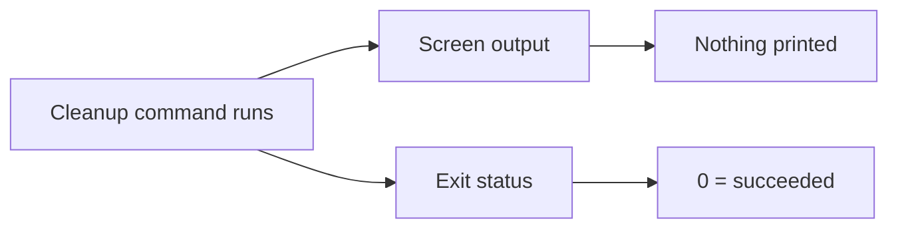

These are two separate channels:

- Screen output is what the command says to you. It can be empty.
- Exit status is a hidden result for the shell or another program.
- `echo $?` is a separate command that displays that hidden status.

Now explain in your own words: How can a command print nothing but still succeed? Include
confidence from 0–100.

LEARNER'S FIRST COMMITTED ANSWER (verbatim):
it can print nothing but it has a hidden status so the shell knows it succeeded

CONFIDENCE FOLLOW-UP (verbatim):
70

EVALUATION:
Correct. The learner separated the empty screen-output channel from the hidden status channel and
explained that the shell uses the latter to recognize success. The required confidence tag was
omitted initially and supplied after one reminder.

PRIMARY BLOCKER:
none on the two-channel model

SCAFFOLD RUNG:
R1 teach-back

RECOVERY STATUS:
worked-example step B passed; climb to a partially scaffolded reverse-direction case

TRANSFER / NEXT RETRIEVAL:
A successful silent command is incorrectly judged by a rule that looks only for printed output.

---

## EV-P1-EXIT-105

DATE: 2026-08-28
PHASE: 1 (fundamentals review; learner limited quiz scope to completed Phases 0–2)
TAG: output_and_exit_status_are_independent, silence_does_not_imply_success
RESULT: partial

PROMPT (verbatim):
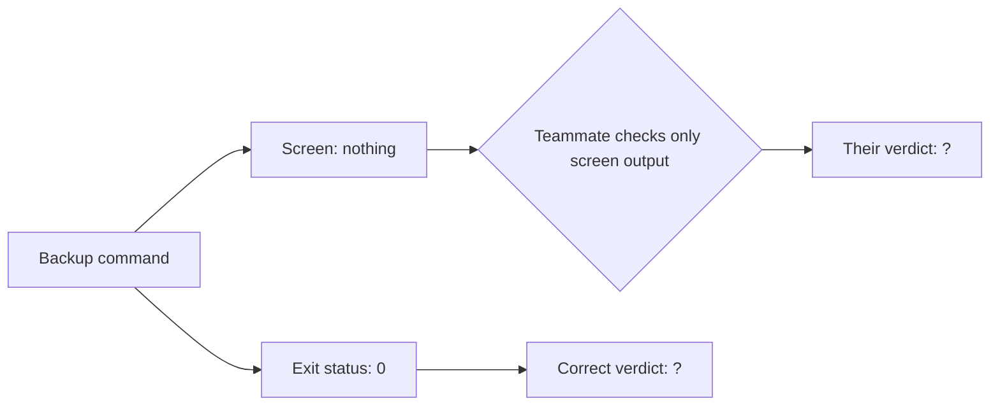

The teammate’s rule is:

> If something appears on screen, mark PASS. Otherwise, mark FAIL.

Answer separately:

1. What verdict does the teammate give?
2. What verdict should the command receive?
3. Why is the teammate’s rule wrong?
4. Confidence: 0–100

LEARNER'S FIRST COMMITTED ANSWER (verbatim):
the teammate gives the fail verdict and the command receives pass, for me looking on screen in a terminal if the output is nothing and i am not calling print i assume it is a pass, is that a bad instinct, 80

EVALUATION:
The two requested verdicts are correct: the teammate's output-only rule produces FAIL, while exit
status `0` means the command should receive PASS. The proposed replacement heuristic, silence
means pass, is not reliable. Screen output is optional diagnostic or informational text; neither
its presence nor its absence determines success.

PRIMARY BLOCKER:
The learner now separates the channels but still wants to infer status from the screen channel
when the actual status is not visible.

SCAFFOLD RUNG:
R2 target; descend to R1 channel-choice problem

RECOVERY STATUS:
in progress

TRANSFER / NEXT RETRIEVAL:
Give conflicting screen text and exit status, then ask which channel determines the shell's
success judgment.

---

## EV-P1-EXIT-106

DATE: 2026-08-28
PHASE: 1 (fundamentals review; learner limited quiz scope to completed Phases 0–2)
TAG: output_and_exit_status_are_independent, status_is_authoritative
RESULT: correct

PROMPT (verbatim):
Yes, that instinct is unsafe. A command can fail silently or succeed while printing many lines.
Treat screen output as information and exit status as the shell’s verdict.

Simpler check:

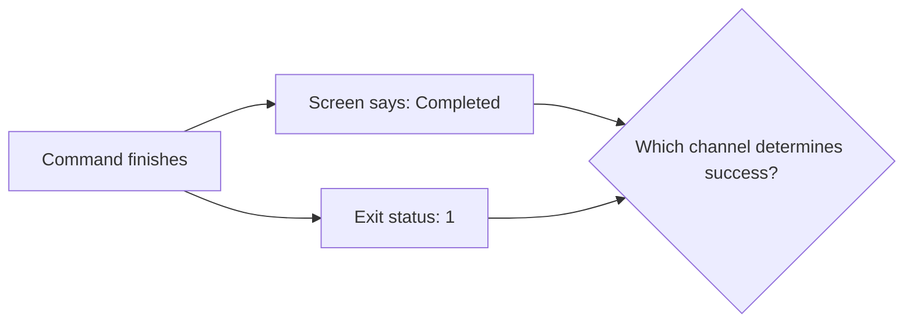

Does the shell consider this command a success or failure? Explain which channel decides, then
give confidence from 0–100.

LEARNER'S FIRST COMMITTED ANSWER (verbatim):
the status determins it is a fail, i would trust the status over anything, 80

EVALUATION:
Correct. Despite reassuring screen text, the learner used nonzero status `1` to classify the
command as failure and explicitly chose the status over screen output.

PRIMARY BLOCKER:
none at R1

SCAFFOLD RUNG:
R1

RECOVERY STATUS:
correct; same-rung near-transfer in the opposite direction next

TRANSFER / NEXT RETRIEVAL:
Give alarming screen text with status `0`; ask for the shell/CI verdict and the controlling
channel.

---

## EV-P1-EXIT-107

DATE: 2026-08-28
PHASE: 1 (fundamentals review; learner limited quiz scope to completed Phases 0–2)
TAG: output_and_exit_status_are_independent, status_is_authoritative
RESULT: correct

PROMPT (verbatim):
Opposite-direction check:

A command prints:

```text
ERROR found in archived log
```

Then it exits with status `0`.

As far as the shell or CI is concerned:

1. Is the command a success or failure?
2. Which channel determines that verdict?
3. Confidence: 0–100

LEARNER'S FIRST COMMITTED ANSWER (verbatim):
it is a success on the shell and CI but I would investigate it further since it is on the screen output telling me there is an error and i would at least ask the question

CONFIDENCE FOLLOW-UP (verbatim):
70

EVALUATION:
Correct and appropriately nuanced. The learner classified the command as success from status `0`
while treating alarming output as evidence worth investigating rather than as the shell's verdict.
The confidence tag was supplied after one reminder.

PRIMARY BLOCKER:
none

SCAFFOLD RUNG:
R1 near-transfer

RECOVERY STATUS:
same-rung near-transfer passed; climb to one fresh target-level two-command case

TRANSFER / NEXT RETRIEVAL:
Two commands with opposing output/status combinations, evaluated separately.

---

## EV-P1-EXIT-108

DATE: 2026-08-28
PHASE: 1 (fundamentals review; learner limited quiz scope to completed Phases 0–2)
TAG: output_and_exit_status_are_independent, status_is_authoritative
RESULT: correct

PROMPT (verbatim):
Last exit-status problem—answer each command separately.

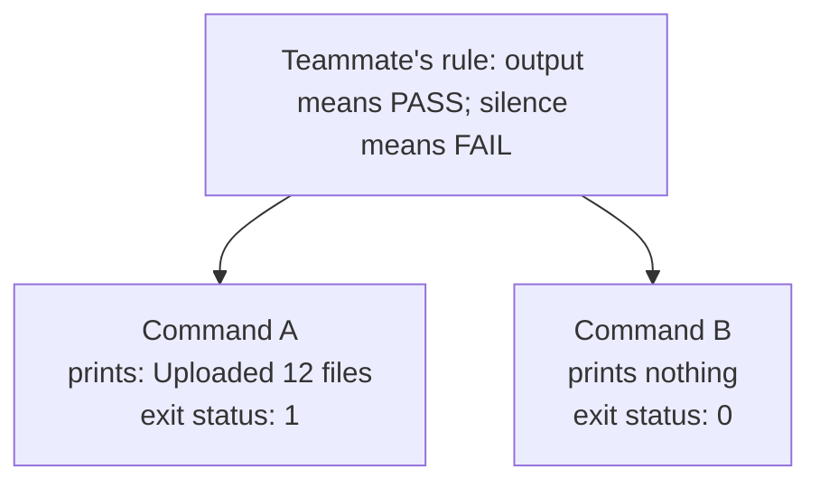

For each command, give one separate line containing:

- Teammate’s verdict
- Correct shell/CI verdict
- Whether the teammate is wrong

Then give confidence from 0–100.

LEARNER'S FIRST COMMITTED ANSWER (verbatim):
for A: teammate pass, shell fail
for B: teammate fail, shell pass
80

EVALUATION:
Correct in both directions and enumerated separately. For A, the output-only rule says PASS while
status `1` says failure. For B, the rule says FAIL while status `0` says success. The teammate is
wrong for both commands, which is implicit in the two opposing verdicts even though the learner
did not separately write that phrase.

PRIMARY BLOCKER:
none

SCAFFOLD RUNG:
R2 target-level transfer

RECOVERY STATUS:
remediated; isolated convention, teach-back, same-rung transfers, climb, and fresh target-level
variant all passed

TRANSFER / NEXT RETRIEVAL:
Delayed retrieval later in a new surface. Rotate now to another Phase 0–2 fundamental.

---

## EV-P1-RETURN-109

DATE: 2026-08-28
PHASE: 1 (fundamentals review; learner limited quiz scope to completed Phases 0–2)
TAG: print_vs_return, missing_return_is_none, list_equality, exit_status_interference
RESULT: partial

PROMPT (verbatim):
Predict by hand; don’t run it.

```python
def announce(word):
    print(word.upper())


results = []
results.append(announce("go"))

print(results == ["GO"])
```

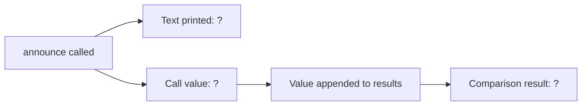

Answer separately:

1. What appears on screen, in exact order?
2. What value is appended to `results`?
3. Why isn’t the printed text necessarily the call’s value?
4. Confidence: 0–100

LEARNER'S FIRST COMMITTED ANSWER (verbatim):
GO&#x20;
exit code 1&#x20;
the function does not return upper it prints it so the announce returns None and that is not equal to GO, 80, None is appended to results

EVALUATION:
The target `print_vs_return` reasoning is correct: `announce` prints `GO`, has no explicit return,
therefore its call value is `None`, and that `None` is appended to `results`. The learner also
correctly states that `None` is not equal to `"GO"`.

The exact second screen line was incorrectly expressed as `exit code 1`. The final statement is a
Python `print` of a Boolean list comparison; it does not display the process exit status. This is
likely immediate interference from the just-completed exit-status sequence, not a return-value
failure.

PRIMARY BLOCKER:
Distinguishing a printed Python Boolean from a shell exit status.

SCAFFOLD RUNG:
R4 target; descend to R1 list-equality expression

RECOVERY STATUS:
in progress; print-versus-return mechanism correct, exact final output not yet recovered

TRANSFER / NEXT RETRIEVAL:
Evaluate and print `[None] == ["GO"]` with no function or shell context.

---

## EV-P1-EQUALITY-110

DATE: 2026-08-28
PHASE: 1 (fundamentals review; learner limited quiz scope to completed Phases 0–2)
TAG: list_equality, printed_boolean_vs_exit_status
RESULT: correct

PROMPT (verbatim):
Simpler Python-only problem:

```python
print([None] == ["GO"])
```

1. Is `[None] == ["GO"]` `True` or `False`?
2. What exactly appears on screen?
3. Confidence: 0–100

LEARNER'S FIRST COMMITTED ANSWER (verbatim):
it would print False&#x20;
80

EVALUATION:
Correct. The unequal one-item lists produce Boolean `False`, and Python prints the word `False`.
No exit status was substituted.

PRIMARY BLOCKER:
none at R1

SCAFFOLD RUNG:
R1

RECOVERY STATUS:
correct; same-rung near-transfer next

TRANSFER / NEXT RETRIEVAL:
Compare lists containing the same values in a different order.

---

## EV-P1-EQUALITY-111

DATE: 2026-08-28
PHASE: 1 (fundamentals review; learner limited quiz scope to completed Phases 0–2)
TAG: list_equality_compares_contents_in_order
RESULT: wrong

PROMPT (verbatim):
Same-level check:

```python
print(["red", "blue"] == ["blue", "red"])
```

The two lists contain the same two words, but in different positions.

1. What exactly appears on screen?
2. Does list equality care about order?
3. Confidence: 0–100

LEARNER'S FIRST COMMITTED ANSWER (verbatim):
True, == is checking the contents not the order, 80

EVALUATION:
Incorrect. Python list equality compares contents in corresponding positions as well as length.
These lists contain the same members but the first positions already differ, so the comparison is
`False` and Python prints `False`.

PRIMARY BLOCKER:
The learner models list equality as unordered membership rather than ordered positional equality.

SCAFFOLD RUNG:
R1; simplify further to one corresponding pair

RECOVERY STATUS:
not remediated

TRANSFER / NEXT RETRIEVAL:
Compare only the first item from each list, stated in plain language before reintroducing whole
lists.

---

## EV-P1-EQUALITY-112

DATE: 2026-08-28
PHASE: 1 (fundamentals review; learner limited quiz scope to completed Phases 0–2)
TAG: list_equality_compares_contents_in_order
RESULT: correct

PROMPT (verbatim):
Compare only the first position:

```text
left list first item:  "red"
right list first item: "blue"
```

Is `"red" == "blue"` `True` or `False`? Explain briefly and give confidence from 0–100.

LEARNER'S FIRST COMMITTED ANSWER (verbatim):
false, i understand the conecept now == wants the list to have the same contents in the same order

CONFIDENCE FOLLOW-UP (verbatim):
100

EVALUATION:
Correct. The first corresponding items differ, so their equality is `False`. The learner also
restated the broader list rule correctly: same contents in the same order. Confidence was supplied
after one reminder.

PRIMARY BLOCKER:
none at the isolated-pair rung

SCAFFOLD RUNG:
R1

RECOVERY STATUS:
isolated prerequisite passed; fresh same-rung near-transfer next

TRANSFER / NEXT RETRIEVAL:
One new corresponding string pair, then rebuild whole-list equality.

---

## EV-P1-EQUALITY-113

DATE: 2026-08-28
PHASE: 1 (fundamentals review; learner limited quiz scope to completed Phases 0–2)
TAG: positional_equality
RESULT: correct

PROMPT (verbatim):
Fresh single-pair check:

```text
left item:  "green"
right item: "green"
```

1. Is `"green" == "green"` `True` or `False`?
2. Why?
3. Confidence: 0–100

LEARNER'S FIRST COMMITTED ANSWER (verbatim):
true, becasue they are the saem string, 100

EVALUATION:
Correct. The corresponding string values are the same, so the comparison is `True`.

PRIMARY BLOCKER:
none

SCAFFOLD RUNG:
R1 near-transfer

RECOVERY STATUS:
same-rung near-transfer passed; climb to a two-position whole-list comparison

TRANSFER / NEXT RETRIEVAL:
Compare two lists position by position and then give the whole-list Boolean.

---

## EV-P1-EQUALITY-114

DATE: 2026-08-28
PHASE: 1 (fundamentals review; learner limited quiz scope to completed Phases 0–2)
TAG: list_equality_compares_contents_in_order, exact_boolean_spelling
RESULT: partial

PROMPT (verbatim):
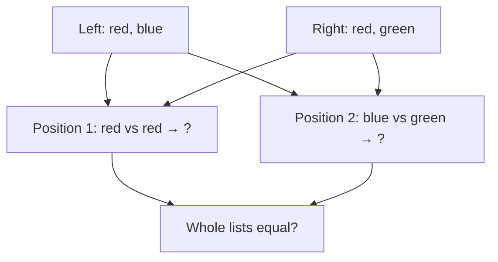

For this code:

```python
print(["red", "blue"] == ["red", "green"])
```

Answer separately:

1. Position 1 comparison: `True` or `False`
2. Position 2 comparison: `True` or `False`
3. Whole-list comparison: `True` or `False`
4. Exact screen output
5. Confidence: 0–100

LEARNER'S FIRST COMMITTED ANSWER (verbatim):
true
fasle
false
false
100

EVALUATION:
The positional and whole-list logic is fully correct: position 1 is true, position 2 is false, and
the whole comparison is false. The exact screen output was written lowercase `false`; Python's
exact Boolean spelling is `False`. The `fasle` typo on position 2 does not obscure the intended
answer because the following whole-list answers are consistent.

PRIMARY BLOCKER:
Exact capitalization/transcription, not list equality.

SCAFFOLD RUNG:
R2 whole list; descend to R0 exact Boolean spelling

RECOVERY STATUS:
ordered list-equality concept recovered; exact output precision remains

TRANSFER / NEXT RETRIEVAL:
Choose Python's exact spelling between `False` and `false`.

---

## EV-P1-BOOLEAN-115

DATE: 2026-08-28
PHASE: 1 (fundamentals review; learner limited quiz scope to completed Phases 0–2)
TAG: exact_boolean_spelling
RESULT: correct

PROMPT (verbatim):
Which is Python’s exact Boolean spelling?

```text
False
```

or

```text
false
```

Answer with the exact spelling and confidence from 0–100.

LEARNER'S FIRST COMMITTED ANSWER (verbatim):
i understand now i need a captial F or T when it comes to booleans

CONFIDENCE FOLLOW-UP (verbatim):
100

EVALUATION:
Correct. The learner stated the general Python convention: `False` and `True` use capital initial
letters. Confidence was supplied after one reminder.

PRIMARY BLOCKER:
none

SCAFFOLD RUNG:
R0

RECOVERY STATUS:
exact-output capitalization corrected; return to a fresh target-level `print_vs_return` trace

TRANSFER / NEXT RETRIEVAL:
A printing function with no explicit return whose call value is stored inside a list.

---

## EV-P1-RETURN-116

DATE: 2026-08-28
PHASE: 1 (fundamentals review; learner limited quiz scope to completed Phases 0–2)
TAG: print_vs_return, missing_return_is_none, list_representation, exit_status_interference
RESULT: partial

PROMPT (verbatim):
Predict by hand; don’t run it.

```python
def mark():
    print("saved")


box = [mark()]
print(box)
```

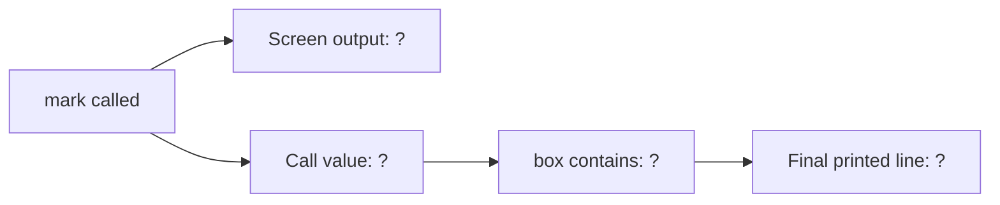

Answer separately:

1. What appears on screen, in exact order?
2. What value does `mark()` contribute to `box`?
3. Why?
4. Confidence: 0–100

LEARNER'S FIRST COMMITTED ANSWER (verbatim):
saved
None on screen
exit code 0 box contains None ,saved None, 100, mark does not return anything so it returns None it does however print saved

EVALUATION:
The `print_vs_return` model is correct: `mark()` prints `saved`, lacks an explicit return, therefore
contributes `None`, and `box` contains `None`. The exact second printed line was given as bare
`None` or ambiguously as `saved None`, rather than the list representation `[None]`. An unrequested
`exit code 0` was also inserted even though the program never prints its process status.

PRIMARY BLOCKER:
Exact display of a list containing `None`; exit-status material is still intruding into Python
screen-output traces.

SCAFFOLD RUNG:
R4 target; descend to R1 printing a literal one-item list

RECOVERY STATUS:
`print_vs_return` mechanism correct; exact-output trace still in progress

TRANSFER / NEXT RETRIEVAL:
Print `[None]` directly, with no function and no shell context.

---

## EV-P1-LIST-117

DATE: 2026-08-28
PHASE: 1 (fundamentals review; learner limited quiz scope to completed Phases 0–2)
TAG: one_item_list_representation, container_vs_item
RESULT: wrong

PROMPT (verbatim):
Simpler Python-only trace:

```python
box = [None]
print(box)
```

What exactly appears on screen, including punctuation and capitalization? Give confidence from
0–100.

LEARNER'S FIRST COMMITTED ANSWER (verbatim):
None 30

LEARNER'S ASSISTED CORRECTION (verbatim):
[None]

CONFIDENCE ON ASSISTED CORRECTION (verbatim):
80, you hinted at it

EVALUATION:
Incorrect. Printing the list displays `[None]`, including the list brackets. The learner printed
the contained item as though `box` referred directly to `None`, losing the container
representation. Confidence 30 appropriately signaled uncertainty.

PRIMARY BLOCKER:
Container versus contained item: `[None]` is a one-item list, not bare `None`.

SCAFFOLD RUNG:
R1 failed; descend to R0 syntax recognition with no print operation

RECOVERY STATUS:
not independently remediated; corrected to `[None]` after the bracket/container distinction was
explicitly supplied, and the learner correctly identified that it was hinted

TRANSFER / NEXT RETRIEVAL:
Fresh one-item list with a numeric item, no output hint.

---

## EV-P1-LIST-118

DATE: 2026-08-28
PHASE: 1 (fundamentals review; learner limited quiz scope to completed Phases 0–2)
TAG: one_item_list_representation, container_vs_item
RESULT: correct

PROMPT (verbatim):
Fresh problem—predict without running:

```python
numbers = [7]
print(numbers)
```

What exactly appears on screen, including punctuation? Give confidence from 0–100.

LEARNER'S FIRST COMMITTED ANSWER (verbatim):
[7], 100

EVALUATION:
Correct and independent. Printing the one-item list displays `[7]`, preserving the container's
brackets.

PRIMARY BLOCKER:
none at R1

SCAFFOLD RUNG:
R1

RECOVERY STATUS:
isolated prerequisite passed independently; fresh same-rung near-transfer next

TRANSFER / NEXT RETRIEVAL:
Print a fresh list with two numeric items, then climb back toward the function/list target.

---

## EV-P1-LIST-119

DATE: 2026-08-28
PHASE: 1 (fundamentals review; learner limited quiz scope to completed Phases 0–2)
TAG: list_representation, exact_output_spacing
RESULT: partial, self-corrected after precision prompt

PROMPT (verbatim):
Fresh near-transfer:

```python
numbers = [3, 8]
print(numbers)
```

What exactly appears on screen, including all punctuation and spacing? Give confidence from
0–100.

LEARNER'S FIRST COMMITTED ANSWER (verbatim):
[3,8]

CONFIDENCE / CORRECTION FOLLOW-UP (verbatim):
100, ok i need to add a spce after the comma

EVALUATION:
The first answer preserved the list container and values but omitted Python's default space after
the comma. After being reminded that exact spacing would be evaluated, the learner self-corrected
to the rule that a space is needed. Exact output is `[3, 8]`. Confidence 100 applies to the
corrected model, not the original transcription.

PRIMARY BLOCKER:
Exact default spacing in printed list representation.

SCAFFOLD RUNG:
R1 generation; descend to R0 recognition between two spellings

RECOVERY STATUS:
in progress; correction was prompted by the spacing reminder

TRANSFER / NEXT RETRIEVAL:
Choose which of two two-item list spellings Python prints.

---

## EV-P1-LIST-120

DATE: 2026-08-28
PHASE: 1 (fundamentals review; learner limited quiz scope to completed Phases 0–2)
TAG: list_representation, exact_output_spacing
RESULT: correct

PROMPT (verbatim):
For this Python code:

```python
print([4, 5])
```

Which exact output does Python display?

```text
A. [4,5]
B. [4, 5]
```

Answer `A` or `B`, copy the exact output, and give confidence from 0–100.

LEARNER'S FIRST COMMITTED ANSWER (verbatim):
B, 100
after this no more nitpicking that is what this is, can we move on to a different part of phase 0,1,2

EVALUATION:
Correct at confidence 100. Python's displayed two-item list uses a space after the comma. The
learner requested no further nitpicking and a move to another part of Phases 0–2. Honor that
preference: do not continue formatting drills, and raise precision only when it changes meaning or
is the concept under test.

PRIMARY BLOCKER:
none

SCAFFOLD RUNG:
R0 recognition

RECOVERY STATUS:
exact list representation recovered sufficiently for this review; rotate topics

TRANSFER / NEXT RETRIEVAL:
Phase 2 summary-model fundamentals, targeting the still-open individual count values.

---

## EV-P2-MODEL-121

DATE: 2026-08-28
PHASE: 2 (fundamentals review; learner limited quiz scope to completed Phases 0–2)
TAG: diff_summary_model, classification_to_count, per_item_enumeration
RESULT: partial

PROMPT (verbatim):
Phase 2 summary problem. Predict without running code.

```text
diff --git a/menu.txt b/menu.txt
index 1111111..2222222 100644
--- a/menu.txt
+++ b/menu.txt
@@ -1,2 +1,3 @@
-tea
+coffee
+water
 cake
```

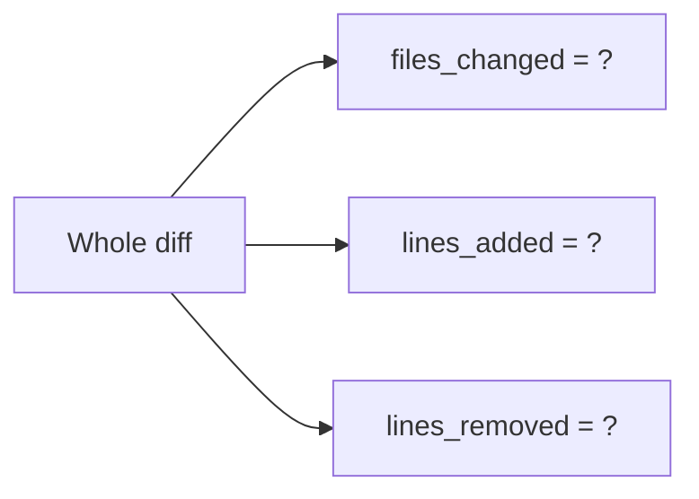

Give each field separately:

1. `files_changed`
2. `lines_added`
3. `lines_removed`
4. Briefly explain which lines caused each count
5. Confidence: 0–100

LEARNER'S FIRST COMMITTED ANSWER (verbatim):
files changed =1&#x20;
lines added = 2
removed = 1
cake is context everything else is metadata, the function uses prefixes to evalutae which line is which, 80

EVALUATION:
All three requested values are correct on the presented diff: one file changed, two lines added,
and one removed. This supplies the individual Phase 2 model values that remained open from
`EV-P2-MODEL-060` on a fresh diff.

The explanation is partial. `cake` is context, but "everything else is metadata" incorrectly
groups the contributing lines: `diff --git` is `file_header`; `-tea` is removed; `+coffee` and
`+water` are added; only the remaining header/hunk lines are metadata. This repeats the procedural
grouping pattern from `EV-P1-BRANCH-098`, not a failure to compute the summary.

PRIMARY BLOCKER:
Per-item enumeration in the explanation; the three-field Phase 2 summary model and values are
correct.

SCAFFOLD RUNG:
R6 summary; descend to R1 with one contributing line

RECOVERY STATUS:
`EV-P2-MODEL-060` value gap closed; explanation remediation in progress

TRANSFER / NEXT RETRIEVAL:
Classify `-tea` alone and state which counter it changes.

---

## EV-P2-MAP-122

DATE: 2026-08-28
PHASE: 2 (fundamentals review; learner limited quiz scope to completed Phases 0–2)
TAG: classification_to_count, per_item_enumeration
RESULT: correct

PROMPT (verbatim):
One line only:

```text
-tea
```

1. What label does the classifier give it?
2. Which Phase 2 summary counter does it increase?
3. Confidence: 0–100

LEARNER'S FIRST COMMITTED ANSWER (verbatim):
removed, lines removed 100

EVALUATION:
Correct. `-tea` is labelled `removed` and increments `lines_removed`.

PRIMARY BLOCKER:
none at R1

SCAFFOLD RUNG:
R1

RECOVERY STATUS:
isolated mapping passed; fresh same-rung near-transfer next

TRANSFER / NEXT RETRIEVAL:
Classify one added line and state its counter.

---

## EV-P2-MAP-123

DATE: 2026-08-28
PHASE: 2 (fundamentals review; learner limited quiz scope to completed Phases 0–2)
TAG: classification_to_count, assistance_fading
RESULT: correct

PROMPT (verbatim):
Fresh line:

```text
+coffee
```

1. What label does it receive?
2. Which summary counter does it increase?
3. Confidence: 0–100

LEARNER'S FIRST COMMITTED ANSWER (verbatim):
ok these are too simple of questions, this is added, it increases lines added, 100

EVALUATION:
Correct at confidence 100. `+coffee` is `added` and increments `lines_added`. The learner said the
rung is too simple; this is accurate evidence that the scaffold should fade. End isolated line
mapping and move to a harder Phase 0–2 transfer.

PRIMARY BLOCKER:
none

SCAFFOLD RUNG:
R1 near-transfer

RECOVERY STATUS:
same-rung near-transfer passed; simple classification-to-counter mapping is stable for this review

TRANSFER / NEXT RETRIEVAL:
Rotate to a composed mutation-versus-new-value trace involving a string and a list.

---

## EV-P2-MUTATION-124

DATE: 2026-08-28
PHASE: 2 (fundamentals review; learner limited quiz scope to completed Phases 0–2)
TAG: string_immutability, sorted_vs_sort, syntax_reading
RESULT: incomplete; syntax-only remediation entered

PROMPT (verbatim):
Harder transfer—predict the state without running it:

```python
word = "build"
upper_word = word.upper()

numbers = [3, 1, 2]
ordered = sorted(numbers)

numbers.sort()
```

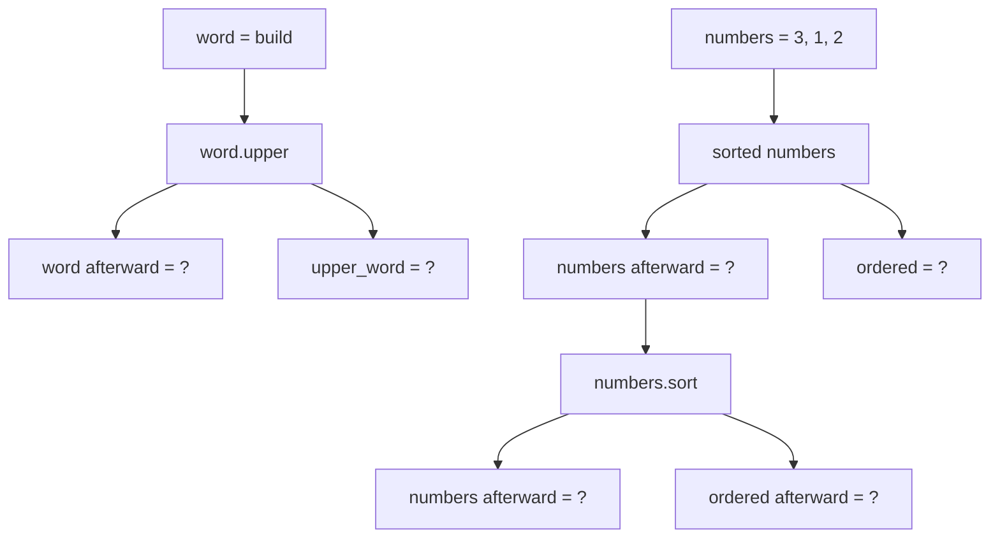

Answer each checkpoint separately:

1. After `word.upper()`: `word` and `upper_word`
2. After `sorted(numbers)`: `numbers` and `ordered`
3. After `numbers.sort()`: `numbers` and `ordered`
4. Which operations created new values, and which mutated an existing value?
5. What single principle connects the string and list cases?
6. Confidence: 0–100

LEARNER'S FIRST COMMITTED ANSWER (verbatim):
word does not change, numbers does change i am not sure when i have not looked at sorted yet

CONFIDENCE FOLLOW-UP (verbatim):
for the word part 100

EVALUATION:
The learner correctly states at confidence 100 that `word` does not change. They did not give
`upper_word`, and they explicitly cannot yet read `sorted(...)`, so evaluation of the list portion
stops. Per syntax-only help mode, do not solve or continue the composed trace. Explain only the
`sorted(list)` syntax and give an R1 example.

PRIMARY BLOCKER:
SYNTAX_READING: `sorted(numbers)` has not been learned.

SCAFFOLD RUNG:
R6 target; descend immediately to R1 for `sorted(...)`

RECOVERY STATUS:
in progress; target problem paused

TRANSFER / NEXT RETRIEVAL:
One two-item list passed to `sorted`, tracking the original and returned list.

---

## EV-P2-SORTED-125

DATE: 2026-08-28
PHASE: 2 (fundamentals review; learner limited quiz scope to completed Phases 0–2)
TAG: sorted_returns_new_list, mutation_vs_new_value
RESULT: correct

PROMPT (verbatim):
`sorted(numbers)` means:

> Make and return a new list containing the same items in sorted order.

It does not change `numbers`.

Tiny example:

```python
numbers = [2, 1]
ordered = sorted(numbers)
```

Without running it:

1. What does `numbers` contain afterward?
2. What does `ordered` contain?
3. Confidence: 0–100

LEARNER'S FIRST COMMITTED ANSWER (verbatim):
so does numbers contain [2, 1] adn ordered is [1, 2], what about sort(), 100

EVALUATION:
Correct at confidence 100. `sorted(numbers)` leaves the original list `[2, 1]` unchanged and
returns the new sorted list `[1, 2]`, assigned to `ordered`. The learner immediately asked about
`.sort()`, which is the appropriate contrasting syntax step.

PRIMARY BLOCKER:
none for `sorted(...)`; `.sort()` remains unread

SCAFFOLD RUNG:
R1

RECOVERY STATUS:
`sorted(...)` syntax understood; teach `.sort()` in isolation next

TRANSFER / NEXT RETRIEVAL:
One two-item list followed by `numbers.sort()`, tracking the mutated list and the call value.

---

## EV-P2-SORT-126

DATE: 2026-08-28
PHASE: 2 (fundamentals review; learner limited quiz scope to completed Phases 0–2)
TAG: sort_mutates, sort_returns_none, mutation_vs_return
RESULT: partial

PROMPT (verbatim):
`numbers.sort()` works differently:

- It rearranges the existing `numbers` list itself.
- It does not create a sorted list as its call value.
- Its call value is `None`.

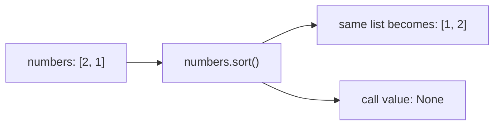

Now predict:

```python
numbers = [3, 1, 2]
result = numbers.sort()
```

1. What does `numbers` contain afterward?
2. What does `result` contain?
3. Confidence: 0–100

LEARNER'S FIRST COMMITTED ANSWER (verbatim):
Numbers = [1, ,2 ,3] and resutl is the same, 100

EVALUATION:
The learner correctly intends that `numbers` itself becomes sorted; the extra comma is treated as
a harmless transcription typo per the learner's stated preference. The conceptual error is saying
`result` is the same sorted list. Assignment receives the call value, and `.sort()` returns
`None`, even though it mutates `numbers`.

PRIMARY BLOCKER:
The changed object is being conflated with the mutating method's return value.

SCAFFOLD RUNG:
R1 failed; descend to R0 choice about the assigned call value

RECOVERY STATUS:
in progress

TRANSFER / NEXT RETRIEVAL:
Choose whether `result = numbers.sort()` assigns the list or `None`, without also tracking list
contents.

---

## EV-P2-SORT-127

DATE: 2026-08-28
PHASE: 2 (fundamentals review; learner limited quiz scope to completed Phases 0–2)
TAG: sort_returns_none, mutation_vs_return
RESULT: wrong; worked-example rescue entered

PROMPT (verbatim):
Focus only on the assignment:

```python
result = numbers.sort()
```

Which value is assigned to `result`?

```text
A. The sorted list
B. None
```

Answer `A` or `B`, explain briefly, and give confidence from 0–100.

LEARNER'S FIRST COMMITTED ANSWER (verbatim):
A,  is my guess if we were to print reslut afterwards it would give us the sorted list but assinged i am not sure, 40

EVALUATION:
Incorrect. `.sort()` mutates the existing list and returns `None`, so `result` receives `None`.
The learner remains unsure whether later printing `result` somehow accesses the changed list. It
does not: `result` holds the call value that assignment received.

PRIMARY BLOCKER:
Mutation of the receiver and return value of the method are still modeled as the same channel.

SCAFFOLD RUNG:
R0 failed after the fact was explicitly taught; enter worked-example rescue

RECOVERY STATUS:
not remediated; worked-example step A next

TRANSFER / NEXT RETRIEVAL:
Show one solved neighboring `.append()` example with the changed list and returned `None` drawn as
separate paths, then require learner teach-back.

---

## EV-P2-MUTATION-128

DATE: 2026-08-28
PHASE: 2 (fundamentals review; learner limited quiz scope to completed Phases 0–2)
TAG: mutation_vs_return, assignment_receives_call_value, aliasing
RESULT: wrong; worked-example teach-back failed

PROMPT (verbatim):
Solved neighboring example:

```python
items = ["a"]
result = items.append("b")
```

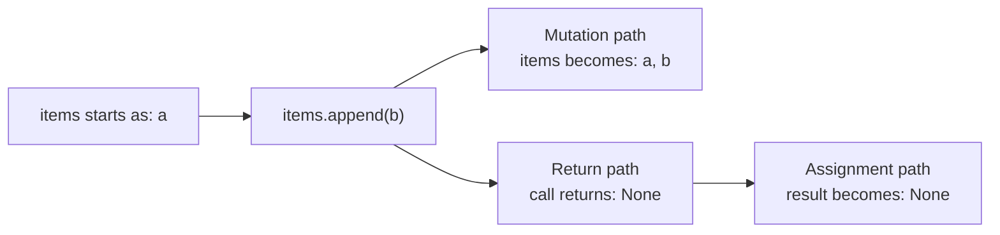

The method does two separate things:

- It changes `items`.
- It returns `None`, which is assigned to `result`.

Explain this example back in your own words:

1. Why does `items` contain `"b"`?
2. Why does `result` contain `None` instead of the changed list?
3. What would `print(result)` display?
4. Confidence: 0–100

LEARNER'S FIRST COMMITTED ANSWER (verbatim):
because we appended b and items and results now point at the same list, 2. i have no idea, 3. it would print [a, b], 80

EVALUATION:
Incorrect. `append` mutates `items`, but its call value is `None`; therefore `result` is `None`,
not an alias of `items`, and `print(result)` displays `None`. The diagram and explicit solved facts
did not survive into the teach-back.

PRIMARY BLOCKER:
Assignment is being modeled as linking the left-hand name to whichever object the method mutated,
rather than binding it to the value produced by the right-hand expression.

SCAFFOLD RUNG:
Worked-example step B failed; descend below method calls to R0 assignment

RECOVERY STATUS:
not remediated

TRANSFER / NEXT RETRIEVAL:
Use only `result = None`; ask what value the name receives and what printing it displays.

---

## EV-P1-NONE-129

DATE: 2026-08-28
PHASE: 1 (fundamentals review; learner limited quiz scope to completed Phases 0–2)
TAG: none_is_a_value, assignment
RESULT: partial

PROMPT (verbatim):
Smallest assignment:

```python
result = None
print(result)
```

1. What value is assigned to `result`?
2. What does `print(result)` display?
3. Confidence: 0–100

LEARNER'S FIRST COMMITTED ANSWER (verbatim):
result has no value, it prints None, 80

EVALUATION:
The printed output is correct. The statement that `result` has no value is not: `None` is itself a
Python value used to represent absence or no meaningful result. The name `result` exists and is
bound to that value.

PRIMARY BLOCKER:
`None` is being treated as the nonexistence of a binding rather than a value that a name can hold.

SCAFFOLD RUNG:
R0

RECOVERY STATUS:
in progress

TRANSFER / NEXT RETRIEVAL:
Ask whether a name assigned `None` exists and what value it holds.

---

## EV-P1-NONE-130

DATE: 2026-08-28
PHASE: 1 (fundamentals review; learner limited quiz scope to completed Phases 0–2)
TAG: none_is_a_value, assignment
RESULT: correct

PROMPT (verbatim):
After this assignment:

```python
result = None
```

1. Does the name `result` exist?
2. What value is it bound to?
3. Confidence: 0–100

LEARNER'S FIRST COMMITTED ANSWER (verbatim):
yes, the value = None, 100

EVALUATION:
Correct. The name exists and is bound to the Python value `None`.

PRIMARY BLOCKER:
none at R0

SCAFFOLD RUNG:
R0

RECOVERY STATUS:
isolated prerequisite passed; one assignment near-transfer next

TRANSFER / NEXT RETRIEVAL:
Copy the `None` value from one existing name to another through assignment.

---

## EV-P1-NONE-131

DATE: 2026-08-28
PHASE: 1 (fundamentals review; learner limited quiz scope to completed Phases 0–2)
TAG: none_is_not_string, assignment, aliasing_language
RESULT: partial

PROMPT (verbatim):
One bridge question:

```python
result = None
copy = result
```

What value is assigned to `copy`, and why? Confidence: 0–100.

LEARNER'S FIRST COMMITTED ANSWER (verbatim):
None, they are pointing at the same string, 100

EVALUATION:
The assigned value is correct: `copy` receives `None`. The explanation misclassifies `None` as a
string. Unquoted `None` is Python's singleton absence value; quoted `"None"` is a string. Both names
are bound to the same `None` object, but calling it a string is a type-model error rather than a
wording nit.

PRIMARY BLOCKER:
Distinguishing the `None` value from the string `"None"`.

SCAFFOLD RUNG:
R1 bridge partial; descend to R0 quoted-versus-unquoted recognition

RECOVERY STATUS:
in progress

TRANSFER / NEXT RETRIEVAL:
Choose which of `None` and `"None"` is a string.

---

## EV-P1-ASSIGN-132

DATE: 2026-08-28
PHASE: 1 (fundamentals review; learner limited quiz scope to completed Phases 0–2)
TAG: assignment_same_object, none_is_not_string, mutability
RESULT: correct teach-back

PROMPT (verbatim):
No—`copy` and `result` are bound to the same single `None` object. Python does not create a
different `None`.

```text
result ──┐
         ├──> None
copy   ──┘
```

`copy = result` means:

1. Look up the value currently bound to `result`.
2. That value is `None`.
3. Bind `copy` to that same value.

Your “pointing at the same thing” idea was right. The only incorrect part was calling that thing a
string:

- `None` is Python’s special absence value.
- `"None"` is a string because it has quotation marks.

Now teach it back: do `result` and `copy` refer to the same or different object, and is that object
`None` or `"None"`? Include confidence from 0–100.

LEARNER'S FIRST COMMITTED ANSWER (verbatim):
ok so my thinking was correct because i was treating it as a string or list where when you make them equal it makes them point to the same string or list and now you are saying the same thing for values, so it points to the same value as well, 100

EVALUATION:
Correct core assignment model at confidence 100. Evaluating the right-hand name produces its
current object/value, and assignment binds the left-hand name to that same object. In this case the
object is `None`, not the string `"None"`. Preserve a later distinction: shared mutable lists expose
changes through either name, while strings and `None` are immutable.

PRIMARY BLOCKER:
none on assignment identity; mutation versus return still must be rebuilt

SCAFFOLD RUNG:
R0/R1 teach-back

RECOVERY STATUS:
assignment prerequisite passed; resume worked-example step C with one missing return value

TRANSFER / NEXT RETRIEVAL:
Give the mutated list state and ask only what value `append` assigns to a result name.

---

## EV-P1-MUTABILITY-133

DATE: 2026-08-28
PHASE: 1 (fundamentals review; learner limited quiz scope to completed Phases 0–2)
TAG: immutable_rebinding, mutable_aliasing, objects_and_values
RESULT: correct

PROMPT (verbatim):
Exactly. That is the key distinction.

With an immutable object, an operation cannot alter the original object. The name is rebound to
another value:

```python
a = 7
b = a
a = a + 1
```

```text
Before: a ─┐
            ├──> 7
        b ─┘

After:  a ────> 8
        b ────> 7
```

The integer `7` was not changed into `8`. `a` was rebound.

With a mutable list:

```python
items = [1]
alias = items
items.append(2)
```

```text
items ─┐
       ├──> [1, 2]
alias ─┘
```

The existing list was changed, so both names observe the change.

Your principle is right:

> Immutable operation → usually produce another value and possibly rebind a name.  
> Mutable operation → change the existing object, so aliases observe it.

Quick transfer:

```python
word = "cat"
copy = word
word = word.upper()

numbers = [2]
alias = numbers
numbers.append(5)
```

What do `word`, `copy`, `numbers`, and `alias` contain afterward? Explain the difference and give
confidence from 0–100.

LEARNER'S FIRST COMMITTED ANSWER (verbatim):
word is CAT, copy is cat, numbers is [2, 5] and so it alias, 100

EVALUATION:
Correct at confidence 100. `word.upper()` produces a new string and rebinds only `word`, leaving
`copy` as `"cat"`. `numbers.append(5)` mutates the shared list, so both `numbers` and `alias`
observe `[2, 5]`.

PRIMARY BLOCKER:
none on immutable rebinding versus mutable aliasing

SCAFFOLD RUNG:
R4/R6 transfer

RECOVERY STATUS:
object/mutability distinction passed; resume worked-example step C for method return value

TRANSFER / NEXT RETRIEVAL:
Return to `returned = items.append("y")` with the mutated list state supplied and ask only for
`returned`.

---

## EV-P2-APPEND-134

DATE: 2026-08-28
PHASE: 2 (fundamentals review; learner limited quiz scope to completed Phases 0–2)
TAG: mutation_vs_return, append_returns_none
RESULT: correct

PROMPT (verbatim):
Return to the paused example:

```python
items = ["x"]
returned = items.append("y")
```

Given:

```text
items is now ["x", "y"]
```

What value is assigned to `returned`? Explain why that value is separate from the mutation of
`items`, then give confidence from 0–100.

LEARNER'S FIRST COMMITTED ANSWER (verbatim):
None, the only purpose of that line is to mutate the list items

CONFIDENCE FOLLOW-UP (verbatim):
90

EVALUATION:
Correct at confidence 90. `append` mutates `items` and returns `None`, which is assigned to
`returned`. The wording "only purpose" refers correctly to the method's useful effect; the full
statement also assigns its `None` call value.

PRIMARY BLOCKER:
none at the partially scaffolded rung

SCAFFOLD RUNG:
worked-example step C

RECOVERY STATUS:
step C passed; fresh unaided step D next

TRANSFER / NEXT RETRIEVAL:
Use `.sort()` on a fresh list and ask for both the mutated list and assigned call value.

---

## EV-P2-SORT-135

DATE: 2026-08-28
PHASE: 2 (fundamentals review; learner limited quiz scope to completed Phases 0–2)
TAG: sort_mutates, sort_returns_none, mutation_vs_return
RESULT: correct

PROMPT (verbatim):
Fresh problem—predict without running:

```python
numbers = [4, 1, 3]
returned = numbers.sort()
```

1. What does `numbers` contain afterward?
2. What value is assigned to `returned`?
3. Explain how one line can mutate `numbers` while assigning a different value to `returned`.
4. Confidence: 0–100

LEARNER'S FIRST COMMITTED ANSWER (verbatim):
returned equals None and the numbers are now sorted afterward, ok so for append and sort do  they all have the same behavior because they are in the pyhton library?

CONFIDENCE FOLLOW-UP (verbatim):
80

EVALUATION:
Correct at confidence 80. `.sort()` mutates `numbers` into sorted order and returns `None`, which
is assigned to `returned`. This is the fresh unaided step D required after worked-example rescue.
The learner then asked whether `.append()` and `.sort()` behave alike merely because both are in
Python's library; answer that design question before resuming the larger composed trace.

PRIMARY BLOCKER:
none on the trace; API-contract generalization is the next question

SCAFFOLD RUNG:
worked-example step D, fresh R1

RECOVERY STATUS:
worked-example recovery completed at the micro level; original composed trace still needs a fresh
target-level return

TRANSFER / NEXT RETRIEVAL:
Explain that mutating-and-returning-None is a common list-method convention, not a universal
library rule; contrast `.append()`, `.sort()`, `sorted()`, `.upper()`, and `.pop()`.

---

## EV-P2-POP-136

DATE: 2026-08-28
PHASE: 2 (fundamentals review; learner limited quiz scope to completed Phases 0–2)
TAG: mutation_vs_return, pop_mutates_and_returns
RESULT: correct

PROMPT (verbatim):
No. They do not behave that way merely because they belong to Python’s library. Each operation has
its own contract.

- `list.append(x)` mutates the list and returns `None`.
- `list.sort()` mutates the list and returns `None`.
- `sorted(list)` leaves the original alone and returns a new sorted list.
- `word.upper()` returns a new string because strings are immutable.
- `list.pop()` mutates the list but also returns the item it removed.

Python commonly makes methods whose sole purpose is mutating a collection return `None`, helping
signal that the original object changed. But that is not a universal rule—`pop()` demonstrates the
exception.

A useful question for any operation is:

> What does it mutate, and what value does it return?

Fresh transfer:

```python
items = ["a", "b"]
returned = items.pop()
```

`pop()` removes and returns the last item. What do `items` and `returned` contain afterward?
Confidence: 0–100.

LEARNER'S FIRST COMMITTED ANSWER (verbatim):
items has a and returned has b, 100

EVALUATION:
Correct at confidence 100. `items` is mutated to contain only `"a"`, while `returned` receives the
removed value `"b"`. This proves the learner is no longer assuming that every mutating method must
return `None`; mutation and return are separate parts of an API contract.

PRIMARY BLOCKER:
none

SCAFFOLD RUNG:
R1 transfer

RECOVERY STATUS:
API-contract distinction passed; return to fresh composed target

TRANSFER / NEXT RETRIEVAL:
Compose string immutability, `sorted()` returning a new list, and `.sort()` mutating and returning
`None`.

---

## EV-P2-MUTATION-137

DATE: 2026-08-28
PHASE: 2 (fundamentals review; learner limited quiz scope to completed Phases 0–2)
TAG: string_immutability, sorted_returns_new_list, sort_mutates, sort_returns_none, composition
RESULT: partial

PROMPT (verbatim):
Harder composed problem—predict without running:

```python
word = "lens"
loud = word.upper()

values = [4, 2, 3]
snapshot = sorted(values)
returned = values.sort()
```

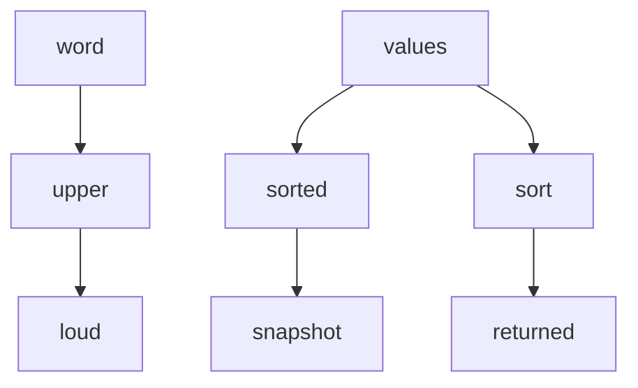

Give the final value of each name:

1. `word`
2. `loud`
3. `values`
4. `snapshot`
5. `returned`
6. Are `values` and `snapshot` the same list object or separate list objects?
7. Which operations mutated an existing object?
8. Confidence: 0–100

LEARNER'S FIRST COMMITTED ANSWER (verbatim):
word= lens
loud = LENS
values= 2,3,4
snapshot = 2,3,4
returned= 2,3,4
they are seprerate list obejcts&#x20;
sort() only&#x20;
100

LEARNER'S ASSISTED CORRECTION (verbatim):
your right retuerned returns none

CONFIDENCE ON ASSISTED CORRECTION (verbatim):
80

EVALUATION:
Six conceptual parts are correct: `word` remains lowercase, `loud` is uppercase, `values` and
`snapshot` both have sorted contents, the two lists are separate objects, and only `.sort()`
mutates. List-bracket omission is ignored per the learner's no-nitpicking preference.

The one conceptual miss is `returned`: `.sort()` returns `None`, so `returned` is `None`, not the
sorted list. The micro-level recovery from `EV-P2-SORT-135` did not survive composition, and the
miss occurred at confidence 100.

PRIMARY BLOCKER:
Retaining a mutating method's separate `None` return value when several operations are composed.

SCAFFOLD RUNG:
R6 target partial; descend only the failed edge to fresh R1 `.sort()` return

RECOVERY STATUS:
not yet recovered independently at target level; all non-return edges passed, and `returned=None`
was accepted after reveal at confidence 80

TRANSFER / NEXT RETRIEVAL:
Give a fresh `.sort()` call with the mutated list state supplied; ask only for the assigned return
value, then climb back with one added operation.

---

## EV-P2-SORT-138

DATE: 2026-08-28
PHASE: 2 (fundamentals review; learner limited quiz scope to completed Phases 0–2)
TAG: sort_mutates, sort_returns_none
RESULT: correct

PROMPT (verbatim):
Fresh isolated check:

```python
scores = [8, 3]
outcome = scores.sort()
```

Given that `scores` becomes sorted, what value is assigned to `outcome`, and why? Confidence:
0–100.

LEARNER'S FIRST COMMITTED ANSWER (verbatim):
scores is sorted and outcome is None, 100

EVALUATION:
Correct and independent at confidence 100. `.sort()` mutates `scores` and its separate call value
is `None`, which assignment binds to `outcome`. The learner asked an intervening clarification
about `pop()` before answering; that clarification did not reveal the `.sort()` answer.

PRIMARY BLOCKER:
none at R1

SCAFFOLD RUNG:
R1 fresh recovery

RECOVERY STATUS:
isolated edge recovered independently; climb one rung by adding `sorted(...)`

TRANSFER / NEXT RETRIEVAL:
Track `sorted()` returning a new list and `.sort()` mutating/returning `None` in the same short
trace.

---

## EV-P2-SORT-139

DATE: 2026-08-28
PHASE: 2 (fundamentals review; learner limited quiz scope to completed Phases 0–2)
TAG: sorted_returns_new_list, sort_mutates, sort_returns_none, composition
RESULT: correct

PROMPT (verbatim):
One-step climb:

```python
scores = [8, 3]
snapshot = sorted(scores)
outcome = scores.sort()
```

Give the final value of:

1. `scores`
2. `snapshot`
3. `outcome`
4. Which operation mutated `scores`?
5. Confidence: 0–100

LEARNER'S FIRST COMMITTED ANSWER (verbatim):
scores is mutated by sort(), [3, 8] , [3, 8] not the same object as scores, None, 100

EVALUATION:
Fully correct at confidence 100. `scores` is `[3, 8]` after `.sort()`, `snapshot` is a separate
`[3, 8]` list created by `sorted()`, `outcome` is `None`, and only `.sort()` mutated `scores`.

PRIMARY BLOCKER:
none at the two-operation rung

SCAFFOLD RUNG:
R2/R4 composition

RECOVERY STATUS:
one-step climb passed; fresh full target with string operation next

TRANSFER / NEXT RETRIEVAL:
Add one immutable string transformation on fresh data and require the full final state.

---

## EV-P2-MUTATION-140

DATE: 2026-08-28
PHASE: 2 (fundamentals review; learner limited quiz scope to completed Phases 0–2)
TAG: string_immutability, sorted_returns_new_list, sort_mutates, sort_returns_none, composition
RESULT: correct

PROMPT (verbatim):
Fresh full transfer:

```python
label = "mix"
upper_label = label.upper()

numbers = [5, 1, 4]
ordered = sorted(numbers)
sort_result = numbers.sort()
```

Give the final value of each, one line per name:

1. `label`
2. `upper_label`
3. `numbers`
4. `ordered`
5. `sort_result`
6. Which operation mutated an existing object?
7. Confidence: 0–100

LEARNER'S FIRST COMMITTED ANSWER (verbatim):
mix, MIX, [1,4,5], [1,4,5] but not the same object as numbers, None, sort() is the mutater, 100

EVALUATION:
Fully correct at confidence 100. `label` remains `"mix"`; `upper_label` receives the new uppercase
string; `ordered` is a separate sorted list; `.sort()` mutates `numbers`; and `sort_result` is
`None`. Spacing inside list displays is ignored per the learner's preference.

PRIMARY BLOCKER:
none

SCAFFOLD RUNG:
R6 full composition

RECOVERY STATUS:
target-level recovery complete

TRANSFER / NEXT RETRIEVAL:
Delayed retrieval later. Rotate to Phase 1 branch-precedence enumeration, requiring one line per
input.

---

## EV-P1-BRANCH-141

DATE: 2026-08-28
PHASE: 1 (fundamentals review; learner limited quiz scope to completed Phases 0–2)
TAG: branch_precedence, per_item_enumeration
RESULT: partial

PROMPT (verbatim):
Harder branch-precedence transfer. Two versions use the same conditions but in different orders.

Original:

```python
def classify_plan(code):
    if code.startswith("PRO-ANNUAL"):
        return "annual"
    elif code.startswith("PRO-"):
        return "pro"
    elif code.startswith("P"):
        return "product"
    return "other"
```

Reordered:

```python
def classify_plan(code):
    if code.startswith("P"):
        return "product"
    elif code.startswith("PRO-ANNUAL"):
        return "annual"
    elif code.startswith("PRO-"):
        return "pro"
    return "other"
```

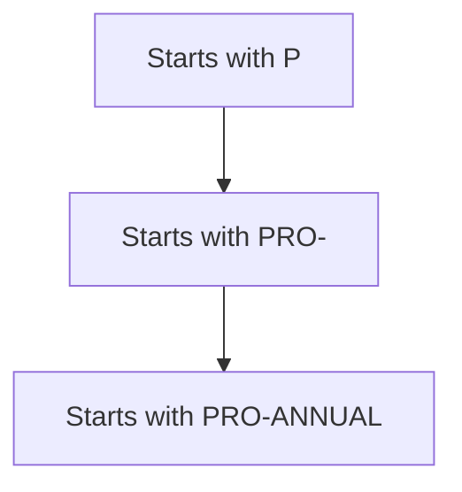

Evaluate every input separately—one line per item:

1. `"PRO-ANNUAL-TEAM"`
2. `"PRO-MONTHLY"`
3. `"PERSONAL"`
4. `"BASIC"`

For each line give:

```text
original result → reordered result → changed yes/no
```

Then explain why order matters and give confidence from 0–100.

LEARNER'S FIRST COMMITTED ANSWER (verbatim):
1,2,3 retunr product and 4 is other

CONFIDENCE FOLLOW-UP (verbatim):
100

EVALUATION:
The stated reordered results are all correct: inputs 1–3 return `product`, and input 4 returns
`other`. The answer omitted every original result, every explicit changed yes/no decision, and the
requested explanation. It also grouped items 1–3 rather than enumerating them separately.

This repeats the procedural pattern from `EV-P1-BRANCH-098`: the branch mechanism appears sound,
but a per-item comparison is answered at group level. Do not re-teach precedence. Isolate one item
and one version.

PRIMARY BLOCKER:
Per-item enumeration and completing every requested comparison field.

SCAFFOLD RUNG:
R6 partial; descend to R3 with one input and the original function only

RECOVERY STATUS:
in progress

TRANSFER / NEXT RETRIEVAL:
For `"PRO-ANNUAL-TEAM"`, ask only for the original result and the first true condition.

---

## EV-P1-BRANCH-142

DATE: 2026-08-28
PHASE: 1 (fundamentals review; learner limited quiz scope to completed Phases 0–2)
TAG: branch_precedence, version_selection, prompt_reading
RESULT: wrong

PROMPT (verbatim):
One item, original function only:

```python
classify_plan("PRO-ANNUAL-TEAM")
```

The branches are checked in this order:

```text
1. starts with "PRO-ANNUAL"
2. starts with "PRO-"
3. starts with "P"
```

Which condition is the first true one, and what does the original function return? Confidence:
0–100.

LEARNER'S FIRST COMMITTED ANSWER (verbatim):
since you changed the prefix to the shortest vewrson the longer prefex is never seen 100

EVALUATION:
Incorrect for the selected version. The answer describes the reordered function, but the prompt
explicitly selected the original function and restated its longest-to-shortest order. In the
original, the first condition is true and returns `"annual"`.

PRIMARY BLOCKER:
Selecting the function version named in the prompt, not branch-condition understanding.

SCAFFOLD RUNG:
R3 failed procedurally; descend to R1 one `startswith` Boolean

RECOVERY STATUS:
in progress

TRANSFER / NEXT RETRIEVAL:
Evaluate `"PRO-ANNUAL-TEAM".startswith("PRO-ANNUAL")` alone.

---

## EV-P1-PREFIX-143

DATE: 2026-08-28
PHASE: 1 (fundamentals review; learner limited quiz scope to completed Phases 0–2)
TAG: startswith, branch_precedence
RESULT: correct

PROMPT (verbatim):
Evaluate only this expression:

```python
"PRO-ANNUAL-TEAM".startswith("PRO-ANNUAL")
```

Is it `True` or `False`? Explain briefly and give confidence from 0–100.

LEARNER'S FIRST COMMITTED ANSWER (verbatim):
true 100, it does start with pro annual

EVALUATION:
Correct at confidence 100. The string begins with the requested prefix, so the expression is
`True`.

PRIMARY BLOCKER:
none on condition evaluation; version selection still needs a fresh check

SCAFFOLD RUNG:
R1

RECOVERY STATUS:
isolated condition passed; fresh single-version bridge next

TRANSFER / NEXT RETRIEVAL:
Use a new prefix domain with one explicitly named version and ask for the first match and return.

---

## EV-P1-BRANCH-144

DATE: 2026-08-28
PHASE: 1 (fundamentals review; learner limited quiz scope to completed Phases 0–2)
TAG: branch_precedence, first_match_wins, version_selection
RESULT: correct

PROMPT (verbatim):
Fresh single-version bridge:

```python
def classify_member(code):
    if code.startswith("VIP-GOLD"):
        return "gold"
    elif code.startswith("VIP"):
        return "vip"
    return "regular"
```

For:

```python
classify_member("VIP-GOLD-TEAM")
```

Which condition matches first, what does the function return, and are later branches checked?
Confidence: 0–100.

LEARNER'S FIRST COMMITTED ANSWER (verbatim):
this is the correct order, so the longest prefixes do not get skipped and this condition returns gold and the later branches are correctly not checked becasue it is the logest prefix first, 100

EVALUATION:
Correct at confidence 100. `VIP-GOLD` is the first true condition, the function returns `gold`,
and later branches are not evaluated. The learner accurately connected specific-before-general
ordering to preserving the specific result.

PRIMARY BLOCKER:
none on single-version branch logic

SCAFFOLD RUNG:
R3/R5

RECOVERY STATUS:
single-version bridge passed; fresh paired-version target next

TRANSFER / NEXT RETRIEVAL:
Use a new domain, four inputs, and require Version A result, Version B result, and changed yes/no
on a separate line for each input.

---

## EV-P1-BRANCH-145

DATE: 2026-08-28
PHASE: 1 (fundamentals review; learner limited quiz scope to completed Phases 0–2)
TAG: branch_precedence, per_item_enumeration, version_comparison
RESULT: partial

PROMPT (verbatim):
Fresh target. Read Version A and Version B separately.

Version A:

```python
def classify_code(code):
    if code.startswith("TEAM-ADMIN"):
        return "admin"
    elif code.startswith("TEAM-"):
        return "team"
    elif code.startswith("T"):
        return "t-code"
    return "other"
```

Version B:

```python
def classify_code(code):
    if code.startswith("T"):
        return "t-code"
    elif code.startswith("TEAM-ADMIN"):
        return "admin"
    elif code.startswith("TEAM-"):
        return "team"
    return "other"
```

Complete all four lines:

```text
1. "TEAM-ADMIN-EAST": A = ? → B = ? → changed yes/no
2. "TEAM-MEMBER":     A = ? → B = ? → changed yes/no
3. "TOOLS":           A = ? → B = ? → changed yes/no
4. "BASIC":           A = ? → B = ? → changed yes/no
```

Then state the shared branch-order principle and give confidence from 0–100.

LEARNER'S FIRST COMMITTED ANSWER (verbatim):
it will only reutnr t-code for all 3 adn basic will not change so a change for 1 and 2 

CONFIDENCE FOLLOW-UP (verbatim):
90

EVALUATION:
The conclusion is conceptually correct. Version B returns `t-code` for inputs 1–3; input 4 remains
`other`; and only inputs 1 and 2 change. However, the answer again groups the first three inputs,
omits every explicit Version A result, does not complete four separate rows, and omits the shared
principle.

This is procedural enumeration, not a branch-precedence failure. The learner correctly identified
the changed set that was missed in prior sessions, but has not yet demonstrated the requested
item-by-item comparison process.

PRIMARY BLOCKER:
Completing every field per item instead of giving only the aggregate conclusion.

SCAFFOLD RUNG:
R6 partial; descend to one complete comparison row

RECOVERY STATUS:
in progress; changed-item set correct, enumeration format not recovered

TRANSFER / NEXT RETRIEVAL:
Ask only for Version A result, Version B result, and changed yes/no for `TEAM-ADMIN-EAST`.

---

## EV-P1-BRANCH-146

DATE: 2026-08-28
PHASE: 1 (fundamentals review; learner limited quiz scope to completed Phases 0–2)
TAG: branch_precedence, per_item_enumeration, version_comparison
RESULT: correct

PROMPT (verbatim):
Complete only this one row:

```text
"TEAM-ADMIN-EAST": Version A = ? → Version B = ? → changed yes/no
```

Give all three fields, then confidence from 0–100.

LEARNER'S FIRST COMMITTED ANSWER (verbatim):
yes changede
verson a admin&#x20;
verson b t-code
100

EVALUATION:
Correct at confidence 100. Version A returns `admin`, Version B returns `t-code`, and the item
changes. The response order differs from the template but all fields are explicit, so this is not
treated as a formatting issue.

PRIMARY BLOCKER:
none on one complete row

SCAFFOLD RUNG:
R3 one-row comparison

RECOVERY STATUS:
one row passed; fresh same-rung row next

TRANSFER / NEXT RETRIEVAL:
Complete the Version A, Version B, and changed fields for `TEAM-MEMBER`.

---

## EV-P1-BRANCH-147

DATE: 2026-08-28
PHASE: 1 (fundamentals review; learner limited quiz scope to completed Phases 0–2)
TAG: branch_precedence, per_item_enumeration
RESULT: correct under learner's no-nitpicking preference

PROMPT (verbatim):
Complete this row:

```text
"TEAM-MEMBER": Version A = ? → Version B = ? → changed yes/no
```

Give all three fields and confidence from 0–100.

LEARNER'S FIRST COMMITTED ANSWER (verbatim):
a team-
b t-code&#x20;
yes change&#x20;
100

EVALUATION:
Version A selected the `TEAM-` branch, Version B returned `t-code`, and changed yes was correct.
The learner subsequently asked that `team-` versus the branch label `team` be treated as a
non-substantive nitpick. Honor that grading preference and treat the row as correct; do not issue a
precision-remediation drill.

PRIMARY BLOCKER:
none under the learner's stated grading preference

SCAFFOLD RUNG:
R3 one-row comparison

RECOVERY STATUS:
row accepted as correct; rotate topics

TRANSFER / NEXT RETRIEVAL:
No label-precision drill. Rotate to Phase 2 data-representation reasoning.

---

## EV-P2-MODEL-148

DATE: 2026-08-28
PHASE: 2 (fundamentals review; learner limited quiz scope to completed Phases 0–2)
TAG: named_fields, positional_representation, validation
RESULT: partial

PROMPT (verbatim):
Different Phase 2 fundamental: data representation.

```python
summary = DiffSummary(
    files_changed=2,
    lines_added=5,
    lines_removed=1,
)
```

Another programmer proposes representing the same result as:

```python
summary = [2, 5, 1]
```

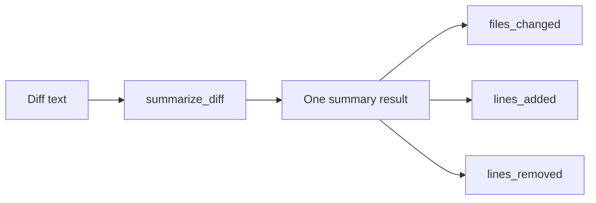

Reason about the design:

1. Why might named fields be safer or clearer than `[2, 5, 1]`?
2. Give one realistic mistake a caller could make with the list representation.
3. Does using `DiffSummary` automatically prevent invalid values such as `lines_added=-5`? Why or
   why not?
4. Give one situation where the simple list might still be acceptable.
5. Confidence: 0–100

LEARNER'S FIRST COMMITTED ANSWER (verbatim):
it gives you the variable names so you know the order and so that when you call them the order does not matter and it is explicitly clear that the value is labeled, it would think lines added is the third position when it is the seoncd positon, 3. i have no idea that is a cool conecpt, it is acceptable if the function calling it clearnly outlines the order of the list and knows what is where, 80

EVALUATION:
Parts 1, 2, and 4 are sound. Named fields make meaning explicit and let callers access by name
rather than remembering positions. The proposed realistic error—treating the third position as
lines added when it is actually second—directly demonstrates positional fragility. A documented,
tightly local list can be acceptable, though it remains more brittle.

Part 3 was explicitly unknown. A plain dataclass with integer annotations does not automatically
enforce nonnegative counts; without added validation, `lines_added=-5` can be constructed. Isolate
that behavior in the next prediction rather than expanding into a validation lecture.

PRIMARY BLOCKER:
Distinguishing representation/naming benefits from runtime invariant validation.

SCAFFOLD RUNG:
R6 design reasoning partial; descend to R1 one construction prediction

RECOVERY STATUS:
named-field and positional-error reasoning passed; validation remains open

TRANSFER / NEXT RETRIEVAL:
Show the actual `DiffSummary` declaration and construct it with `lines_added=-5`; predict accepted
object versus error before running.

---

## EV-P2-ANNOTATION-149

DATE: 2026-08-28
PHASE: 2 (fundamentals review; learner limited quiz scope to completed Phases 0–2)
TAG: type_annotation, runtime_validation, dataclass
RESULT: partial

PROMPT (verbatim):
Predict without running:

```python
from dataclasses import dataclass


@dataclass
class DiffSummary:
    files_changed: int
    lines_added: int
    lines_removed: int


summary = DiffSummary(
    files_changed=1,
    lines_added=-5,
    lines_removed=0,
)
```

1. Does Python create the object, or raise an error?
2. Does `lines_added: int` mean “must be an integer,” “must be nonnegative,” both, or neither at
   runtime?
3. Confidence: 0–100

LEARNER'S FIRST COMMITTED ANSWER (verbatim):
it creates an object , no it means it could be an integer for the shell to read, 80

EVALUATION:
Part 1 is correct: the plain dataclass object is created with `lines_added=-5`. Part 2 is partial.
The shell is not involved. `: int` is a type annotation for humans and static/tooling checks;
ordinary Python does not automatically enforce integer type or nonnegative range at runtime. Of
the supplied choices, the runtime answer is neither.

PRIMARY BLOCKER:
Type annotations are being connected to the shell rather than understood as metadata for readers
and tools, separate from runtime validation.

SCAFFOLD RUNG:
R1 partial; remain at R1 with one annotated field and a string value

RECOVERY STATUS:
in progress

TRANSFER / NEXT RETRIEVAL:
Create an `int`-annotated dataclass field with a string and predict whether plain Python accepts it.

---

## EV-P2-ANNOTATION-150

DATE: 2026-08-28
PHASE: 2 (fundamentals review; learner limited quiz scope to completed Phases 0–2)
TAG: type_annotation, runtime_validation, dataclass
RESULT: correct

PROMPT (verbatim):
Predict without running:

```python
from dataclasses import dataclass


@dataclass
class Counter:
    amount: int


counter = Counter(amount="five")
```

In ordinary Python, with no extra validation library:

1. Is the object created or rejected?
2. What value does `counter.amount` hold?
3. Does `: int` automatically convert `"five"` into an integer?
4. Confidence: 0–100

LEARNER'S FIRST COMMITTED ANSWER (verbatim):
created, "five" , no , 80

EVALUATION:
Correct at confidence 80. The object is created, the field holds the unchanged string `"five"`,
and the annotation performs no automatic conversion.

PRIMARY BLOCKER:
none at R1

SCAFFOLD RUNG:
R1

RECOVERY STATUS:
isolated behavior passed; fresh same-rung near-transfer next

TRANSFER / NEXT RETRIEVAL:
Use a different wrong-type value, then climb to runtime invariant design.

---

## EV-P2-ANNOTATION-151

DATE: 2026-08-28
PHASE: 2 (fundamentals review; learner limited quiz scope to completed Phases 0–2)
TAG: type_annotation, runtime_validation, dataclass
RESULT: correct

PROMPT (verbatim):
```python
from dataclasses import dataclass


@dataclass
class Counter:
    amount: int


counter = Counter(amount=[1, 2])

print(counter.amount)
```

Predict without running:

1. Is `counter` created or rejected?
2. If created, what does `counter.amount` contain?
3. What appears on screen?
4. Confidence: 0–100.

LEARNER'S FIRST COMMITTED ANSWER (verbatim):
created&#x20;
creates the list it contains [1, 2]
the list&#x20;
60

EVALUATION:
Correct at confidence 60. The object is created, the field holds `[1, 2]`, and printing the field
displays the list. The phrase "creates the list" is accepted as referring to evaluating the list
literal; no representation-formatting detail is graded.

PRIMARY BLOCKER:
none at R1

SCAFFOLD RUNG:
R1 near-transfer

RECOVERY STATUS:
same-rung near-transfer passed; climb to runtime-contract design

TRANSFER / NEXT RETRIEVAL:
State which candidate DiffSummary values should be accepted or rejected under a nonnegative-integer
contract and what must be checked beyond annotations.

---

## EV-P2-VALIDATION-152

DATE: 2026-08-28
PHASE: 2 (fundamentals review; learner limited quiz scope to completed Phases 0–2)
TAG: runtime_validation, type_invariant, range_invariant
RESULT: correct

PROMPT (verbatim):
Suppose the contract says:

> Every `DiffSummary` count must be an integer greater than or equal to zero.

Evaluate each candidate separately:

```text
A. files_changed=1, lines_added=2,   lines_removed=0
B. files_changed=1, lines_added=-2,  lines_removed=0
C. files_changed=1, lines_added="2", lines_removed=0
```

For each candidate:

1. Accept or reject?
2. If rejected, which rule did it violate?

Then state the two checks runtime validation must perform beyond the annotations. Confidence:
0–100.

LEARNER'S FIRST COMMITTED ANSWER (verbatim):
a. accepted
b. failed has a negative number
c. failed has a string&#x20;
100 

EVALUATION:
Correct at confidence 100. A satisfies both rules. B violates the nonnegative-range rule. C
violates the integer-type rule. Although the two checks were not repeated as a separate final
sentence, the item explanations explicitly identify both, so the answer is accepted without a
formatting drill.

PRIMARY BLOCKER:
none

SCAFFOLD RUNG:
R4 design application

RECOVERY STATUS:
runtime type-versus-range validation distinction passed

TRANSFER / NEXT RETRIEVAL:
Rotate to Phase 2 `splitlines()` behavior and string immutability.

---

## EV-P2-SPLITLINES-153

DATE: 2026-08-28
PHASE: 2 (fundamentals review; learner limited quiz scope to completed Phases 0–2)
TAG: splitlines, string_immutability, list_mutation
RESULT: correct

PROMPT (verbatim):
Predict without running:

```python
text = "alpha beta\ngamma"
lines = text.splitlines()
lines.append("delta")
```

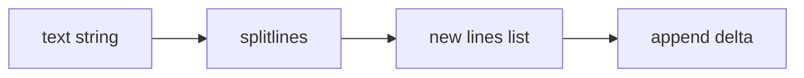

Answer conceptually; exact punctuation is not being graded:

1. What type of object is passed into `splitlines()`?
2. What items are in `lines` immediately after `splitlines()`?
3. What items are in `lines` after `append("delta")`?
4. Does `text` change? What does it still contain?
5. Does `splitlines()` print anything by itself?
6. Which operation mutates an existing object?
7. Confidence: 0–100.

LEARNER'S FIRST COMMITTED ANSWER (verbatim):
text stays the same, lines = [alpha beta, gamma, delta] strings are passed into splitlines and on the \n it turns them into a lsit with each string in the list speerated by where the \n is, immediatly after lines is [aplpha beta, gamma], it does not print anything by itself, append only splitlines creates the list it does not mutate the strings 100

EVALUATION:
Fully correct at confidence 100. The learner identified the string input, newline boundary rather
than space splitting, the intermediate and final list contents, no implicit printing, the original
string remaining unchanged, `splitlines()` creating a new list, and `append()` as the sole
mutation. Typos and representation punctuation are ignored per preference.

PRIMARY BLOCKER:
none

SCAFFOLD RUNG:
R6 composed transfer

RECOVERY STATUS:
the `splitlines` misconception family and its connection to string immutability are recovered at
target level for this review

TRANSFER / NEXT RETRIEVAL:
Delayed retrieval later. Rotate to a loop accumulator bug using `= +1` versus adding to the old
count.

---

## EV-P1-ACCUMULATOR-154

DATE: 2026-08-28
PHASE: 1 (fundamentals review; learner limited quiz scope to completed Phases 0–2)
TAG: accumulator_update, assignment_vs_augmented_assignment
RESULT: partial; correct fix supplied independently, mechanism remediation deferred at learner-requested session close

PROMPT (verbatim):
Got it—last question before dinner.

Predict without running:

```python
labels = ["added", "context", "added", "added"]
count = 0

for label in labels:
    if label == "added":
        count = +1

print(count)
```

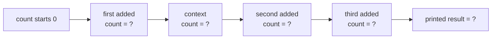

Answer:

1. Track `count` after each of the four loop iterations.
2. What does the program print?
3. What is the bug in `count = +1`?
4. What should that line be if the goal is to count every `"added"` label?
5. Confidence: 0–100.

LEARNER'S FIRST COMMITTED ANSWER (verbatim):
first loop&#x20;
coutn = 1
second loop
count=1
third loop
count =2
thrid look&#x20;
count = 3
it prints 3
it needs a spce so count += 1
80

EVALUATION:
Partial. The learner independently supplied the correct replacement line, `count += 1`, in the
first committed answer. The four predicted post-iteration states and output were incorrect: the
states are `1, 1, 1, 1`, and the program prints `1`.
`count = +1` assigns the positive integer `1` each time the condition matches; it does not use the
old count. The supplied fix is correct, but not because of spacing: `+=` is a distinct augmented-
assignment operator whose right-hand `1` is added to the current value.

PRIMARY BLOCKER:
`= +1` is being read as an increment operation, and `+=` is being modeled as a spacing variant
rather than a distinct operator.

SCAFFOLD RUNG:
R6 target failed; next session must descend to R0 operator recognition

RECOVERY STATUS:
correct fix independently produced; mechanism and trace not remediated. The learner explicitly
designated this as the last question before dinner, so stop the quiz rather than issuing the
mandatory simpler follow-up tonight.

TRANSFER / NEXT RETRIEVAL:
Next session: compare `x = +1` and `x += 1` as two isolated syntax forms, then use one sequential
near-transfer before returning to a loop accumulator.

---

## EV-P1-ACCUMULATOR-155

DATE: 2026-08-28
PHASE: 1 (fundamentals review; learner limited quiz scope to completed Phases 0–2)
TAG: assignment_vs_augmented_assignment
RESULT: correct values; mechanism explanation due

PROMPT (verbatim):
Yes. We’ll resume with the open accumulator concept and record new questions in `QUIZZES.md`.

Start with:

```python
count = 5
count = +1
```

versus:

```python
count = 5
count += 1
```

For each version:

1. What is the final value of `count`?
2. What does the second line do?
3. Are `= +` and `+=` the same operator or different forms?
4. Confidence: 0–100.

LEARNER'S FIRST COMMITTED ANSWER (verbatim):
in the first one it is 1 and the second one it is 6, 100

EVALUATION:
Both state predictions are correct at confidence 100. `count = +1` ends at `1`; `count += 1` ends
at `6`. The requested description of each second line and explicit same-versus-different answer
were omitted, so the mechanism explanation remains due before climbing.

PRIMARY BLOCKER:
none in state prediction; completing the operator explanation

SCAFFOLD RUNG:
R0/R1

RECOVERY STATUS:
correct values; teach-back pending

TRANSFER / NEXT RETRIEVAL:
Explain `= +1` as assignment of positive one and `+= 1` as old value plus one, and state that they
are different forms.

---

## EV-P1-ACCUMULATOR-156

DATE: 2026-08-28
PHASE: 1 (fundamentals review; learner limited quiz scope to completed Phases 0–2)
TAG: assignment_vs_augmented_assignment, teach_back
RESULT: correct

PROMPT (verbatim):
Correct: `= +1` assigns positive one, while `+= 1` adds one to the current value and stores the
result.

Please add your confidence from 0–100.

LEARNER'S FIRST COMMITTED ANSWER (verbatim):
90, skip this one i am looking for harder questions

PRECEDING MECHANISM ANSWER (verbatim):
\= +1 is poitive one and += is add ont to the number

EVALUATION:
Correct at confidence 90. The learner distinguished assignment of positive one from adding one to
the existing value and explicitly requested harder questions. Stop the micro-drill and fade to a
target-level composed accumulator trace.

PRIMARY BLOCKER:
none at the syntax rung

SCAFFOLD RUNG:
R0/R1 teach-back

RECOVERY STATUS:
operator distinction passed; target-level loop retrieval next

TRANSFER / NEXT RETRIEVAL:
Two independent function calls, each with a local loop accumulator and multiple branches.

---

## EV-P1-ACCUMULATOR-157

DATE: 2026-08-28
PHASE: 1 (fundamentals review; learner limited quiz scope to completed Phases 0–2)
TAG: loop_accumulation, local_state_per_call, multi_call_trace
RESULT: correct trace; local-state explanation due

PROMPT (verbatim):
Harder target-level trace—predict without running:

```python
def change_score(labels):
    score = 0

    for label in labels:
        if label == "added":
            score += 2
        elif label == "removed":
            score += 1

    return score


first = change_score(["added", "context", "removed"])
second = change_score(["removed", "added", "added"])

print(first + second)
```

Answer:

1. Track `score` after every label in the first call.
2. Track `score` after every label in the second call.
3. Give `first`, `second`, and the printed result.
4. Why does the second call start with its own `score = 0` instead of continuing from `first`?
5. Confidence: 0–100.

LEARNER'S FIRST COMMITTED ANSWER (verbatim):
first is called then we start the loop, it goes added so plus 2 then context so nothing happens and then removed so 2 + 1 first = 3, then second removed so +1 then added 1+2 then added 3+2 so second = 5  and finally it rints first +second which is 3+5 which is 8 

CONFIDENCE FOLLOW-UP (verbatim):
90

EVALUATION:
The full computational trace is correct at confidence 90. First-call states are `2, 2, 3`;
second-call states are `1, 3, 5`; `first=3`, `second=5`, and the program prints `8`. The learner
did not explain why the second call has fresh local state, even after a direct follow-up, so that
reasoning remains due.

PRIMARY BLOCKER:
Completing the local-state/lifetime explanation, not accumulation arithmetic.

SCAFFOLD RUNG:
R6 computation passed

RECOVERY STATUS:
target accumulator trace passed; call-local reasoning pending

TRANSFER / NEXT RETRIEVAL:
Ask conceptually where each call's `score` lives, what survives after return, and why `first` does
not become the second call's starting score.

---

## EV-P1-LOCAL-158

DATE: 2026-08-28
PHASE: 1 (fundamentals review; learner limited quiz scope to completed Phases 0–2)
TAG: local_state_per_call, function_call_lifetime
RESULT: correct

PROMPT (verbatim):
The full trace and printed result `8` are correct.

Two remaining parts:

1. Why does the second function call start with a new local `score = 0` instead of continuing from
   `first = 3`?
2. Confidence: 0–100.

LEARNER'S FIRST COMMITTED ANSWER (verbatim):
the score =0 happens everytime you call  change score before the loop

CONFIDENCE FOLLOW-UP (verbatim):
90

EVALUATION:
Correct at confidence 90. Every call executes `score = 0` before its loop, creating fresh local
state. The returned number is then stored by the caller in `first` or `second`; it does not become
the next call's starting local variable.

PRIMARY BLOCKER:
none

SCAFFOLD RUNG:
R6 explanation

RECOVERY STATUS:
accumulator operator, target trace, and local-state explanation recovered

TRANSFER / NEXT RETRIEVAL:
Harder debugging transfer where an accumulator is external and therefore leaks across calls.

---

## EV-P1-DICT-159

DATE: 2026-08-28
PHASE: 1 (fundamentals review; learner limited quiz scope to completed Phases 0–2)
TAG: dictionary_key_value, dictionary_lookup, syntax_reading
RESULT: partial

PROMPT (verbatim):
No—this colon is dictionary syntax, not a type annotation.

```python
totals = {"added": 0}
```

means:

```text
dictionary
key       → value
"added"   → 0
```

- `"added"` is a string key—the label used to find something.
- `0` is the value stored under that key.
- The colon separates the key from its value.
- `totals["added"]` looks up the value and currently produces `0`.

This differs from:

```python
amount: int
```

where the colon introduces a type annotation.

Syntax-only check:

```python
fruit_counts = {"apples": 2}
print(fruit_counts["apples"])
```

What does `fruit_counts["apples"]` retrieve, and what is printed? Confidence: 0–100.

LEARNER'S FIRST COMMITTED ANSWER (verbatim):
it should print 2 because that is the value, it retireves "apples" but the vlaue of apples was set to 2, 90

EVALUATION:
The exact printed result `2` and the key/value association are understood. The phrase "retrieves
apples" is inaccurate: `"apples"` is the key supplied to the lookup, while the expression
retrieves/evaluates to its associated value `2`.

PRIMARY BLOCKER:
Separating the lookup key from the value returned by the lookup expression.

SCAFFOLD RUNG:
R1 syntax-only partial

RECOVERY STATUS:
in progress; larger external-state trace paused

TRANSFER / NEXT RETRIEVAL:
Ask only what value one fresh dictionary lookup expression evaluates to.

---

## EV-P1-DICT-160

DATE: 2026-08-28
PHASE: 1 (fundamentals review; learner limited quiz scope to completed Phases 0–2)
TAG: dictionary_key_value, dictionary_lookup
RESULT: correct

PROMPT (verbatim):
One quick syntax bridge, then back to the harder problem:

```python
settings = {"retries": 3}
value = settings["retries"]
```

What value is assigned to `value`? In your explanation, identify the key and the retrieved value
separately. Confidence: 0–100.

LEARNER'S FIRST COMMITTED ANSWER (verbatim):
value is assinged 3, it looks up "retries" and the value stored under that key is 3, 100

EVALUATION:
Correct at confidence 100. `"retries"` is the key, the lookup retrieves the associated integer
value `3`, and assignment binds `value` to `3`.

PRIMARY BLOCKER:
none on lookup syntax

SCAFFOLD RUNG:
R1

RECOVERY STATUS:
lookup syntax recovered; one dictionary-update bridge next

TRANSFER / NEXT RETRIEVAL:
Apply `+= 1` to one dictionary entry and track the mutated mapping.

---

## EV-P1-DICT-161

DATE: 2026-08-28
PHASE: 1 (fundamentals review; learner limited quiz scope to completed Phases 0–2)
TAG: dictionary_update, dictionary_mutation
RESULT: partial

PROMPT (verbatim):
Dictionary-update bridge:

```python
totals = {"added": 0}
totals["added"] += 1
```

1. What value is now stored under the key `"added"`?
2. Did this create a new dictionary or mutate the existing `totals` dictionary?
3. Confidence: 0–100.

LEARNER'S FIRST COMMITTED ANSWER (verbatim):
time to guess, so the value looked up by "added" is 0 so then we take 0 and += 1 so the value under added becomes 1, 2. i have no idea, 40

EVALUATION:
Part 1 is correct at confidence 40: the lookup retrieves `0`, augmented assignment computes `1`,
and the key now maps to `1`. Part 2 was explicitly unknown. Assignment through a dictionary key
mutates the existing dictionary object; it does not create a replacement dictionary.

PRIMARY BLOCKER:
Recognizing subscript assignment as mutation of the dictionary object.

SCAFFOLD RUNG:
R1 partial; use one alias-observation transfer

RECOVERY STATUS:
entry arithmetic passed; mutation identity remains open

TRANSFER / NEXT RETRIEVAL:
Alias a dictionary, update one entry through the original name, and ask what the alias observes.

---

## EV-P1-DICT-162

DATE: 2026-08-28
PHASE: 1 (fundamentals review; learner limited quiz scope to completed Phases 0–2)
TAG: dictionary_mutation, aliasing, subscript_assignment
RESULT: wrong

PROMPT (verbatim):
Use the same aliasing principle you already applied to lists:

```python
totals = {"added": 0}
alias = totals

totals["added"] += 1
```

```text
totals ─┐
        ├──> one dictionary object
alias  ─┘
```

1. What value does `alias["added"]` retrieve afterward?
2. Why can `alias` observe an update performed through `totals`?
3. Confidence: 0–100.

LEARNER'S FIRST COMMITTED ANSWER (verbatim):
alias is still 0, so it createss a new object, 2. i have no idea 40

EVALUATION:
Incorrect at confidence 40. `alias` and `totals` refer to the same dictionary object. Updating the
entry through `totals` mutates that object, so `alias["added"]` retrieves `1`. No new dictionary is
created by subscript augmented assignment.

PRIMARY BLOCKER:
Dictionary entry mutation is being modeled as rebinding `totals` to a new dictionary, despite the
shared-object diagram.

SCAFFOLD RUNG:
R2 failed; descend to familiar list-element mutation through aliases

RECOVERY STATUS:
not remediated; external-state target remains paused

TRANSFER / NEXT RETRIEVAL:
Use a one-item list, alias it, replace index zero, and ask what the alias observes.

---

## EV-P1-ALIAS-163

DATE: 2026-08-28
PHASE: 1 (fundamentals review; learner limited quiz scope to completed Phases 0–2)
TAG: list_mutation, aliasing, subscript_assignment, dictionary_mapping_question
RESULT: correct list transfer; dictionary connection still unclear

PROMPT (verbatim):
Step back to a list:

```python
numbers = [0]
alias = numbers

numbers[0] = 1
```

1. What does `alias[0]` retrieve afterward?
2. Did `numbers[0] = 1` create a new list or mutate the shared list?
3. Confidence: 0–100.

LEARNER'S FIRST COMMITTED ANSWER (verbatim):
i just do not understand the rules of apples : 3 and how it applies to the other conecpts we have gone over, alias[0] =1, it mutated the shared list, 90

EVALUATION:
The list aliasing answer is fully correct at confidence 90: indexed assignment mutates the shared
list, so `alias[0]` retrieves `1`. The learner explicitly identifies the remaining blocker as the
dictionary mapping notation—how `"apples": 3` connects to familiar lookup and mutation concepts.

PRIMARY BLOCKER:
Mapping dictionary keys/values onto the already-stable container/subscript/alias model.

SCAFFOLD RUNG:
R1 list prerequisite passed

RECOVERY STATUS:
list aliasing stable; direct list-versus-dictionary comparison next

TRANSFER / NEXT RETRIEVAL:
Explain list index-to-value and dictionary key-to-value as two subscriptable mutable containers,
then update one dictionary key through an alias.

---

## EV-P1-ALIAS-164

DATE: 2026-08-28
PHASE: 1 (fundamentals review; learner limited quiz scope to completed Phases 0–2)
TAG: list_aliasing, indexed_mutation, shared_object
RESULT: wrong

PROMPT (verbatim):
From the list’s point of view, yes: it removes its reference to `3` from slot `0` and stores a
reference to `4` there instead.

But `3` is not necessarily destroyed. Another name could still hold it:

```python
numbers = [3]
old_value = numbers[0]

numbers[0] = 4
```

Afterward:

```text
numbers   → [4]
old_value → 3
```

The list stopped referring to `3`, but `old_value` still refers to it.

Now with:

```python
numbers = [3]
alias = numbers
numbers[0] = 4
```

What does `alias[0]` retrieve, and why? Confidence: 0–100.

LEARNER'S FIRST COMMITTED ANSWER (verbatim):
alias would still have 3 becasue it only threw away the 3 in the list for numbers, 30

EVALUATION:
Incorrect at confidence 30. `alias = numbers` does not create a copied list. Both names refer to
one list object, so replacing slot zero through `numbers` makes `alias[0]` retrieve `4`.

PRIMARY BLOCKER:
The learner now models alias assignment as creating separate per-name list containers, despite an
earlier correct alias transfer.

SCAFFOLD RUNG:
R2 failed; descend to R0 object-count recognition before mutation

RECOVERY STATUS:
not remediated; dictionary target remains paused

TRANSFER / NEXT RETRIEVAL:
Given `numbers = [3]; alias = numbers`, ask whether one or two list objects were created.

---

## EV-P1-ALIAS-165

DATE: 2026-08-28
PHASE: 1 (fundamentals review; learner limited quiz scope to completed Phases 0–2)
TAG: list_aliasing, shared_object
RESULT: correct

PROMPT (verbatim):
Before any mutation:

```python
numbers = [3]
alias = numbers
```

How many list objects were created?

```text
A. One list object with two names pointing to it
B. Two separate list objects
```

Answer `A` or `B`, explain briefly, and give confidence from 0–100.

LEARNER'S FIRST COMMITTED ANSWER (verbatim):
one list, both pointing at the same list

CONFIDENCE FOLLOW-UP (verbatim):
100

EVALUATION:
Correct at confidence 100. The list literal creates one list object, and `alias = numbers` binds a
second name to that same object rather than copying it.

PRIMARY BLOCKER:
none at R0

SCAFFOLD RUNG:
R0

RECOVERY STATUS:
list object-count prerequisite passed; fresh dictionary object-count transfer next

TRANSFER / NEXT RETRIEVAL:
Given a dictionary and `alias = counts`, ask whether one or two dictionary objects exist.

---

## EV-P1-DICT-166

DATE: 2026-08-28
PHASE: 1 (fundamentals review; learner limited quiz scope to completed Phases 0–2)
TAG: dictionary_aliasing, shared_object, composition_tracking
RESULT: correct state model; container term corrected

PROMPT (verbatim):
That matches the evidence: you understand each individual rule, but adding one operation makes the
earlier state disappear from your mental model. That is a composition/tracking issue, not a failure
to understand aliasing.

Use this procedure:

```text
Read one line
→ update the state
→ freeze that state
→ then read the next line
```

For the next trace, complete one state at a time:

```python
counts = {"apples": 3}
alias = counts
```

After line 1:

```text
dictionary objects: ?
names that exist: ?
```

After line 2:

```text
dictionary objects: ?
counts points to: ?
alias points to: ?
```

Does line 2 create a new dictionary, or only add another name? Confidence: 0–100.

LEARNER'S FIRST COMMITTED ANSWER (verbatim):
line 1 counts is a list with apples as a key and 3 as the lookup value, then alias is created pointing at the same list

CONFIDENCE FOLLOW-UP (verbatim):
90

EVALUATION:
The state/identity model is correct at confidence 90: the first line creates one container, and
the second line adds a name pointing to the same object rather than copying it. The learner called
the object a list; it is a dictionary. That term is corrected because container type is the active
concept, but no separate terminology drill is needed.

The learner also stated immediately before this exercise: "for some reason adding the one extra
step throws me off." The successful line-by-line state freeze supports diagnosing composition
load rather than an aliasing-rule gap.

PRIMARY BLOCKER:
Composition tracking; dictionary identity itself is correct under line-by-line state freezing.

SCAFFOLD RUNG:
R1/R2 state movie

RECOVERY STATUS:
two-line dictionary alias composition passed; add exactly one mutation step next

TRANSFER / NEXT RETRIEVAL:
Add `counts["apples"] = 4` and track the same dictionary and both names one line at a time.

---

## EV-P1-DICT-167

DATE: 2026-08-28
PHASE: 1 (fundamentals review; learner limited quiz scope to completed Phases 0–2)
TAG: dictionary_mutation, dictionary_aliasing, composition_tracking
RESULT: correct core state

PROMPT (verbatim):
Add exactly one step:

```python
counts = {"apples": 3}
alias = counts
counts["apples"] = 4
```

Freeze the state after line 3:

1. How many dictionary objects exist?
2. What does `counts["apples"]` retrieve?
3. What does `alias["apples"]` retrieve?
4. Did either name move to a new object, or did the shared object change?
5. Confidence: 0–100.

LEARNER'S FIRST COMMITTED ANSWER (verbatim):
1 list exssts, count apples and count alias both point at the same lsit, so now apples is 4 for the lookup value for both objects

CONFIDENCE FOLLOW-UP (verbatim):
90

EVALUATION:
The core state is correct at confidence 90: one dictionary object exists; `counts` and `alias`
refer to it; both lookups produce `4`; and the shared object changed without either name being
rebound. The learner called it a list and ended with "both objects," but the explicit one-object /
same-container model is clear. Accept the concept under the learner's no-nitpicking preference and
do not issue a terminology drill.

PRIMARY BLOCKER:
none under line-by-line state tracking; composition should now be faded gradually

SCAFFOLD RUNG:
R2 state movie

RECOVERY STATUS:
dictionary alias mutation recovered with scaffolding; harder shared-counter transfer next

TRANSFER / NEXT RETRIEVAL:
Use three names for one dictionary and two augmented updates, with no filled state prompts.

---

## EV-P1-DICT-168

DATE: 2026-08-28
PHASE: 1 (fundamentals review; learner limited quiz scope to completed Phases 0–2)
TAG: dictionary_aliasing, shared_mutation, composition_tracking
RESULT: correct

PROMPT (verbatim):
Harder shared-counter transfer—no filled state prompts:

```python
shared = {"hits": 0}
first = shared
second = shared

first["hits"] += 2
second["hits"] += 3
```

1. How many dictionary objects exist?
2. What does each of these retrieve at the end?

```python
shared["hits"]
first["hits"]
second["hits"]
```

3. Explain why the second update starts from the result of the first update.
4. Confidence: 0–100.

LEARNER'S FIRST COMMITTED ANSWER (verbatim):
so all of them point at the same list, hits starts at zero and then first adds 2 and then second adds 3 so they all retireve 5, 90

EVALUATION:
Correct at confidence 90. One dictionary exists; all names refer to it; the first update stores
`2`; the second reads that shared state and stores `5`; and all three lookups retrieve `5`. The
learner again said list, but the shared mapping behavior is fully correct and the terminology is
not drilled under the stated preference.

PRIMARY BLOCKER:
none at composed alias-update level

SCAFFOLD RUNG:
R4 composed transfer

RECOVERY STATUS:
dictionary alias mutation recovered without filled state prompts; fresh external-function target
next

TRANSFER / NEXT RETRIEVAL:
Use a fresh external dictionary counter across two function calls, then diagnose purity and name a
local-state repair.

---

## EV-P1-EXTERNAL-169

DATE: 2026-08-28
PHASE: 1 (fundamentals review; learner limited quiz scope to completed Phases 0–2)
TAG: external_state, cross_call_leakage, purity, print_arguments
RESULT: partial

PROMPT (verbatim):
Fresh target-level debugging problem—predict without running:

```python
stats = {"errors": 0}


def count_errors(events):
    for event in events:
        if event == "error":
            stats["errors"] += 1

    return stats["errors"]


first = count_errors(["error", "ok"])
second = count_errors(["error", "error"])

print(first, second)
```

Answer:

1. Track `stats["errors"]` through both calls.
2. Give `first`, `second`, and what is printed.
3. Why does the second call inherit the first call’s count?
4. Is the function pure, or does it mutate state outside itself?
5. What small design change would make each call count independently?
6. Confidence: 0–100.

LEARNER'S FIRST COMMITTED ANSWER (verbatim):
first is 1 and second is 3, this is a cool conecpt you can make the key you are counting very obious so then the key and the lookup value are simple and convientent, it prints 4, the stats error : 0 is at the top of the file instead of before the loop in the function so it only is set to 0 at the start of the file call, that is a good question and i have no idea for number 4, i think it would mutate every object in the list but i am not sure. put the errors : 0  under def count errors and befroe the loop

CONFIDENCE FOLLOW-UP (verbatim):
90

EVALUATION:
The difficult state trace is correct at confidence 90: `first=1`, `second=3`, and the second call
starts from external state left by the first. The learner also identified the correct design
direction—initialize call-local state inside the function before the loop—and made a valid data-
representation observation about named keys.

Purity was explicitly unknown; the function mutates the external `stats` dictionary, not every
event/list object, so it is impure. The learner subsequently asked that the `print(first, second)`
slip be disregarded as "just blind." Honor that preference and do not remediate output.

PRIMARY BLOCKER:
Identifying the exact external object changed and using that to judge purity.

SCAFFOLD RUNG:
R6 target partial; isolate purity conceptually

RECOVERY STATUS:
cross-call state and repair direction passed; output slip disregarded; purity pending

TRANSFER / NEXT RETRIEVAL:
Ask whether mutating the external `stats` dictionary makes the function pure or impure, and whether
the input `events` list changes.

---

## EV-P1-PURITY-170

DATE: 2026-08-28
PHASE: 1 (fundamentals review; learner limited quiz scope to completed Phases 0–2)
TAG: purity, external_state, input_vs_external_mutation
RESULT: wrong

PROMPT (verbatim):
After defining pure as depending only on inputs and making no observable external changes, the
learner was asked to classify the external-counter `count_errors` function, identify which object
changes, and give confidence.

LEARNER'S FIRST COMMITTED ANSWER (verbatim):
ok then it is pure, it returns a number and does not mutate any of the lsits, the result is a count of a certian criteria of the inputs so the input is directly responsible for the result output, 90

EVALUATION:
Incorrect at confidence 90. The input lists are unchanged, but purity requires scanning all
observable state. The function mutates the external counter dictionary, and later calls observe
that changed state, so the function is impure.

PRIMARY BLOCKER:
Side-effect analysis stopped at the inputs and missed mutation of a different external object.

SCAFFOLD RUNG:
R6 judgment failed; contrast external and local counters

RECOVERY STATUS:
not remediated in this attempt

TRANSFER / NEXT RETRIEVAL:
Compare the external-counter version with a fresh local counter inside the function.

---

## EV-P1-PURITY-171

DATE: 2026-08-28
PHASE: 1 (fundamentals review; learner limited quiz scope to completed Phases 0–2)
TAG: purity, local_state, external_state
RESULT: correct

PROMPT (verbatim):
State the contrast in your own words:

1. Why is the external-`stats` version impure?
2. Why is the local-`error_count` version pure?
3. Confidence: 0–100.

LEARNER'S FIRST COMMITTED ANSWER (verbatim):
becasue it changes the counter outside the function, the count is created inside the function adn so it does not affecct anything outside the function, 90, can you push i need to move locations

EVALUATION:
Correct at confidence 90. The external version is impure because it changes a counter outside the
call. The local version creates fresh call-owned state, reads but does not mutate the input, and
does not affect external state, so it is pure.

PRIMARY BLOCKER:
none on the explicit contrast

SCAFFOLD RUNG:
R4/R6 teach-back

RECOVERY STATUS:
purity distinction recovered with direct contrast; delayed fresh transfer remains due

TRANSFER / NEXT RETRIEVAL:
Delayed new-domain purity judgment with more than one external object; require a complete
side-effect scan.

---

## EV-P1-COMPOSE-172

DATE: 2026-08-29
PHASE: 1 (fundamentals review; learner limited quiz scope to completed Phases 0–2)
TAG: composition_tracking, dictionary_values, implicit_none, purity, object_count
RESULT: partial

PROMPT (verbatim):
Super-hard question 1 of 3. Do not run the code:

```python
def choose(name):
    if name.startswith("pro-annual"):
        return "gold"
    elif name.startswith("pro"):
        return "product"
    else:
        print("unknown")


def inspect(names):
    counts = {"gold": 0, "product": 0, "other": 0}
    alias = counts
    results = []

    for name in names:
        result = choose(name)
        results.append(result)

        if result == "gold":
            counts["gold"] += 1
        elif result == "product":
            alias["product"] += 1
        else:
            counts["other"] += 1

    ordered = sorted([
        counts["gold"],
        counts["product"],
        counts["other"],
    ])

    results.append(ordered.pop())
    return results


first = inspect(["pro-basic", "team", "pro-annual-plus"])
second = inspect(["team", "pro-annual"])

print(first)
print(second)
```

Trace the entire program and answer:

1. What is printed while `first` is being calculated?
2. What does `first` contain?
3. What is printed while `second` is being calculated?
4. What does `second` contain?
5. What do the final two `print` calls display?
6. Does the second call inherit any state from the first? Explain why.
7. Is `inspect` pure or impure? Explain by checking all effects—not only its input.
8. How many separate `counts` dictionaries are created during the entire program?

Include confidence from 0–100.

LEARNER'S FIRST COMMITTED ANSWER (verbatim):
inspect sets the counts to zero before the loop then alias = counts so they point at the same list object, results is an empy list, when we start the for loop we call the first entry in first which is pro basic, that returns product and then results gets product appended to the list, it then adds the key of product to add one for the lookup value, it then runs team which prints unknown and returns None when we go back to the inspect it adds None to the results list and then adds to the key other plus one on the lookup vaue, finnaly pro annual plus which returns gold and then gold is added to results and then the key gold gets the lookup value added 1 that is the endo f the for loop so ordered is a list of the keys for gold then product then other, not sure why this was done but then it removes or pops other as a key from ordered and appends it to results, then returns results so first is [product, other, gold, counts[other]], then we call second all of the lists get empltied and we go again, team prints unknown and then returns None then it adds to the key other plus on on the lookup value, the pro annual which returns gold which is appended to results so reuslts now equals [None, gold], the count for key gold's lookup value is added 1 and then we sort ordered, orded is then [gold,product,other]<- keys, we then pop the counts other key and append it to results so results is [other, gold, counts[other]], then re return results,
unknown
unknown
product other gold 1
other gold 1
90
it is pure, the inputs are the reults and it changes nothing outside the function
6 are created for counts because alias and counts point to the same dictionary and 3 dictinary is created everytime inspect is called

EVALUATION:
Partial at confidence 90. The learner correctly traced prefix precedence, both `unknown` side
effects, implicit `None`, per-call local reset, shared dictionary mutation through `alias`, and the
first call's three count values. Four composed details were missed: `ordered` contains looked-up
numbers rather than keys; `results` retains `None`; `inspect` is impure because calling `choose`
prints observable output; and exactly two `counts` dictionaries are created, one per call.

PRIMARY BLOCKER:
Composition tracking loses the distinction between dictionary keys, looked-up values, names, and
new objects when several familiar operations are combined.

SCAFFOLD RUNG:
R6 target partial; isolate the smallest value/object-count bridge before returning to Q2

RECOVERY STATUS:
target incomplete; one short required checkpoint next

TRANSFER / NEXT RETRIEVAL:
Ask what a list of dictionary lookups contains and how many objects a function-local dictionary
literal creates across two calls. Then resume super-hard question 2 of 3.

---

## EV-P1-COMPOSE-173

DATE: 2026-08-29
PHASE: 1 (fundamentals review; learner limited quiz scope to completed Phases 0–2)
TAG: dictionary_lookup, function_local_objects, list_values, object_count
RESULT: correct

PROMPT (verbatim):

```python
def collect():
    scores = {"red": 2, "blue": 1}
    picked = [scores["red"], scores["blue"]]
    return picked

first = collect()
second = collect()
```

What are `first` and `second`, and across both calls, how many dictionaries and lists are created?
Include confidence.

LEARNER'S FIRST COMMITTED ANSWER (verbatim):
for :def collect():
   scores = {"red": 2, "blue": 1}
   picked = [scores["red"], scores["blue"]]
   return picked

first = collect()
second = collect()

picked takes the values i know that now, first and second are both [2,1] and 2 ditionareis and lists are created 60

EVALUATION:
Correct at confidence 60. Each lookup contributes a numeric value, both returns equal `[2, 1]`,
and the two calls create two dictionaries plus two lists. The confidence underrates a fully correct
answer.

PRIMARY BLOCKER:
none on the isolated bridge

SCAFFOLD RUNG:
R1 recovery

RECOVERY STATUS:
value-versus-key and per-call object count recovered; resume target complexity

TRANSFER / NEXT RETRIEVAL:
Super-hard question 2 of 3 with nested aliasing and mutator return values.

---

## EV-P1-COMPOSE-174

DATE: 2026-08-29
PHASE: 1 (fundamentals review; learner limited quiz scope to completed Phases 0–2)
TAG: sort_vs_sorted, mutation, aliasing, nested_lists, purity, composition_tracking
RESULT: wrong

PROMPT (verbatim):
Super-hard question 2 of 3. Do not run the code:

```python
def reorganize(items, report):
    alias = items
    ordered = sorted(items)
    removed = ordered.pop()

    report["removed"] += 1

    status = alias.sort()
    alias.append(removed)

    return [ordered, status]


numbers = [4, 1, 3]
same = numbers
stats = {"removed": 0}

first = reorganize(numbers, stats)
second = reorganize(first[0], stats)

print(numbers)
print(same)
print(first)
print(second)
print(stats)
```

The learner was asked to trace both calls; give the final contents and five printed values; explain
why `status` is `None`; judge purity; count list objects; and provide confidence from 0–100.

LEARNER'S FIRST COMMITTED ANSWER (verbatim):
it is impure, make sure to push after this problem i am getting lunch, alias items and number and asme are all pointing to the same list, we start with ordered which is not pooint the the same list but is now sorted with [1,3,4] then removed = 4 becaue we pop it and ordered now is just 1 and 3 then we add to the key removed look up value plus 1 then we run sort on alias which sorts returns a sorted list for alias without changing alias so status does not point to the same list as alisa we then append back in the 4 that was removed and return ordered which is the items sorted without 4 and status which is alias sorted with the 4 appended back in, numbers prints [4,1,3] same with same fisrt prints [[1,3],[1,3,4]
then we move onto second starts with the list [1,3] and stats whiuch is now 1, now ordered is [1,3] and we pop 3 so now only 1 remains in ordede, we add plus one to the lookuop value of key removed and then status = [1,3,4,4] i did not trace the alias correctly it appends what ou removed but we remove the value from orded not from alias so alisa has the original [4,1,3] with an added [4,3], it returns ordede which is now [1] and stats whcih is removed,

CONFIDENCE FOLLOW-UP (verbatim):
60

EVALUATION:
Incorrect overall at confidence 60. The learner correctly identified impurity, the initial aliases, the separate list
created by `sorted`, both popped values, and the shared report count. The primary error was reversing
the established `.sort()` rule: `.sort()` mutates `alias` and returns `None`; it does not create or
return a sorted list. That error propagated into both calls and prevented a complete final state and
object count.

Correct final state for later comparison: `numbers` and `same` are `[1, 3, 4, 4]`; `first` is
`[[1, 3, 3], None]`; `second` is `[[1], None]`; `stats` is `{"removed": 2}`; five list objects
exist. Do not present all of this as a new lecture on resumption—recover `.sort()` first.

PRIMARY BLOCKER:
Under high composition, `.sort()` was changed from an in-place mutator returning `None` into a
non-mutating operation returning a list.

SCAFFOLD RUNG:
R6 target failed; next problem must isolate `.sort()` versus `sorted()` before rebuilding

RECOVERY STATUS:
pending after lunch; super-hard question 3 has not been asked

TRANSFER / NEXT RETRIEVAL:
One short `.sort()`/`sorted()` state checkpoint, then a near-transfer containing one alias, then
resume super-hard question 3 of 3.
