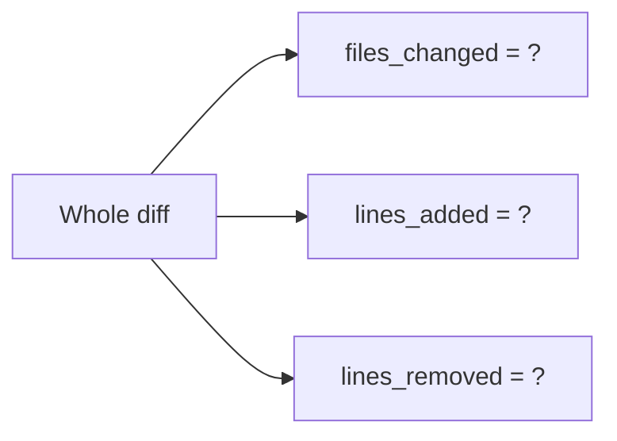
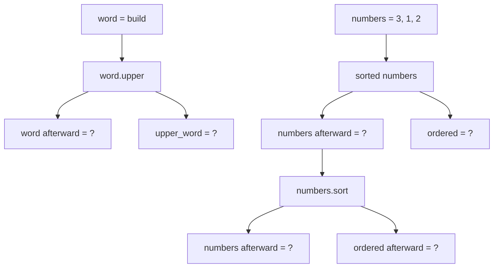
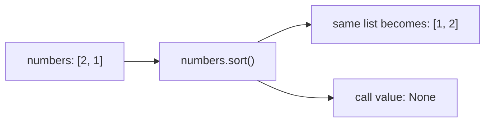
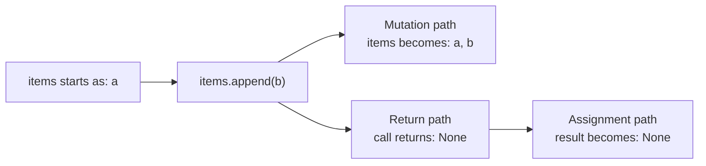
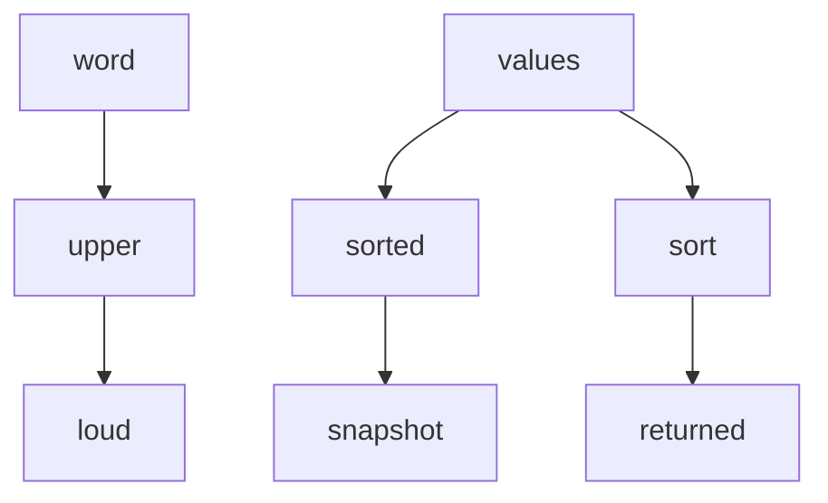
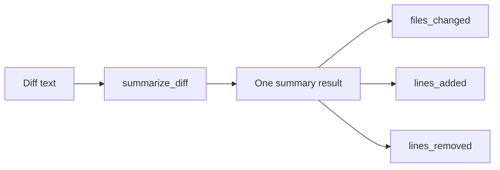
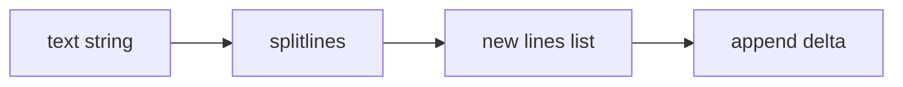

## EV-P2-MODEL-121

DATE: 2026-08-28
PHASE: 2 (fundamentals review; learner limited quiz scope to completed Phases 0–2)
TAG: diff_summary_model, classification_to_count, per_item_enumeration
RESULT: partial

PROMPT (verbatim):
Phase 2 summary problem. Predict without running code.

```text
diff --git a/menu.txt b/menu.txt
index 1111111..2222222 100644
--- a/menu.txt
+++ b/menu.txt
@@ -1,2 +1,3 @@
-tea
+coffee
+water
 cake
```



Give each field separately:

1. `files_changed`
2. `lines_added`
3. `lines_removed`
4. Briefly explain which lines caused each count
5. Confidence: 0–100

LEARNER'S FIRST COMMITTED ANSWER (verbatim):
files changed =1&#x20;
lines added = 2
removed = 1
cake is context everything else is metadata, the function uses prefixes to evalutae which line is which, 80

EVALUATION:
All three requested values are correct on the presented diff: one file changed, two lines added,
and one removed. This supplies the individual Phase 2 model values that remained open from
`EV-P2-MODEL-060` on a fresh diff.

The explanation is partial. `cake` is context, but "everything else is metadata" incorrectly
groups the contributing lines: `diff --git` is `file_header`; `-tea` is removed; `+coffee` and
`+water` are added; only the remaining header/hunk lines are metadata. This repeats the procedural
grouping pattern from `EV-P1-BRANCH-098`, not a failure to compute the summary.

PRIMARY BLOCKER:
Per-item enumeration in the explanation; the three-field Phase 2 summary model and values are
correct.

SCAFFOLD RUNG:
R6 summary; descend to R1 with one contributing line

RECOVERY STATUS:
`EV-P2-MODEL-060` value gap closed; explanation remediation in progress

TRANSFER / NEXT RETRIEVAL:
Classify `-tea` alone and state which counter it changes.

---

## EV-P2-MAP-122

DATE: 2026-08-28
PHASE: 2 (fundamentals review; learner limited quiz scope to completed Phases 0–2)
TAG: classification_to_count, per_item_enumeration
RESULT: correct

PROMPT (verbatim):
One line only:

```text
-tea
```

1. What label does the classifier give it?
2. Which Phase 2 summary counter does it increase?
3. Confidence: 0–100

LEARNER'S FIRST COMMITTED ANSWER (verbatim):
removed, lines removed 100

EVALUATION:
Correct. `-tea` is labelled `removed` and increments `lines_removed`.

PRIMARY BLOCKER:
none at R1

SCAFFOLD RUNG:
R1

RECOVERY STATUS:
isolated mapping passed; fresh same-rung near-transfer next

TRANSFER / NEXT RETRIEVAL:
Classify one added line and state its counter.

---

## EV-P2-MAP-123

DATE: 2026-08-28
PHASE: 2 (fundamentals review; learner limited quiz scope to completed Phases 0–2)
TAG: classification_to_count, assistance_fading
RESULT: correct

PROMPT (verbatim):
Fresh line:

```text
+coffee
```

1. What label does it receive?
2. Which summary counter does it increase?
3. Confidence: 0–100

LEARNER'S FIRST COMMITTED ANSWER (verbatim):
ok these are too simple of questions, this is added, it increases lines added, 100

EVALUATION:
Correct at confidence 100. `+coffee` is `added` and increments `lines_added`. The learner said the
rung is too simple; this is accurate evidence that the scaffold should fade. End isolated line
mapping and move to a harder Phase 0–2 transfer.

PRIMARY BLOCKER:
none

SCAFFOLD RUNG:
R1 near-transfer

RECOVERY STATUS:
same-rung near-transfer passed; simple classification-to-counter mapping is stable for this review

TRANSFER / NEXT RETRIEVAL:
Rotate to a composed mutation-versus-new-value trace involving a string and a list.

---

## EV-P2-MUTATION-124

DATE: 2026-08-28
PHASE: 2 (fundamentals review; learner limited quiz scope to completed Phases 0–2)
TAG: string_immutability, sorted_vs_sort, syntax_reading
RESULT: incomplete; syntax-only remediation entered

PROMPT (verbatim):
Harder transfer—predict the state without running it:

```python
word = "build"
upper_word = word.upper()

numbers = [3, 1, 2]
ordered = sorted(numbers)

numbers.sort()
```



Answer each checkpoint separately:

1. After `word.upper()`: `word` and `upper_word`
2. After `sorted(numbers)`: `numbers` and `ordered`
3. After `numbers.sort()`: `numbers` and `ordered`
4. Which operations created new values, and which mutated an existing value?
5. What single principle connects the string and list cases?
6. Confidence: 0–100

LEARNER'S FIRST COMMITTED ANSWER (verbatim):
word does not change, numbers does change i am not sure when i have not looked at sorted yet

CONFIDENCE FOLLOW-UP (verbatim):
for the word part 100

EVALUATION:
The learner correctly states at confidence 100 that `word` does not change. They did not give
`upper_word`, and they explicitly cannot yet read `sorted(...)`, so evaluation of the list portion
stops. Per syntax-only help mode, do not solve or continue the composed trace. Explain only the
`sorted(list)` syntax and give an R1 example.

PRIMARY BLOCKER:
SYNTAX_READING: `sorted(numbers)` has not been learned.

SCAFFOLD RUNG:
R6 target; descend immediately to R1 for `sorted(...)`

RECOVERY STATUS:
in progress; target problem paused

TRANSFER / NEXT RETRIEVAL:
One two-item list passed to `sorted`, tracking the original and returned list.

---

## EV-P2-SORTED-125

DATE: 2026-08-28
PHASE: 2 (fundamentals review; learner limited quiz scope to completed Phases 0–2)
TAG: sorted_returns_new_list, mutation_vs_new_value
RESULT: correct

PROMPT (verbatim):
`sorted(numbers)` means:

> Make and return a new list containing the same items in sorted order.

It does not change `numbers`.

Tiny example:

```python
numbers = [2, 1]
ordered = sorted(numbers)
```

Without running it:

1. What does `numbers` contain afterward?
2. What does `ordered` contain?
3. Confidence: 0–100

LEARNER'S FIRST COMMITTED ANSWER (verbatim):
so does numbers contain [2, 1] adn ordered is [1, 2], what about sort(), 100

EVALUATION:
Correct at confidence 100. `sorted(numbers)` leaves the original list `[2, 1]` unchanged and
returns the new sorted list `[1, 2]`, assigned to `ordered`. The learner immediately asked about
`.sort()`, which is the appropriate contrasting syntax step.

PRIMARY BLOCKER:
none for `sorted(...)`; `.sort()` remains unread

SCAFFOLD RUNG:
R1

RECOVERY STATUS:
`sorted(...)` syntax understood; teach `.sort()` in isolation next

TRANSFER / NEXT RETRIEVAL:
One two-item list followed by `numbers.sort()`, tracking the mutated list and the call value.

---

## EV-P2-SORT-126

DATE: 2026-08-28
PHASE: 2 (fundamentals review; learner limited quiz scope to completed Phases 0–2)
TAG: sort_mutates, sort_returns_none, mutation_vs_return
RESULT: partial

PROMPT (verbatim):
`numbers.sort()` works differently:

- It rearranges the existing `numbers` list itself.
- It does not create a sorted list as its call value.
- Its call value is `None`.



Now predict:

```python
numbers = [3, 1, 2]
result = numbers.sort()
```

1. What does `numbers` contain afterward?
2. What does `result` contain?
3. Confidence: 0–100

LEARNER'S FIRST COMMITTED ANSWER (verbatim):
Numbers = [1, ,2 ,3] and resutl is the same, 100

EVALUATION:
The learner correctly intends that `numbers` itself becomes sorted; the extra comma is treated as
a harmless transcription typo per the learner's stated preference. The conceptual error is saying
`result` is the same sorted list. Assignment receives the call value, and `.sort()` returns
`None`, even though it mutates `numbers`.

PRIMARY BLOCKER:
The changed object is being conflated with the mutating method's return value.

SCAFFOLD RUNG:
R1 failed; descend to R0 choice about the assigned call value

RECOVERY STATUS:
in progress

TRANSFER / NEXT RETRIEVAL:
Choose whether `result = numbers.sort()` assigns the list or `None`, without also tracking list
contents.

---

## EV-P2-SORT-127

DATE: 2026-08-28
PHASE: 2 (fundamentals review; learner limited quiz scope to completed Phases 0–2)
TAG: sort_returns_none, mutation_vs_return
RESULT: wrong; worked-example rescue entered

PROMPT (verbatim):
Focus only on the assignment:

```python
result = numbers.sort()
```

Which value is assigned to `result`?

```text
A. The sorted list
B. None
```

Answer `A` or `B`, explain briefly, and give confidence from 0–100.

LEARNER'S FIRST COMMITTED ANSWER (verbatim):
A,  is my guess if we were to print reslut afterwards it would give us the sorted list but assinged i am not sure, 40

EVALUATION:
Incorrect. `.sort()` mutates the existing list and returns `None`, so `result` receives `None`.
The learner remains unsure whether later printing `result` somehow accesses the changed list. It
does not: `result` holds the call value that assignment received.

PRIMARY BLOCKER:
Mutation of the receiver and return value of the method are still modeled as the same channel.

SCAFFOLD RUNG:
R0 failed after the fact was explicitly taught; enter worked-example rescue

RECOVERY STATUS:
not remediated; worked-example step A next

TRANSFER / NEXT RETRIEVAL:
Show one solved neighboring `.append()` example with the changed list and returned `None` drawn as
separate paths, then require learner teach-back.

---

## EV-P2-MUTATION-128

DATE: 2026-08-28
PHASE: 2 (fundamentals review; learner limited quiz scope to completed Phases 0–2)
TAG: mutation_vs_return, assignment_receives_call_value, aliasing
RESULT: wrong; worked-example teach-back failed

PROMPT (verbatim):
Solved neighboring example:

```python
items = ["a"]
result = items.append("b")
```



The method does two separate things:

- It changes `items`.
- It returns `None`, which is assigned to `result`.

Explain this example back in your own words:

1. Why does `items` contain `"b"`?
2. Why does `result` contain `None` instead of the changed list?
3. What would `print(result)` display?
4. Confidence: 0–100

LEARNER'S FIRST COMMITTED ANSWER (verbatim):
because we appended b and items and results now point at the same list, 2. i have no idea, 3. it would print [a, b], 80

EVALUATION:
Incorrect. `append` mutates `items`, but its call value is `None`; therefore `result` is `None`,
not an alias of `items`, and `print(result)` displays `None`. The diagram and explicit solved facts
did not survive into the teach-back.

PRIMARY BLOCKER:
Assignment is being modeled as linking the left-hand name to whichever object the method mutated,
rather than binding it to the value produced by the right-hand expression.

SCAFFOLD RUNG:
Worked-example step B failed; descend below method calls to R0 assignment

RECOVERY STATUS:
not remediated

TRANSFER / NEXT RETRIEVAL:
Use only `result = None`; ask what value the name receives and what printing it displays.

---

## EV-P2-APPEND-134

DATE: 2026-08-28
PHASE: 2 (fundamentals review; learner limited quiz scope to completed Phases 0–2)
TAG: mutation_vs_return, append_returns_none
RESULT: correct

PROMPT (verbatim):
Return to the paused example:

```python
items = ["x"]
returned = items.append("y")
```

Given:

```text
items is now ["x", "y"]
```

What value is assigned to `returned`? Explain why that value is separate from the mutation of
`items`, then give confidence from 0–100.

LEARNER'S FIRST COMMITTED ANSWER (verbatim):
None, the only purpose of that line is to mutate the list items

CONFIDENCE FOLLOW-UP (verbatim):
90

EVALUATION:
Correct at confidence 90. `append` mutates `items` and returns `None`, which is assigned to
`returned`. The wording "only purpose" refers correctly to the method's useful effect; the full
statement also assigns its `None` call value.

PRIMARY BLOCKER:
none at the partially scaffolded rung

SCAFFOLD RUNG:
worked-example step C

RECOVERY STATUS:
step C passed; fresh unaided step D next

TRANSFER / NEXT RETRIEVAL:
Use `.sort()` on a fresh list and ask for both the mutated list and assigned call value.

---

## EV-P2-SORT-135

DATE: 2026-08-28
PHASE: 2 (fundamentals review; learner limited quiz scope to completed Phases 0–2)
TAG: sort_mutates, sort_returns_none, mutation_vs_return
RESULT: correct

PROMPT (verbatim):
Fresh problem—predict without running:

```python
numbers = [4, 1, 3]
returned = numbers.sort()
```

1. What does `numbers` contain afterward?
2. What value is assigned to `returned`?
3. Explain how one line can mutate `numbers` while assigning a different value to `returned`.
4. Confidence: 0–100

LEARNER'S FIRST COMMITTED ANSWER (verbatim):
returned equals None and the numbers are now sorted afterward, ok so for append and sort do  they all have the same behavior because they are in the pyhton library?

CONFIDENCE FOLLOW-UP (verbatim):
80

EVALUATION:
Correct at confidence 80. `.sort()` mutates `numbers` into sorted order and returns `None`, which
is assigned to `returned`. This is the fresh unaided step D required after worked-example rescue.
The learner then asked whether `.append()` and `.sort()` behave alike merely because both are in
Python's library; answer that design question before resuming the larger composed trace.

PRIMARY BLOCKER:
none on the trace; API-contract generalization is the next question

SCAFFOLD RUNG:
worked-example step D, fresh R1

RECOVERY STATUS:
worked-example recovery completed at the micro level; original composed trace still needs a fresh
target-level return

TRANSFER / NEXT RETRIEVAL:
Explain that mutating-and-returning-None is a common list-method convention, not a universal
library rule; contrast `.append()`, `.sort()`, `sorted()`, `.upper()`, and `.pop()`.

---

## EV-P2-POP-136

DATE: 2026-08-28
PHASE: 2 (fundamentals review; learner limited quiz scope to completed Phases 0–2)
TAG: mutation_vs_return, pop_mutates_and_returns
RESULT: correct

PROMPT (verbatim):
No. They do not behave that way merely because they belong to Python’s library. Each operation has
its own contract.

- `list.append(x)` mutates the list and returns `None`.
- `list.sort()` mutates the list and returns `None`.
- `sorted(list)` leaves the original alone and returns a new sorted list.
- `word.upper()` returns a new string because strings are immutable.
- `list.pop()` mutates the list but also returns the item it removed.

Python commonly makes methods whose sole purpose is mutating a collection return `None`, helping
signal that the original object changed. But that is not a universal rule—`pop()` demonstrates the
exception.

A useful question for any operation is:

> What does it mutate, and what value does it return?

Fresh transfer:

```python
items = ["a", "b"]
returned = items.pop()
```

`pop()` removes and returns the last item. What do `items` and `returned` contain afterward?
Confidence: 0–100.

LEARNER'S FIRST COMMITTED ANSWER (verbatim):
items has a and returned has b, 100

EVALUATION:
Correct at confidence 100. `items` is mutated to contain only `"a"`, while `returned` receives the
removed value `"b"`. This proves the learner is no longer assuming that every mutating method must
return `None`; mutation and return are separate parts of an API contract.

PRIMARY BLOCKER:
none

SCAFFOLD RUNG:
R1 transfer

RECOVERY STATUS:
API-contract distinction passed; return to fresh composed target

TRANSFER / NEXT RETRIEVAL:
Compose string immutability, `sorted()` returning a new list, and `.sort()` mutating and returning
`None`.

---

## EV-P2-MUTATION-137

DATE: 2026-08-28
PHASE: 2 (fundamentals review; learner limited quiz scope to completed Phases 0–2)
TAG: string_immutability, sorted_returns_new_list, sort_mutates, sort_returns_none, composition
RESULT: partial

PROMPT (verbatim):
Harder composed problem—predict without running:

```python
word = "lens"
loud = word.upper()

values = [4, 2, 3]
snapshot = sorted(values)
returned = values.sort()
```



Give the final value of each name:

1. `word`
2. `loud`
3. `values`
4. `snapshot`
5. `returned`
6. Are `values` and `snapshot` the same list object or separate list objects?
7. Which operations mutated an existing object?
8. Confidence: 0–100

LEARNER'S FIRST COMMITTED ANSWER (verbatim):
word= lens
loud = LENS
values= 2,3,4
snapshot = 2,3,4
returned= 2,3,4
they are seprerate list obejcts&#x20;
sort() only&#x20;
100

LEARNER'S ASSISTED CORRECTION (verbatim):
your right retuerned returns none

CONFIDENCE ON ASSISTED CORRECTION (verbatim):
80

EVALUATION:
Six conceptual parts are correct: `word` remains lowercase, `loud` is uppercase, `values` and
`snapshot` both have sorted contents, the two lists are separate objects, and only `.sort()`
mutates. List-bracket omission is ignored per the learner's no-nitpicking preference.

The one conceptual miss is `returned`: `.sort()` returns `None`, so `returned` is `None`, not the
sorted list. The micro-level recovery from `EV-P2-SORT-135` did not survive composition, and the
miss occurred at confidence 100.

PRIMARY BLOCKER:
Retaining a mutating method's separate `None` return value when several operations are composed.

SCAFFOLD RUNG:
R6 target partial; descend only the failed edge to fresh R1 `.sort()` return

RECOVERY STATUS:
not yet recovered independently at target level; all non-return edges passed, and `returned=None`
was accepted after reveal at confidence 80

TRANSFER / NEXT RETRIEVAL:
Give a fresh `.sort()` call with the mutated list state supplied; ask only for the assigned return
value, then climb back with one added operation.

---

## EV-P2-SORT-138

DATE: 2026-08-28
PHASE: 2 (fundamentals review; learner limited quiz scope to completed Phases 0–2)
TAG: sort_mutates, sort_returns_none
RESULT: correct

PROMPT (verbatim):
Fresh isolated check:

```python
scores = [8, 3]
outcome = scores.sort()
```

Given that `scores` becomes sorted, what value is assigned to `outcome`, and why? Confidence:
0–100.

LEARNER'S FIRST COMMITTED ANSWER (verbatim):
scores is sorted and outcome is None, 100

EVALUATION:
Correct and independent at confidence 100. `.sort()` mutates `scores` and its separate call value
is `None`, which assignment binds to `outcome`. The learner asked an intervening clarification
about `pop()` before answering; that clarification did not reveal the `.sort()` answer.

PRIMARY BLOCKER:
none at R1

SCAFFOLD RUNG:
R1 fresh recovery

RECOVERY STATUS:
isolated edge recovered independently; climb one rung by adding `sorted(...)`

TRANSFER / NEXT RETRIEVAL:
Track `sorted()` returning a new list and `.sort()` mutating/returning `None` in the same short
trace.

---

## EV-P2-SORT-139

DATE: 2026-08-28
PHASE: 2 (fundamentals review; learner limited quiz scope to completed Phases 0–2)
TAG: sorted_returns_new_list, sort_mutates, sort_returns_none, composition
RESULT: correct

PROMPT (verbatim):
One-step climb:

```python
scores = [8, 3]
snapshot = sorted(scores)
outcome = scores.sort()
```

Give the final value of:

1. `scores`
2. `snapshot`
3. `outcome`
4. Which operation mutated `scores`?
5. Confidence: 0–100

LEARNER'S FIRST COMMITTED ANSWER (verbatim):
scores is mutated by sort(), [3, 8] , [3, 8] not the same object as scores, None, 100

EVALUATION:
Fully correct at confidence 100. `scores` is `[3, 8]` after `.sort()`, `snapshot` is a separate
`[3, 8]` list created by `sorted()`, `outcome` is `None`, and only `.sort()` mutated `scores`.

PRIMARY BLOCKER:
none at the two-operation rung

SCAFFOLD RUNG:
R2/R4 composition

RECOVERY STATUS:
one-step climb passed; fresh full target with string operation next

TRANSFER / NEXT RETRIEVAL:
Add one immutable string transformation on fresh data and require the full final state.

---

## EV-P2-MUTATION-140

DATE: 2026-08-28
PHASE: 2 (fundamentals review; learner limited quiz scope to completed Phases 0–2)
TAG: string_immutability, sorted_returns_new_list, sort_mutates, sort_returns_none, composition
RESULT: correct

PROMPT (verbatim):
Fresh full transfer:

```python
label = "mix"
upper_label = label.upper()

numbers = [5, 1, 4]
ordered = sorted(numbers)
sort_result = numbers.sort()
```

Give the final value of each, one line per name:

1. `label`
2. `upper_label`
3. `numbers`
4. `ordered`
5. `sort_result`
6. Which operation mutated an existing object?
7. Confidence: 0–100

LEARNER'S FIRST COMMITTED ANSWER (verbatim):
mix, MIX, [1,4,5], [1,4,5] but not the same object as numbers, None, sort() is the mutater, 100

EVALUATION:
Fully correct at confidence 100. `label` remains `"mix"`; `upper_label` receives the new uppercase
string; `ordered` is a separate sorted list; `.sort()` mutates `numbers`; and `sort_result` is
`None`. Spacing inside list displays is ignored per the learner's preference.

PRIMARY BLOCKER:
none

SCAFFOLD RUNG:
R6 full composition

RECOVERY STATUS:
target-level recovery complete

TRANSFER / NEXT RETRIEVAL:
Delayed retrieval later. Rotate to Phase 1 branch-precedence enumeration, requiring one line per
input.

---

## EV-P2-MODEL-148

DATE: 2026-08-28
PHASE: 2 (fundamentals review; learner limited quiz scope to completed Phases 0–2)
TAG: named_fields, positional_representation, validation
RESULT: partial

PROMPT (verbatim):
Different Phase 2 fundamental: data representation.

```python
summary = DiffSummary(
    files_changed=2,
    lines_added=5,
    lines_removed=1,
)
```

Another programmer proposes representing the same result as:

```python
summary = [2, 5, 1]
```



Reason about the design:

1. Why might named fields be safer or clearer than `[2, 5, 1]`?
2. Give one realistic mistake a caller could make with the list representation.
3. Does using `DiffSummary` automatically prevent invalid values such as `lines_added=-5`? Why or
   why not?
4. Give one situation where the simple list might still be acceptable.
5. Confidence: 0–100

LEARNER'S FIRST COMMITTED ANSWER (verbatim):
it gives you the variable names so you know the order and so that when you call them the order does not matter and it is explicitly clear that the value is labeled, it would think lines added is the third position when it is the seoncd positon, 3. i have no idea that is a cool conecpt, it is acceptable if the function calling it clearnly outlines the order of the list and knows what is where, 80

EVALUATION:
Parts 1, 2, and 4 are sound. Named fields make meaning explicit and let callers access by name
rather than remembering positions. The proposed realistic error—treating the third position as
lines added when it is actually second—directly demonstrates positional fragility. A documented,
tightly local list can be acceptable, though it remains more brittle.

Part 3 was explicitly unknown. A plain dataclass with integer annotations does not automatically
enforce nonnegative counts; without added validation, `lines_added=-5` can be constructed. Isolate
that behavior in the next prediction rather than expanding into a validation lecture.

PRIMARY BLOCKER:
Distinguishing representation/naming benefits from runtime invariant validation.

SCAFFOLD RUNG:
R6 design reasoning partial; descend to R1 one construction prediction

RECOVERY STATUS:
named-field and positional-error reasoning passed; validation remains open

TRANSFER / NEXT RETRIEVAL:
Show the actual `DiffSummary` declaration and construct it with `lines_added=-5`; predict accepted
object versus error before running.

---

## EV-P2-ANNOTATION-149

DATE: 2026-08-28
PHASE: 2 (fundamentals review; learner limited quiz scope to completed Phases 0–2)
TAG: type_annotation, runtime_validation, dataclass
RESULT: partial

PROMPT (verbatim):
Predict without running:

```python
from dataclasses import dataclass


@dataclass
class DiffSummary:
    files_changed: int
    lines_added: int
    lines_removed: int


summary = DiffSummary(
    files_changed=1,
    lines_added=-5,
    lines_removed=0,
)
```

1. Does Python create the object, or raise an error?
2. Does `lines_added: int` mean “must be an integer,” “must be nonnegative,” both, or neither at
   runtime?
3. Confidence: 0–100

LEARNER'S FIRST COMMITTED ANSWER (verbatim):
it creates an object , no it means it could be an integer for the shell to read, 80

EVALUATION:
Part 1 is correct: the plain dataclass object is created with `lines_added=-5`. Part 2 is partial.
The shell is not involved. `: int` is a type annotation for humans and static/tooling checks;
ordinary Python does not automatically enforce integer type or nonnegative range at runtime. Of
the supplied choices, the runtime answer is neither.

PRIMARY BLOCKER:
Type annotations are being connected to the shell rather than understood as metadata for readers
and tools, separate from runtime validation.

SCAFFOLD RUNG:
R1 partial; remain at R1 with one annotated field and a string value

RECOVERY STATUS:
in progress

TRANSFER / NEXT RETRIEVAL:
Create an `int`-annotated dataclass field with a string and predict whether plain Python accepts it.

---

## EV-P2-ANNOTATION-150

DATE: 2026-08-28
PHASE: 2 (fundamentals review; learner limited quiz scope to completed Phases 0–2)
TAG: type_annotation, runtime_validation, dataclass
RESULT: correct

PROMPT (verbatim):
Predict without running:

```python
from dataclasses import dataclass


@dataclass
class Counter:
    amount: int


counter = Counter(amount="five")
```

In ordinary Python, with no extra validation library:

1. Is the object created or rejected?
2. What value does `counter.amount` hold?
3. Does `: int` automatically convert `"five"` into an integer?
4. Confidence: 0–100

LEARNER'S FIRST COMMITTED ANSWER (verbatim):
created, "five" , no , 80

EVALUATION:
Correct at confidence 80. The object is created, the field holds the unchanged string `"five"`,
and the annotation performs no automatic conversion.

PRIMARY BLOCKER:
none at R1

SCAFFOLD RUNG:
R1

RECOVERY STATUS:
isolated behavior passed; fresh same-rung near-transfer next

TRANSFER / NEXT RETRIEVAL:
Use a different wrong-type value, then climb to runtime invariant design.

---

## EV-P2-ANNOTATION-151

DATE: 2026-08-28
PHASE: 2 (fundamentals review; learner limited quiz scope to completed Phases 0–2)
TAG: type_annotation, runtime_validation, dataclass
RESULT: correct

PROMPT (verbatim):
```python
from dataclasses import dataclass


@dataclass
class Counter:
    amount: int


counter = Counter(amount=[1, 2])

print(counter.amount)
```

Predict without running:

1. Is `counter` created or rejected?
2. If created, what does `counter.amount` contain?
3. What appears on screen?
4. Confidence: 0–100.

LEARNER'S FIRST COMMITTED ANSWER (verbatim):
created&#x20;
creates the list it contains [1, 2]
the list&#x20;
60

EVALUATION:
Correct at confidence 60. The object is created, the field holds `[1, 2]`, and printing the field
displays the list. The phrase "creates the list" is accepted as referring to evaluating the list
literal; no representation-formatting detail is graded.

PRIMARY BLOCKER:
none at R1

SCAFFOLD RUNG:
R1 near-transfer

RECOVERY STATUS:
same-rung near-transfer passed; climb to runtime-contract design

TRANSFER / NEXT RETRIEVAL:
State which candidate DiffSummary values should be accepted or rejected under a nonnegative-integer
contract and what must be checked beyond annotations.

---

## EV-P2-VALIDATION-152

DATE: 2026-08-28
PHASE: 2 (fundamentals review; learner limited quiz scope to completed Phases 0–2)
TAG: runtime_validation, type_invariant, range_invariant
RESULT: correct

PROMPT (verbatim):
Suppose the contract says:

> Every `DiffSummary` count must be an integer greater than or equal to zero.

Evaluate each candidate separately:

```text
A. files_changed=1, lines_added=2,   lines_removed=0
B. files_changed=1, lines_added=-2,  lines_removed=0
C. files_changed=1, lines_added="2", lines_removed=0
```

For each candidate:

1. Accept or reject?
2. If rejected, which rule did it violate?

Then state the two checks runtime validation must perform beyond the annotations. Confidence:
0–100.

LEARNER'S FIRST COMMITTED ANSWER (verbatim):
a. accepted
b. failed has a negative number
c. failed has a string&#x20;
100 

EVALUATION:
Correct at confidence 100. A satisfies both rules. B violates the nonnegative-range rule. C
violates the integer-type rule. Although the two checks were not repeated as a separate final
sentence, the item explanations explicitly identify both, so the answer is accepted without a
formatting drill.

PRIMARY BLOCKER:
none

SCAFFOLD RUNG:
R4 design application

RECOVERY STATUS:
runtime type-versus-range validation distinction passed

TRANSFER / NEXT RETRIEVAL:
Rotate to Phase 2 `splitlines()` behavior and string immutability.

---

## EV-P2-SPLITLINES-153

DATE: 2026-08-28
PHASE: 2 (fundamentals review; learner limited quiz scope to completed Phases 0–2)
TAG: splitlines, string_immutability, list_mutation
RESULT: correct

PROMPT (verbatim):
Predict without running:

```python
text = "alpha beta\ngamma"
lines = text.splitlines()
lines.append("delta")
```



Answer conceptually; exact punctuation is not being graded:

1. What type of object is passed into `splitlines()`?
2. What items are in `lines` immediately after `splitlines()`?
3. What items are in `lines` after `append("delta")`?
4. Does `text` change? What does it still contain?
5. Does `splitlines()` print anything by itself?
6. Which operation mutates an existing object?
7. Confidence: 0–100.

LEARNER'S FIRST COMMITTED ANSWER (verbatim):
text stays the same, lines = [alpha beta, gamma, delta] strings are passed into splitlines and on the \n it turns them into a lsit with each string in the list speerated by where the \n is, immediatly after lines is [aplpha beta, gamma], it does not print anything by itself, append only splitlines creates the list it does not mutate the strings 100

EVALUATION:
Fully correct at confidence 100. The learner identified the string input, newline boundary rather
than space splitting, the intermediate and final list contents, no implicit printing, the original
string remaining unchanged, `splitlines()` creating a new list, and `append()` as the sole
mutation. Typos and representation punctuation are ignored per preference.

PRIMARY BLOCKER:
none

SCAFFOLD RUNG:
R6 composed transfer

RECOVERY STATUS:
the `splitlines` misconception family and its connection to string immutability are recovered at
target level for this review

TRANSFER / NEXT RETRIEVAL:
Delayed retrieval later. Rotate to a loop accumulator bug using `= +1` versus adding to the old
count.

---

